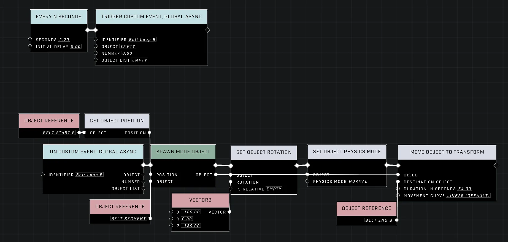

# Conveyor Belt Push

<figure><figcaption></figcaption></figure>

Creating conveyor belt movement that effectively interacts with players and physics objects can be difficult, as standard translation methods may not provide the necessary physical interaction required for gameplay.

## Implementation Methods

### Segmented Belt Script

A highly effective approach involves a segmented belt script that uses a spawn mode object node. This method is preferred because it allows the conveyor to maintain custom textures easily while moving segments along a predefined path. To maintain performance and prevent object buildup, a deletion zone should be placed at the end of the belt to remove segments once they reach their destination.

<figure><figcaption>
The revised belt script utilizes spawned segments and a deletion zone at the end.
</figcaption></figure>


Using the spawn mode object node allows the conveyor to preserve custom textures more effectively than other movement methods.


### Physics-based Conveyor Belts

Using the normal physics option on a conveyor belt allows for native physics interactions, such as moving players or physics crates placed on the surface.

<figure><figcaption>
A player navigates a conveyor belt system.
</figcaption></figure>

This method introduces specific movement dynamics:
* Players run faster when moving in the same direction as the belt.
* Players run slower when moving against the direction of the belt.
* Stationary players being moved by the belt might not appear on radar.


Spawning multiple physics objects closely together in a constrained space may lead to instability; spawning objects individually and moving them one at a time can result in more reliable behavior.


### Translation and Position Nodes

The [Translate Object To Point](../../../scripting/nodes/objects-transform/translate-object-to-point.md) node can be used to move objects, though players cannot walk against the direction of movement or jump out of the affected area. Additionally, all objects within the area monitor are subject to this movement. To prevent non-player objects from being moved, a [Get Is Player](../../../scripting/nodes/players/get-is-player.md) node can be used to verify the identity of objects within the area monitor.

<figure><figcaption>
The node graph shows an initial prototype for the conveyor system.
</figcaption></figure>

<figure><figcaption>
This node graph displays an alternative setup for object positioning.
</figcaption></figure>

Alternatively, moving both the conveyor belt and the player simultaneously using `Set Position` can create an illusion of continuous movement. However, `Set Position` functions as a teleportation rather than a continuous translation over time.

***

## Source Data

* Discord thread: [Conveyor Belt Push](https://discord.com/channels/220766496635224065/1048495100042416218/1048495100042416218)

#### <mark style="color:green;">Contributors</mark>

Koma\
TheProgrammer163\
Okom\
green