# tsg hackSwitch

<figure>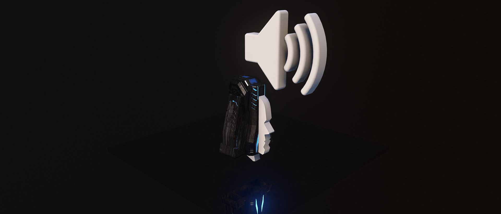<figcaption></figcaption></figure>

`tsg hackSwitch` is a recreation of the hacking terminal used to hack the loot caves in the dev-made BTB map Fragmentation. The user experience is nearly identical due to the user experience largely relying on nav markers that are accessible with Forge. The prefab has four variants.

Bookmark the prefabs with the [filter link here](https://www.halowaypoint.com/halo-infinite/ugc/browse?searchTerm=tsg+hackSwitch) or find the prefabs through the in-game UGC browser by searching with keywords or tags.

## Features

A showcase of the hack switch features and how they are triggered.

### Activation

A hack can be activated by interacting with the switch. The hack progress will be assigned to the team of the interacting unit. When a hack is started, a nav marker will appear that visualizes the progress of the hack around the outer edge of the nav marker. The nav marker progress will increase when the hack is active. A hacking audio loop will play during the hack.

&#x20;A friendly nav marker "Guard" is shown to the activating unit's team, and an enemy nav marker "Disarm" is shown to all other teams.

<figure>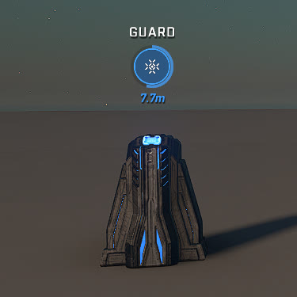<figcaption>
The "Guard" nav marker shows for the allied team
</figcaption></figure>

 

<figure>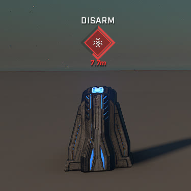<figcaption>
The "Disarm" nav marker shows for the opposing teams
</figcaption></figure>

### Deactivation

The progression of a hack will stop if:

* The activating unit exits the hack boundary during the hack
* A unit from another team activates the switch during the hack

Upon a hack deactivating, the nav marker will turn neutral and the progress will start decreasing, shown by the progress bar of the nav marker, and a sound is played at the switch location. The progress bar color will be the color of the team that had ownership of the hack before it was deactivated.

<figure>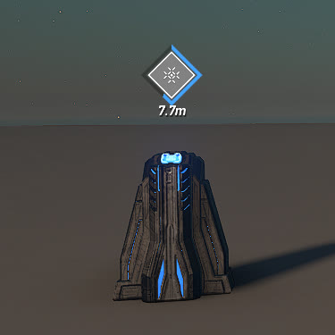<figcaption>
The neutral nav marker shows for all teams
</figcaption></figure>

#### Disarming

An ongoing hack can be disarmed by a unit of an opposing team from that of the current ongoing hack. This action turns the nav marker neutral and starts decreasing the hack progress. The hack can then be activated again to assign ownership of it to the activating unit.

### Depletion

If the progress bar of the hack reaches empty, all nav markers from it will disappear and a failure sound is played at the location of the switch. The switch can be reactivated to start a new hack.

### Completion

If the progress bar of the hack reaches full, the hack will complete. Upon completion, the switch will delete, an alert audio will play at the location of the Audio Emitter and:



* The reset timer will begin counting down

<figure>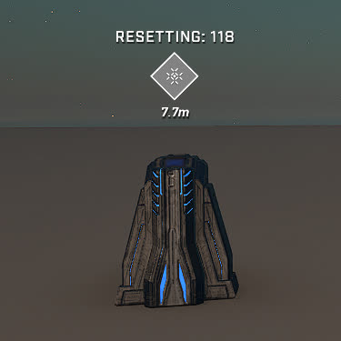<figcaption>
The "Resetting: x" message displaying the remaining cooldown time
</figcaption></figure>

After the reset timer reaches 0, the switch will spawn and the hack can be activated again.



* The "Hack Completed" message will show

<figure>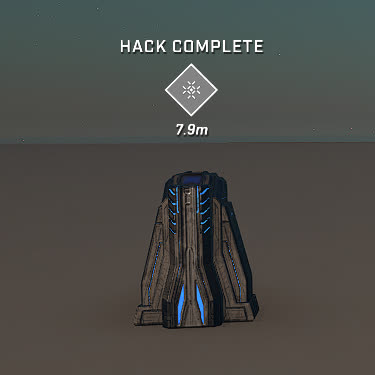<figcaption>
The "Hack Complete" message
</figcaption></figure>

The message will show for a short period of time and then disappear. The switch will not spawn again.



#### hackCompleteEvent

A `Custom Event, Global Async`  with the `hackCompleteEvent` identifier is fired upon hack completion, where the Object pin is connected to the Script Brain of the hackSwitch prefab.

A simple method to determine which hackCompleteEvent is fired can be done by comparing if the Object of the custom event is the same object as the desired hackSwitch's Script Brain.

<figure>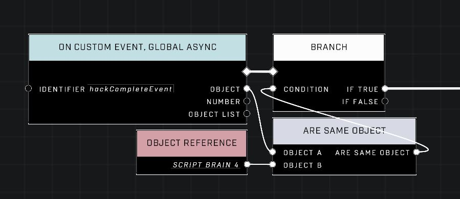<figcaption>
Code pattern to filter the hackCompleteEvent
</figcaption></figure>

## Adjustments

### Hack time

The hack time of a switch can be adjusted with a single Number node inside the Script Brain. The Number node is found on the left side of the script. The default value is `20.00` and the value translates to how many seconds the hack time will be.

<figure>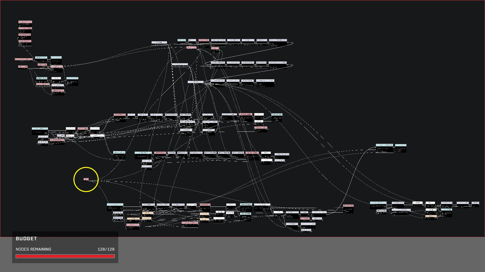<figcaption>
The node for adjusting the hack time can be found on the left side of the script
</figcaption></figure>

 

<figure>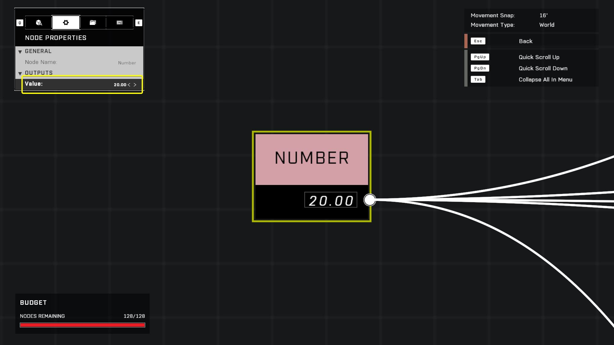<figcaption>
The default hack time is 20 seconds
</figcaption></figure>

### Cooldown time

The cooldown time of a switch can be adjusted inside the hackCooldown Custom Event trigger with the Number value inside the Script Brain. The hackCooldown Custom Event Trigger is found on the right side of the script. The default value is `120.00` and the value translates how many to seconds the cooldown time will be.

<figure>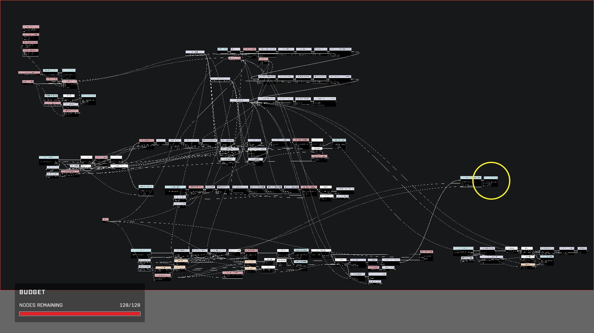<figcaption>
The node for adjusting the hack cooldown time can be found on the right side of the script
</figcaption></figure>

 

<figure>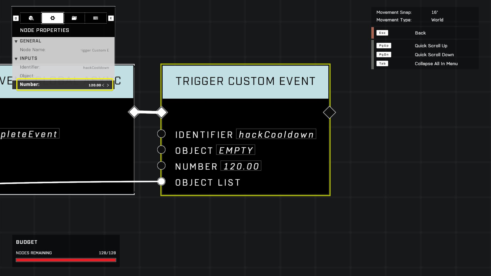<figcaption>
The default cooldown time is 120 seconds
</figcaption></figure>

### Boundary size

The boundary size where the hacking unit has to stay inside during the hack can be adjusted in a two-step process. The boundary is made up of an invisible boundary that the trigger logic ties into and a visual boundary for the players to see where the boundary limits are. Both of these boundaries should be adjusted for the ideal experience.

Adjust the invisible trigger boundary from the Object Properties of the Script Brain. Adjust the visible boundary from the Object Properties of the Hacking Terminal located under the switch. Match the boundary sizes to be identical for the ideal user experience.

<figure>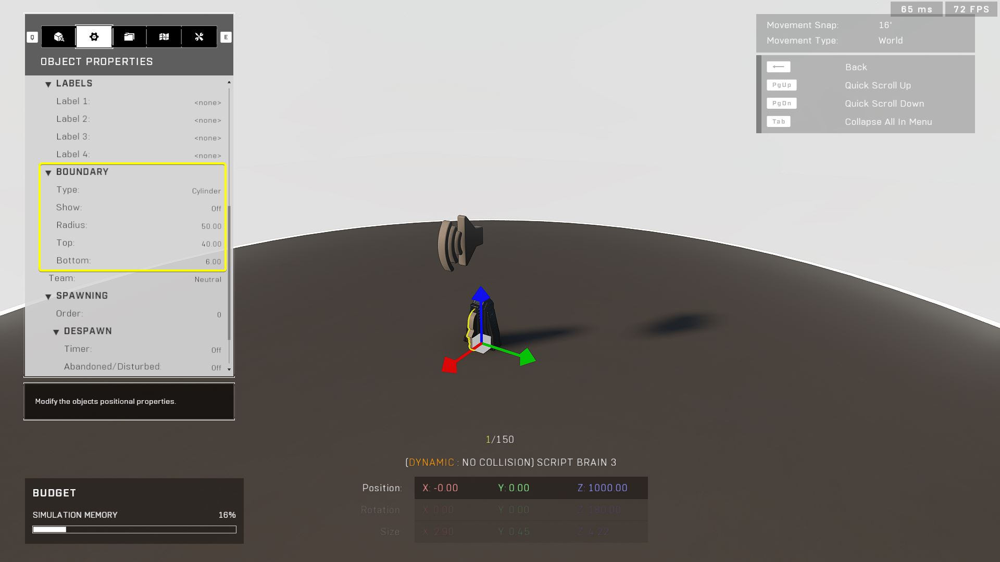<figcaption>
The logic trigger boundary is adjusted from the Script Brain
</figcaption></figure>

 

<figure>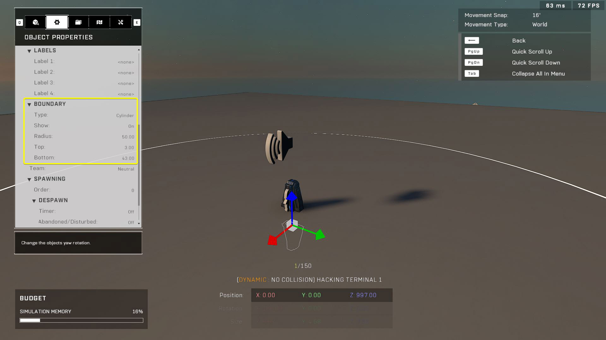<figcaption>
The visual boundary is adjusted from the Hacking Terminal under the switch
</figcaption></figure>

#### Why two boundaries?

The Sandbox > Hacking Terminal object is the only object with an identical visual boundary to the real hacking terminal used in the BTB map Fragmentation. Sadly this object is broken in multiple ways and pretty much the only use for this object is to act as a dummy object for showing its unique visual boundary.

Even scripting events like "On Area Entered" don't work when entering the boundary of this object. Thus a secondary object is required to mirror the same boundary, but with an object that can have it's boundary actions be detected with scripting. This is what the Script Brain boundary is used for.

Why the Hacking Terminal is upside down and much lower than the real switch is because otherwise players could interact with the switch by looking at the ground, leading to unwanted actions. A complication of having the switch have this position and rotation is that it makes mirroring a new boundary size more difficult, but that's just something we have to live with for now.

### Completion audio location

When a hack completes, an alert sound will be played at the position of the Audio Emitter that comes with the prefab. This Audio Emitter can freely be moved anywhere, and it's recommended to position it in an area where players should pay attention to after the hack completes.

The Audio Emitter object itself has no sound coming from it, but the object is used due to it's visual communication in Forge, as opposed to any other invisible object.

## Adding Multiple Switches

To add multiple switches to your map, spawn a new prefab of the desired tsg hackSwitch variant. This way the object references used in the script are correctly linked to the newly created objects from the new prefab.

## Variants

The tsg hackSwitch prefab has four variants:

### hackSwitch

Standard variant with a `Scriptable Switch Forerunner Terminal` as the interactable object. An adjustable cooldown will commence after a successful hack, during which the switch cannot be interacted with. The switch will become active again after the cooldown period.

<figure>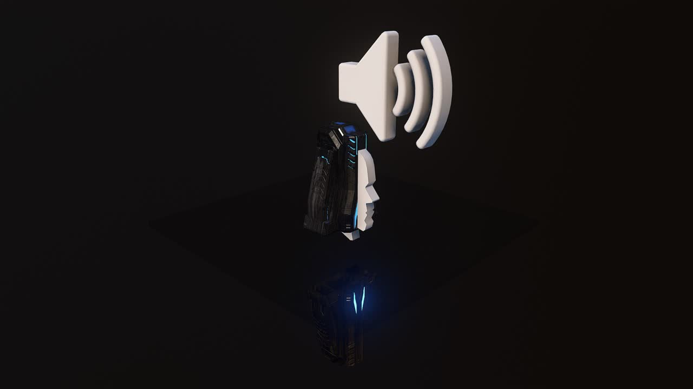<figcaption>
Standard hack switch objects
</figcaption></figure>

### hackSwitch, Invis

Invisible variant with a `Scriptable Switch (Invisible)` as the interactable object. An adjustable cooldown will commence after a successful hack, during which the switch cannot be interacted with. The switch will become active again after the cooldown period.

The UI nav marker location of the hack progress appears at the origin point of the `Projectile Blocker 1x1x1` and can easily be adjusted by repositioning the object.

<figure>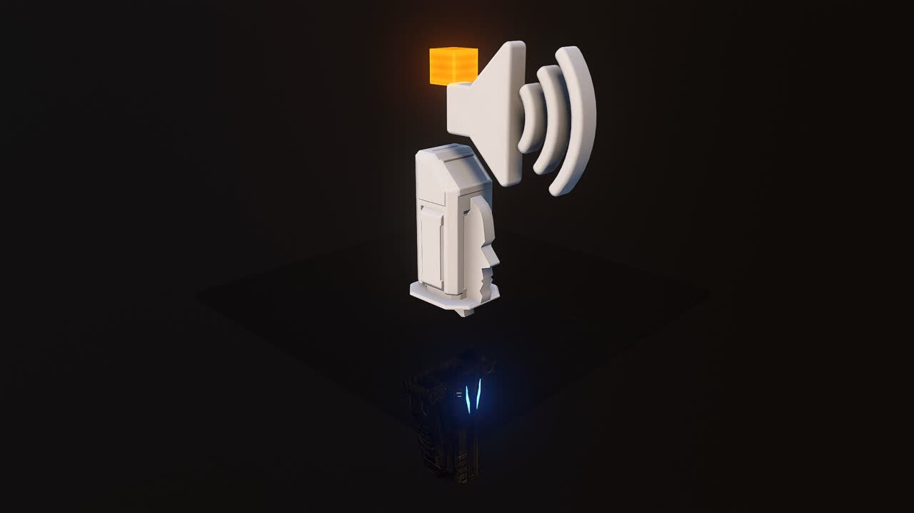<figcaption>
Invisible hack switch objects
</figcaption></figure>

### hackSwitch, Single-Use

Standard variant with a `Scriptable Switch Forerunner Terminal` as the interactable object. The message "Hack Complete" will show after a successful hack, disappearing shortly after and removing the ability to interact with the switch again.

<figure>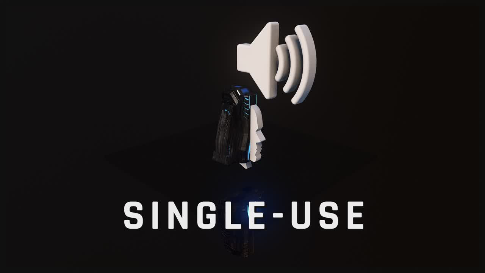<figcaption>
Standard single-use hack switch objects
</figcaption></figure>

### hackSwitch, Invis, Single-Use

Invisible variant with a `Scriptable Switch (Invisible)` as the interactable object. The message "Hack Complete" will show after a successful hack, disappearing shortly after and removing the ability to interact with the switch again.

The UI nav marker location of the hack progress appears at the origin point of the `Projectile Blocker 1x1x1` and can easily be adjusted by repositioning the object.

<figure>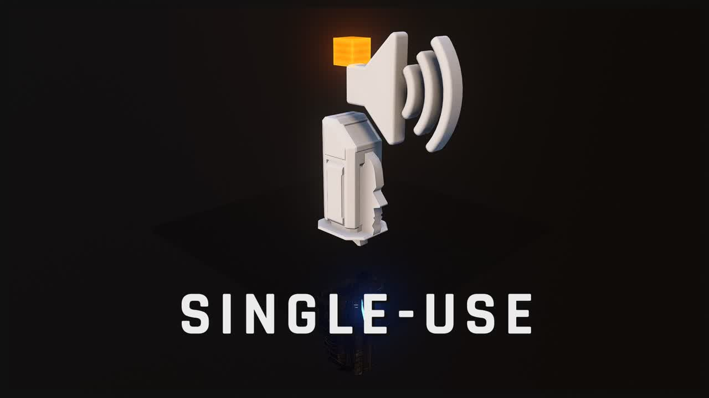<figcaption>
Invisible single-use hack switch objects
</figcaption></figure>

## Trivia

### Single Script Brain

The code just about fits within the 128 node limit of a Script Brain, and it was chosen not to split the code in to two brains because:

* The Nav Marker nodes used in the script only work in the brain they appear in, and is a fundamental feature of supporting multiple hack switches with little code.
* One Script Brain is more neat and simple.
* There has been no proven performance or execution -related issues regarding high node count in a single Script Brain.

#### Relocatable nodes

A small amount of nodes can be relocated to a separate Script Brain:

* The Variable declaration nodes in the top left.
* The initial event triggers on the top left, but some of the Object Reference nodes need to stay.

### Known issues

There are some issues that were found during development and testing, but were ultimately ignored as workarounds for them would compromise some major benefits of the current product such as node count. Also some issues just weren't tackled at all due to them being rare to encounter and them only having a minor negative visual impact on the user experience.

List of known issues:

* Hack- and cooldown progress can be continued across rounds.
* The "Resetting: x" nav marker text can be shown on the neutral nav marker on a second round if the cooldown was initiated during the previous round.
* Disarming a hack right as it's about to complete can cause the progress bar to show up on the "Resetting: x" or "Hack Complete" nav marker.
* Z-fighting may occasionally be seen on the top of the Scriptable Switch Forerunner Terminal object. This is caused by the nearly identical dummy switch object underneath it having it's location be slightly altered sometimes when the dynamic match objects are loaded. An attempted workaround for this was to move the dummy switch object 0.02 units lower and 0.01 units behind the real switch so they don't overlap, but sometimes the game moves them closer together anyways. Why the dummy object isn't deleted when not needed is to save on node count.

### The idea

From Okom, the prefab creator:

> I had the idea to recreate the Fragmentation loot caves in Forge already in late December 2022, and it was my first scripting project in Halo Infinite. My question post about it in the TSG Discord is here: [https://discord.com/channels/220766496635224065/1057368234464120983/1057368234464120983](https://discord.com/channels/220766496635224065/1057368234464120983/1057368234464120983)
>
> Limited by Forge's capabilities at the time and mostly by my scripting knowledge, I didn't get very far efficiently, but still got a working loot cave! – with some bugs. Now attempting the project again nearly two years after and I'm glad about how it turned out with how close to the original, and how efficiently I was able to make it.

***

#### <mark style="color:green;">Contributors</mark>

Okom
