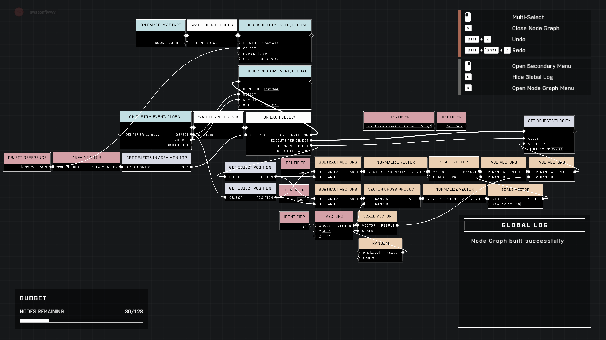

# TSG Tornado

<figure><figcaption></figcaption></figure>

TSG Tornado is a plug-and-play script designed for easy integration into any Halo Infinite map. It creates a vortex-like effect that influences the movement and rotation of objects within its area monitor.

## Core Components

The script's functionality is driven by three primary mechanical components that determine how entities within the tornado's influence behave:

* **Pull**: Defines the strength with which objects are drawn toward the center of the tornado.
* **Spin**: Controls the amount of rotational force applied to objects.
* **Lift**: Dictates the height to which objects are elevated while inside the effect.

### Mechanical Details

The behavior of these three components can be adjusted by modifying the scalar values of the `Scale Vector` nodes within the script.


The script is designed to be "plug-and-play," allowing it to be added to existing maps with minimal setup.


## Customization and Implementation

To change the intensity or characteristics of the tornado, users can interact with the `Scale Vector` nodes to scale the pull, spin, and lift values.

<figure><figcaption>
Source image from the original research thread.
</figcaption></figure>

### Visual Features

The script includes lightning flashes as a visual addition to the tornado effect.

## Observed Behavior

In testing environments, such as Operation Eden, the script has demonstrated the ability to affect various entities, including vehicles and AI.

* **AI Interaction**: AI entities have been observed to remain active while caught in the effect; for example, a Ghost may continue to fire its weapon while being spun by the tornado.
* **Entity Influence**: The script is capable of causing vehicles and AI to spin around the center of the tornado's area monitor.

***

## Source Data

* Discord thread: [TSG Tornado](https://discord.com/channels/220766496635224065/1493713249139691651/1493713249139691651)

#### <mark style="color:green;">Contributors</mark>

swagonflyyyy\
parthenopaeus_v