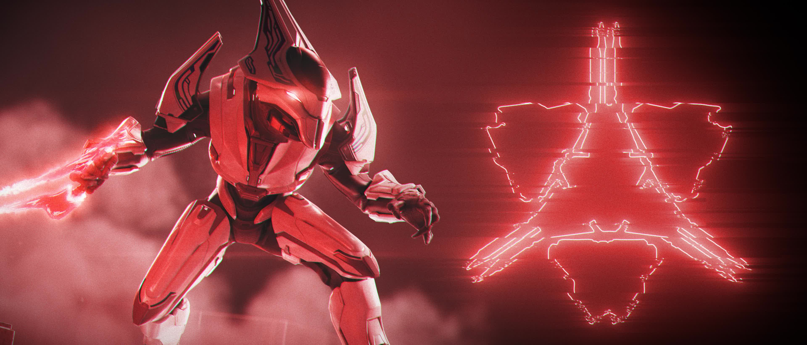
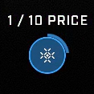

# Survive The Undead Strategy Guide

<figure><figcaption></figcaption></figure>

Survive The Undead (STU) is a community-made PvE mode in Halo Infinite where a group of 4 players fight against increasingly difficult waves of AI using items and powerups purchased with points. This guide explains how to reach high scores and survive for longer in the mode.

* [Mode](https://www.unggoy.xyz/modes/6254af4b-c175-49aa-9991-77943b7fca01)
* [Maps](https://www.unggoy.xyz/browse?assetKind=Map\&gamertag=I%20EliteFalcon%20I\&searchTerm=of%20the)

## Progression from Gameplay Start

Succeeding in a match of Survive The Undead is based a lot on the decisions you make early on so you can have a solid loadout for later and survive. Follow this step-by-step progression to always have a good chance of getting a high-score match.

### Opening

1. Only melee enemies for the two first rounds to conserve ammo.
   * Melee with the Mk50 Sidekick for faster melees.
   * If players steal your kills, shoot the enemies with the Mk50 Sidekick.
   * Much more enemies will come at wave 4, where you can start to gather some points back if you didn't get much in the first 3.
2. Purchase Damage 2/4 and Health 1/4 immediately when you have enough points.
3. Save all points until wave 6 (first Berserker Brutes) is complete.
   * Use the Mk50 Sidekick until it's empty. There should be no need to buy Max Ammo up to this point if you've followed the steps.

### Midgame

1. Spend points on the Mystery Box 5 times and try to get a Heatwave, Pulse Carbine or Plasma Pistol (the "ideal weapons"). Only exchange one gun at this point.
   * Activate the Mystery Box while holding the worst weapon in your inventory, as that will be replaced. The MA40 AR has more ammo and is a better secondary fallback.
   * If you don't get one of the ideal weapons after 5 tries and you don't have Health 4/4, jump to step 3; if you have Health 4/4, jump to step 5.
2. Upgrade the ideal weapon at the 2500-point machine and try to get one of these combos:
   * Heatwave + Purging Shock Rifle
   * Pulse Carbine + Scatterbound Heatwave
   * Pulse Carbine + Convergence Bulldog
   * Plasma Pistol + Scatterbound Heatwave


Try as many times as you deem appropriate and move to the next step.


3. Purchase Health 4/4 as you want to prioritize staying alive.
   * Health 4/4 gives vampirism, which grants health for kills and is crucial in later waves.
4. If you don't have any of the ideal weapons, jump to step 1.
5. Purchase Damage 4/4
6. If you don't have any of the ideal weapons, jump to step 1.
7. Purchase the Repulsor equipment.
   * Allows you to push enemies away from you as well as escape tight situations by jumping over enemies on the maps that allow it.
8. Purchase Speed 4/4


Purchase Max Ammo when about to run out of ammo.



#### Temporary price decreases

At the beginning of an intermission period after wave 6 has passed, a message displaying "1/x Price" can show up on a 25% chance. This makes all the purchasable items be a fraction of their price for 20 seconds. The available fractions are:

* 1/10 = a tenth of normal price
* 1/4 = a quarter of normal price
* 1/2 = half of normal price

When these are active and you're saving up to purchase something, it's recommended to go for the most expensive option first such as taking a chance at the 2500-point weapon upgrade machine to try and get an ideal or endgame weapon.


### Endgame

1. After wave 13 at the latest, Spend all your accumulated points on the Mystery Box and try to get a Heatwave or Pulse Carbine (the "endgame weapons") depending on which ones you are missing. The goal is to have a Heatwave and a Pulse Carbine as your two weapons.
   * Activate the Mystery Box while holding the worst weapon in your inventory, as that will be replaced.
   * Keep trying until you get either one of the endgame weapons. If you don't already have an endgame weapon, don't attempt to get both yet.
2. Upgrade the endgame weapon at the 2500-point machine and try to get these combos:
   * Pulse Carbine + Scatterbound Heatwave (shows the Pulse Carbine icon)
   * Heatwave + Purging Shock Rifle


The Heatwave + Calcine Disruptor is a bad combo which can kill you unintentionally due to its explosive Disruptor shots if they land close to you. Due to this, it's recommended to only use the upgrade machine when you have at least 5000 points. If you get the Calcine Disruptor combo, you can change it for another one immediately to avoid accidental death when fighting enemies close by


1. If you don't have both of the endgame weapons, jump to step 1.
2. During intermission, purchase max ammo.
3. Purchase the Repulsor equipment back if it has been used up.


This loadout is the "**endgame loadout**". You've achieved it if you have nothing more to spend your points on except more ammo, potential revives and point shares. You should have the Heatwave + Purging Shock Rifle and Pulse Carbine + Scatterbound Heatwave combo weapons, max perks and a Repulsor.


## Reviving

Info about when to revive teammates for the best results depending on the situation in the game.

### Reviving general

Only revive teammates if you have the Endgame loadout and points to spare, or if you need a health boost. As revived teammates get 30 seconds of 4x damage resistance, attempt to revive teammates 30 seconds before the round ends so they get extra time for gaining back their loadout.

* Reviving a teammate gives the reviver full health and half Overshield, which can save them in some tight situations.
* Teammates get revived automatically after a round has ended where they can also start getting their loadout back with no enemies attacking them.
* Usually it's very difficult for a teammate to build back their loadout when there's enemies attacking them, even when they have a 4x damage resistance trait for 30 seconds after spawning.

### Getting teammates up to speed again

If you or a teammate is revived, follow these steps to get the revived player back up to a state where they can contribute to the match. Keep in mind, it is very difficult to achieve this in later waves.

#### Before reviving

Make sure to share points to your teammates with the 2000-point share interface so they have a minimum of 6300 points saved up. And preferably more, such as 9300. These points will be used up quickly to get perks and an upgraded weapon after being revived.

#### During the current round

1. Revive all teammates approximately 30 seconds before you predict the round to end. Reviving a teammate gives them 30 seconds of 4x damage resistance which should keep them alive even if enemies are attacking them. If they survive until the intermission, they've now gained extra time to gather back their loadout.
2. The revived players must purchase Health 4/4, Damage 4/4, a 500-point Calcine Disruptor off the wall and upgrade the Disruptor at the 2500-point machine and try to get the Disruptor + Volatile Skewer combo weapon.

#### Intermission 1

1. Alive players with the endgame loadout must share all of their points on the 2000-point Point Share interface to give the revived players enough points for the next steps.
2. Revived players must do the [Midgame](survive-the-undead-strategy-guide.md#midgame) purchasing steps excluding the perk upgrades. So attempting the mystery box to get the ideal weapons.

#### Intermission 2 onwards

1. Alive players with the endgame loadout should share all of their points on the 2000-point Point Share interface to give the revived players enough points for them to progress.
2. Revived players must continue doing the [Midgame](survive-the-undead-strategy-guide.md#midgame) and [Endgame](survive-the-undead-strategy-guide.md#endgame) steps until they have the endgame loadout.

## General tips

General tips to help you understand how to play the mode better and more efficiently.

### Best loadout

**Heatwave + Purging Shock Rifle**

* Shoots a 5-projectile Purging Shock Rifle bolt 5 times per trigger pull.
* A single shot shocks and stuns multiple enemies, making them stationary for a short period, which buys you valuable time with a lot of enemies attacking.


Only three shots per magazine, so keep an eye out for when you need to reload.


**Pulse Carbine + Scatterbound Heatwave**

* Shoots a 5-projectile tracking Heatwave shot 5 times per trigger pull.
* Shoot the ground to activate the Heatwave shot tracking towards enemies. This is the main strategy to shooting with this weapon.
* Scatterbound Heatwave projectiles pass through enemies and bounce off walls, dealing damage to multiple enemies with a single burst.


The bouncing shots can damage and kill the shooter unexpectedly.


**Max perks**

* Damage 4/4
* Health 4/4
* Speed 4/4

**Repulsor equipment**

* Allows you to push enemies away from you as well as escape tight situations by jumping over enemies on the maps that allow it.
* 5 charges per purchase.

#### Alternative good weapons

**Disruptor + Volatile Skewer**

* 48 exploding Skewer shots which can one-shot enemies even in later waves. 12 shots per magazine.
* A potentially very low investment as it can be purchased off the wall for only 500 points, making the only randomness be the 25% chance of getting the right combo at the 2500-point upgrade machine.
* Can easily carry a whole team to wave 14.


Shoots explosive shots, which can also damage and kill the shooter.


**Plasma Pistol + Scatterbound Heatwave**

* Temporary secondary along with a Heatwave.
* Scatterbound Heatwave projectiles pass through enemies and bounce off walls, dealing damage to multiple enemies with a single burst.
* Overheats if shot too fast, which is often necessary.
* 114 semi-auto shots instead of 125 burst-fire shots compared to the Pulse Carbine + Scatterbound Heatwave combo.


The bouncing shots can damage and kill the shooter unexpectedly.


**Pulse Carbine + Convergence Bulldog**

* Temporary secondary along with a Heatwave.
* Kills single enemies fast.
* Ammo doesn't last long.
* Doesn't keep up with the pace required at later waves.

**Plasma Pistol + Convergence Bulldog**

* Temporary secondary along with a Heatwave.
* Kills single enemies fast.
* Ammo doesn't last long.
* Overheats if shot too fast, which is often necessary.
* Doesn't keep up with the pace required at later waves.

#### Safest weapon to upgrade

The **Pulse Carbine** is the safest weapon to upgrade as it has only three variants:

* Scatterbound Heatwave
* Convergence Bulldog
* Unbound Plasma Pistol


Unbound Plasma Pistol being the only bad variant. This means if you get a Pulse Carbine, you need a minimum of 5000 points to guarantee an ideal weapon.


If you get the Unbound Plasma Pistol variant on your first upgrade, you are guaranteed to get either the Scatterbound Heatwave or the Convergence Bulldog variant on the second upgrade as the machine won't give you the same variant twice.

**Explosive projectile caution**

Explosive projectiles such as the Skewer, Rockets or Calcine Disruptor shot can damage the player easily which will unintentionally kill you when the enemy count starts becoming higher and they start appearing next to you.

A weapon that shoots only a single explosive projectile per shot such as the M392 Bandit + Volatile Skewer combo can be survived point-blank if the shooter has Health 4/4 as they will also regenerate health from the damage dealt. Any more than one explosion nearby will very quickly kill the shooter.

#### Last chance to get an ideal weapon

You can survive to about wave 14 (first Escharum) with the default loadout of Mk50 Sidekick and MA40 AR, full perks and a Repulsor. After that, the enemy count and difficulty will become too much for the default weapons to handle. So if by wave 14 you haven't had good luck with the Mystery Box on getting an ideal weapon, you might just be out of luck.

### Prioritize yourself first

Regardless if you're playing with a team or not, focus on getting your situation to the best and most reliable state before helping others. Be aware that when playing with a team, the player who gets a powerful weapon first may steal a lot of the kills and make it difficult for the rest of the team to gather points. In this case it may be necessary to share points to the rest of the team.

### Track your ammo

Don't let your ammo run out without you being aware of it.

* Keep track of your weapon's ammo count and purchase the Max Ammo if required. This will be a common strategy in later waves.
* Weapon ammo will be refilled after boss waves (3, 6, 9 & 12).
* Upgrading a weapon grants 40 seconds of unlimited ammo.

### Insta Kill caution

The Insta Kill powerup will set all enemy health counts to 1% for 30 seconds, but this has a negative impact on health vampirism. As the health vampirism that comes with the Health 4/4 perk restores player health based on damage dealt and the Insta Kill powerup reduces the damage required to kill enemies to a non-existent amount, you also won't be getting any health back for kills.

It's then important to try and not let enemies damage you too much when an Insta Kill powerup is active during later waves when also the Black Eye skull is active, only regenerating health from melees. During later waves where your main source of health for staying alive is damaging enemies in large amounts, you'll want consider the consequences before picking up an Insta Kill powerup.

### Deadly enemies

**Escharum**

* Always prioritize killing Escharum if present on the map. He can kill you very quickly if you don't focus fire on him intentionally.

**Jega 'Rdomnai**

* Invisible Elite that can surprise attack you and deal large amounts of damage to unaware players. Prioritize killing him, if you see him.

**Plasma Cannon Chieftains**

* Plasma fire depletes player shields very quickly and the Plasma Cannon is by far the most effective at that so prioritize killing these Brutes.

### Personal Score

Personal Score is what gets converted into XP. The ways to get personal score are:

* Round complete = 50
* Round begin = 25
* AI Kill = 20
* Assisting AI Kill = 10

The Score Attack powerup multiplies the points gained as well as score gained. One Score Attack powerup is worth a 2x multiplier, and multiple of them can be stacked to increase the multiplier.

### Solo strategy

Follow the [Progression from Gameplay Start](survive-the-undead-strategy-guide.md#progression-from-gameplay-start) guide and when you have an endgame loadout, keep focusing on yourself staying alive as a priority. If teammates die, first share points with them to see if they know what to do in order to get back in the game, but if they seem like deadweights, only use them as health boosts by reviving them if you get low on health.

### Team strategy

Follow the [Progression from Gameplay Start](survive-the-undead-strategy-guide.md#progression-from-gameplay-start) guide and make sure to communicate with your teammates. If teammates die, attempt to get them back into the game following the guide explained in [Getting teammates up to speed again](survive-the-undead-strategy-guide.md#getting-teammates-up-to-speed-again). The mode is more fun with teammates and it's an interesting challenge to try and get them back up to speed after dying instead of just focusing on yourself like in solo play with deadweight teammates.

#### Communication

Communicate with teammates if possible, as it will help you stay aware of what is happening on the map.

* Call out when picking up powerups such as Max Ammo (Mounted and Loaded), Nuke (Boom), Insta Kill (Spray and Pray) and Double Points (Score Attack) to know when and how to adjust your gameplay in the moment.
* Call out if you are about to die or need to refill ammo so teammates can focus on clearing the enemies around you.

***

#### <mark style="color:green;">Contributors</mark>

Okom
