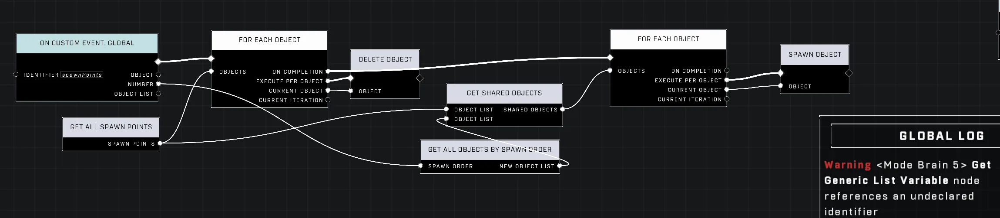
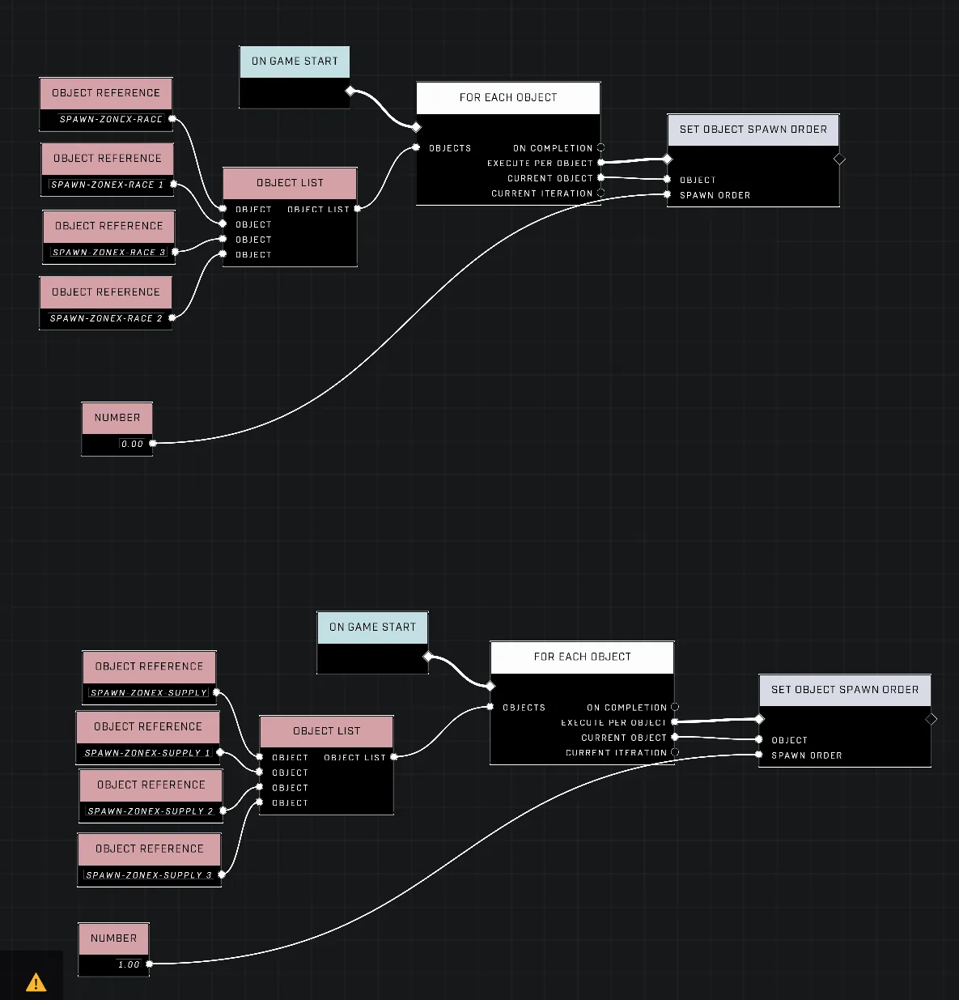
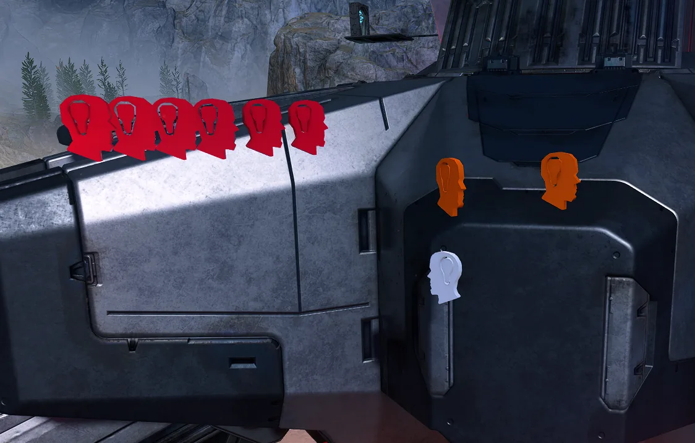

# HALOTAT

<figure><figcaption></figcaption></figure>

HALOTAT is a project designed to bring the fast-paced, best-of-three round combat style of STRAFTAT to Halo Infinite. The mode emphasizes momentum-based movement and efficient match management through advanced scripting and prefab organization.

## Movement and Momentum

The gameplay experience is centered around high-speed interaction with the environment. One primary goal is to implement mechanics that allow for more vertical and lateral mobility than standard movement provides.

### Wall Jumping and Surface Interaction

To facilitate wall jumping, the system can utilize raycasting directed at the sides of the player. If the raycast detects a hit with a static surface, an invisible platform can be placed momentarily beneath the player to enable a jump.

<figure><figcaption>
The circle jump demonstrates a method for performing wall-based jumps.
</figcaption></figure>

Additionally, developers have explored the possibility of creating low-friction surfaces, similar to ice-themed maps, to enhance sliding mechanics.

## Spawning and Match Management

Managing how and where players appear is critical for maintaining the intended flow of the rounds.

### Spawn Sequencing and Randomization

Spawning can be managed by setting individual spawn orders within the object properties of each spawn point. For more complex setups, such as matches involving multiple zones, scripts can be used to cycle through spawn points.

To introduce variety into each match, spawning groups can be randomized. This is achieved by using a generic list of numbers to assign new spawn orders to specific groupings of spawn points at the start of a round. On large maps with many zones, ensuring each zone has its own individual spawn order in the object properties allows the script to randomize the zones themselves.

<figure><figcaption>
A script brain manages the sequence for the start of a round.
</figcaption></figure>

<figure><figcaption>
This script brain processes custom global events.
</figcaption></figure>

<figure><figcaption>
The script brain sets individual spawn orders when the game starts.
</figcaption></figure>


Using scripts to manage spawn sequencing may result in race conditions unless the scripts are injected into the existing spawn initialization process.


<figure><figcaption>
Players are positioned at their designated spawn points.
</figcaption></figure>

<figure><figcaption>
The map layout shows various player spawn locations across the environment.
</figcaption></figure>

### Playlist Organization and Randomization

To streamline the creation of playlists, "maps" can be saved as prefabs. This approach allows a single map file to load a collection of different environment setups, effectively functioning as a playlist. 

Playlists can be randomized and will iterate through all maps in the list; for example, a five-map playlist will cycle back to the first map after the fifth is played.


While it is recommended to keep these map prefabs relatively simple, the hard limit for objects within a prefab is 255.


### Spectator Systems

A custom spectator camera allows players to switch between different teams in multi-team matches, providing a better viewing experience than standard spectator modes.

***

## Source Data

* Discord thread: [HALOTAT](https://discord.com/channels/220766496635224065/1475678585476874320/1475678585476874320)

#### <mark style="color:green;">Contributors</mark>

Aimless_E\
Deathcrawller\
Frogwyn\
Okom