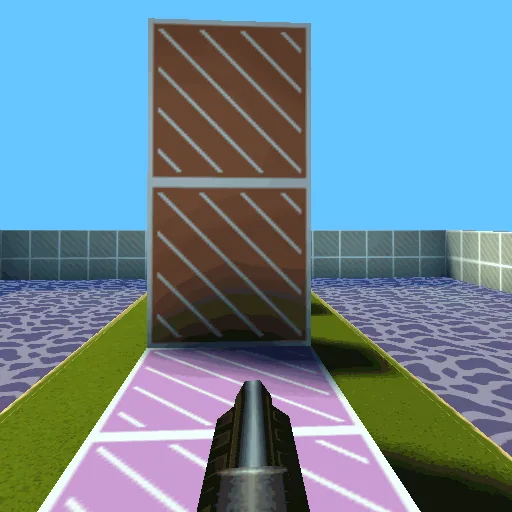
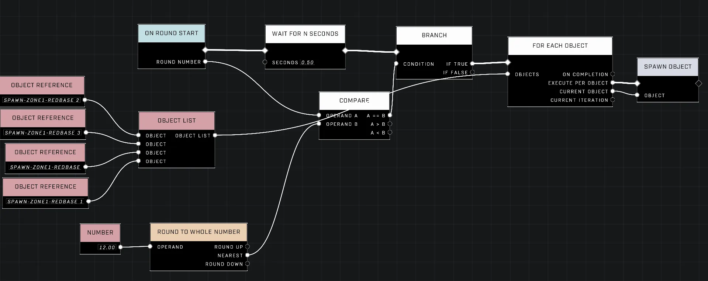
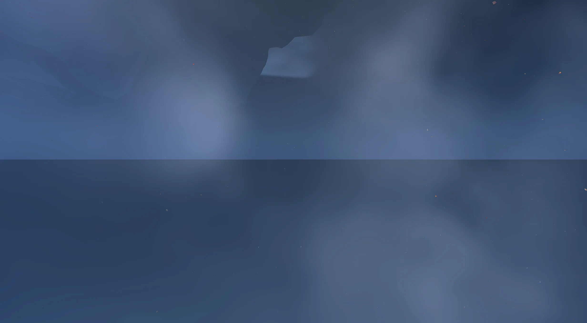

# HALOTAT

<figure><figcaption></figcaption></figure>


This mode is a work-in-progress.


HALOTAT is a project designed to bring the fast-paced, best-of-three round combat style of STRAFTAT to Halo Infinite. The mode emphasizes momentum-based movement and efficient match management through advanced scripting and prefab organization.

## Movement and Momentum

The gameplay experience is centered around high-speed interaction with the environment. One primary goal is to implement mechanics that allow for more vertical and lateral mobility than standard movement provides.

### Wall Jumping and Surface Interaction

To facilitate wall jumping, the system can utilize raycasting directed at the sides of the player. If the raycast detects a hit with a static surface, an invisible platform can be placed momentarily beneath the player to enable a jump.

<figure><figcaption>
The circle jump demonstrates a method for performing wall-based jumps.
</figcaption></figure>

Additionally, developers have explored the possibility of creating low-friction surfaces, similar to ice-themed maps, to enhance sliding mechanics, though the reliability of such surfaces may be limited.

## Spawning and Match Management

Managing how and where players appear is critical for maintaining the intended flow of the rounds.

### Spawn Sequencing and Randomization

Spawning can be managed by setting individual spawn orders within the object properties of each spawn point. For more complex setups, such as matches involving multiple zones, scripts can be used to cycle through spawn points.

To introduce variety into each match, spawning groups can be randomized. This is achieved by using a generic list of numbers to assign new spawn orders to specific groupings of spawn points at the start of a round. For maps featuring many different zones, developers should ensure each zone has its own spawn order set within the settings of each individual spawn point.

<figure><figcaption>
This script brain shows a method for managing spawn sequences.
</figcaption></figure>

<figure><figcaption>
A script brain displays a warning regarding undeclared identifiers.
</figcaption></figure>

<figure><figcaption>
Several script brains work together to manage complex spawning and zone transitions.
</figcaption></figure>


Using scripts to manage spawn sequencing may result in race conditions unless the scripts are injected into the existing spawn initialization process.


<figure><figcaption>
Players are shown at spawn points within a configured match environment.
</figcaption></figure>

### Playlist and Prefab Organization

To streamline the creation of playlists, "maps" can be saved as prefabs. This approach allows a single map file to load a collection of different environment setups, effectively functioning as a playlist. This method also encourages simplicity by helping keep prefab sizes manageable. While it is recommended to keep these map prefabs relatively simple, the hard limit for objects within a prefab is 255.

Playlists can also be randomized, including the iteration through the playlist itself. For example, if a playlist contains five maps but a match requires ten rounds to win, the system can cycle back to the first map after the fifth has been played.

## Match Features

To improve the user experience in multi-team or FFA scenarios, a multi-team spectator camera can be implemented. This allows players to switch between different teams and observe the match rather than being stuck viewing their own perspective.

***

## Source Data

* Discord thread: [HALOTAT](https://discord.com/channels/220766496635224065/1475678585476874320/1475678585476874320)

#### <mark style="color:green;">Contributors</mark>

Aimless\_E\
Deathcrawller\
Frogwyn\
Okom
