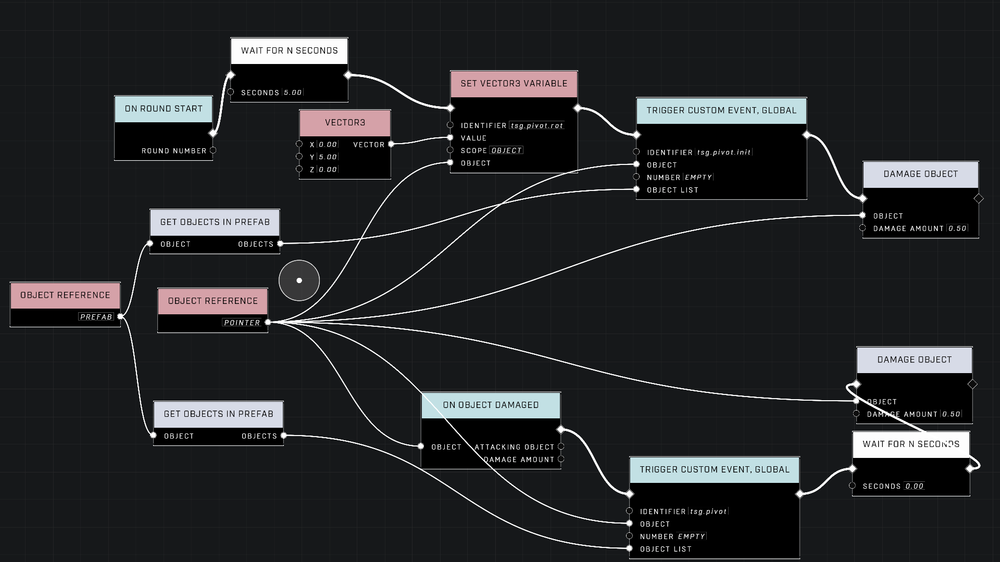
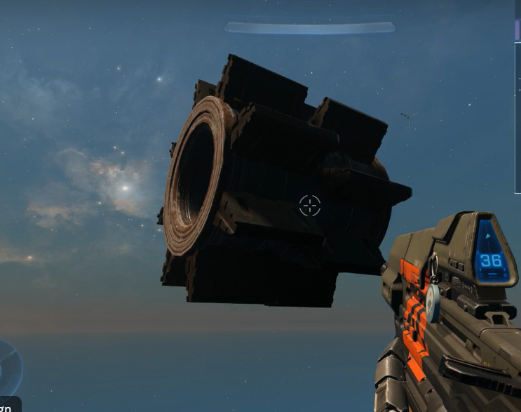
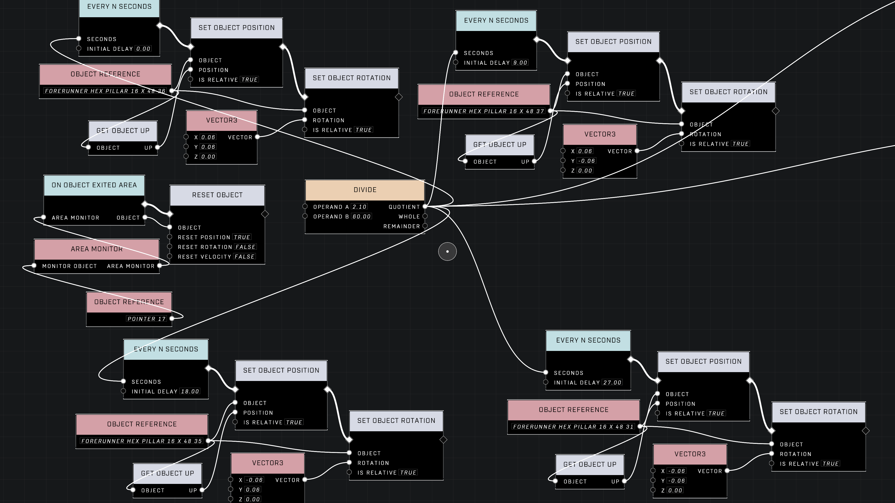
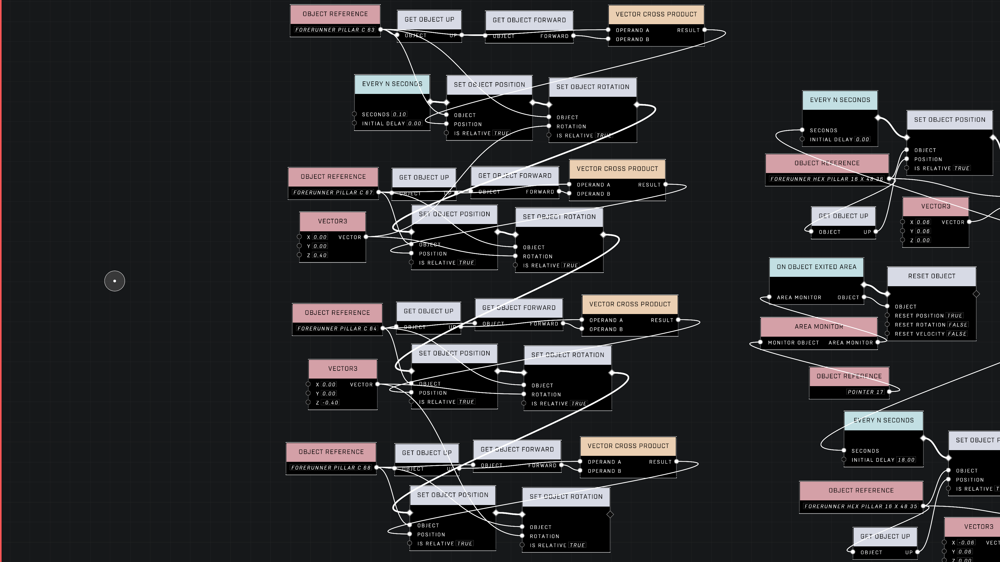

# tsg pivot

<figure><figcaption></figcaption></figure>

The `tsg pivot` library provides global events to attach multiple objects to a single pivot point. This allows for complex behaviors such as orbiting, rotating clusters, or synchronized object attachment, regardless of the objects' physics modes.

## Implementation and Workflow

The script functions by calculating the relative position of a set of objects to a "pivot" object. Once these offsets are established, the script can continuously reposition and rotate the objects based on the pivot's current transform.

### Script Logic

To use the library effectively, a specific sequence of operations must be followed to ensure the offsets are recorded correctly.

* `tsg.pivot.init`: This node should be called to set the initial relative positions of the target objects compared to the pivot object.
* `tsg.pivot.rot`: This variable (object-scoped to the parent or pointer object) defines the amount of rotation to apply. This value can be adjusted at any time, including setting it to zero.
* `tsg.pivot`: This node applies the calculated relative position and the defined rotation to the target objects. It should be called whenever the pivot object is moved or whenever a rotation update is desired.

<figure><figcaption>
This screenshot shows a gear-shaped prefab setup using the pivot script.
</figcaption></figure>

<figure><figcaption>
The image displays the node graph used to manage the rotation of the gear teeth.
</figcaption></figure>

#### Rotation and Timing

For smooth execution, the rotation amount assigned to `tsg.pivot.rot` must be balanced with the script's execution frequency. In certain high-speed applications, if the rotation increment is too large, the math may struggle to keep up with the execution time, causing objects to clump together. 

Using a `Wait N seconds` node with a value of `0.00` can effectively act as an "Every N seconds" timer, executing as quickly as the server can handle.


The `tsg.pivot.rot` variable is additive. This makes it difficult to dynamically set an object to a specific absolute rotation angle relative to the pivot, as the value acts as a rotation increment rather than a direct angle assignment.


## Custom Game Compatibility

Using `tsg pivot` in Custom Games can present unique challenges compared to standard Forge environments due to how the server handles object initialization and synchronization.

### Initialization Challenges

In Custom Games, objects may not be fully initialized when the script begins. If `tsg.pivot` is called before `tsg.pivot.init` has successfully executed, the objects may default to the pivot's origin (0,0,0), causing them to teleport to the center of the pivot.


To prevent synchronization issues in Custom Games, avoid triggering pivot logic immediately upon [On Gameplay Start](../../../scripting/nodes/events/on-gameplay-start.md). It is recommended to introduce a delay of several seconds to ensure all dynamic objects have been properly set up by the server.


### Prefabs and Object Lists

Prefab lists and the `Get Prefab Objects` node may not function reliably in Custom Games. For more stable behavior, it is recommended to build object lists using label lists, manual object references, or an area monitor on round start, rather than relying on prefab-based lists.

<figure><figcaption>
This node graph demonstrates an efficient orbiting setup using basis vectors.
</figcaption></figure>

<figure><figcaption>
The provided graph illustrates the implementation of orbiting pillars for a map environment.
</figcaption></figure>

***

## Source Data

* Discord thread: [tsg pivot](https://discord.com/channels/220766496635224065/1039677768872497313/1039677768872497313)
* Discord thread: [Moving a "prefab" ADVICE](https://discord.com/channels/220766496635224065/1327472659201789992/1327472659201789992)

#### <mark style="color:green;">Contributors</mark>

Kwatzy\
ZopstaLobsta\
cjj19970505\
CallMeTrinity23#001\
Tyler Johnson\
Captain Punch\
KraZe_EyE\
thescriptinator\
ShambullŽ/Yumudas\
WolfReign\
theDidact\
Yolomcswag\
Fearless7\
Okom\
seanonix\
AbeStrange\
NOKYARD\
swagonflyyyy (Mr. Blackwell)