# tsg radial

<figure><figcaption></figcaption></figure>

`tsg radial` is a scripting module template that simplifies the creation of Radial Menus. The method used for creating the Radial Menus is efficient and allows for intuitive navigation between multiple categories or even separate Radial Modules.

Bookmark the mode prefab below or find the it through the in-game UGC browser by searching with keywords or tags.



## Features

A showcase of the radial menu template features and how to modify them to suit your Radial Menu.

### Opening a Menu

In `tsg radial` a Menu is opened by calling a `Custom Event, Global` associated with the desired Menu. The standard for opening Radial Menus is either with the Custom Input key, or by interacting with a switch on the level.

<figure>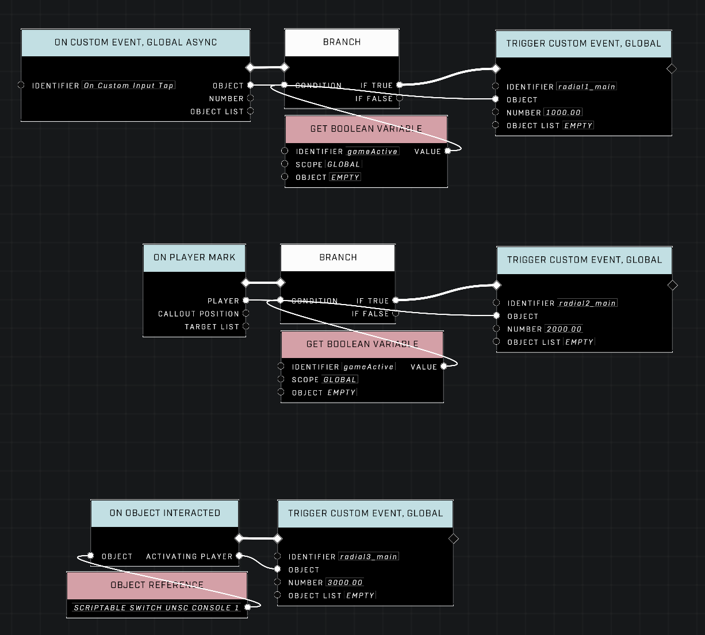<figcaption>
Triggers and Events for opening Menus
</figcaption></figure> <figure><figcaption>
An example menu
</figcaption></figure>

The events for opening a Menu rely on the following parameters:

* **Identifier**: A custom name for the event; suggested to use the naming pattern: `radial{Digit 1}_{category}` as it helps you keep track of what radial belongs where
* **Object**: The player who the Menu should be shown to
* **Number**: A 4-digit number value containing information about the Menu; used for determining which menu to return to when navigating backwards
  * **Digit 1**: Radial Module
  * **Digit 2**: Radial Category
  * **Digit 3**: Radial Page
  * **Digit 4**: Menu Item

Having these number values consistent between all Custom Events that open Menus is crucial for the script module to function correctly.

<figure><figcaption>
Value 1000 = main radial of the 1st Radial Module
</figcaption></figure> <figure><figcaption>
Value 2203 = 3rd Menu Item from the 2nd category of the 2nd Radial Module
</figcaption></figure>


The 4th digit is only used if selecting the Menu Item takes you to an extra Radial Menu that has no more navigation beyond it, such as a selection for which Team's bot to remove.


### Menu creation

Each menu in `tsg radial` is built right before the menu is shown to the player. This way the most updated information can be shown on the menu, and the code used for creating the menu is all in the same place for efficiency.

<figure>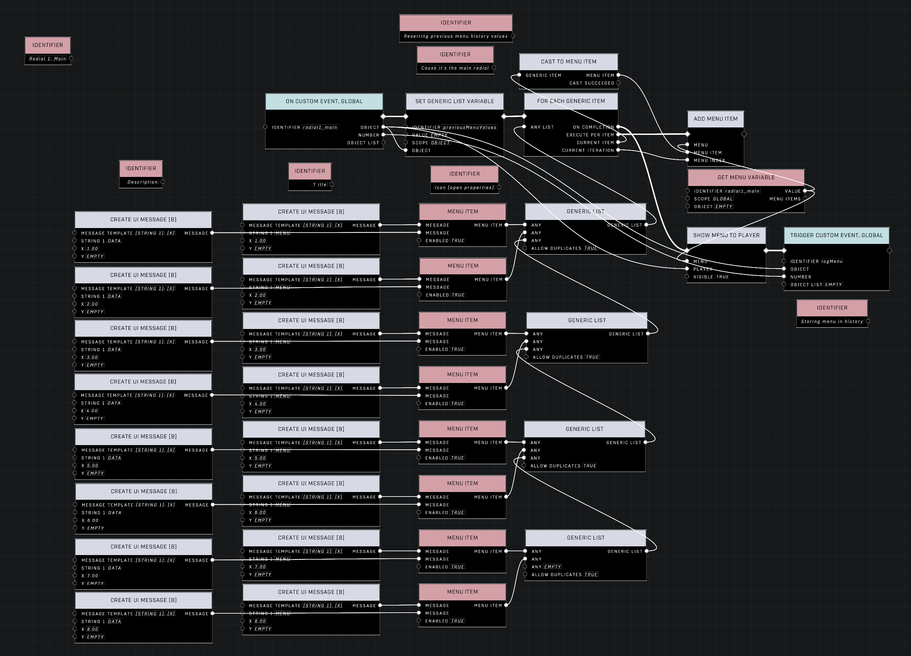<figcaption>
Code for a building, showing and logging a Menu
</figcaption></figure>

#### Menu Items

Radial Menus consist of a maximum 8 Menu Items (selectable sectors) per Menu, which each must be declared in the code so display the desired Title, Description, Icon and Enabled state. The Title and Description utilize a `Create UI Message` node, and the Icon and Enabled state are set by opening the properties of the `Menu Item` node.

<figure><figcaption>
Menu Item node properties showing options for setting the Enabled state and Icon
</figcaption></figure>

Each Menu Item is fed into a `Generic List` running through a `For Each Generic Item` loop that adds each Menu Item to the Menu at the index where it shows up in the Generic List. A blank Menu Item can be created by picking a new Menu Item node, leaving the Icon selection as empty, and making the Enabled state False.

<figure>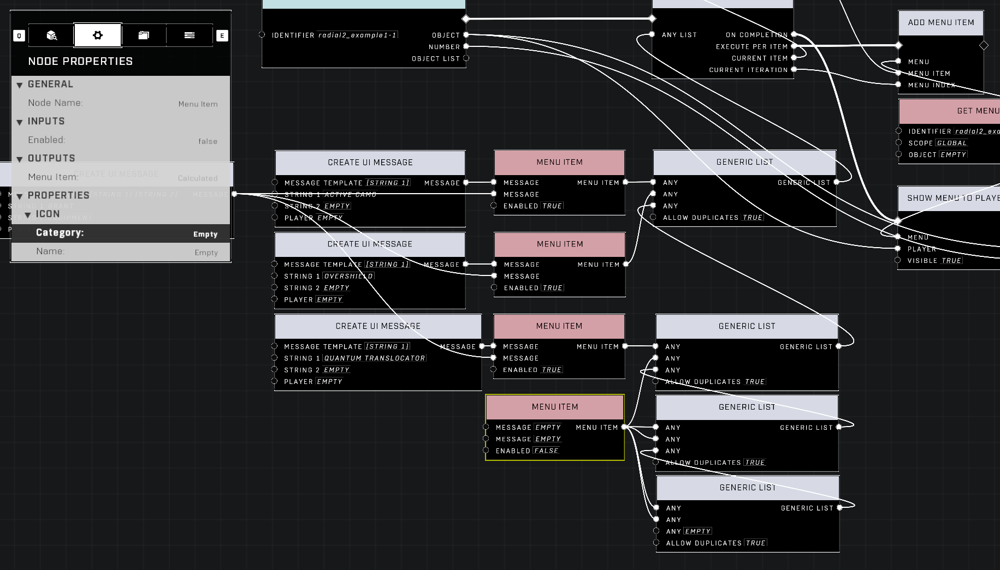<figcaption>
Code for creating five blank Menu Items in a Menu
</figcaption></figure> <figure><figcaption>
Menu Items 4-8 showing as blank and unselectable
</figcaption></figure>

#### Menu Variables

Menu Variables are the core of each Menu. These must be declared via the `Declare Menu Variable` node before Menu Items can be assigned to them.

The Menu Variables follow these parameters:

* **Identifier**: A custom name for the Menu; suggested to use the exact same naming pattern: `radial{Digit 1}_{category}` as used for the `Custom Event, Global` for creating the Menu as it's more streamlined
* **Scope**: Global
  * Optimally object-scope should be used for player-based menus, but a current bug is preventing object-scoped menus from functioning correctly

<figure>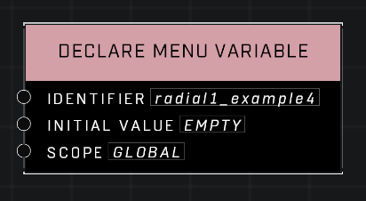<figcaption></figcaption></figure> <figure>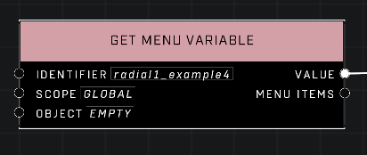<figcaption></figcaption></figure>

#### Displaying the Menu

After the menu has been built, it's shown to the player in that state using the `Show Menu To Player` node. With `tsg radial` if another player opens the same menu shortly after with their own building parameters, the previous player's Menu will not be affected.

<figure><figcaption></figcaption></figure> <figure><figcaption></figcaption></figure>

#### Logging the Menu

After a Menu is displayed to a player, its Number value is stored at the end of a Generic List named `previousMenuValues`. This list is used to look up previous Menus the player has been shown to determine which Menu to navigate back to when closing a Menu. This custom Menu history tracking allows for complex nested Menus to feel intuitive navigating in and out from.

Also a Boolean Variable `radialOpen` is set to True, which is used elsewhere to track whether the player has a Menu open or not, as this is not natively tracked.

<figure>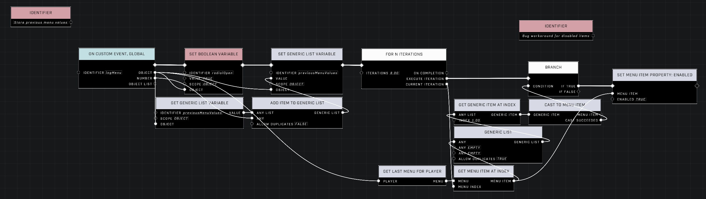<figcaption>
Logging the Menu Number value in a Generic List
</figcaption></figure>


Extra code for a bug workaround is appended to the function that may become unnecessary in the future.


### Menu forwards navigation

The Menu can be navigated with the controller movement stick, mouse movement, or keyboard WASD keys and various inputs for selecting the Menu Items. Selecting a Menu Item will take you to a separate Menu or result in an action such as being granted a weapon.

<figure><figcaption></figcaption></figure> <figure><figcaption></figcaption></figure> <figure><figcaption></figcaption></figure>

#### Menu Item selection

When a Menu Item is selected, a comparison is done to determine which menu the selection was made from. If the Menu where a selection made matches a Menu in the comparison tree, a `Custom Event, Global` is fired with data that is used to determine which item was selected.

Also a Boolean Variable `radialOpen` is set to False, which is used elsewhere to track whether the player has a Menu open or not, as this is not natively tracked.

<figure>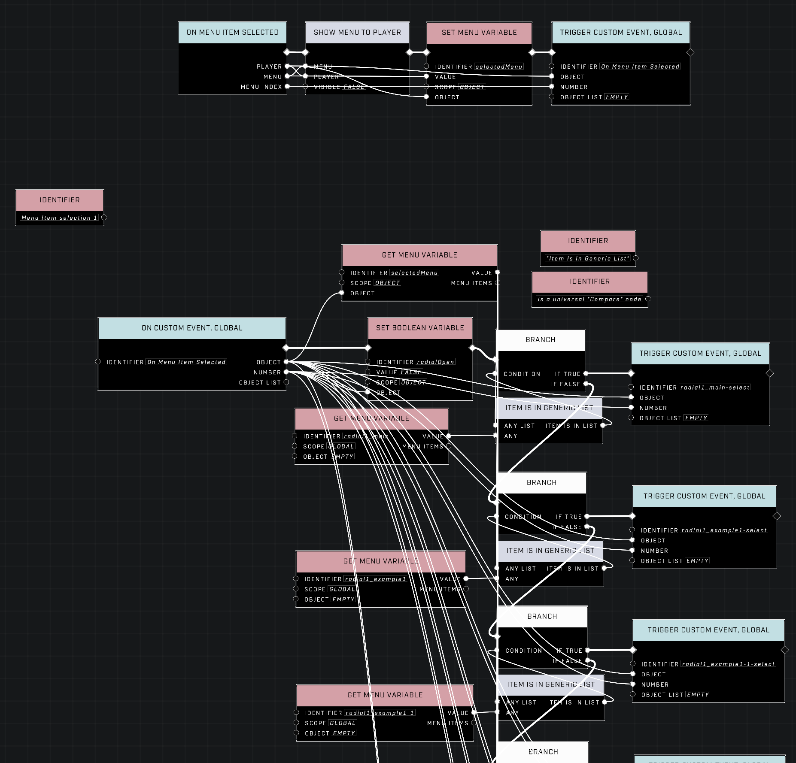<figcaption>
Comparison tree determining which Menu a selection was made in
</figcaption></figure>

The event for the item selection relies on the following parameters:

* **Identifier**: A custom name for the event; suggested to use nearly the same naming pattern: `radial{Digit 1}_{category}-select` as used for the `Get Menu Variable` for comparing the Menu as it's more streamlined
* **Object**: Player who made the Menu Item selection
* **Number**: The index of the selected Menu Item

<figure><figcaption></figcaption></figure>

#### Selection event

The filtered selection event leads into a function that determines what to do based on which index Menu Item was selected. The function uses a simple comparison tree with an optimized amount of Compare nodes to cover all values from 1-8. Comparing for 8 values is not necessary if the menu contains less selectable Menu Items to begin with.


The value 0 is also in the comparison, which is used for backwards navigation purposes as the same event is reused there to determine which Menu to return to.


<figure><figcaption>
Main radial selection event leading to 8 different categories
</figcaption></figure> <figure><figcaption>
Category 1 selection event with weapon grants and a link to the 2nd page
</figcaption></figure>

<figure><figcaption>
Category 1, Page 1 selection event with weapon grants and a final Menu Item selection radial
</figcaption></figure>

<figure><figcaption>
Menu Item selection radial
</figcaption></figure>

### Menu backwards navigation

`tsg radial` has a custom [menu history system](tsg-radial.md#logging-the-menu) where closing a Menu by pressing the Cancel button in the center of each radial will take you to the previous Menu you were in. This feature can be disabled if necessary, but is a very useful feature in large menus with multiple categories.

<figure><figcaption></figcaption></figure> <figure><figcaption></figcaption></figure> <figure><figcaption></figcaption></figure>

#### Menu closing filter

When a Menu is closed, the custom value of the closed Menu is removed from the `previousMenuValues` list, and it's checked whether the last item in the list is a valid number. If so, the 4-digit number value is filtered through various checks in order to open the correct Menu for the player. This Menu would be the previous Menu the player had been in.

**Digit 1** is filtered to determine which Radial Module the Menu belongs in, and a `Custom Event, Global` corresponding to the Radial Module is fired. Radial Modules are meant to represent entirely different Radial Menus, each with their own set of nested Menus for example. The 4-digit Menu logging system in `tsg radial` supports 9 separate Radial Modules which should be plenty.

<figure><figcaption>
Filter for determining the Radial Module of the Menu that should be returned to
</figcaption></figure>

The event for the Menu filtering relies on the following parameters:

* **Identifier**: A custom name for the event; suggested to use the naming pattern: `menuClose_radial{Digit 1}` as it helps you keep track of which Radial Module is being processed
* **Object**: Player who closed the Menu
* **Number**: The remaining 3-digit number value after the first filtered value has been excluded

<figure><figcaption></figcaption></figure>

Then the second, third and fourth digits are filtered to determine the exact Menu that should be shown to the player.

* **Digit 2** determines the Radial Category. If the desired Menu has no nested menus, the [Selection event](tsg-radial.md#selection-event) for that Menu is fired with **Digit 4** fed into the Number value of the event.
* **Digit 3** determines the Radial Page. If the desired Menu has a nested menu, a branch is created that compares which page matches the comparison. The same Selection event for the desired Menu is fired as before.
* **Digit 4** determines the Menu Item or the Menu itself. In this pattern this value is usually 0, which is used in the Selection event only for this purpose to return the desired Menu to the player.

<figure><figcaption>
Filter for determining the Menu that should be returned to from Radial Module 1
</figcaption></figure> <figure><figcaption>
Filter for determining the Menu that should be returned to from Radial Module 2
</figcaption></figure>

Here's an example following how the value `110` is filtered:

<figure><figcaption>
Highlighted connections that are used when the Number <code>110</code> is processed in the Menu filtering event
</figcaption></figure>


**Note:** The Number `110` started as `1110` before having **Digit 1** removed when fed into this Custom Event.


## Background events

The essential background events that serve as the foundation for some features of `tsg radial`. These events should be left untouched when using the scripting module.

### Initialization events and declarations

Custom Events created to ensure smooth timing and predictable execution of the rest of the code.

<figure>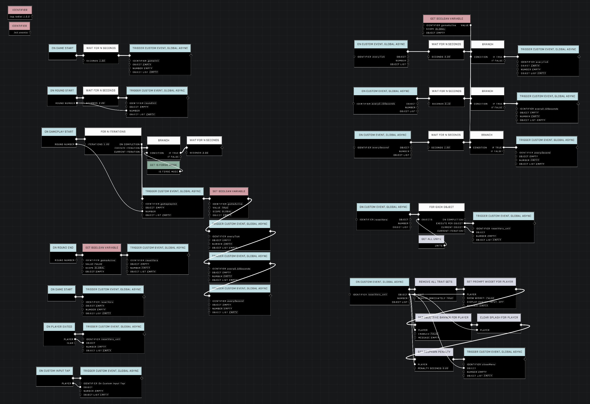<figcaption>
Initialization events
</figcaption></figure>

Declarations for all variables and traits in one place. More variable declarations are needed when new Menu Variables are used.

<figure>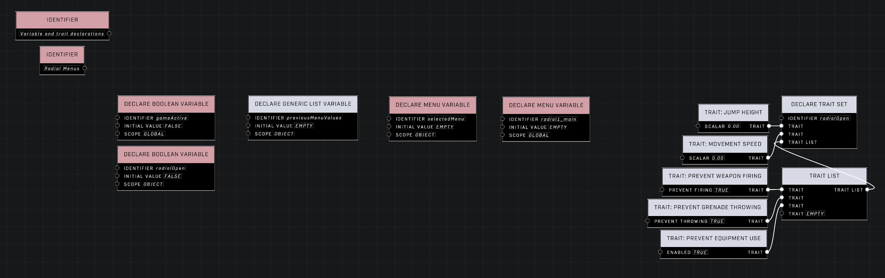<figcaption>
Variable and trait declarations
</figcaption></figure>

### Menu state events

Essential events for tracking if a player has a Menu open, logging the menu values, and ways of forcefully closing the menu.

<figure><figcaption>
Menu state tracking
</figcaption></figure> <figure>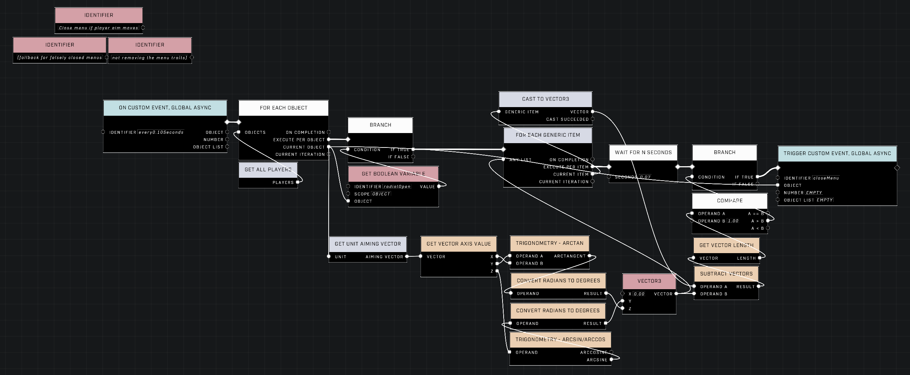<figcaption>
Fallback for closing the Menu by moving the aim vector
</figcaption></figure>

<figure><figcaption>
Logging the Menu Number value and applying a bug workaround
</figcaption></figure> <figure><figcaption>
Forceful closing of the player's current Menu
</figcaption></figure>

## Example setups

Examples of using `tsg radial` to make various types of Menus.

### Value update on Menu open

Object-based values can be fed into the `Create UI Message` nodes in order to alter what values show up in the Menu messages. These values update each time the event is called to open the Menu.

This Menu example also features a button-like Menu Item that reopens the same Menu after selecting the Menu Item at index 1 so the same Menu Item can be quickly pressed multiple times.

<figure>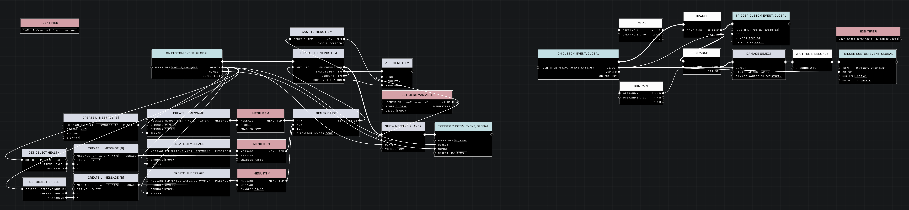<figcaption>
Pulling the player's health and shield values to be used in the Description of Menu Items
</figcaption></figure>

<figure><figcaption>
The selected Menu Item is disabled, but still shows the Title and Description containing the player's shield amount
</figcaption></figure>

A menu for toggling Skulls where the description of each Menu Item is updated based on if the Skull is enabled or not. First the Menu Items are added to the Menu, and then the Enabled state of them is re-evaluated with a separate for-loop that updates the Menu Item descriptions.

When any Menu Item in this Menu is selected, the same Menu is returned to the player to make the menu act in a button-like manner in addition to toggling the selected Skull.

<figure>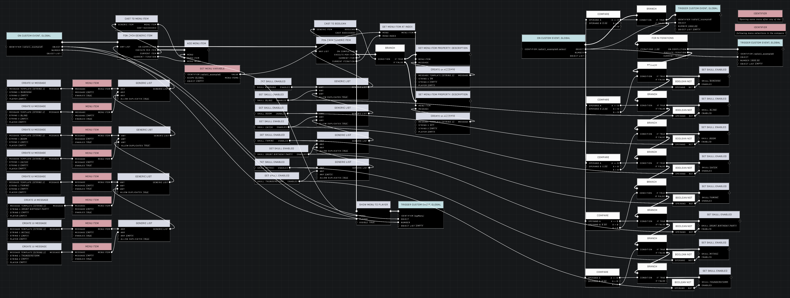<figcaption>
Using Boolean values of certain Skulls being enabled or not to determine what is shown in the Description of a Menu Item
</figcaption></figure>

<figure><figcaption>
Skull disabled
</figcaption></figure> <figure><figcaption>
Skull enabled
</figcaption></figure>

### Variable Enabled state values

By feeding a comparison output Boolean into the Enabled state property of a Menu Item, Menus can be built that display items in enabled or disabled states based on if the player meets the criteria for them to be selectable. In this example the player has enough points to spawn an allied Elite squad, but not a Brute squad.

<figure><figcaption>
Menu Items being enabled or disabled based on if the player has enough points or not. Points are deducted when a selection is made.
</figcaption></figure>

<figure><figcaption>
Enough points to get Elite allies
</figcaption></figure> <figure><figcaption>
Not enough points to get Brute allies
</figcaption></figure>

### tsg radial-example

A display of more example setups covering nearly everything `tsg radial` is capable of can be found in the module variant `tsg radial-example`. Bookmark the mode prefab below or find the it through the in-game UGC browser by searching with keywords or tags.



<figure><figcaption></figcaption></figure>

### tsg radial-machinima

A Machinima control Radial Menu built from `tsg radial`. Options for Camera Mode toggle, Weapon lowering, Fists and empty Sword grant, Fly mode toggle and item grants. Can be loaded as a standalone mode on any map. Bookmark the mode prefab below or find the it through the in-game UGC browser by searching with keywords or tags.

This Menu Module also contains examples of granting every type of weapon, equipment, vehicle and grenade.





## Known Issues

A list of known issues that couldn't be fixed:

* Two players opening the same Menu at the simultaneously may often result in one player's Menu not displaying.
* Two players opening the same Menu at the simultaneously may rarely result in one player's Menu displaying for the other player.
* Two players opening the same Menu at the simultaneously may rarely result in one player's Menu showing all Menu Items in the Enabled state.
* Navigation between nested Menus becomes slower with latency to the server.

***

#### <mark style="color:green;">Contributors</mark>

Okom
