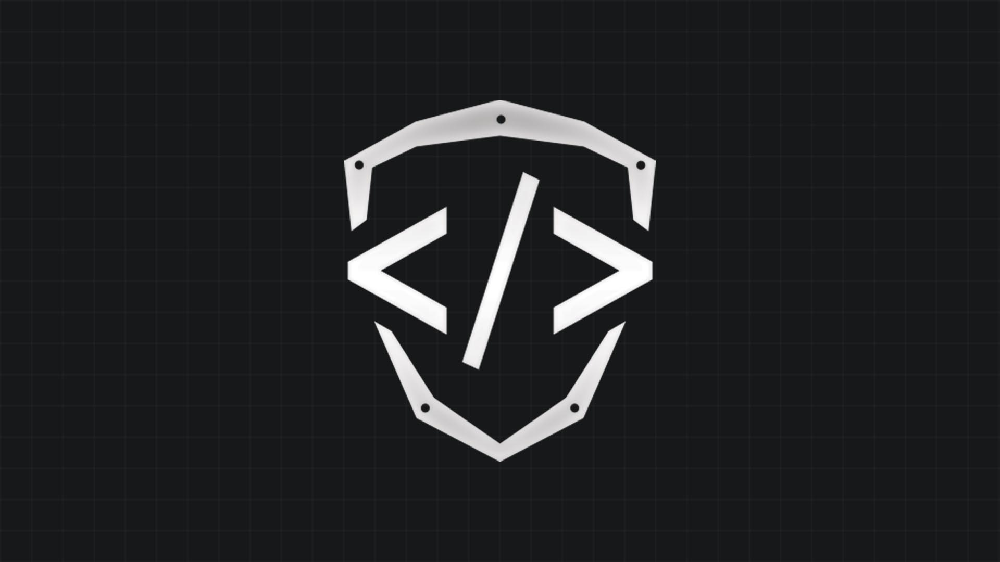

# Article Template

Give a brief explanation of the topic that the article is about. What the purpose of the thing is and what kind of adjustments can be done to it. Keep it short, as the sections below should be used for further explanation.

<figure><figcaption>
This is a cover image with the aspect ratio of 21:9. This is a custom cropped image just for this purpose, and one should be made for each article, if possible. In a real article, leave this text caption field blank for the cover image. Remember to change the alt text of the image.
</figcaption></figure>

Temporary section for general notes about the article; write down things quickly that you want to write about so you can easily recall them later. Delete this section when the article is finished:

*
*
*

## First heading 1 title

Write about a branch of the main topic. This section title will show up on the sidebar on the right.

### Sub-heading 2 title

Write about a sub-section of the topic above. This section title will show up on the sidebar on the right.

<figure><figcaption>
TSG logo in the node graph
</figcaption></figure>

 

<figure><figcaption>
Mysterious cat
</figcaption></figure>

More text here about the topic.

#### Sub-heading 3 title

Write about a topic. This section title will _not_ show up on the sidebar on the right.

## Second heading 1 title

Write more topics here.


Leave a one-paragraph gap before a new "heading 1" title (`## Title name`) to make the large sections more separated and distinguishable.


***

#### <mark style="color:green;">Contributors</mark>

First article contributor\
Someone else\
Another user
