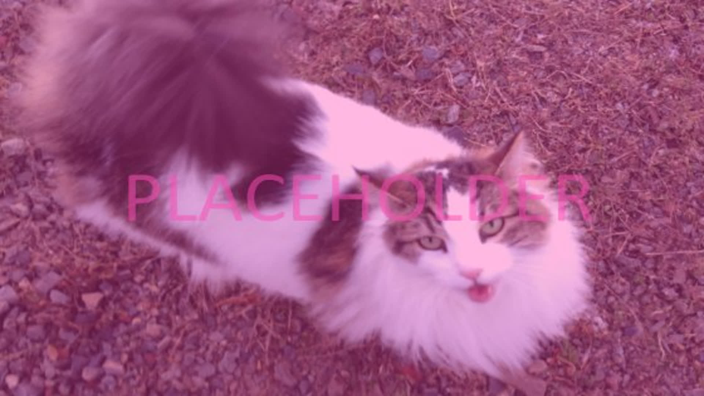

# Article Template

Give a brief introduction to the topic that the article is about here.

<figure><figcaption></figcaption></figure>

## First section title

Write about the first section in this article topic. This section title will show up on the sidebar on the right.

### Sub-section title

Write about a potential sub-section in this article topic. This section title will show up on the sidebar on the right.

#### Sub-sub-section

Write about a potential sub-sub-section in this article topic. This section title will _not_ show up on the sidebar on the right.

## Second section title

Write more topics here.

#### <mark style="color:green;">Contributors</mark>

First article contributor\
Someone else\
Another user
