# Submitting Content to the Wiki

In order to efficiently submit content to the TSG Forge Wiki, it's important to follow some guidelines that we've setup to make sure that the articles are made properly and the Wiki structure works correctly. Here you will find information on how to do just that.

<figure>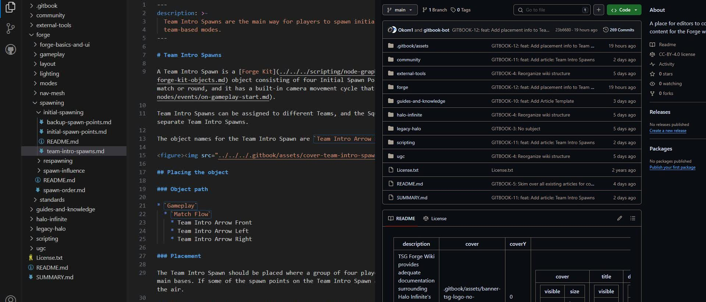<figcaption></figcaption></figure>

## How the TSG Forge Wiki operates

The TSG Forge Wiki is based on a public [GitHub repository](https://github.com/The-Scripters-Guild/ForgeWiki) (repo) that is synced onto a [GitBook documentation page](https://wiki.thescriptersguild.com/main). In order to add content to the Wiki, the content of the GitHub repo must be changed. The way to change this content is for someone to submit a request to change it; these are called "Pull Requests".

It's easiest for the moderators of this Wiki to have users submit these pull requests in a well-formatted and organized manner so the changes within them can easily be authored and confirmed to be pushed to the Wiki. To help with this process, we've created this article to explain the process.

If you'd prefer to submit info via other means, you can look at the [Submitting via Discord](submitting-content-to-the-wiki.md#submitting-via-discord) section, but keep in mind that this is much more work for the moderators of the Wiki to get content parsed from there into a functioning article.

## Git and Visual Studio Code

This process focuses on adding content to the Wiki with the help of two programs: [Git](https://git-scm.com/) and [Visual Studio Code](https://code.visualstudio.com). Git is a distributed version control system that we use to efficiently push changes to our repo. Visual Studio Code is a great text editing software that also has native integrations with Git and GitHub Pull Requests.

Watch this video to get started with Git using Visual Studio Code:



### Useful Visual Studio Code extensions

In order to get a more accurate Markdown preview than the VS Code built-in one and some additional quality-of-life improvements specifically tailored to making articles for TSG Forge Wiki, consider installing these VS Code extensions:

* GitHub Markdown Preview
  * Installing this extension also installs multiple other ones
* Markdown All in One
* GitHub Pull Requests (mandatory in a later step)

<figure>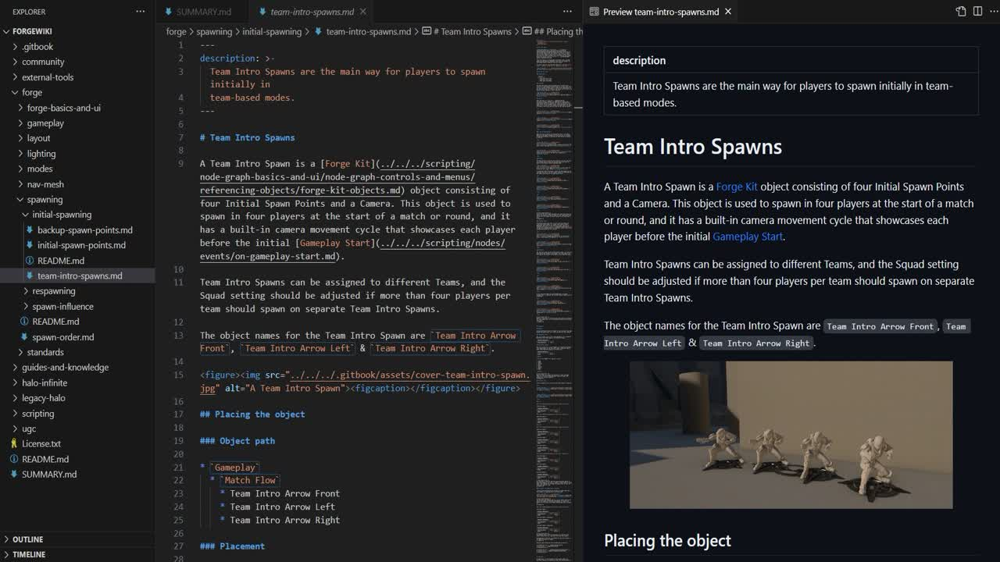<figcaption>
VS Code Markdown preview with the mentioned extensions installed
</figcaption></figure>


To open the Markdown preview to the side, click the preview icon on the top right, or use the shortcut: `CTRL+K V`.


## Cloning the repository

To get a copy of the TSG Forge Wiki repo onto your local machine for editing, the repo needs to be cloned. The repo can be found here: [https://github.com/The-Scripters-Guild/ForgeWiki](https://github.com/The-Scripters-Guild/ForgeWiki)

Watch this section (5:43-6:20) in this tutorial video to learn how to clone a GitHub repository:



## GitBook structure

To achieve a working Table of Contents structure (the list on the left) with articles, pages and sub-pages (drop-downs), GitBook relies on looking for certain patterns in the GitHub repo to make everything work.

### Markdown files for pages

Markdown files (`.md` extension) are used as the file type for all pages. Markdown is a lightweight markup language for creating formatted text using a plain-text editor. Pages made from other file types won't be recognized as working pages.

### SUMMARY.md

The `SUMMARY.md` file is where the Table of Contents structure is stored. If a new Markdown page is to be added to the repo, the `SUMMARY.md` file must be updated to include the correct path of the newly added file. Otherwise the new page won't show up in the Table of Contents structure in the live GitBook site.

<figure>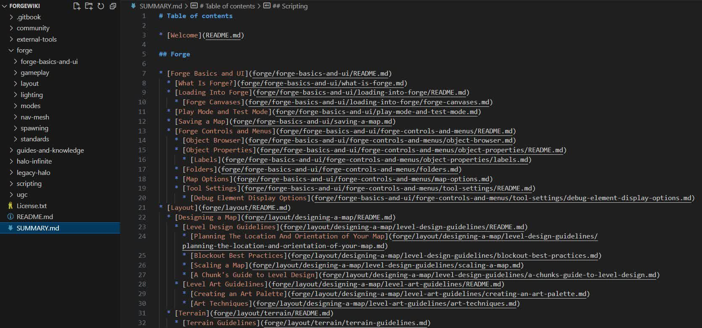<figcaption>
SUMMARY.md of the TSG Forge Wiki repo in Visual Studio Code
</figcaption></figure>


Always remember to update the SUMMARY.md file if a new page is added.


## Creating a branch

A Branch is a separate version or ...branch of the main repository. Branches allow you to work on different parts of a project without impacting the main branch. When the work is complete, a branch can be merged with the main project.

Watch this section (2:05-2:33) in this tutorial video to learn how to create a branch:



### Branch naming

When making edits to the cloned repo, Wiki contributors should always work in a separate branch that is named semantically and in relation to the changes being made. After the changes in the working branch have been merged into the main branch, the working branch is usually deleted as to not fill up the repo with old branches.

For effective and standardized branch naming, read these articles:

[Git Naming Conventions – GitHub, rukavinaet](https://github.com/rukavinaet/git-naming-conventions)




Branches should be named meaningfully and with as few words as possible required to communicate the necessary changes the branch is focusing on.


## Making edits

When making edits to the repo, it's important to follow some standards and guidelines so that there's less work for the Wiki moderators to correct. Along the way you'll also learn some Markdown standards.

We've created a [Style Guide](style-guide.md) that showcases the most common article formatting techniques for TSG Forge Wiki articles. Some important and useful external resources to also read through and take note of are listed below:

[Markdown Formatting Rules – GitHub, markdownlint](https://github.com/DavidAnson/markdownlint/blob/v0.34.0/doc/Rules.md)



### Before adding content

Search the Wiki for existing information about the topic you are looking for. Use the the Search bar in the top right of the site. The search will index any instances of the search term, which is very useful for finding any mentions of the information you are trying to find.

<figure>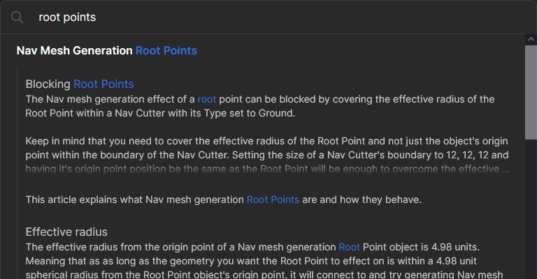<figcaption>
Searching for an article name
</figcaption></figure>

 

<figure>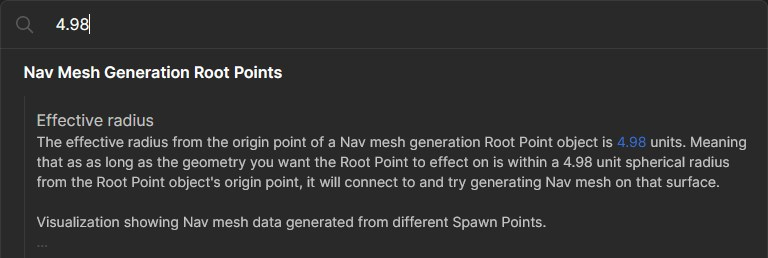<figcaption>
Searching for a mention of a term within an article
</figcaption></figure>

Based on if relevant information already exists or not, you can make a decision on whether to [edit  existing content](submitting-content-to-the-wiki.md#editing-existing-articles), [add new content](submitting-content-to-the-wiki.md#adding-new-articles) or to drop the initiative.

### Article formatting guidelines

The articles for the TSG Forge Wiki follow a standardized formatting syntax for consistency and readability:

* Page names should be Title Case. This is achieved via the \[Page Name] in `SUMMARY.md`, rather than in the file for the page or its file name
* If a blank page is crated to "reserve" an article spot in the category, the page needs to mention that it's a stub, and include a link to this page so readers know how to learn to edit that page
  * If you're trying to workshop content, do so on the Discord in the [Wiki Discussion](https://discord.com/channels/220766496635224065/1032391999740969011) forum
* Images should be added to the `.assets` folder of the repo and linked from there. Images can easily be inserted into a `.md` file in VS Code by shift-dragging the image on to the code.
  * Image formats should be preferably JPG/JPEG due to their small file size, but PNG & GIF are supported as well
  * Try to keep individual image size under 300 KB to make pages load faster
  * Images should be named using kebab-case and be named semantically
  * External media links should be avoided whenever possible to keep the informative content concentrated within the repo

### Editing existing articles

Editing an existing article is very simple as all of the back-end functionality and files should already be set up correctly, and all you need to do is edit the `.md` file for the article.

If you're making fixes to an already formatted and written article, just stick to the guidelines shown above when making edits.

For writing new content to an empty page, copy the entire page formatting from the [Article Template](folder-template/article-template.md) page and paste it into the page you're about to write. The said template is made to keep the article formatting consistent and easily digestible. When editing a folder that has articles nested in it, the folder formatting should be copied from [Folder Template](folder-template/) and adapted accordingly.

### Adding new articles

When adding new articles that don't have a `.md` file and a `SUMMARY.md` entry for them, they must both be created. We've also set up some naming guidelines that we'd like Wiki contributors to follow:

#### Standalone pages

Create a file in the desired folder. Name the file with kebab-case and the `.md` extension (`generating-nav-mesh.md` in the image; [link to the live article](broken-reference)). This file will act as the page file that can be edited.

<figure>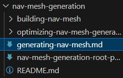<figcaption></figcaption></figure>

#### Pages with sub-pages

Also known as the main file of a folder. Create a folder with the name of the page in kebab-case (`nav-mesh-generation` in the image; [link to the live article](../../forge/nav-mesh/nav-mesh-generation/)); create a file inside the folder with the name `README.md`. The `README.md` file will act as the page file that can be edited.

<figure>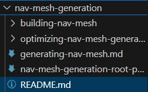<figcaption></figcaption></figure>

#### Updating SUMMARY.md

If a new `.md` file is created in the structure, it has to also be added to `SUMMARY.md` in the right line and with the correct indentation for it to work.

<figure>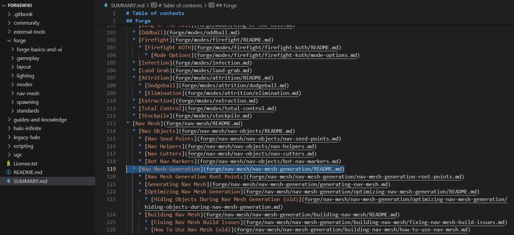<figcaption>
The Nav Mesh Generation page represented in SUMMARY.md
</figcaption></figure>

#### Moving or removing an article, or adding a sub-page to a standalone page


Important! Read carefully if your edit falls into this category.


Since moving an article to some other category will break internal (e.g. [../../forge/nav-mesh/nav-mesh-generation/building-nav-mesh.md](../../forge/nav-mesh/nav-mesh-generation/building-nav-mesh/)) and external (e.g. [https://wiki.thescriptersguild.com/main/forge/nav-mesh/nav-mesh-generation/building-nav-mesh](https://wiki.thescriptersguild.com/main/forge/nav-mesh/nav-mesh-generation/building-nav-mesh)) references to it, these actions should be done via the [GitBook GUI](submitting-content-to-the-wiki.md#creating-a-private-gitbook-app-environment-1).

Removing an article can have this same effect, if the article was the only page in a folder group, as then that folder should become a standalone page. (from `/folder/path/README.md` -> `/folder/path/article-name.md`)

And in addition to removing an article causing this, also adding a sub-page to an existing standalone page will have the same effect as now all of the references pointing to `/folder/path/article-name.md` should point to `/folder/path/README.md`, but it's not done automatically outside of the GitBook editor.

The GitBook editor automatically updates all internal references to an article if it's moved with the GUI, which saves half of the trouble. If you don't have a GitBook app environment set up for this purpose, [open an issue](https://github.com/The-Scripters-Guild/ForgeWiki/issues) on the repo and detail what article needs to be moved and why. Temporarily place your articles in the [TODO](todo/) folder so they are still present on the repo.


If you are working in an editor other than the GitBook editor and have to move or remove an article, or add a sub-page to a standalone page, open up a GitHub issue about it instead and temporarily place your articles in the TODO folder so a TSG staff member can correctly adjust the article placement.


## Making commits

Commits are a way to push changes to a branch, kind of like a save point. They are points in the project you can go back to if you find a bug, or want to make a change.

Watch this section (1:17-2:04) in this tutorial video to learn how to make a commit:



### Commit messages

Commit messages should tell what has been done in the commit in a concise and semantic way. Every commit should be accompanied by a message and sometimes also a description. In the VS Code Source Control page, the first line in the Message field will be the commit message and the second line (by pressing `ENTER`) will be the commit description.

If you leave the commit message field empty, a new page named `COMMIT_EDITMSG` will open where you can add a commit message on line 1 and a description on line 2 with the help of vertical guide lines on the right that show the 50 and 72 character length. Confirm the commit with the checkmark icon on the right.

<figure>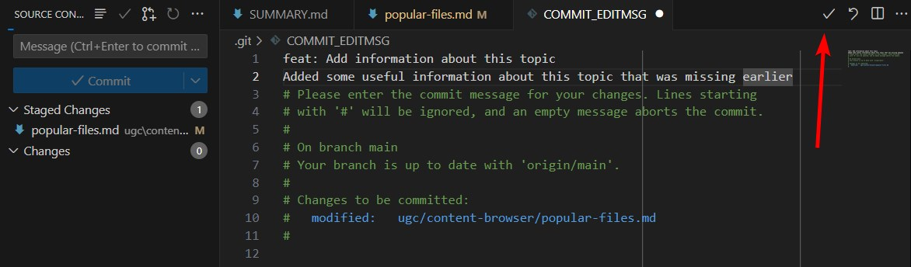<figcaption></figcaption></figure>

For effective and standardized commit messages, read this article:



## Submitting a Pull Request

Pull requests let you tell others about changes you've pushed to a branch in a repository on GitHub. Once a pull request is opened, you can discuss and review the potential changes with collaborators and add follow-up commits before your changes are merged into the main branch.

Make sure to include enough documentation on what was done to the repo contents within the pull request so the Wiki moderators have an easier time understanding and validating the request.

Watch this tutorial video to learn how to make a pull request:




Once your pull request gets merged, the changes will update to the live Wiki page after a short sync delay.


## Syncing the repo 

If changes to the repo have been done by someone other than you and the copy of the repo on your local machine is outdated, the local repo will have to be synced to the repo on GitHub. To do this from VS Code, click the "Synchronize Changes" button in the bottom left.

<figure>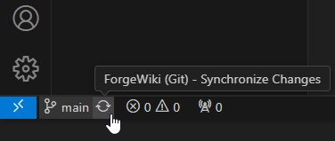<figcaption></figcaption></figure>

## Creating a private GitBook app environment (optional) 

If you want to get a very accurate preview of what your added content will look like and make edits with a user-friendly GUI, you can _fork_ the repo and sync your fork to a private [GitBook app environment](https://app.gitbook.com/join). This would act as a carbon-copy of the Wiki, but without affecting the live Wiki page and allowing you to preview added content on the fly.

When working with a forked repo, you have to constantly make sure that it's synced to the main repo so that you won't make changes that have already been made in the main repo. Do this via the "Sync Fork" button in your forked repo on GitHub, then [sync the changes](submitting-content-to-the-wiki.md#creating-a-private-gitbook-app-environment) to your local cloned repo in VS Code.

As GitBook has it's own adaptation of the [Markdown syntax](https://commonmark.org/), that VS Code can't preview accurately it can be beneficial to be able to see the correct preview of what GitBook-specific [Blocks](https://docs.gitbook.com/content-editor/blocks) will look like. VS Code has some extensions to make the Markdown preview look like Git_Hub_'s preview, but not for GitBook. The use of these extensions is explained in the section [Useful Visual Studio Code extensions](submitting-content-to-the-wiki.md#useful-visual-studio-code-extensions).

<figure>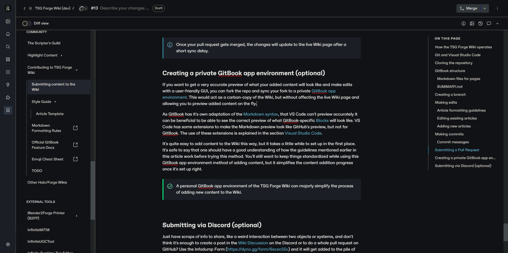<figcaption>
Image from the GitBook editing interface that this article was written in
</figcaption></figure>

It's quite easy to add content to the Wiki this way, but it takes a little while to set up in the first place. It's safe to say that one should have a good understanding of how the guidelines mentioned earlier in this article work before trying this method. You'll still want to keep things standardized while using this GitBook app environment method of adding content, but it simplifies the content addition progress once it's set up right.


A personal GitBook app environment of the TSG Forge Wiki can majorly simplify the process of adding new content to the Wiki.


## Submitting via Discord (optional) 

If learning the GitHub Pull Request process isn't your thing, but you want to contribute to the wiki, you can do so by making a post message in the [Wiki Discussion](https://discord.com/channels/220766496635224065/1032391999740969011) forum on the TSG Discord about your article topic. From there, wiki moderators will collect the information and convert them into articles.



As this is a very manual process by the wiki moderators, it's important to format your post correctly so there is a higher chance that the volunteer moderators will want to convert them into wiki articles. For more guidelines on Discord message formatting for wiki articles, see: [Discord Message Article Template](folder-template/discord-message-article-template.md).


[discord-message-article-template.md](folder-template/discord-message-article-template.md)


Just have scraps of info to share, like a weird interaction between two objects or systems, and don't think it's enough to create a pull request on GitHub or to post in the Wiki Discussion forum on the Discord? In this case, you can use the [Infodump Form](https://dyno.gg/form/6ecec55c) and it will get added to the pile of other scraps of info that are used as reference when writing wiki articles

***

#### <mark style="color:green;">**Contributors**</mark>

Okom\
Captain Punch
