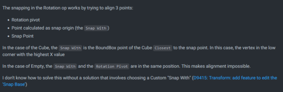

# "Prefabs" via MACHIN3tools

This guide is extremely helpful if you have a lot of object groups that need to be repeated frequently, like doorways, elaborate pillars, support beams, houses, you name it. Anything that you need to be able to make quick copies of and place down in different places, this will work good for. You can also Scale/Rotate these "Prefabs/Groups" around an origin you choose, and it will not interfere with the individual objects' origins, so they will all print perfectly.



#### MACHIN3tools

[https://github.com/machin3io/MACHIN3tools](https://github.com/machin3io/MACHIN3tools)

**Download & Installation**



#### Usage Notes

Don't try to use Rotation Snaps with these groups, just rotate them into place manually. Blender gets very weird/inconsistent/broken when trying to resolve rotation snap math when the parent object is an Empty.

<figure><figcaption></figcaption></figure>

Source: [https://projects.blender.org/blender/blender/issues/99279](https://projects.blender.org/blender/blender/issues/99279)

**Contributors**

UberSailFig
