# Forge Interface

This page describes the elements of the Halo Infinite Forge level editor interface and what they do. It also links to other pages where you can learn more about the topics.

<figure>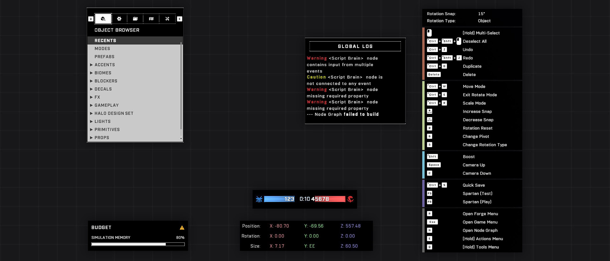<figcaption></figcaption></figure>

## Limitations

Halo Infinite's Forge interface has some quality-of-life limitations as it has a static interface. Keep these in mind while reading:

* Menu placement cannot be changed
* Controls and shortcuts cannot be remapped

## Standard Interface

When you open a map in Forge, you will see the following interface:

<figure>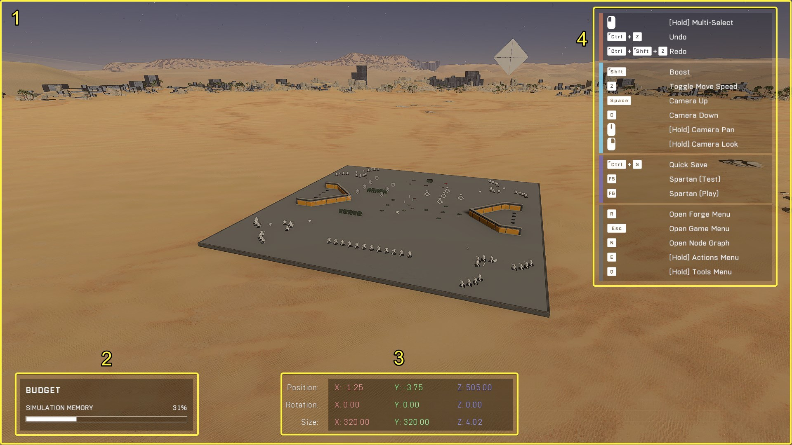<figcaption></figcaption></figure>

<table><thead><tr><th data-type="number">Number</th><th>Name</th><th>Description</th></tr></thead><tbody><tr><td>1</td><td><a href="./#level-viewport">Level Viewport</a></td><td>Displays the contents of your Level, with the other menus overlaid on top.</td></tr><tr><td>2</td><td><a href="./#budget-meter">Budget Meter</a></td><td>Displays the Game Simulation Memory usage of the map.</td></tr><tr><td>3</td><td><a href="./#object-positional-data">Object Positional Data</a></td><td>Displays the position, rotation and size of the last selected object.</td></tr><tr><td>4</td><td><a href="./#controls-helper">Controls Helper</a></td><td>Displays controls and shortcuts for various actions.</td></tr></tbody></table>

### Level Viewport

The **Level Viewport** fills the entire screen and displays the contents of your level along with all Forge interfaces overlaid on top. The viewport is a 3D view of the level in real time and players can play their level in-engine using the different [Editor Modes](../editor-modes.md). There is no orthographic 2D view option in Halo Infinite's Forge.

[Forge transformation widgets](../coordinate-system-and-spaces.md) are optimized for a field of view (FOV) of 100°. A lower field of view will result in larger transformation widgets.

<figure>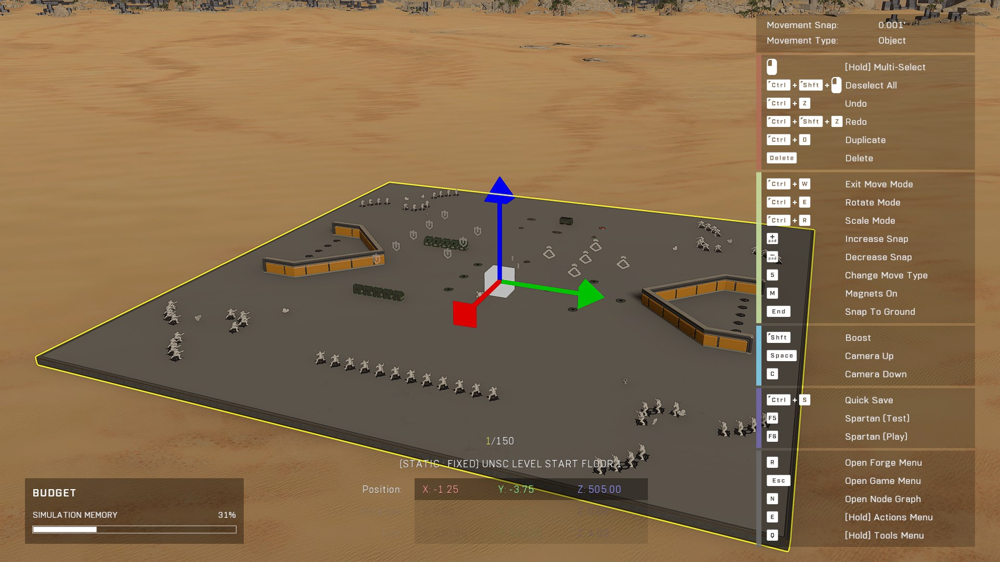<figcaption>
FOV 65° @ 1920x1080
</figcaption></figure>

 

<figure>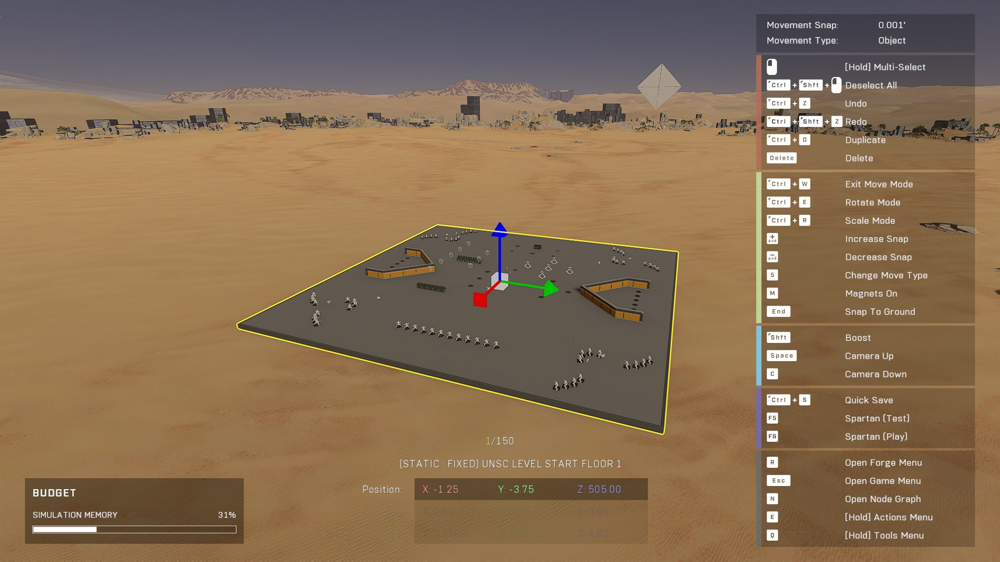<figcaption>
FOV 100° @ 1920x1080
</figcaption></figure>

 

<figure>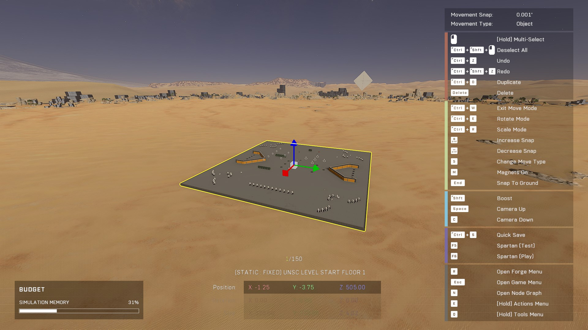<figcaption>
FOV 120° @ 1920x1080
</figcaption></figure>

Forge gameplay is optimized for window sizes above 1600x1200.

<figure><figcaption>
1280x768 @ FOV 100°
</figcaption></figure>

 

<figure>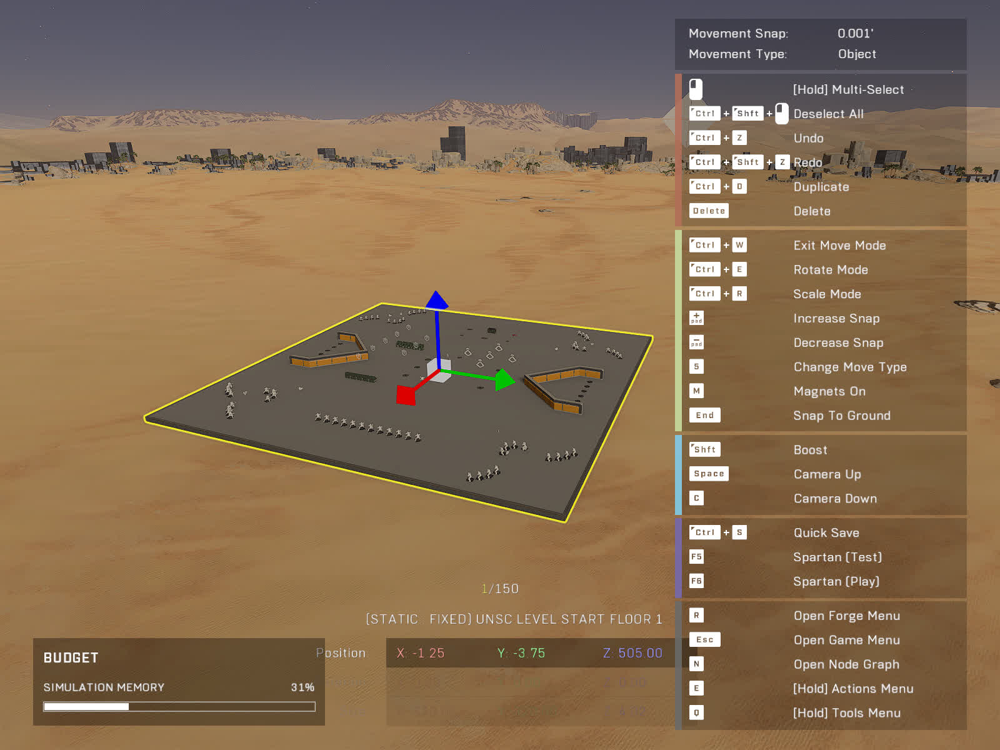<figcaption>
1600x1200 @ FOV 100°
</figcaption></figure>

 

<figure>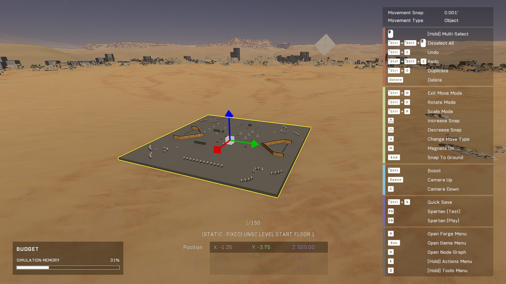<figcaption>
1920x1080 @ FOV 100°
</figcaption></figure>

### Budget Meter

The **Budget Meter** is located in the bottom left corner of the screen and displays the Game Simulation Memory usage of the map. Game Simulation Memory is the cost of simulating entities in a networked environment, including dynamic objects, projectiles, units, actions and similar.

This budget is often the first to reach 100% on maps that have more dynamic aspects to them such as multiple gamemode support and scripting rather than just mostly static geometry, but still many maps reach 100% on Forge Simulation Memory earlier, so the full reasoning for only displaying the Game Simulation Memory in this menu is unknown.

A decimal-accurate value of this budget can be seen in [Map Options](map-options.md) > Budget[^1]. The budget shown on the Budget Meter cannot be changed to display another budget. A yellow warning symbol appears on the Budget Meter if the Game Simulation Memory of the map reaches 80%, and at 100% the progress bar turns red.

<figure><figcaption>
Warning symbol shows up at 80%
</figcaption></figure>

 

<figure>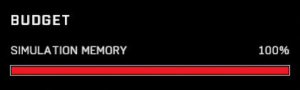<figcaption>
Progress bar turns red at 100%
</figcaption></figure>

Visibility of the Budget Meter can be toggled from [Tool Settings](tool-settings/) > [HUD > Budget Meter](#user-content-fn-2)[^2].

### Object Positional Data

The **Object Positional Data** menu is located at the bottom middle of the screen and displays axis values of the position, rotation and size of the last selected object. While the counterpart to this positional data interface in [Object Properties](object-properties/) > Transform can only display a maximum value of 9999.90 and a minimum of -9999.90, this on-screen menu can display values up to 2147483647.00 and down to -2147483647.00, which is the maximum value for a 32-bit signed binary integer. All values beyond those will display "EE".

For more functionality of this menu, see [Isolated Object Positional Data](./#isolated-object-positional-data).

<figure>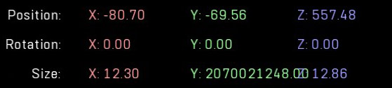<figcaption>
Object with a Y scale of 20700212480.00
</figcaption></figure>

 

<figure>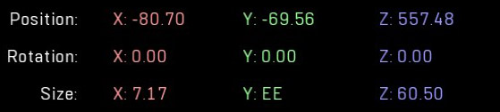<figcaption>
Object with a Y scale larger than 2147483647.00, displaying EE as the value
</figcaption></figure>

How a scale of this size was achieved was with an exploit to [Bypass Object Scaling Limits](../../../guides-and-knowledge/forge-know-how/forge-exploits/bypassing-object-scaling-limits.md).

### Controls Helper

The **Controls Helper** menu is located at the top right of the screen and displays controls and shortcuts for various actions. The size of the menu will change depending on how many relevant controls and shortcuts can be done in the current state of manipulating objects or having different menus open.

While there are a lot of shortcuts shown in the helper menu, it does not display all shortcuts possible in Forge. These and more are explained in detail in [Controls and Shortcuts](../controls-and-shortcuts.md).

<figure>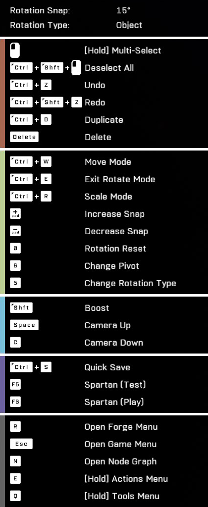<figcaption>
Controls Helper menu while holding an item with the rotation widget selected
</figcaption></figure>

 

<figure><figcaption>
Controls Helper menu when the Forge Menu is open with some categories expanded and while holding an item with the movement widget selected
</figcaption></figure>

Visibility of the Controls Helper can be toggled from [Tool Settings](tool-settings/) > [HUD > Controls Helper](#user-content-fn-3)[^3].

**Learn more about:**

<table data-view="cards"><thead><tr><th></th><th data-hidden data-card-cover data-type="files"></th><th data-hidden data-card-target data-type="content-ref"></th></tr></thead><tbody><tr><td>Controls and Shortcuts</td><td><a href="../../../.gitbook/assets/cover-tsg-placeholder.jpg">cover-tsg-placeholder.jpg</a></td><td><a href="../controls-and-shortcuts.md">controls-and-shortcuts.md</a></td></tr></tbody></table>

***

Pressing  (keyboard) or  (controller) opens up the **Forge Menu**, which houses more options:

<figure>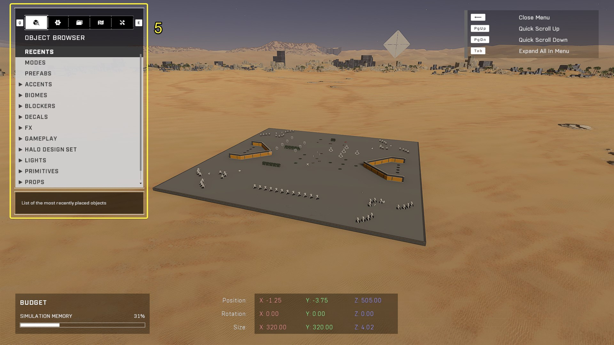<figcaption></figcaption></figure>

<table><thead><tr><th data-type="number">Number</th><th>Name</th><th>Description</th></tr></thead><tbody><tr><td>5</td><td><a href="./#forge-menu">Forge Menu</a></td><td>Displays various properties related to Forge objects and map settings</td></tr></tbody></table>

### Forge Menu

The **Forge Menu** is located on the top left corner of the screen and it displays various properties related to Forge objects and map settings. The menu is divided into five unique tabs housing the most important information a Forger needs.

| Name                                      | Description                                                                                   |
| ----------------------------------------- | --------------------------------------------------------------------------------------------- |
| [Object Browser](object-browser.md)       | A list of available objects to spawn in Forge.                                                |
| [Object Properties](./#object-properties) | Properties for the selected object(s).                                                        |
| [Folders](folders/)                       | A hierarchical tree view of all objects placed on the map.                                    |
| [Map Options](map-options.md)             | Options for changing map lighting, wind and sound, and inspecting budget usage.               |
| [Tool Settings](tool-settings/)           | Options for changing the Forge tool properties, and toggling various debug options and menus. |

**Learn more about:**

<table data-view="cards"><thead><tr><th></th><th data-hidden data-card-cover data-type="files"></th><th data-hidden data-card-target data-type="content-ref"></th></tr></thead><tbody><tr><td>Object Browser</td><td><a href="../../../.gitbook/assets/cover-tsg-placeholder.jpg">cover-tsg-placeholder.jpg</a></td><td><a href="object-browser.md">object-browser.md</a></td></tr><tr><td>Object Properties</td><td><a href="../../../.gitbook/assets/cover-tsg-placeholder.jpg">cover-tsg-placeholder.jpg</a></td><td><a href="object-properties/">object-properties</a></td></tr><tr><td>Folders</td><td><a href="../../../.gitbook/assets/cover-tsg-placeholder.jpg">cover-tsg-placeholder.jpg</a></td><td><a href="folders/">folders</a></td></tr><tr><td>Map Options</td><td><a href="../../../.gitbook/assets/cover-tsg-placeholder.jpg">cover-tsg-placeholder.jpg</a></td><td><a href="map-options.md">map-options.md</a></td></tr><tr><td>Tool Settings</td><td><a href="../../../.gitbook/assets/cover-tsg-placeholder.jpg">cover-tsg-placeholder.jpg</a></td><td><a href="tool-settings/">tool-settings</a></td></tr></tbody></table>

## Selected Object Interface

If an object is selected, the Forge interface changes slightly, revealing more information:

<figure><figcaption></figcaption></figure>

<table><thead><tr><th data-type="number">Number</th><th>Name</th><th>Description</th></tr></thead><tbody><tr><td>1</td><td><a href="./#selected-object-count">Selected Object Count</a></td><td>Displays the amount of objects currently selected. A maximum of 150 can be selected at the same time.</td></tr><tr><td>2</td><td><a href="./#object-information">Object Information</a></td><td>Displays the Object Mode, Physics and Name of the last selected object.</td></tr><tr><td>3</td><td><a href="./#isolated-object-positional-data">Isolated Object Positional Data</a></td><td>Highlights the positional data of the currently selected transform gizmo.</td></tr><tr><td>4</td><td><a href="./#transform-snap-and-coordinate-space">Transform Snap and Coordinate Space</a></td><td>Displays the snap values and coordinate space of the currently selected transform gizmo.</td></tr></tbody></table>

### Selected Object Count

The **Selected Object Count** indicator is located in the bottom middle of the screen, and displays the amount of objects currently selected. A maximum of 150 objects can be selected at the same time, but more may be selected if some of the items in the selection are in a prefab. Learn more about [Bypassing 150-Object Prefab Limit](../../../guides-and-knowledge/forge-know-how/forge-exploits/bypassing-150-object-prefab-limit.md).

### Object Information

The **Object Information** string is located in the bottom middle of the screen, and displays the Object Mode, Physics and Name of the last selected object. The syntax is as follows:

> \[{Object Mode}: {Physics}] {Object Name}

The number at the end of objects is a part of the object name. If an object with a duplicate name is created, an incrementing number will be appended to the end of the object name.

The Object Mode indicator color is white for Static objects and orange for Dynamic objects. There is also a third uncommon Object Mode "None" that can be seen on gameplay objects.

<figure>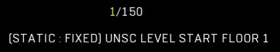<figcaption>
Object Mode: Static
</figcaption></figure>

 

<figure>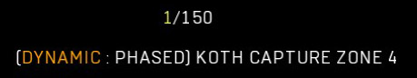<figcaption>
Object Mode: Dynamic
</figcaption></figure>

<figure>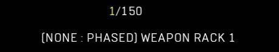<figcaption>
Object Mode: None
</figcaption></figure>

### Isolated Object Positional Data

The [Object Positional Data](./#object-positional-data) menu changes slightly when an object is selected and one of the three [Transform Gizmos](#user-content-fn-4)[^4] are selected; The positional data of the currently selected transform gizmo is highlighted, and the other data displays are made less opaque.

The transform gizmos can be cycled between with the following shortcuts:

* Movement:  +  (keyboard) or \[Hold]  (controller)
* Rotation:  +  (keyboard) or \[Hold]  (controller)
* Size:  +  (keyboard) or \[Hold]  +  (controller)
* Cycle between all:  (keyboard)


Another way to isolate the Object Positional Data without selecting an object is to hover your cursor over the object and press  (keyboard) to cycle between the gizmos. This has no real use and is most likely a bug. A potential purpose of this is to act as a hacky way to simulate hovering over objects and previewing their properties as the movement gizmo is not rendered and is the default gizmo here.


If the same gizmo shortcut is entered while that gizmo is already selected, the gizmo will disappear and the Object Positional Data menu will return to showing all values highlighted while still having an object selected.

<figure>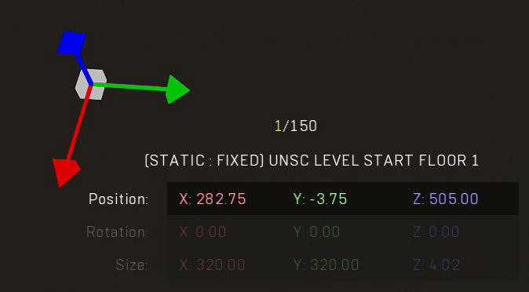<figcaption>
Movement gizmo selected
</figcaption></figure>

 

<figure>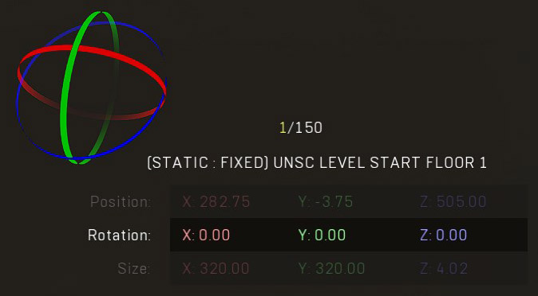<figcaption>
Rotation gizmo selected
</figcaption></figure>

<figure>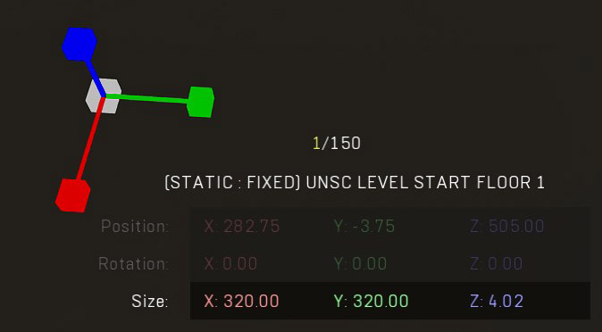<figcaption>
Scale gizmo selected
</figcaption></figure>

 

<figure>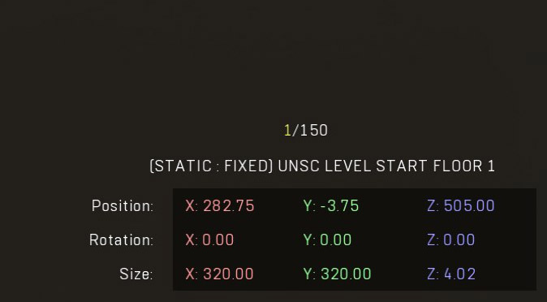<figcaption>
No gizmo selected
</figcaption></figure>

### Transform Snap and Coordinate Space

The **Transform Snap and Coordinate Space** menu is located in the top right of the screen, and displays the snap values and coordinate space of the currently selected transform gizmo. The snap values can be adjusted with / and / (keyboard) or \[Hold] // &  +  (controller), and the space/type can be cycled with  (keyboard) or \[Hold] / +  (controller).

The available snap values are as follows:

* Movement & Scale: `<none>`, `0.001'`, `1/8'`, `1/4'`, `1/2'`, `1'`, `2'`, `4'`, `8'` & `16'`
* Rotation: `<none>`, `1/2°`, `1°`, `5`°, `15°`, `30°`, `45°`, `60°`, `90°` & `180°`

For more information about snapping, see Snapping[^5].


**Note from Okom:**\
I usually use a Movement Snap of `0.001'`, Rotation Snap of `15°` or `5°,` and a Scaling Snap of `1/8'`, which work for me as the most efficient and versatile snap values after 3000+ hours of Halo Infinite Forging experience.


The available space/type values are as follows:

* Movement: `World` & `Object`
* Rotation: `World`, `Camera` & `Object`

For more information about spaces, see [Coordinate Spaces](#user-content-fn-6)[^6].

## Actions Menu

Holding  (keyboard) or  (controller) at any time while in Monitor Mode will open the radial **Actions Menu**:

<figure>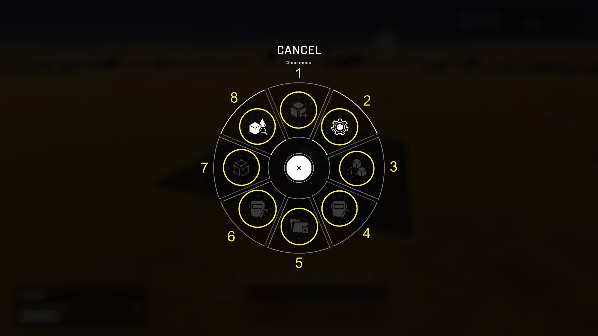<figcaption></figcaption></figure>

<table><thead><tr><th data-type="number">Number</th><th>Name</th><th>Description</th></tr></thead><tbody><tr><td>1</td><td><a href="./#create-prefab-create-mode-prefab">Create Prefab / Create Mode Prefab</a></td><td>Create a savable group of a minimum two objects.</td></tr><tr><td>2</td><td><a href="./#object-properties">Object Properties</a></td><td>Modify the properties of the selected object(s).</td></tr><tr><td>3</td><td><a href="./#add-to-prefab">Add To Prefab</a></td><td>Combine the selected objects into an existing selected prefab.</td></tr><tr><td>4</td><td><a href="./#weld">Weld</a></td><td>Group together Dynamic objects. The origin object has to have Normal physics.</td></tr><tr><td>5</td><td><a href="./#save-prefab">Save Prefab</a></td><td>Save a selected Prefab to My Files.</td></tr><tr><td>6</td><td><a href="./#unweld">Unweld</a></td><td>Break the weld from a group of welded Dynamic objects, making the object group into a prefab.</td></tr><tr><td>7</td><td><a href="./#ungroup">Ungroup</a></td><td>Disconnect a group of prefabbed objects or a group of welded Dynamic objects.</td></tr><tr><td>8</td><td><a href="./#object-browser">Object Browser</a></td><td>Open the Object Browser menu to see a list of available objects to spawn in Forge.</td></tr></tbody></table>

### Create Prefab / Create Mode Prefab

The **Create Prefab / Create Mode Prefab** tab is located on the top of the radial Actions Menu and is used to create a savable group of a minimum two objects. A prefab is a group of objects that pivot around a single object and can easily be saved to share with others. Prefabs have a green outline around all of the child objects within it, with the parent object having a cyan outline.

Learn more about [Prefabs](../../../ugc/metadata-and-file-management/prefabs/).

<figure>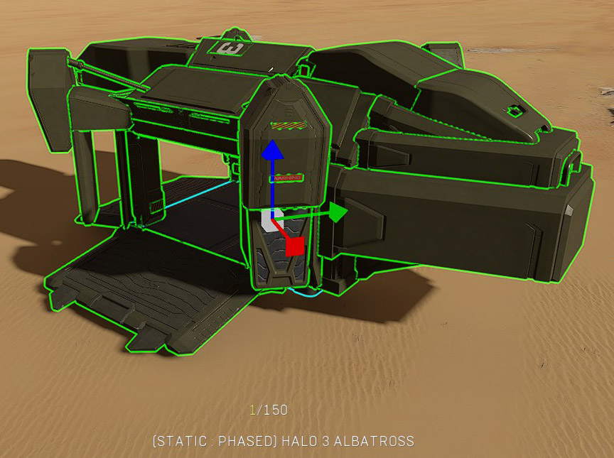<figcaption>
A named prefab resembling a Halo 3 vehicle prop
</figcaption></figure>

 

<figure>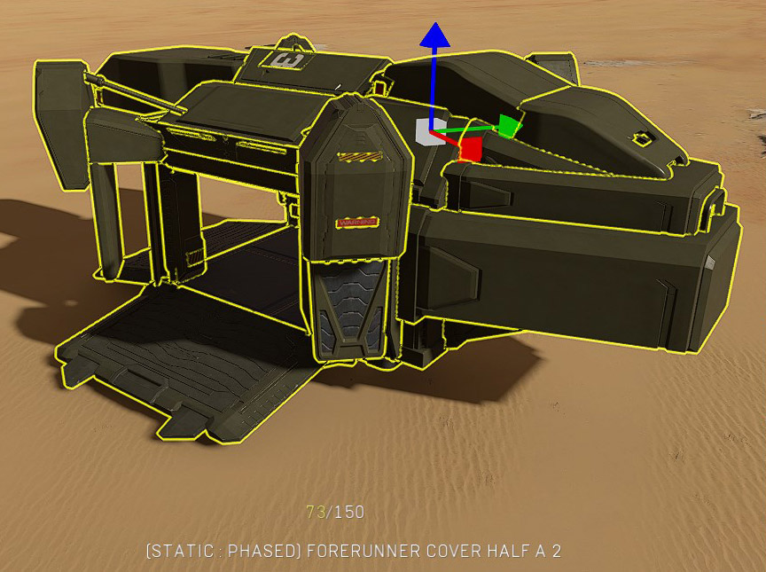<figcaption>
The prefab ungrouped shows that it's made from 73 objects
</figcaption></figure>

A Mode Prefab can be made with two or more [Mode Brains](../../../scripting/scripting-basics-and-ui/script-brains-and-mode-brains.md) as the only objects in the group of objects. Mode Brains are used to make playable [Forge Modes](#user-content-fn-7)[^7].

Learn more about [Mode Prefabs](../../../ugc/metadata-and-file-management/prefabs/mode-prefabs.md).

<figure>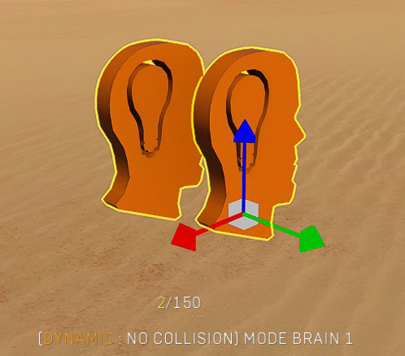<figcaption>
A selection of two Mode Brains
</figcaption></figure>

 

<figure>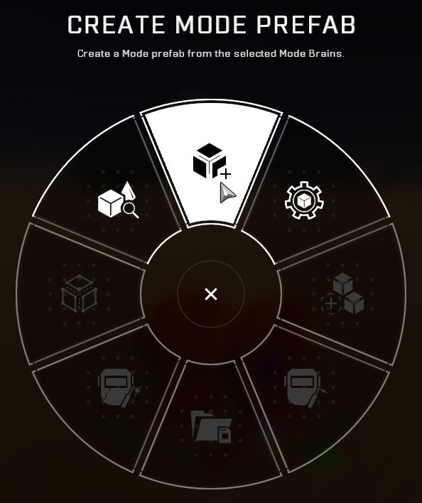<figcaption>
"Create Mode Prefab" tab in the Actions Menu
</figcaption></figure>

 

<figure>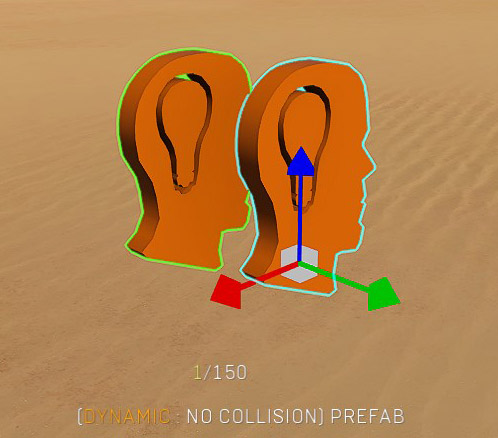<figcaption>
A Mode Prefab consisting of two Mode Brains
</figcaption></figure>

### Object Properties

The **Object Properties** tab is located on the top right of the radial Actions Menu and is used to modify the properties of the selected object(s).

**Learn more about:**

<table data-view="cards"><thead><tr><th></th><th data-hidden data-card-cover data-type="files"></th><th data-hidden data-card-target data-type="content-ref"></th></tr></thead><tbody><tr><td>Object Properties</td><td><a href="../../../.gitbook/assets/cover-tsg-placeholder.jpg">cover-tsg-placeholder.jpg</a></td><td><a href="object-properties/">object-properties</a></td></tr></tbody></table>

### Add To Prefab

The **Add To Prefab** tab is located on the right of the radial Actions Menu and is used to combine the selected objects into an existing selected prefab. Adding new objects to an Object Prefab will reset the prefab name and make it an entirely new asset. Adding new objects to a Mode Prefab will keep the same prefab name and asset ID.

Learn more about [Prefabs](../../../ugc/metadata-and-file-management/prefabs/).


Saved Object Prefabs cannot be updated with new objects while keeping the same asset ID, but Mode Prefabs can.


### Weld

The **Weld** tab is located on the bottom right of the radial Actions Menu and is used to group together Dynamic objects. The origin object of the group has to have Normal physics for the weld to be possible; the rest of the objects can be any physics, but their Object Mode must not be Static. Two vehicles cannot be welded together.

Welded Prefabs have a purple outline around all of the child objects within it, with the parent object having a cyan outline.


Mounted Turret weapons classify as vehicles so they sadly cannot be welded to other vehicles.


Welding is similar to prefabbing, but there are a few differences:

* Welds cannot contain static objects
* Vehicle physics don't apply to prefabs
* Welds cannot contain two vehicles
* Welds cannot contain some Dynamic, Normal physics objects. Currently known list:
  * Launchers

Welding is often used to create vehicles that have objects attached to them:

<figure>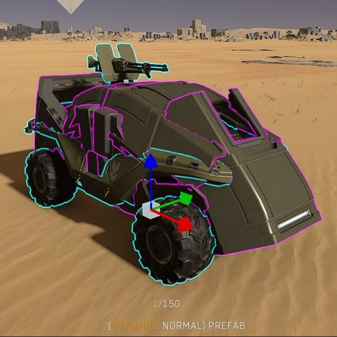<figcaption>
A Warthog with UNSC Cover pieces welded to it that act as armor
</figcaption></figure>

 

<figure>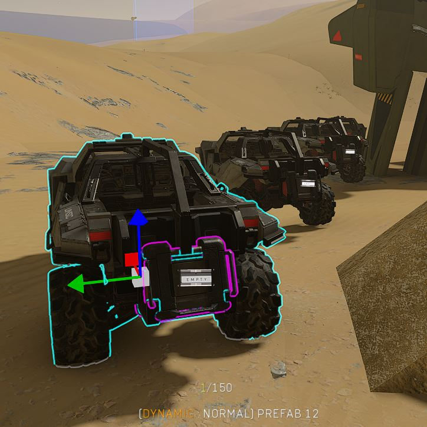<figcaption>
Razorbacks with an Ammo Crate welded to the back
</figcaption></figure>

> Map: [Just Keep Driving - Sandtrap](https://www.halowaypoint.com/halo-infinite/ugc/maps/acf53d3b-de15-453f-8e40-901fd8272aad)


The vehicles were momentarily made to have Phased physics with an exploit before welding in order to phase the cover objects into them because the only physics option for vehicles is Normal. Learn more about: [Applying Inaccessible Object Properties](../../../guides-and-knowledge/forge-know-how/forge-exploits/applying-inaccessible-object-properties.md).


Welds can also be used to make interactable map objects, sometimes using clever tricks:

<figure>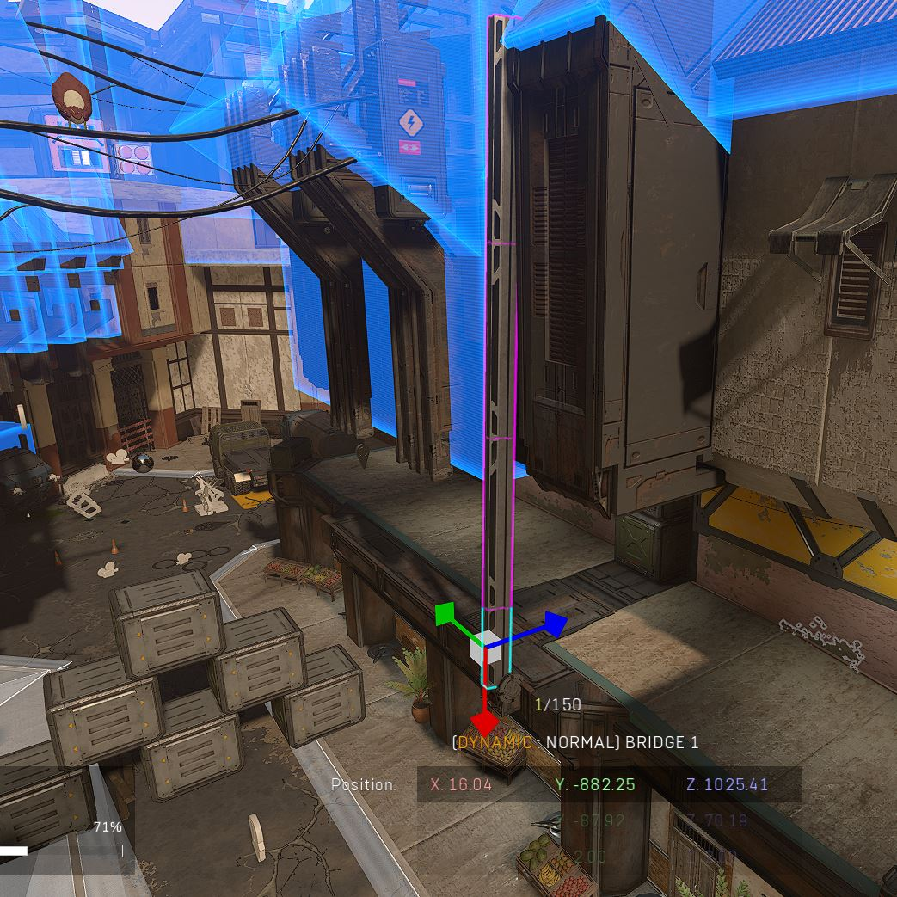<figcaption>
Interactable welded bridge
</figcaption></figure>

 

<figure>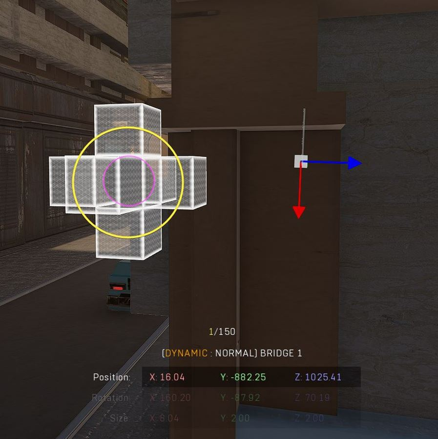<figcaption>
Artificial movement restriction on the Y axis; the sphere is a part of the weld
</figcaption></figure>

 

<figure>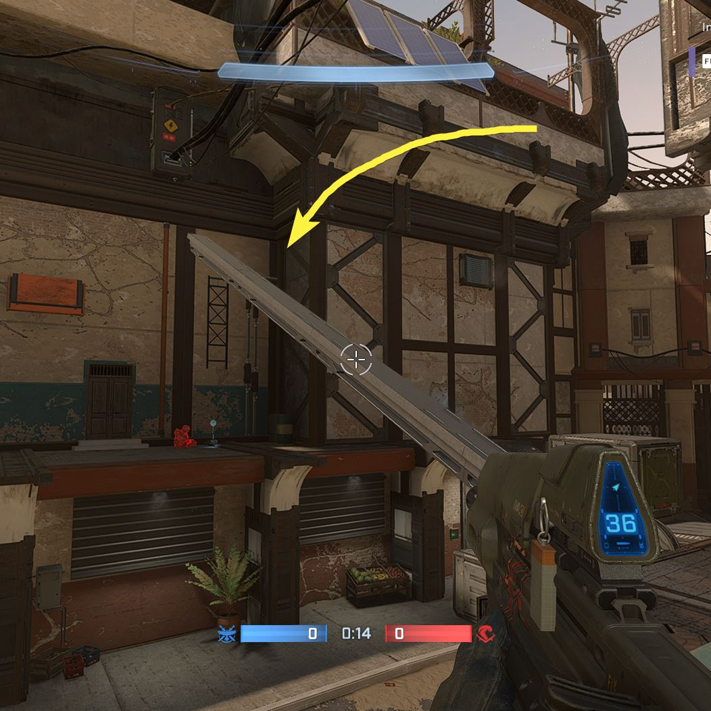<figcaption>
Bridge falling down after being punched
</figcaption></figure>

> Map: [Boulevard](https://www.halowaypoint.com/halo-infinite/ugc/maps/05a4f045-0b4b-4565-a246-38fb6be62a30)


The most important factor in making a welded prefab like this work is ensuring that the movement restriction sphere is perfectly aligned with the welded prefab on the axis that is to be restricted, and that it's enclosed very tightly so that the sphere cannot move in any unwanted directions.


#### Massless Children

Welded Prefabs have a setting called "Massless Children" found in the Object Properties of the prefab. This setting makes the welded prefab not take into account the mass it's child objects when calculating physics.

<figure>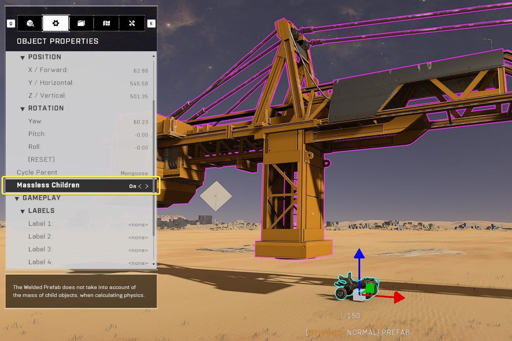<figcaption>
Massless Children setting in the Object Properties of a Welded Prefab
</figcaption></figure>

<figure>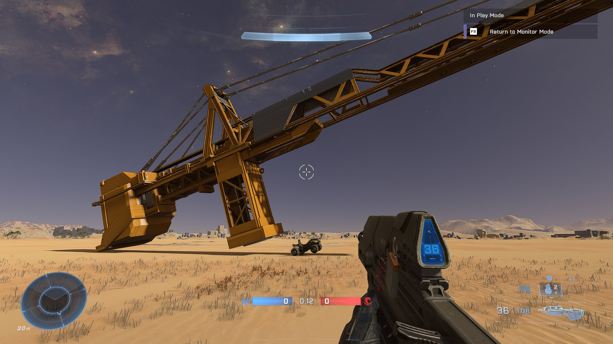<figcaption>
Massless Children OFF
</figcaption></figure>

 

<figure>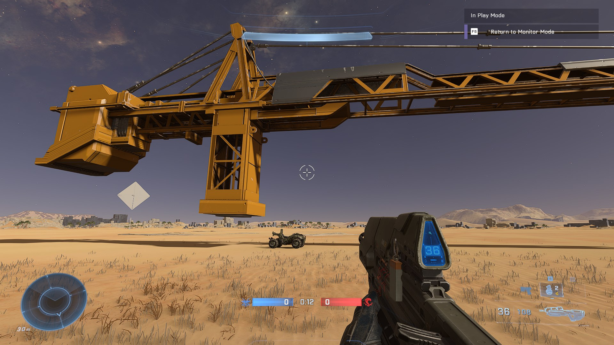<figcaption>
Massless Children ON
</figcaption></figure>

#### Weld Bugs

Although welds can be used as useful gameplay elements, there are a ton of bugs surrounding them, which makes working with welded prefabs extremely annoying, sometimes to the point of having to scrap the idea that would have worked if there weren't some obscure issues happening to them.

Learn more about [Welded Prefab Bugs](../../../guides-and-knowledge/forge-know-how/forge-bugs/welded-prefab-bugs.md).

### Save Prefab

The **Save Prefab** tab is located on the bottom of the radial Actions Menu and is used to save a selected Prefab to [My Files](#user-content-fn-8)[^8]. After selecting, an interface to enter the name of the prefab will be shown. A quirk of this interface is that a prefab name up to 40 characters can be entered, unlike the 32-character limit of renaming a file through the [File Name](../../../ugc/metadata-and-file-management/working-with-files/file-name.md) interface. This also works for naming Forge Modes by saving Mode Prefabs.

<figure>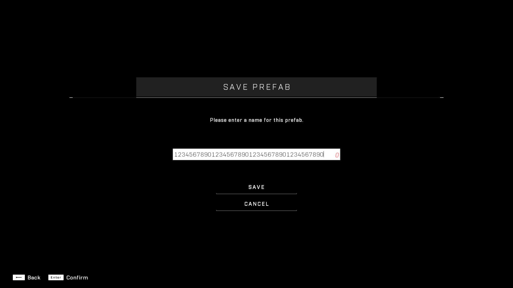<figcaption>
40-character limit when saving a prefab and entering a name
</figcaption></figure>

 

<figure>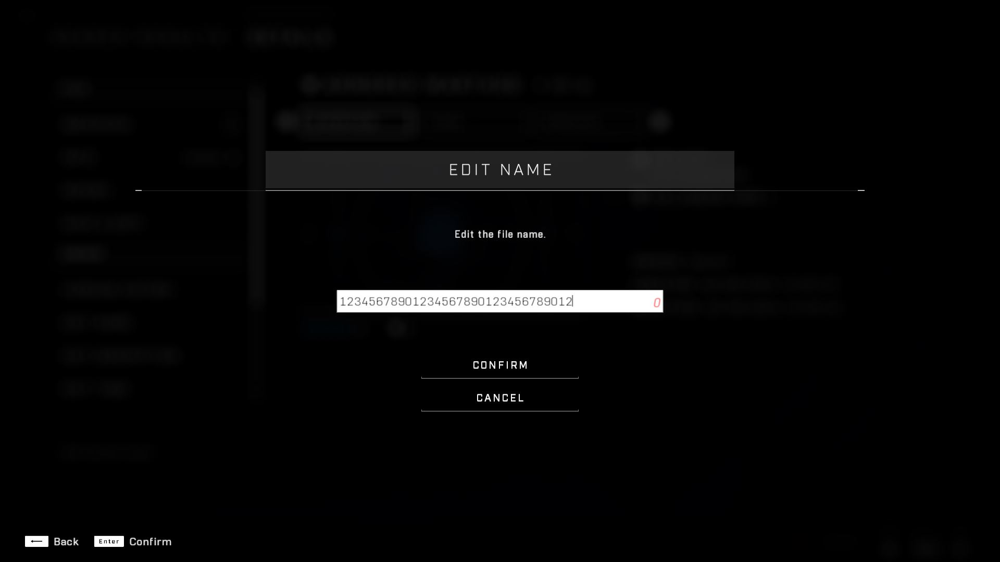<figcaption>
32-character limit when editing the name of an asset
</figcaption></figure>

### Unweld

The **Unweld** tab is located on the bottom left of the radial Actions Menu and is used to break the weld from a group of welded Dynamic objects, making the object group into a prefab.

After unwelding, the group of objects will turn into a prefab.

Be aware of the [Welded Prefab Bugs](../../../guides-and-knowledge/forge-know-how/forge-bugs/welded-prefab-bugs.md) that may occur when unwelding a welded prefab.

### Ungroup

The **Ungroup** tab is located on the left of the radial Actions Menu and is used to disconnect a group of prefabbed objects or a group of welded Dynamic objects.

After ungrouping, the group of objects that made up the prefab will stay selected. If the prefab included more than 150 objects, only the first 150 objects will stay in the selection. If the remaining objects are Static, they will keep a green outline until a temporary hover-over selection is performed on them.

Learn more about: [Bypassing 150-Object Prefab Limit](../../../guides-and-knowledge/forge-know-how/forge-exploits/bypassing-150-object-prefab-limit.md).

<figure>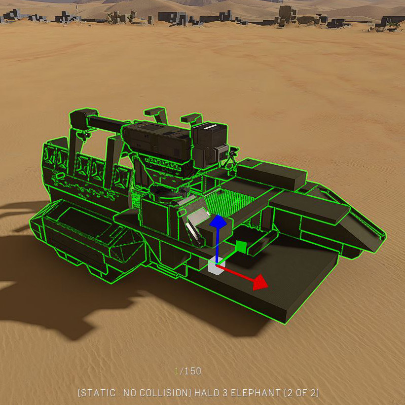<figcaption>
A 206-object prefab
</figcaption></figure>

 

<figure>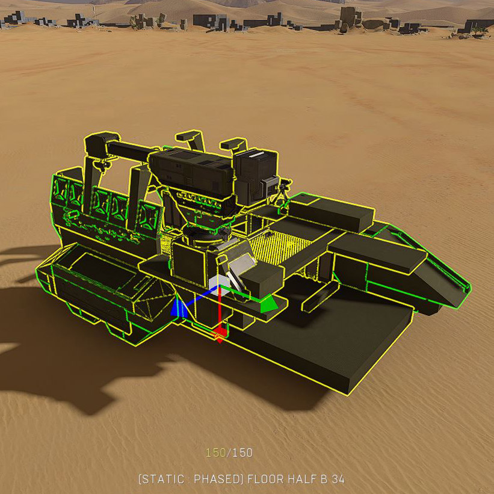<figcaption>
Prefab ungrouped, 150 objects left in the selection
</figcaption></figure>

 

<figure>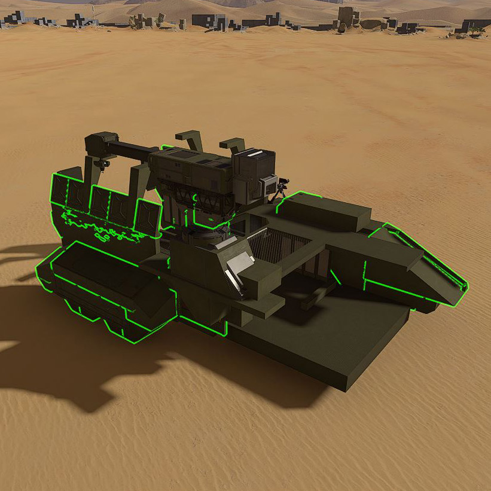<figcaption>
Objects deselected, leaving the remaining 56 objects with a green outline 
</figcaption></figure>

<figure>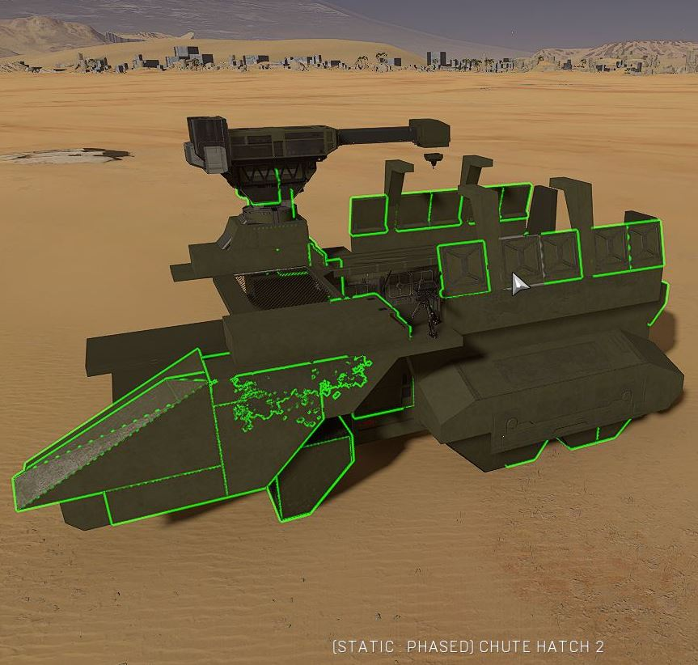<figcaption>
The green outline will disappear once the object is hovered over with a cursor selection
</figcaption></figure>

 

<figure>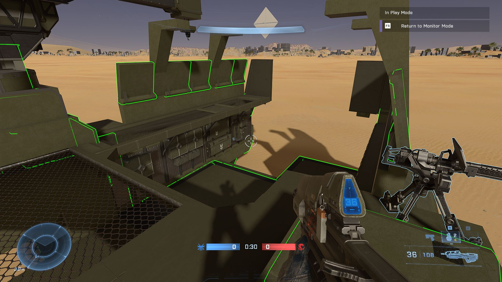<figcaption>
The green outline will stay on the objects in Play Mode; outline does not stay after a session restart
</figcaption></figure>

> Prefab: [Halo 3 Elephant (2 of 2)](https://www.halowaypoint.com/halo-infinite/ugc/prefabs/85670a93-f8ff-40fd-9874-0c33a5461b12)

### Object Browser

The **Object Browser** tab is located on the top left of the radial Actions Menu and is used to open the Object Browser menu to see a list of available objects to spawn in Forge.

**Learn more about:**

<table data-view="cards"><thead><tr><th></th><th data-hidden data-card-cover data-type="files"></th><th data-hidden data-card-target data-type="content-ref"></th></tr></thead><tbody><tr><td>Object Browser</td><td><a href="../../../.gitbook/assets/cover-tsg-placeholder.jpg">cover-tsg-placeholder.jpg</a></td><td><a href="object-browser.md">object-browser.md</a></td></tr></tbody></table>

## Tools Menu

Holding  (keyboard) or  (controller) at any time while in Monitor Mode will open the radial Tools Menu:

<figure>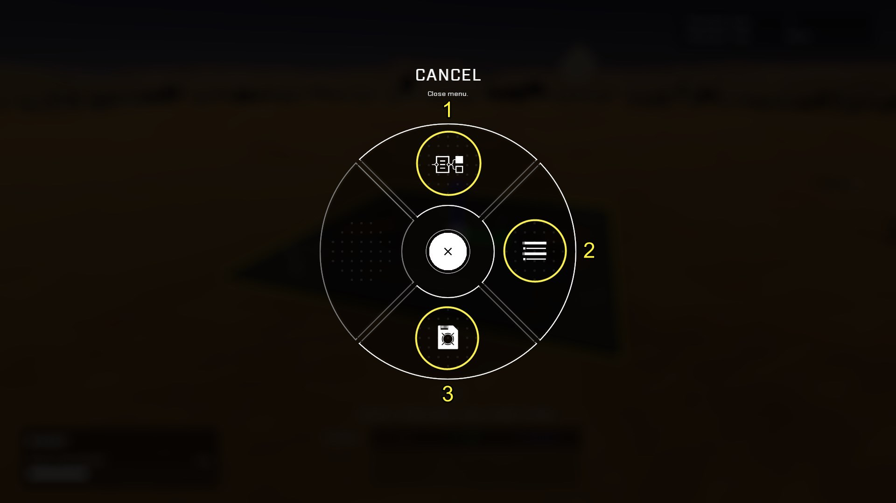<figcaption></figcaption></figure>

<table><thead><tr><th data-type="number">Number</th><th>Name</th><th>Description</th></tr></thead><tbody><tr><td>1</td><td><a href="./#node-graph">Node Graph</a></td><td>Open the Node Graph to create scripts.</td></tr><tr><td>2</td><td><a href="./#build-menu">Build Menu</a></td><td>Build data for various map elements.</td></tr><tr><td>3</td><td><a href="./#quicksave">Quicksave</a></td><td>Save the current map version with no custom version note added.</td></tr></tbody></table>

### Node Graph

The **Node Graph** tab is located on the top of the radial Tools Menu and is used to open the Node Graph to create scripts. The Node Graph Interface can also be opened with  (keyboard).

Learn more about [Node Graph Interface and Controls](../../../scripting/scripting-basics-and-ui/node-graph-interface/).

### Build Menu

The **Build Menu** tab is located on the right of the radial Tools Menu and is used to build data for various map elements. The available map data to build are:

* [Lighting](../../lighting/building-lighting/)
* [Nav Mesh](../../nav-mesh/nav-mesh-generation/building-nav-mesh/)
* [Audio](../../gameplay/audio/building-audio/)
* [Reflection Volumes](../../lighting/lighting-modifiers/reflections/reflection-volumes/building-reflection-volumes.md)

Yellow warning symbols are displayed on the elements that aren't up-to-date with the current state of the map. While these do convey a real problem, the map can still be played and published even if some build data has a warning symbol next to it.

<figure>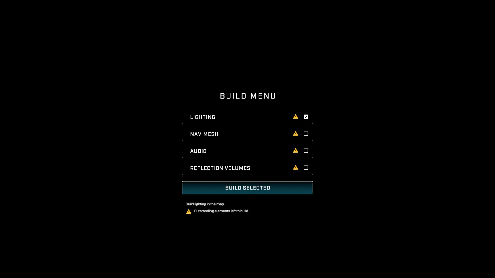<figcaption>
Outstanding elements left to build after map modifications
</figcaption></figure>

 

<figure>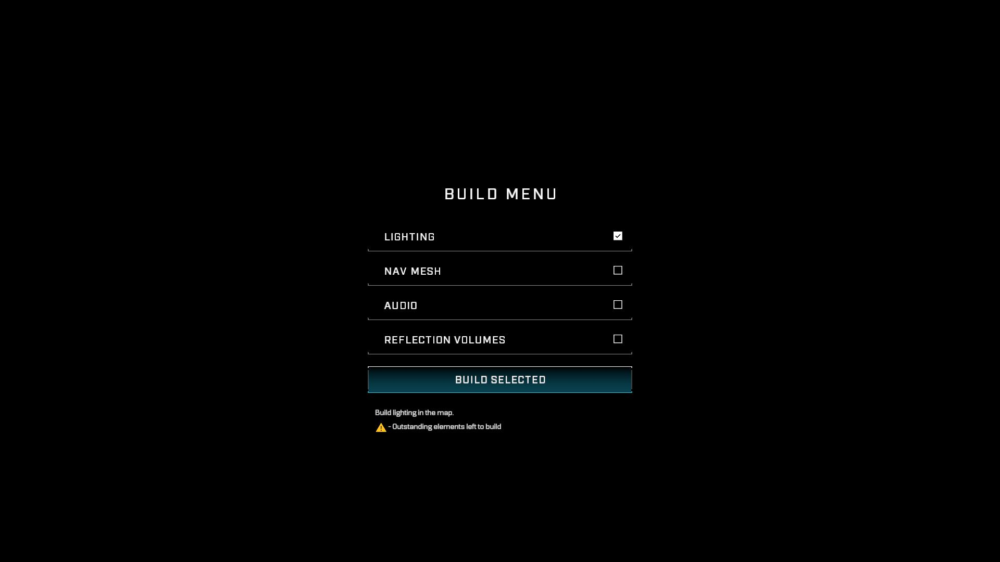<figcaption>
All build data up-to-date with the current state of the map
</figcaption></figure>

Due to all the warning symbols appearing right after even a single object's position is altered on the map, it is not recommended to constantly keep building map element data just because there is a warning symbol next to it. Instead, learn when map data should be built and build it only when necessary.


[building-lighting](../../lighting/building-lighting/)



[building-nav-mesh](../../nav-mesh/nav-mesh-generation/building-nav-mesh/)



[building-audio](../../gameplay/audio/building-audio/)



[building-reflection-volumes.md](../../lighting/lighting-modifiers/reflections/reflection-volumes/building-reflection-volumes.md)


### Quicksave

The **Quicksave** tab is located on the bottom of the radial Tools Menu and is used to save the current map version with no custom version note added. After activation, a message will show in the killfeed indicating that the map version has been saved successfully. A quicksave can also be done with  +  (keyboard).

<figure>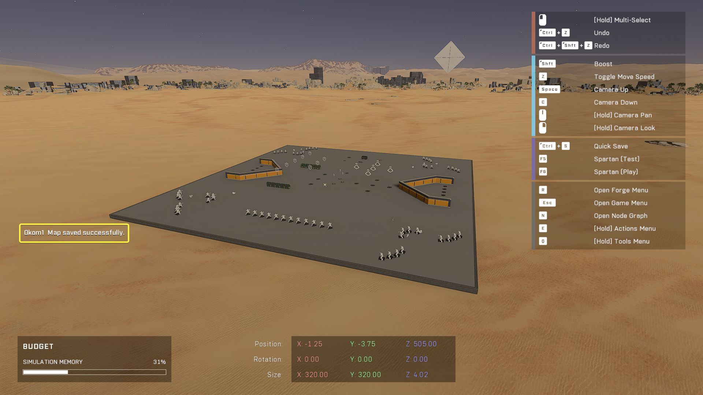<figcaption>
Message "{Gamertag} Map saved successfully." displaying in the killfeed after a quicksave
</figcaption></figure>

A quicksave will not prompt for a version note to be added to the saved version. Instead, the string "Quicksave" will be automatically added as the note for the version.

Learn more about: [Saving Assets](../saving-assets.md).

<figure>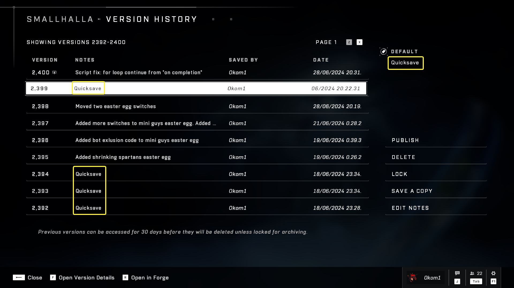<figcaption>
Automatic edit note "Quicksave" seen on some versions in a map's version history
</figcaption></figure>

## Play Mode

If Play Mode is entered with  (keyboard) or \[Hold]  (controller), the Forge interface changes to show information relevant to gameplay:

<figure>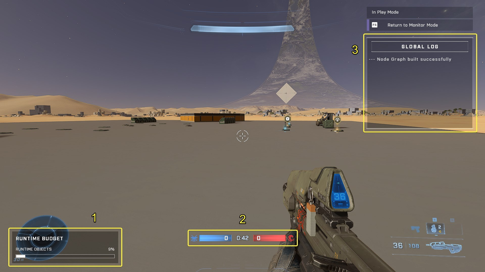<figcaption></figcaption></figure>

<table><thead><tr><th data-type="number">Number</th><th>Name</th><th>Description</th></tr></thead><tbody><tr><td>1</td><td><a href="./#runtime-budget-meter">Runtime Budget Meter</a></td><td>Displays the runtime budget which is the most full based on the current state of the map.</td></tr><tr><td>2</td><td><a href="./#score-and-timer">Score and Timer</a></td><td>Displays the score of two teams and an unlimited timer that counts upwards.</td></tr><tr><td>3</td><td><a href="./#global-log">Global Log</a></td><td>Displays the runtime state of the Node Graph including potential errors and warnings.</td></tr><tr><td>4</td><td><a href="./#controls-helper-1">Controls Helper</a></td><td>Displays controls and shortcuts for various actions</td></tr></tbody></table>

### Runtime Budget Meter

The **Runtime Budget Meter** is located in the bottom left of the screen, and displays the runtime budget which is the most full based on the current state of the map. The different budgets that can be displayed are:

* Runtime Objects
* Navpoints
* Objectives
* AI Units

<figure><figcaption>
Runtime Objects usage display
</figcaption></figure>

 

<figure>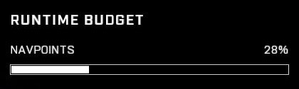<figcaption>
Navpoints usage display
</figcaption></figure>

<figure>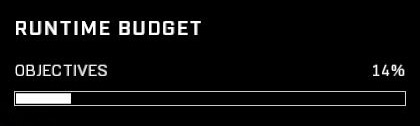<figcaption>
Objectives usage display
</figcaption></figure>

 

<figure>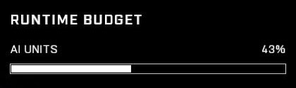<figcaption>
AI Units usage display
</figcaption></figure>

A yellow warning symbol appears on the Runtime Budget Meter if the displayed budget of the map reaches 80%, and at 100% the progress bar turns red.

<figure><figcaption>
Warning symbol shows up at 80%
</figcaption></figure>

 

<figure>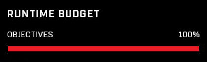<figcaption>
Progress bar turns red at 100%
</figcaption></figure>

The budget shown on the Runtime Budget Meter cannot manually be changed to display another budget. It only always displays the budget with the most usage at runtime. Visibility of the Runtime Budget Meter can be toggled from [Tool Settings](tool-settings/) > HUD > [Runtime Budget Meter](#user-content-fn-9)[^9].

### Score and Timer

The **Score and Timer** are located in the bottom middle of the screen, and display the score of two teams and an unlimited timer that counts upwards. The score in the Forge Play Mode can only be adjusted via scripting with the [Adjust Team Points](../../../scripting/nodes/game-mode/adjust-team-points.md) node.

The UI for the score display is built to support values up to 4 digits long before it starts to overflow. The score field can display values up to 2147483647 and down to -2147483647, which is the maximum value for a 32-bit signed binary integer. All values beyond those will display "EE".

<figure>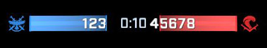<figcaption>
Eagle: 123 / Cobra: 45678
</figcaption></figure>

 

<figure>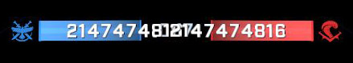<figcaption>
Score 2147474816 on both teams
</figcaption></figure>

<figure><figcaption>
Eagle: -2147474816 / Cobra: 0
</figcaption></figure>

 

<figure><figcaption>
Eagle: EE / Cobra: 0
</figcaption></figure>

### Global Log

The **Global Log** is located in the top right of the screen, and displays the runtime state of the Node Graph including potential errors and warnings.

The syntax for an error is as follows:

> <mark style="color:red;">**Warning**</mark>/<mark style="color:yellow;">**Caution**</mark> <{Script Brain Name}>  {error statement}\
> \--- Node Graph **failed to build**

<figure>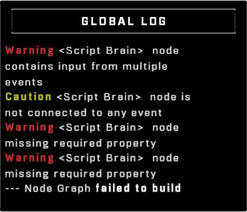<figcaption>
The Global Log displaying Warning and Caution messages indicating a script that did not execute properly.
</figcaption></figure>

Many scripters have despised the lack of detail in the error statements printed in the Global Log as they can often be too vague such as "node missing required property", which doesn't indicate which node is the cause, and which property is missing.

Visibility of the Play Mode Global Log can be toggled from [Tool Settings](tool-settings/) > [HUD > Global Log](#user-content-fn-10)[^10].

### Controls Helper

The **Controls Helper** is located in the top right of the screen, and displays controls and shortcuts for various actions. In Play Mode, it only displays the control to return to Monitor Mode,  (keyboard) or \[Hold]  (controller).

## Trivia

At a glance, Halo Infinite's Forge is modeled heavily after Halo 5's. The default control scheme for controllers is also reminiscent of Halo 5's defaults. Users of previous titles have control schemes available to choose from to have an experience closer to those titles.

While the menus are similarly placed and handle very similarly to Halo 5's, there is the addition of radial menus that can be called for accessing functions like prefabbing, group welding, opening a Script Brain's node graph, etc., and the options available across the board are much deeper.

It is apparent via node graphs, the expanded lighting options, and more, that many cues have been taken from more fully-featured game dev IDEs and repackaged to work well and have parity between console and pc.

As with any tool of this complexity and depth, there is a learning curve present with the tool, but it remains that the surface-level is still accessible enough to build simple levels. The forger will just need to know the majority of the toolset in order to bring their level to a higher standard, which wasn't previously possible, and now is expected of the top performing levels.

***

#### <mark style="color:green;">Contributors</mark>

Okom\
Captain Punch\
Mr Greencastle\
Yolomcswag\
MikRips

[^1]: Add link when complete

[^2]: Add link when complete

[^3]: Add link when complete

[^4]: Add link when the article for it is written

[^5]: Add link when ready

[^6]: Add link when complete

[^7]: Add link when written

[^8]: Add link once done

[^9]: Add link when complete

[^10]: Add link when complete
