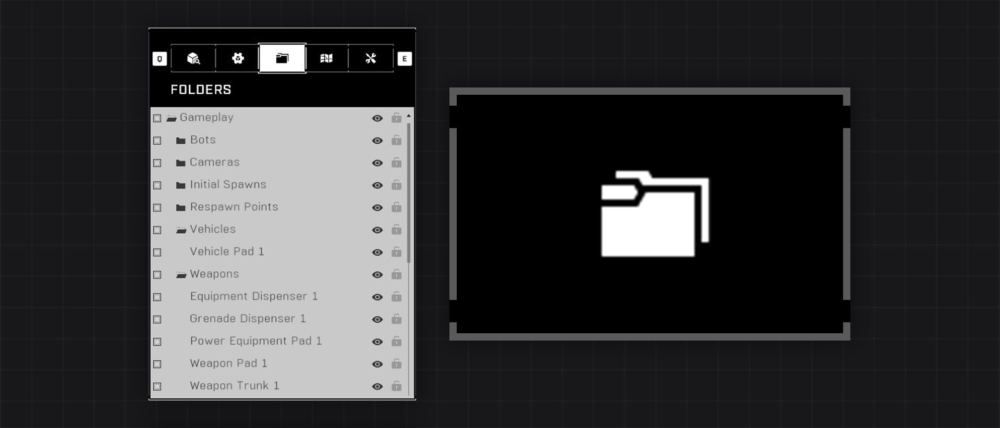
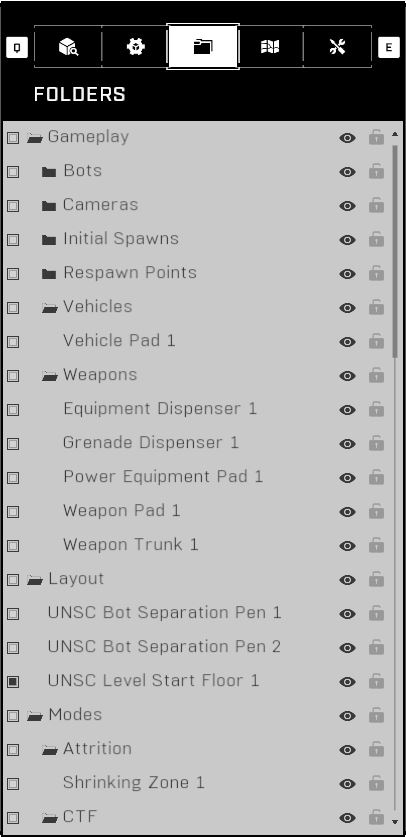
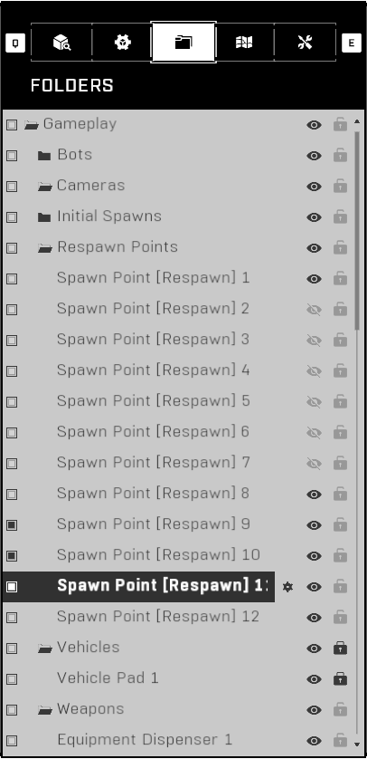
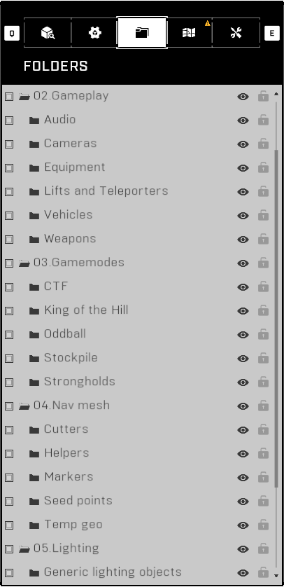
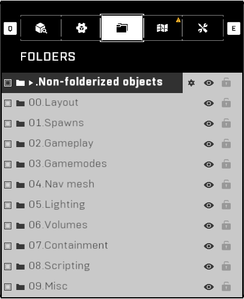
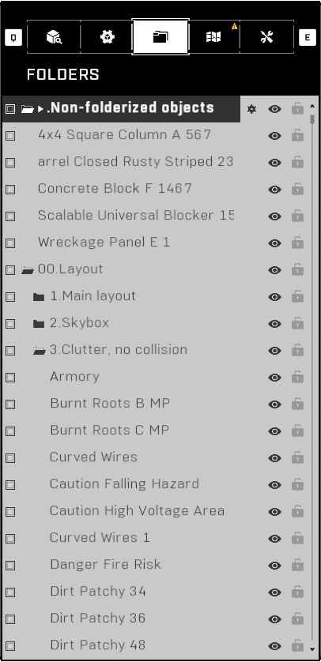
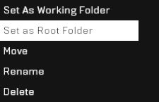

# Folders

The Folders tab is the third tab at the top of the Forge Menu and it allows users to create folders and subfolders where objects can be moved into.

<figure><figcaption></figcaption></figure>

## Interface

The Folders tab consists of main folders and subfolders where forge objects placed on the map are stored. The main folders and subfolders can be opened and closed, and their state will persist until the Forge session is closed. The folders can be renamed, and their positioning is based on alphabetical order. A folder and the objects within the folder can be locked or hidden. These options prevent the object from being selected and hide their visibility respectfully.

<figure><figcaption>
Default folder structure and objects on the Arid canvas
</figcaption></figure>

 

<figure><figcaption>
Objects selected, hidden and locked in the Folders tab
</figcaption></figure>

 

<figure><figcaption>
Custom folder structure for the 4v4 map HighGear
</figcaption></figure>

<figure><figcaption>
Advanced folder structure with 10 main folders as categories
</figcaption></figure>

 

<figure><figcaption>
Inspecting the contents of the custom folder structure
</figcaption></figure>

## Controls

Controls related to navigating the Folders tab. Options for both Keyboard and Mouse, and Controller are provided:



* <mark style="color:yellow;">Open the Folders tab</mark>:  + 
  * Alternative:  →  / 
* <mark style="color:yellow;">Close the Folders tab</mark>: 
  * Alternative: 
  * Alternative: 
* <mark style="color:yellow;">Navigation</mark>: , , , 
  * Alternative: , , , 
  * Alternative: , , 
* <mark style="color:yellow;">Quick Scroll Up</mark>: 
  * Alternative: 
* <mark style="color:yellow;">Quick Scroll Down</mark>: 
  * Alternative: 
* <mark style="color:yellow;">Select Object/Folder</mark>: 
  * Alternative: \[Hover]  → 
* <mark style="color:yellow;">Delete Selected items</mark>: 
* <mark style="color:yellow;">Select Setting</mark>: \[Hover] , , ,  → , , , 
* <mark style="color:yellow;">Open Options Menu</mark>: \[Hover] Object/Folder Name → 
  * Alternative: \[Hover]  → , , , 
* <mark style="color:yellow;">Expand/Collapse Folder</mark>: \[Hover]  → 
  * Alternative: \[Hover] Folder Name → , , 
* <mark style="color:yellow;">Focus Object</mark>: \[Hover] Object Name → , , 
* <mark style="color:yellow;">Expand/Collapse All Folders</mark>: 



* <mark style="color:yellow;">Open the Folders tab</mark>:  →  / 
* <mark style="color:yellow;">Close the Folders tab</mark>: 
* <mark style="color:yellow;">Navigation</mark>: 
  * Alternative: 
* <mark style="color:yellow;">Quick Scroll Up</mark>: 
* <mark style="color:yellow;">Quick Scroll Down</mark>: 
* <mark style="color:yellow;">Expand/Collapse All Folders</mark>: 

This section is still a stub.



## Default Folders

Each of the [default Forge canvases](../../loading-into-forge/forge-canvases.md) has a set of default folders that are localized to every supported language. If the names of these folders are changed, the localization support will be broken. The list of default folders is as follows:

* Gameplay
  * Bots
  * Cameras
  * Initial Spawns
  * Respawn Points
  * Vehicles
  * Weapons
* Layout [`root folder`](./#set-as-root-folder)
* Modes
  * Attrition
  * CTF
  * King of the Hill
  * Oddball
  * Stockpile
  * Strongholds

## Features

By opening the Options Menu (see [Controls](./#controls)) of an object or folder the following options will be available based on your selected item:

### Grab Selected (150 Max)

Turns a folder-only object selection into a viewport selection of the object group. A maximum of 150 objects can be in a viewport selection. Multiple prefabs can be selected, but the total number of objects within them can't be over 255, which is the true limit, instead of 150.

Learn more about: [Bypassing 150-Object Prefab Limit](../../../../guides-and-knowledge/forge-know-how/forge-exploits/bypassing-150-object-prefab-limit.md).

### Move

Moves the selected object(s) or folder with object(s) to a different folder. When a move is in progress, the menu navigation changes from object-to-object to folder-to-folder which helps with finding the destination folder quicker.

#### Moving Folders

Selecting Move on an entire folder moves only the objects within the folder to the new destination folder, regardless of your other selected items. Moving two folders at the same time by selecting the folders with  is not recommended as the move process will result in the objects within those subfolders now being under the destination main folder, instead of in the subfolders in the destination main folder.


Don't move two subfolders at the same time as the objects within them will not be nested in the subfolders anymore.


Moving singular subfolders between main folders works as expected, but moving a main folder to another main folder will turn the initial main folder into a subfolder of the destination main folder. Any subfolders of the initial main folder will be moved to the destination main folder as subfolders. Forcefully attempting to move a subfolder to another subfolder with  is not possible.

#### Object Selection Bug

A selection bug can happen if an object or a collapsed folder in it's entirety is selected and moved while other folders are collapsed. This bug causes random non-selected objects to be brought in with the object selection and be moved to the destination folder. To prevent this follow these steps:

* Open the Folders tab
* Navigate to your objects and select the desired objects
  * Alternatively get to this point by selecting the desired objects straight from the map
* Select and [grab the selected objects](./#grab-selected-150-max)
* Collapse/Expand all folders with / until all folders are expanded
* Close the Folders tab and re-open it
* Now select Move on one of the objects in your selection and move the selected objects to the desired folder
  * Folders can temporarily be collapsed with / after the "Move" button has been pressed and then expanded again in order to navigate around the folder structure quicker


When attempting to move groups of objects, it is recommended to expand all folders first before making the move to avoid an object selection bug.


### Rename

Sets the name of the selected object or folder. The object name is displayed in Folders, [Object Properties](../object-properties.md), [Object Reference](../../../../scripting/nodes/variables-basic/object-reference.md) nodes and the [Object Information](../#object-information) panel while the folder name is only displayed in the Folders tab. An object name up to 40 characters can be entered.

### Place in Empty Subfolder

Places the selected object(s) in a new folder within the same main folder named "My Subfolder".

### Delete

Deletes the selected object(s) or folder. If a folder is deleted, all objects within the folder will also be deleted. Selected objects and folders can be quickly deleted with the  key.

### Drop

Drops a specific object from the [selection of grabbed objects](./#grab-selected-150-max).

### Drop Selected

Drops all selected objects in the Folders tab selection from the [selection of grabbed objects](./#grab-selected-150-max).

### Set as Working Folder

Sets the selected folder as the directory where all newly created objects will be put into. Persists only for the current Forge session, after which the working folder will return to the [root folder](./#set-as-root-folder).

### Set as Root Folder

Turns the selected subfolder into a main folder and turns it into the root folder. All objects within the subfolder will be transferred to the new main folder. The root folder of a map is set as the [working folder](./#set-as-working-folder) by default when a Forge session is loaded.


This option arguably causes more harm than good as it's often only be useful when setting up the folder structure of a map in the first place, and most if not all presses of the button afterwards are misinputs from trying to select "Set As Working Folder", resulting in a ton of unnecessary headache.



### Add New Folder

Creates a new main folder with the specified name; the default name is "My Folder". This option can only be accessed by opening the Options Menu of a main folder. The newly created main folder will also automatically become the new [root folder](./#set-as-root-folder).

### Create Empty Subfolder

Creates a new subfolder with the specified name within the selected main folder; the default name is "My Subfolder".  This option can only be accessed by opening the Options Menu of a main folder.

### Hide & Unhide

The  icon toggles the visibility of objects from the map viewport. Hiding an object only applies to Test Mode. Hidden objects can't be selected directly from the map viewport, but can still be selected via mouse drag-select or by [selecting and grabbing](./#grab-selected-150-max) them from the Folders tab.

Hiding unnecessary objects while forging is common practice, but don't forget to unhide the objects before handing off the map for someone else to forge on, as the next person might think the map is missing objects, if they don't clue in to checking the Folders tab for hidden objects.

### Lock & Unlock

The  icon toggles the selectability of objects from the map viewport. Locked objects can still be selected and grabbed from the Folders tab. Locked objects will have a red lock icon next to the object's Object Mode indicator on the [Object Information](../#object-information) panel. The option "(DELETE ALL UNLOCKED)" in [Map Options](../map-options.md) will not delete any locked objects.

<figure><figcaption>
Locked object showing a red lock next to it's name
</figcaption></figure>


Some forgers use object locking as a a safety measure to not accidentally select the object, while others use it as a mental check to confirm that a section of a map is finished.


## Why Use Folders?

Organizing objects in folders helps you and others find objects on the map quicker, and hide or lock specific object categories. It becomes difficult locating objects or hiding all of the player containment objects on the map if everything is together in one big folder, as is usually the case.

## Folder Tips

Tips from experienced forgers about using the Folders tab to it's fullest.

### Selecting Objects

The quickest way to select groups of individual objects where selecting the entire folder isn't applicable is by selecting the object with (keyboard) , pressing  or  to go to the next object, and repeating the cycle. If you want to then move that group of objects, read the instructions on how to [safely and consistently do so](./#object-selection-bug).

### Naming

As the folder structure in Forge is alphabetically ordered, a numbering system can be used to order the folders. Prefixing a number either in the form of `1, 2, 3...` or `01, 02, 03...` to a main folder is commonplace in the folder structures of many experienced forgers. Subfolders usually aren't number-ordered like this, but there's no harm in doing it.

## Folder Structure References

The folder structure doesn't have to be overly complicated to work efficiently. The objects on a map can roughly be divided into: Layout, Gameplay, Containment & Scripts. It's also useful to separate the playable geometry and the skybox geometry of the map to [optimize the Nav Mesh build](../../../nav-mesh/nav-mesh-generation/optimizing-nav-mesh-generation/) by hiding the skybox during [Nav Mesh generation](../../../nav-mesh/nav-mesh-generation/building-nav-mesh/).

A great folder structure allows the forgers who care about folderizing objects to do so while still keeping newly placed objects organized in one place if the forger forgot to set a working folder. Below are references to recommended folder structures used by experienced forgers that have been tried and tested over multiple different maps to work efficiently.

### Basic Folder Structure

For categorizing objects into large categories that still differentiate them enough to be understandable.

**Learn more about:**

<table data-view="cards"><thead><tr><th></th><th data-hidden data-card-cover data-type="files"></th><th data-hidden data-card-target data-type="content-ref"></th></tr></thead><tbody><tr><td>Basic Folder Structure</td><td><a href="../../../../.gitbook/assets/cover-tsg-placeholder.jpg">cover-tsg-placeholder.jpg</a></td><td><a href="basic-folder-structure.md">basic-folder-structure.md</a></td></tr></tbody></table>

### Advanced Folder Structure

For categorizing every object type efficiently and semantically. Takes a bit longer to set up and takes up more budget, but is much more useful on larger projects or feature-rich maps.

**Learn more about:**

<table data-view="cards"><thead><tr><th></th><th data-hidden data-card-cover data-type="files"></th><th data-hidden data-card-target data-type="content-ref"></th></tr></thead><tbody><tr><td>Advanced Folder Structure</td><td><a href="../../../../.gitbook/assets/cover-tsg-placeholder.jpg">cover-tsg-placeholder.jpg</a></td><td><a href="advanced-folder-structure.md">advanced-folder-structure.md</a></td></tr></tbody></table>

## Trivia

* Before Season 4, selecting an item in the folder structure automatically [grabbed the selected item](./#grab-selected-150-max). This was changed to allow objects more than 150 to be moved between folders at the same time as well as to lessen the potential for performance issues when selecting 150 objects at the same time.&#x20;
* Each folder adds on to the Forge Simulation budget, which can be an issue on maps at the budget limit where no more new folders can be made.
* Changes within the folder structure such as item moving or folder deletion cannot be undone with the undo-action.

***

#### <mark style="color:green;">Contributors</mark>

Okom\
MikRips\
ArturBloodshot\
Mr Kwatz
