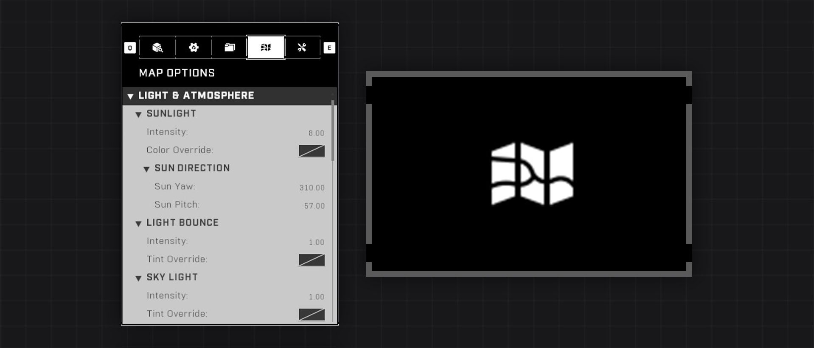
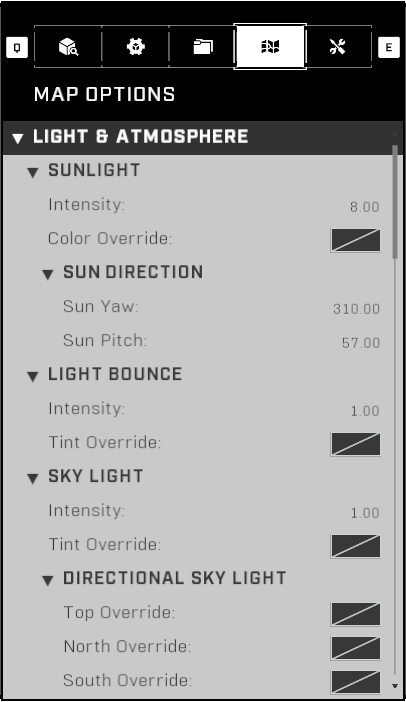
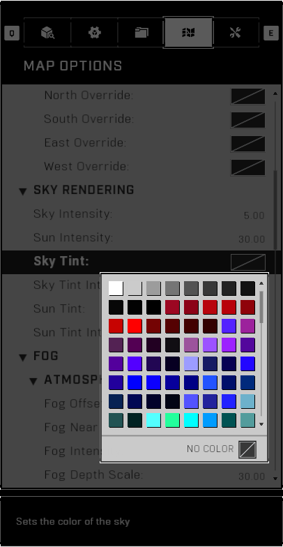
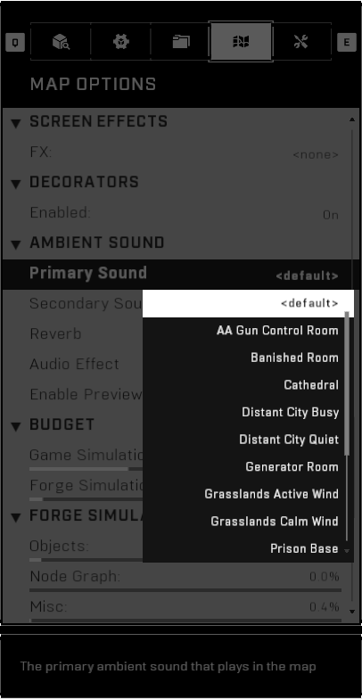
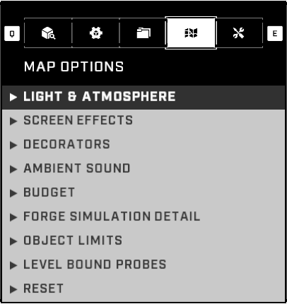
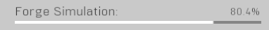
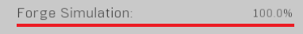
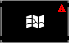

# Map Options

<figure><figcaption></figcaption></figure>

The Map Options tab is the fourth tab at the top of the Forge Menu and it displays options such as changing map lighting, wind, sound, and inspecting budget usage.

## Interface

The Map Options tab consists of categories and subcategories, within which are adjustable map options and settings. The categories can be opened and closed, and their state will persist until the Forge session is closed. A short description of the selected item is shown under the main interface. The common adjustable map options include Sunlight, Light Bounce, Ambient Sound, Budget, and Level Bound Probes.

<figure><figcaption>
Map Options tab with default settings on the Arid canvas
</figcaption></figure> <figure><figcaption>
Sky Tint color selection
</figcaption></figure> <figure><figcaption>
Primary ambient sound selection
</figcaption></figure>

<figure><figcaption>
Map Options tab with all categories collapsed
</figcaption></figure>

## Controls

Controls related to navigating the Map Options tab. Options for both Keyboard and Mouse, and Controller are provided:



* <mark style="color:yellow;">Open the Map Options tab</mark>:  + 
  * Alternative:  →  / 
  * Alternative: \[Hold]  → Map Options  /  /  / 
* <mark style="color:yellow;">Close the Map Options tab</mark>: 
  * Alternative: 
  * Alternative: 
* <mark style="color:yellow;">Navigation</mark>: , , , 
  * Alternative: , , , 
  * Alternative: , , 
* <mark style="color:yellow;">Quick Scroll Up</mark>: 
  * Alternative: 
* <mark style="color:yellow;">Quick Scroll Down</mark>: 
  * Alternative: 
* <mark style="color:yellow;">Select Item / Expand/Collapse Category</mark>: 
  * Alternative: 
  * Alternative: 
  * Alternative: 
* <mark style="color:yellow;">Expand/Collapse All Categories</mark>: 



* <mark style="color:yellow;">Open the Map Options tab</mark>:  →  / 
  * Alternative: \[Hold]  → Map Options 
* <mark style="color:yellow;">Close the Map Options tab</mark>: 
* <mark style="color:yellow;">Navigation</mark>: 
  * Alternative: 
* <mark style="color:yellow;">Quick Scroll Up</mark>: 
* <mark style="color:yellow;">Quick Scroll Down</mark>: 
* <mark style="color:yellow;">Select Item / Expand/Collapse Category</mark>: 
* <mark style="color:yellow;">Expand/Collapse All Categories</mark>: 



## Main Categories ↓

The sections below detail the different categories within the Map Options tab.

## Lights & Atmosphere

Settings to adjust the lighting, fog and wind.

### Sunlight

Settings to adjust the sunlight and it's direction. For more details, see [Sun](../../lighting/settings-global-lighting/sun.md).

#### Intensity

Changes the brightness of the sunlight.

Input range: `0.00` - `100.00`

#### Color Override

Changes the color of the sunlight. Note that this doesn't change the color of the sun itself. For changing the color of the sun, see [Sun Tint](map-options.md#sun-tint).

#### Sun Yaw

Changes the position of the sun in relation to the map cardinal directions. In simpler terms: left and right.

Input range: `0.00` - `360.00`

#### Sun Pitch

Changes the position of the sun in relation to the time of day. In simpler terms: up and down.

Input range: `0.00` - `360.00`

### Light Bounce

Settings to control how bounce light affects the level. For more details, see [Light Bounce](../../lighting/settings-global-lighting/light-bounce.md).

#### Intensity

Changes the brightness of bounce light from the sun and all other light sources.

Input range: `0.00` - `100.00`

#### Tint Override

Changes the color of bounce light.

### Sky Light

Sky light settings adjust the sky lighting and it's positional colors. For more details, see [Sky](../../lighting/settings-global-lighting/sky.md).

#### Intensity

Changes the brightness of sky lighting.

Input range: `0.00` - `100.00`

#### Tint Override

Changes the color of sky lighting.

#### Top Override

Changes the color of sky lighting coming from above the map.

#### North Override

Changes the color of sky lighting coming from the north side of the map.

#### South Override

Changes the color of sky lighting coming from the south side of the map.

#### East Override

Changes the color of sky lighting coming from the east side of the map.

#### West Override

Changes the color of sky lighting coming from the west side of the map.

### Sky Rendering

Sky rendering settings adjust the look of the sky and sun. For more details, see [Sky](../../lighting/settings-global-lighting/sky.md) and [Sun](../../lighting/settings-global-lighting/sun.md).

#### Sky Intensity

Sets the brightness of the sky. Uses Rayleigh scattering.

Input range: `0.00` - `100.00`


Setting the Sky Intensity to 0.00 hides the sun.


#### Sun Intensity

Sets the brightness of the sun. Uses Mie scattering.

Input range: `0.00` - `100.00`

#### Sky Tint

Sets the color of the sky.

#### Sky Tint Intensity

Sets how intense the sky color is.

Input range: `0.00` - `100.00`

#### Sun Tint

Sets the color of the sun. Note that this doesn't change the color of the sunlight. For changing the color of the sunlight, see [Sunlight Color Override](map-options.md#color-override).

#### Sun Tint Intensity

Sets how intense the sun color is.

### Atmospheric Fog

Atmospheric fog settings emulate light scattering in the atmosphere. For more details, see [Fog](../../lighting/settings-global-lighting/fog.md).

#### Fog Offset

Sets the distance to offset the fog falloff from where atmospheric fog starts rendering to the horizon. Based on [Fog Near Falloff](map-options.md#fog-near-falloff).

Input range: `0.00` - `5.00`

#### Fog Near Falloff

Sets the distance from player where atmospheric fog starts rendering.

Input range: `0.00` - `10,000.00`

#### Fog Intensity

Sets atmospheric fog density.

Input range: `0.00` - `1.00`

#### Fog Depth Scale

Sets the atmospheric fog density at a distance. Works with the [Fog Near Falloff](map-options.md#fog-near-falloff) value.

Input range: `0.00` - `1,500.00`

#### Fog Falloff Up

Sets the amount of atmoshperic fog falloff that occurs upwards from the horizon.

Input range: `0.00` - `5.00`

#### Fog Falloff Down

Sets the amount of atmoshperic fog falloff that occurs downwards from the horizon.

Input range: `0.00` - `5.00`

#### Sky Fog Intensity

Determines how much atmospheric fog is in the atmosphere. Color is based on [Sky Tint Override](map-options.md#tint-override-1).

Input range: `0.00` - `5,000.00`

#### Inscattering

Sets the amount of light that scatters throughout the atmosphere. Lower values result in stronger scattering.

Input range: `0.00` - `1.00`

#### Fake Inscattering Tint

Sets a false color scatter throughout the atmosphere.


The [Atmospheric Fog Inscattering](map-options.md#inscattering) value must be under 1.00 for the color to show.


### Volumetric Fog

Volumetric fog settings simulate 3D fog as cost from a light source. For more details, see [Fog](../../lighting/settings-global-lighting/fog.md).


Volumetric Fog can be turned off client-side from the video settings, so it shouldn't be relied on for major fog effects.


#### Enabled

Toggles the display of volumetric fog.

#### Density

Sets the volumetric fog density.

Input range: `0.00` - `1.00`

#### Color

Sets the volumetric fog color.

#### Near Range

Sets the distance from player where the volumetric fog starts rendering.

Input range: `0.00` - `600.00`

#### Far Range

Sets the distance from player where the volumetric fog stops rendering.

Input range: `0.00` - `1,000.00`

### Wind

Wind settings affect the movement of some dynamic objects such MP Trees, as well as Screen Effects.


To easily preview the wind settings, change the [Screen Effect](map-options.md#fx) to _Retro Heavy_, and turn the [Wind Speed](map-options.md#wind-speed) to _12.00_.


#### Yaw

Changes the direction of the wind in relation to the map cardinal directions. In simpler terms: left and right.

Input range: `-180.00` - `180.00`

#### Pitch

Changes the angle of the wind in relation to the ground plane. In simpler terms: up and down.

Input range: `-180.00` - `180.00`

#### Wind Speed

Changes the speed of the wind.

Input range: `1.00` - `12.00`

## Screen Effects

Screen Effects are global moving particles that display on every player's screen.

#### FX

Changes the screen effect such as rain, dust, bubbles, etc.

Input options:

\<none>

Dust Heavy

Dust Light

Dust Medium

Embers Heavy

Embers Light

Embers Medium

Motes Heavy&#x20;

Motes Light

Motes Medium

Papers Heavy

Papers Light

Papers Medium

Rain Heavy

Rain Light

Rain Medium

Retro Heavy

Retro Light

Retro Medium

Snow Heavy

Snow Light

Snow Medium


Having global Screen Effects _on_ may cause issues on maps with multiple [FX-emitting objects](../../lighting/fx/fx-emitting-objects.md) such as [Weapon Spawners](../../gameplay/sandbox/weapons/weapon-spawning/). Turning the Screen Effects off in these cases helps prevent issues with FX overload.


## Decorators

#### Enabled

Toggles the visibility of decorators in the map. Decorators are small foliage details on the built-in canvas floor of Forge canvases.


Decorators are usually disabled, as many maps aren't built directly on the canvas floor to visually benefit from them, and the performance impact of having them enabled is unknown.


## Ambient Sound

Ambient Sounds are audio loops heard throughout the map at a quiet volume.

#### Primary Sound

The primary ambient sound that plays in the map.

Input options:

\<default>

AA Gun Control Room

Banished Room

Cathedral

Distant City Busy

Distant City Quiet

Generator Room

Grasslands Active Wind

Grasslands Calm Wind

Prison Base

Prison Security Room

Scorched Earth

Ship Wreckage

Silence

Spire Room

Under Water

#### Secondary Sound

The secondary ambient sound that plays in the map.

Input options:

\<none>

Distant Battle A

Distant Battle B

Distant Thunder

Lake Water Laps

Ocean Surf

Rain Heavy

Rain Light

Rain Medium

Thunder Storm with Rain

Wind Storm

#### Reverb

The type of reverb applied to the map. Reverb can be commonly heard in the form of object impacts, gunshots and explosions.

Input options:

Exterior Open

Exterior Reflective

Interior Large

Interior Medium

Interior Narrow


Reverb is a commonly overlooked option, but can help in making the map feel more realistic. Set the Reverb type based on the majority of place spaces in the map.


#### Audio Effect

The secondary ambient sound that plays in the map.

Input options:

\<none>

Helium

Space


Setting an Audio Effect on a map is uncommon, as not many maps suit the theme, but they also affect all of the announcer voice lines, which sound weird.


#### Enable Preview

Toggles the playing of primary and secondary ambient sounds during Forge edit mode.

## Budget

Object placement limits and the current costs of various elements in the map. The budgets show a progress bar of how much of a specific budget has been used up. If a budget reaches 80%, a yellow warning icon shows up in the Map Options tab. If a budget reaches 100%, its progress bar turns red and a red warning icon shows up in the Map Options tab.

<figure><figcaption>
Budget progress bar
</figcaption></figure> <figure><figcaption>
Progress bar turns red at 100%
</figcaption></figure>

<figure><figcaption>
Yellow warning symbol indicating a budget is at 80%
</figcaption></figure> <figure><figcaption>
Red warning symbol indicating a budget is at 100%
</figcaption></figure>

#### Game Simulation

The cost of simulating entities in a networked environment, including dynamic objects, projectiles, units, actions, etc. This is separate from the additional cost of networking entities in Forge.

Budget range: `0.0%` - `100.00%`

The Game Simulation budget is the hard limit on what a map can simulate in gameplay. Dynamic objects and large scripts take up the majority of Game Simulation budget.


The Game Simulation budget is also shown on the [Budget Meter](./#budget-meter) in the standard Forge interface.



The Game Simulation budget used by Forge Modes via Mode Brains are separate from the on-level budgets. Even maps at 95% Game Simulation can be loaded with a Forge Mode that by itself takes up over 5% Game Simulation budget.


#### Forge Simulation

The cost of simulating entities in Forge, including dynamic and static objects, prefabs, user strings, Node Graph elements, etc. This is separate from the base cost of simulating entities in a networked environment.

Budget range: `0.0%` - `100.00%`

Forge Simulation often reaches 100.00% before Game Simulation, as the interfaces for modifying objects and elements in Forge require additional resources. One way to alleviate Forge Simulation budget is to convert on-level scripts from Script Brains into a Forge Mode script within Mode Brains.


The Forge Simulation budget used by Forge Modes via Mode Brains are separate from the on-level budgets. It's best practice to load as much scripting from a Forge Mode, instead of from on-level scripting in order to relieve Game- and Forge Simulation budget to use on the map.


### Forge Simulation Detail

A breakdown of the categories of the Forge Simulation budget.

#### Objects

The total percent of the Forge Simulation budget used by Object entities, including static objects and dynamic objects.

Budget range: `0.0%` - `100.00%`

#### Node Graph

The total percent of the Forge Simulation budget used by Node Graph entities, including nodes, connections, and node properties.

Budget range: `0.0%` - `100.00%`


While the budget range is up to 100.00%, players have reported not being able to load map versions with Node Graph budget in the range of 14-20%. This real limit is affected by the amount of other objects on the map, but 14-20% should be considered the 100% of the Node Graph budget on full maps.



The Node Graph budget used by Forge Modes via Mode Brains are separate from the on-level budgets. It's best practice to load as much scripting from a Forge Mode, instead of on-level scripting to not run into limitations with the Node Graph budget.


#### Misc

The total percent of the Forge Simulation budget used by miscellaneous entities, including prefabs, user strings, some properties, etc.

Budget range: `0.0%` - `100.00%`


[Prefabs](../../../ugc/metadata-and-file-management/prefabs/) and [Folder](folders/) names take up Forge Simulation budget, but the impact is negligible to take into consideration. If the Forge Simulation budget is at 100.00%, you may not be able to create prefabs or rename folders.


### Object Limits

Object count limits for various types of objects.

#### Static Geo

The percentage usage of the static render meshes in the map. Static objects can be composed of multiple render meshes. This is a hard limit and cannot be exceeded.

Budget range: `0.0%` - `100.00%`

#### Vehicles

The number of vehicles in the map. Does not account for vehicles created during gameplay. Includes all types of [Vehicle Spawners](../../gameplay/sandbox/vehicles/vehicle-spawning/).

Budget range: `0` - `40` / 40

While the limit is only 40, it's a very safe limit, as the real hard limit for vehicles is 128. Some vehicles like the Scorpion and Warthog are made out of two vehicles: the mover and the turret. Creating vehicles during gameplay such as spawning players in vehicles or cloning vehicles via scripting only has the hard limit of 128 total vehicles in play.


Attempting to create more than 128 vehicles won't work. If a vehicle made from two vehicles is created as the 128th vehicle, only the mover part of the vehicle will be created.


#### Reflection Volumes

The number of [Reflection Volumes](../../lighting/lighting-modifiers/reflections/reflection-volumes/) in the map. This is a hard limit and cannot be exceeded.

Budget range: `0` - `15` / 15

#### Movers

The number of movers in the map. This is a hard limit and cannot be exceeded.

Budget range: `0` - `48` / 48


Only one object is known to fall into this category, being the _Vehicle Lift_ [hidden object](../../../guides-and-knowledge/forge-know-how/forge-misc/hidden-forge-objects.md).


#### Animations

The percentage usage of animation states used by objects in the map. This is a hard limit and cannot be exceeded.

Budget range: `0.0%` - `100.00%`


Never reported as being the cause of issues.


#### Physics

The percentage usage of the total Physics budget. This is a soft limit and can be exceeded, but doing so may have a negative impact on performance, and some objects may stop working correctly.

Budget range: `0.0%` - `100.00%`


Never reported as being the cause of issues.


#### Collision

The percentage usage of the total Collision budget. This is a soft limit and can be exceeded, but doing so may have a negative impact on performance, and some objects may stop working correctly.

Budget range: `0.0%` - `100.00%`


Never reported as being the cause of issues.


## Level Bound Probes

Settings to adjust the light probes generated by default in a map. For details on what light probes are, see [Light Probes](../../lighting/lighting-modifiers/light-probes.md).

#### Bounding Type

The bounding type determines the area where to generate light probes by default. For details about custom light probes, see [Light Probe Marker](#user-content-fn-1)[^1].

Input options:

Level

Objects

* **Level**: Light Probes are generated within the entire Forge canvas gameplay space. Only useful in maps with large skyboxes in the canvas gameplay space that need light bounce data.
* **Objects**: Light Probes are generated only within a bounding box that covers all objects placed in the map. Useful in maps built in interiors, or maps where the skybox doesn't need to have accurate light bounce data.


While _Level_ is the default option, _Objects_ is usually recommended, as it often results in using less Light Probes, with the drawback of not having any light probes outside the invisible bounding box surrounding all placed objects.


#### Probe Spacing

Sets the distance between default light probes. For details about custom light probes, see [Light Probe Marker](#user-content-fn-1)[^1]. Lower spacing values result in more accurate lighting at the expense of increased light probe counts and [lighting build](../../lighting/building-lighting/) times.

Input range: `1.00` - `100.00`


A general good spacing to start with is 20, which can be decreased later to suit the desired lighting accuracy.


#### Probe Count

Estimated number of light probes based on the current settings across the Level Bound Probes and the [Light Probe Marker](#user-content-fn-2)[^2]. Larger probe count values result in more accurate lighting at the expense of increased [lighting build](../../lighting/building-lighting/) times.

Value range: `0` - `14000` / 14000

## Reset

#### Reset Map Properties

Reset all map properties, such as fog, and reference colors to the default values as dictated by the Forge canvas base map.


This action cannot be undone.


#### Delete All Unlocked

Delete all unlocked objects in the map. For more details about locked and unlocked objects, see [Lock & Unlock](folders/#lock-and-unlock).


This action cannot be undone.


***

#### <mark style="color:green;">Contributors</mark>

Okom

[^1]: Link when complete

[^2]: Fix when done
