# Object Browser

The Object Browser tab is the first tab at the top of the Forge Menu and it displays a list of objects to spawn in Halo Infinite Forge.

<figure>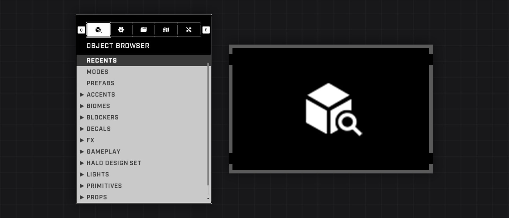<figcaption></figcaption></figure>

## Interface

The Object Browser consists of object categories and subcategories, within which are spawnable objects. The categories can be opened and closed, and their state will persist until the Forge session is closed, and a short description of the selected item is shown under the main interface. In addition to object categories, there are also categories for recently used objects, and Modes and Prefabs that you are a [Collaborator](../../../../ugc/metadata-and-file-management/working-with-files/file-collaborators.md) on or have bookmarked.

<figure>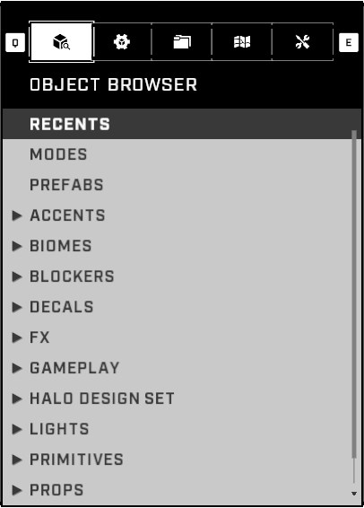<figcaption>
Object Browser tab with all categories collapsed
</figcaption></figure>

 

<figure>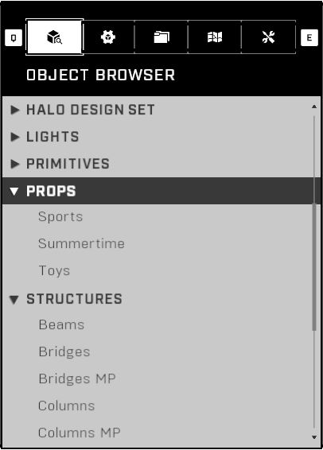<figcaption>
Object Browser tab with two categories open
</figcaption></figure>

 

<figure>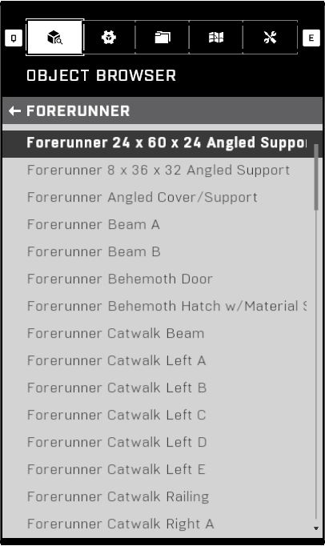<figcaption>
Accents > Forerunner category open in the Object Browser tab
</figcaption></figure>

## Controls

Controls related to navigating the Object Browser. Options for both Keyboard and Mouse, and Controller are provided:



*   Open Object Browser:  + 

    * Alternative:  ->  / 

* Close Object Browser: 
  * Alternative: 
  *   Alternative: 

*   Navigation: , , , 

    * Alternative: , , , 
    * Alternative: , , 

*   Quick Scroll Up: 

    * Alternative: 

* Quick Scroll Down: 
  * Alternative: \

*   Select Item / Expand/Collapse Category: 

    * Alternative: 
    * Alternative: 
    * Alternative: 

* Expand/Collapse All Categories: \

* Go Back: 
  * Alternative:  (on the subcategory name at the top)



* Open Object Browser:  ->  / \

*   Close Object Browser: 

*   Navigation: 

*   Quick Scroll Up: 

* Quick Scroll Down: \

* Select Item / Expand/Collapse Category: \

* Expand/Collapse All Categories: \

* Go Back: 



## Categories

The sections below detail the different categories within the Object Browser tab, their contents, and properties in detail. The [Forge Object List](./#forge-object-list) section acts as a searchable full object list for Halo Infinite Forge.

### Recents

A list of the most recently placed objects. This list persists between Forge sessions, and only resets when the game is closed.

### Modes

A list of Forge Modes that you are a collaborator on, or have bookmarked. The modes (consisting of only Mode Brains) can be placed on the map straight from the menu.

When a Forge session is loaded, each player requests all of their owned and bookmarked modes to be loaded so the game can display these in the Modes category. This happens for both modes and prefabs. For players who have a lot of these, it can cause upwards of 1000 network requests just from loading the same modes and prefabs every time a new Forge session is loaded.

<figure>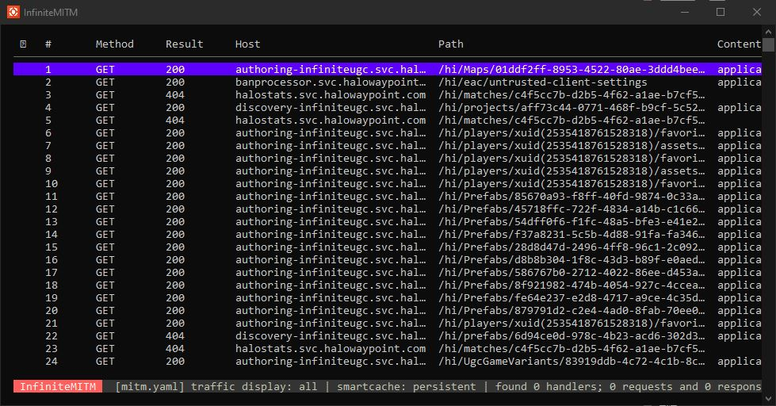<figcaption>
Prefabs and modes start loading right after the map loads
</figcaption></figure>

 

<figure>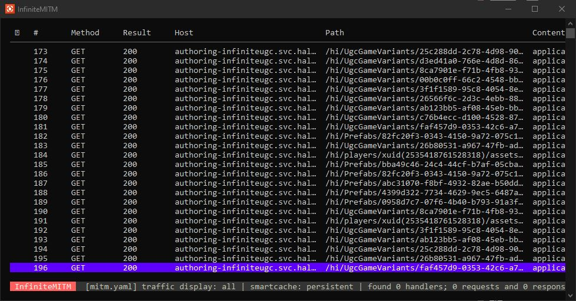<figcaption>
Over 100 asset requests in
</figcaption></figure>

 

<figure>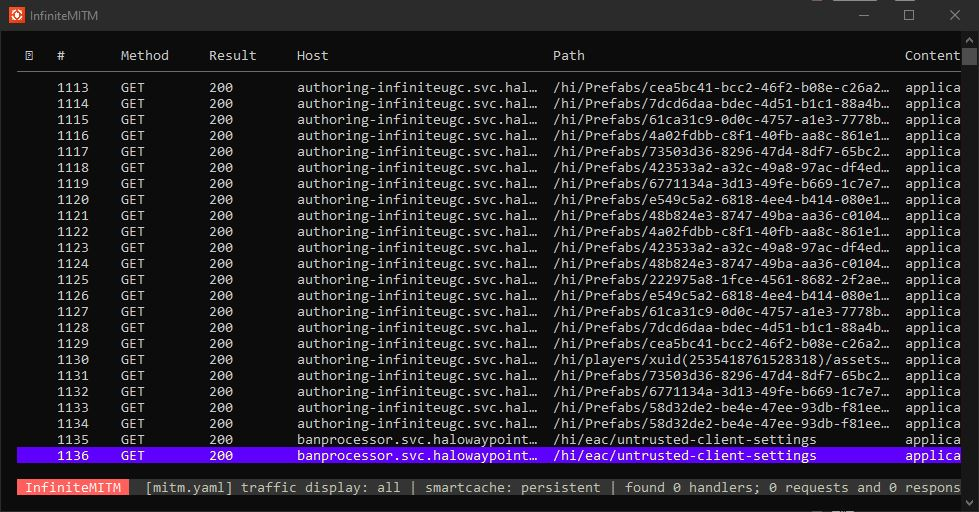<figcaption>
Around 1130 asset requests by joining a Forge session
</figcaption></figure>

> Tool: [InfiniteMITM](https://github.com/Alexis-Bize/InfiniteMITM)

This results in not being able to easily select modes or prefabs from the corresponding categories when the requests are being made as the list of items is constantly changing, which resets the position of the scroll bar to the top of the category. Only after all of the requests have been fulfilled, will the scroll bar stop resetting.

### Prefabs

A list of Object Prefabs that you are a collaborator on, or have bookmarked. The prefabs can be placed on the map straight from the menu. When a Forge session is loaded, each player requests all of their owned and bookmarked prefabs to be loaded so the game can display these in the Prefabs category.

<figure>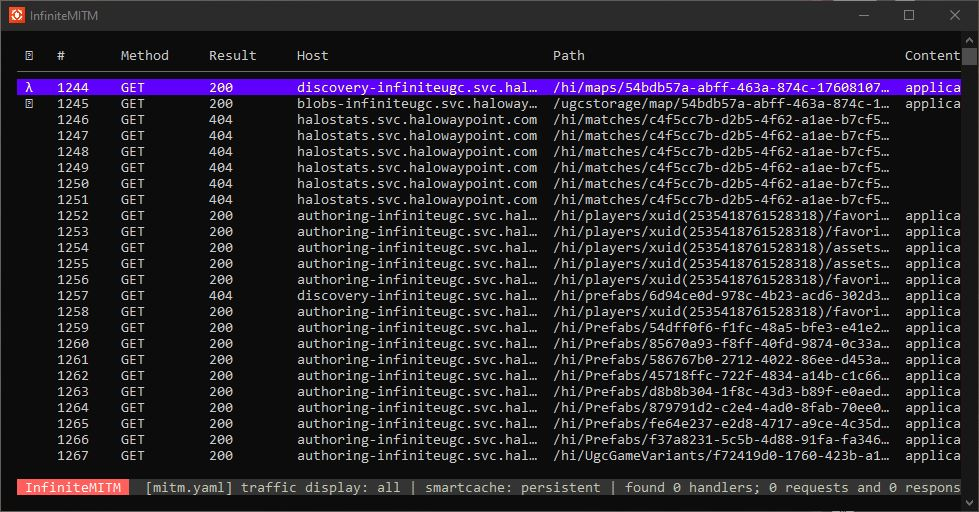<figcaption>
Forge map load started at request #1244
</figcaption></figure>

 

<figure>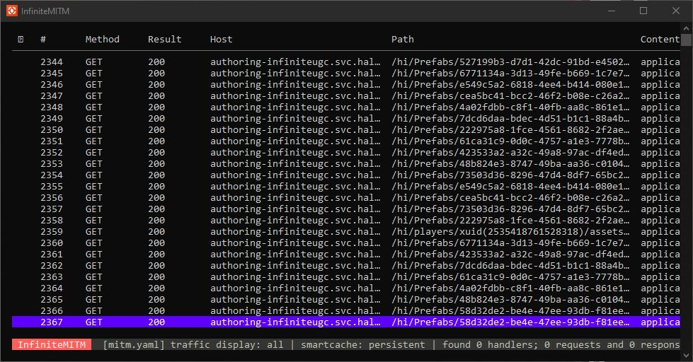<figcaption>
After 1123 requests, all the assets are loaded
</figcaption></figure>

### Forge Object List

Full object list of all spawnable objects in Halo Infinite Forge:

<table data-view="cards"><thead><tr><th></th><th data-hidden data-card-cover data-type="files"></th><th data-hidden data-card-target data-type="content-ref"></th></tr></thead><tbody><tr><td>Forge Object List</td><td><a href="../../../../.gitbook/assets/cover-tsg-placeholder.jpg">cover-tsg-placeholder.jpg</a></td><td><a href="forge-object-list.md">forge-object-list.md</a></td></tr></tbody></table>

## Hidden Categories

There are hidden categories in the Object Browser which hold assets that have not been validated for Forge yet, but may have been used by 343 on their internal builds while making Forge maps. It also holds depreciated objects that have been replaced by a new variant. Most of these are objects that have had their origin point changed.

A showcase of the hidden objects of Season 5 can be seen in this YouTube video:



> Map: [Hidden Forge Objects Season 5](https://www.halowaypoint.com/halo-infinite/ugc/maps/47dce9d6-f7bd-4570-9e75-e4a9c0fcab5d)

> Map: [Hidden Forge Objects](https://www.halowaypoint.com/halo-infinite/ugc/maps/f358f1e5-c944-43d1-81e4-139e4caf1e88) (alternative)

### Enabling the Hidden Categories

* Inspect the Halo Infinite executable with a Interactive Disassembler like IDA PRO, find the function for `Forge_DisableForgeHiddenCategory`, which should point to a byte: `50C3140`
* Open Halo Infinite without Easy Anti Cheat by replacing the HaloInfinite.exe file from the install directory with the HaloInfinite.exe file from `\game`, and running the executable
* Search for the byte `50C3140` in the Halo Infinite executable with Cheat Engine and flip it's value to `0`
* Apply the changes and the hidden categories should be available

### Notable Hidden Objects&#x20;

#### Argyle Lift

While not actually named "Argyle Lift", and instead just "Banished Gravity Lift", the name was quickly attached to the object in the Forge community as it is the lift object used on the 343-made Forge map "Argyle". Since this object is used on a dev-made map that is even played competitively, Forgers have been confused why it's still a normally unobtainable object.

<figure>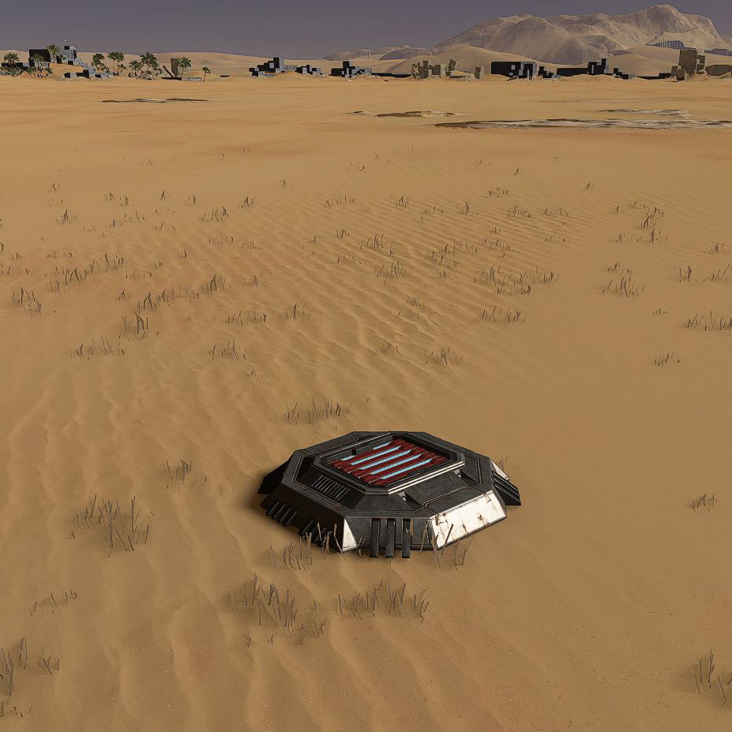<figcaption>
The "Argyle Lift"
</figcaption></figure>

 

<figure>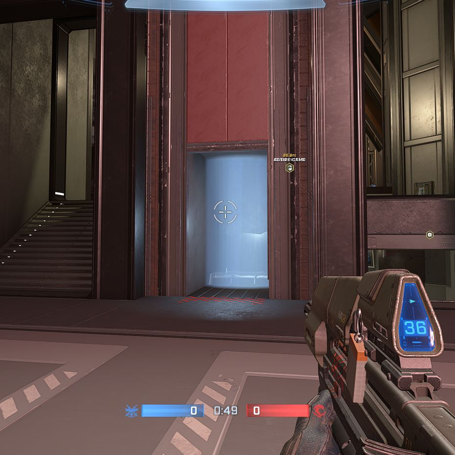<figcaption>
The lift on the map "Argyle" in back base
</figcaption></figure>

<figure>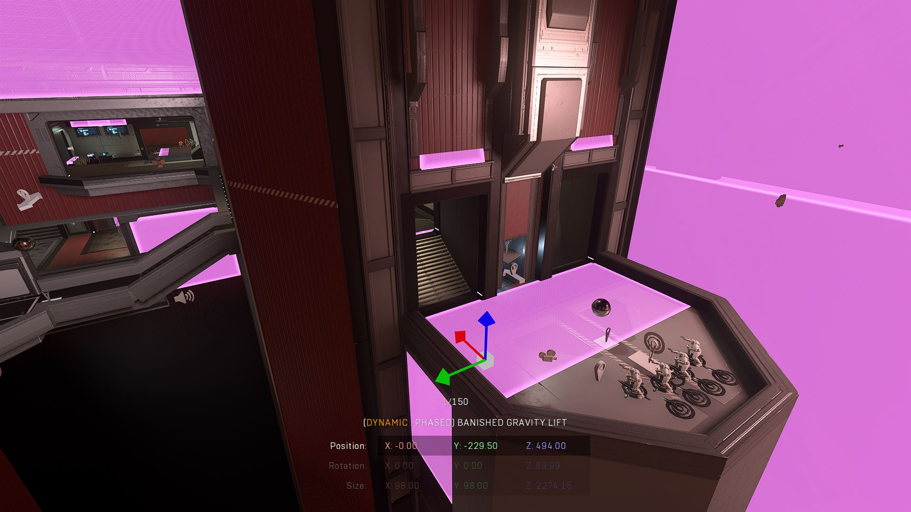<figcaption>
The lift location seen from above the map
</figcaption></figure>

 

<figure>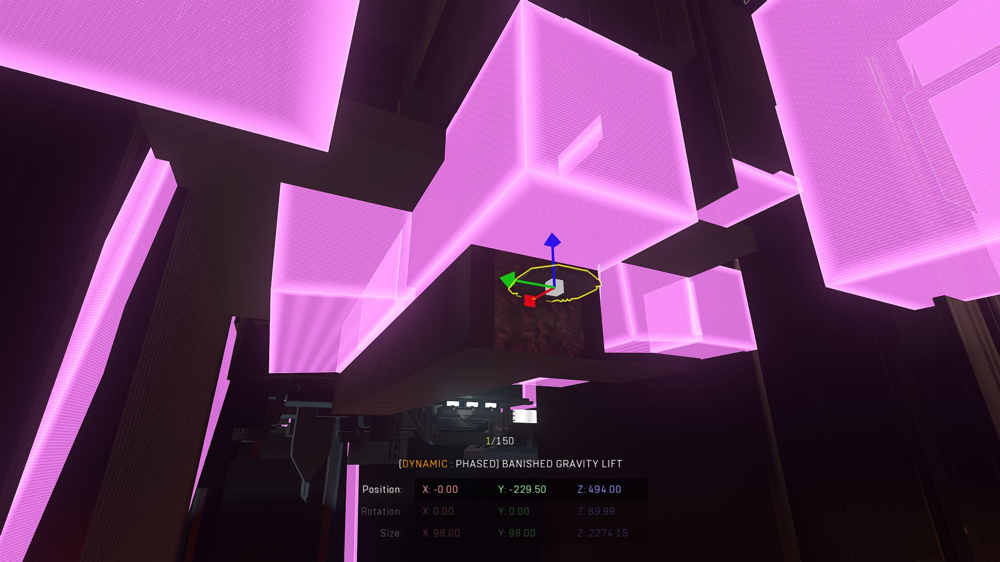<figcaption>
The lift under the map
</figcaption></figure>

> Map: [Argyle](https://www.halowaypoint.com/halo-infinite/ugc/maps/dd600260-d91c-4d77-9990-3f35873c90a1)

What makes the lift special is how long the gravity lift effect of it is. Measuring at 100.00 units of effective lift, the height is almost triple that of the normal "Gravity Lift Banished" object's 35.10 effective lift height. In addition to the extremely tall lift, the player is also ejected towards the front facing direction of the lift (X axis) at the apex of the lift height. This is also why the lift object is located so low on Argyle.

<figure>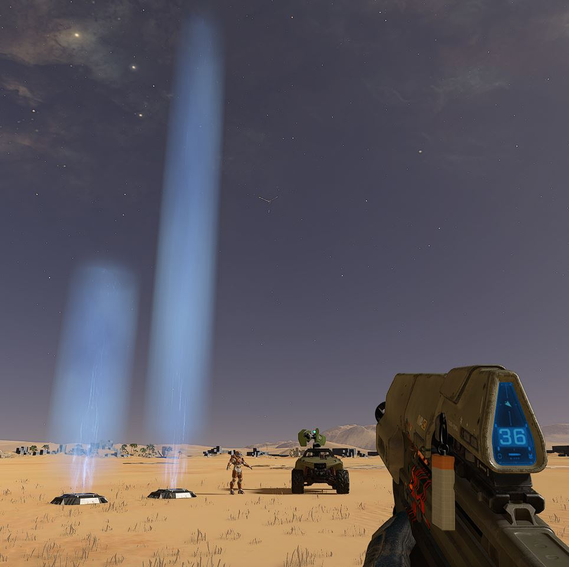<figcaption></figcaption></figure>

#### Leaks B

Leaks B is a colorable decal that looks like a liquid leak. In addition to being colorable, the texture of it can also be changed, allowing for the object to be used in numerous ways to smoothly blend a transition between two textures.

<figure>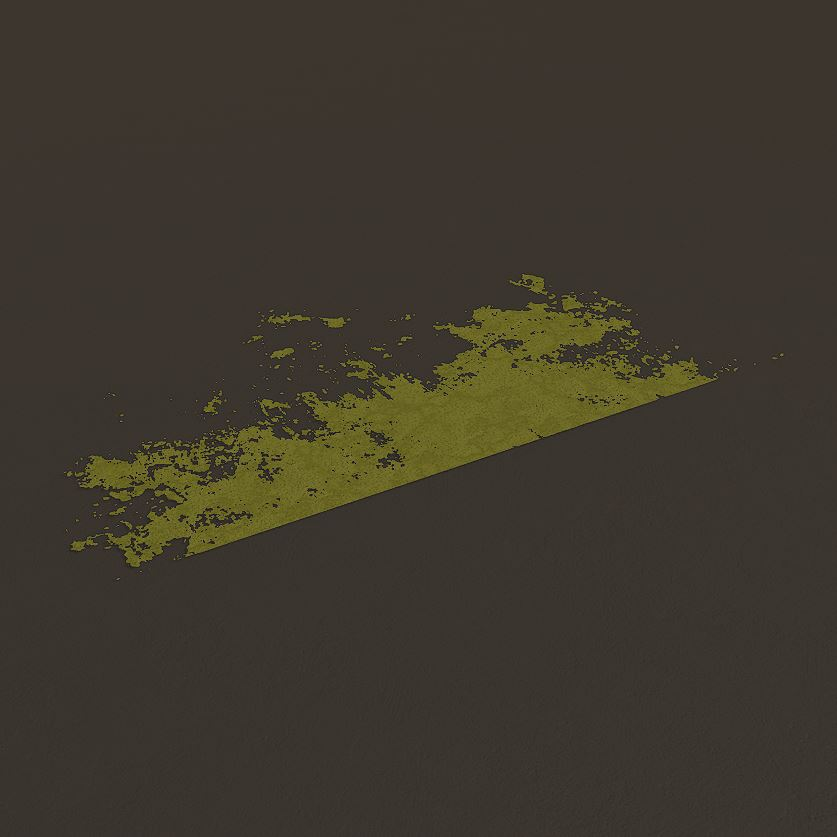<figcaption></figcaption></figure>

When Forgers found Leaks B with the release of Season 5 on 17th Oct, 2024 within the hidden objects, it was the first object of it's kind and Forgers quickly started integrating the object into their maps. Forgers were disappointed when the Leaks B object was removed from the game on 5th Dec, 2023, which left a lot of maps that had utilized the object, looking empty. 343 was made abundantly clear about the want for the return of Leaks B by the Forgers via varous channels of communication.

<figure>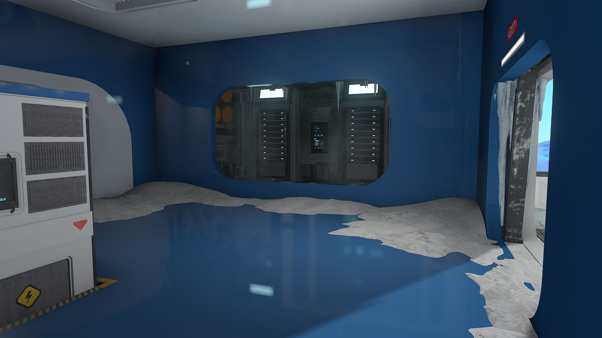<figcaption>
A room without Leaks B 
</figcaption></figure>

 

<figure>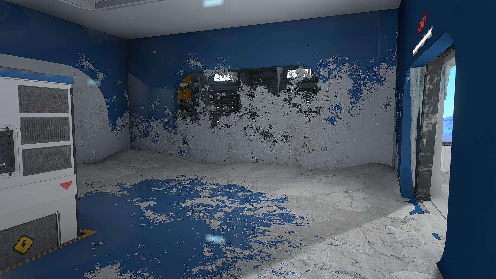<figcaption>
A room with Leaks B
</figcaption></figure>

> Map: [Worthwhile](https://www.halowaypoint.com/halo-infinite/ugc/maps/4e085611-8550-4907-b597-9373342a1bdc)

On Jan 19th, 2024, during a 343 community livestream showcasing the upcoming CU29 update, the presenters went over the Leaks B object and expressed a comedic reference to the beloved decal that only people in the know got:



The Leaks B object became fully supported with the CU29 update and can now be found in Decals > Editable > Leaks B. Now you, too, understand why talking about Leaks B was so funny to the 343 employees in the video – Forge Lord, Unyshek and ske7ch.

#### Gauss Hog

The Gauss Hog is an anti-armor variant of the Warthog that never saw a finished variant for Halo Infinite. The hidden vehicle object is functional, but the gauss turret model and textures are unfinished, as well as there is no projectile nor explosion impact when the turret is shot.

<figure>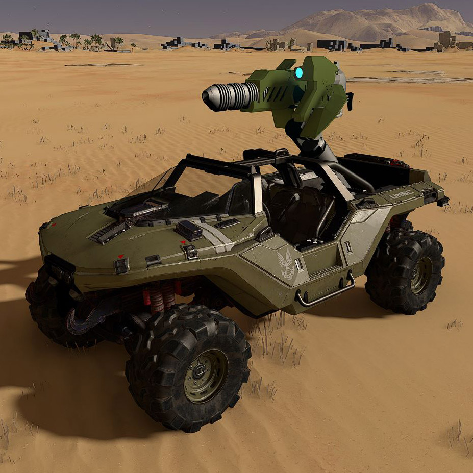<figcaption>
Gauss Hog
</figcaption></figure>

 

<figure>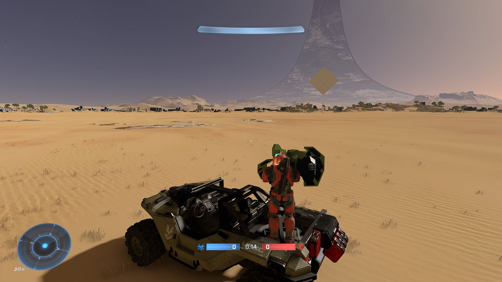<figcaption>
Player operating the gauss turret
</figcaption></figure>

Due to the bad UX support of the vehicle as well as it being quite weak in comparison to previous Halo's gauss hogs, players have been reluctant on including the vehicle in their maps. One map that does feature the Gauss Hog and gets used regularly is [Just Keep Driving - Sandtrap](https://www.halowaypoint.com/halo-infinite/ugc/maps/acf53d3b-de15-453f-8e40-901fd8272aad).

#### Pelican Drop

The Pelican Drop object is the underlying object used on dev-made BTB maps that cause a Pelican to deliver vehicle ordnance at set points during a game. Loading up the dev-made BTB maps in Forge shows that the objects are nowhere to be found, as they have been either scraped from the retail build, or are baked into the on-level scripting.

<figure>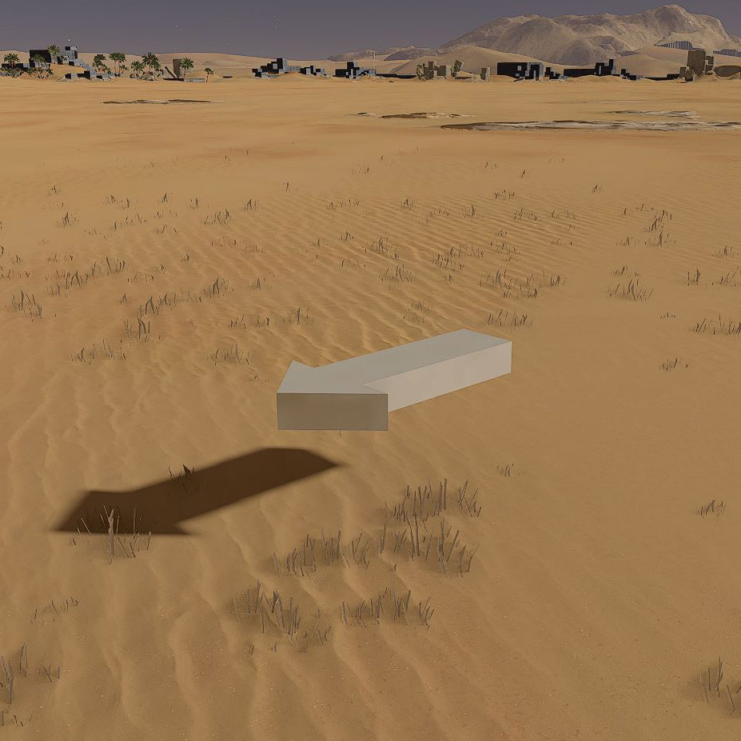<figcaption>
Pelican Drop object
</figcaption></figure>

 

<figure>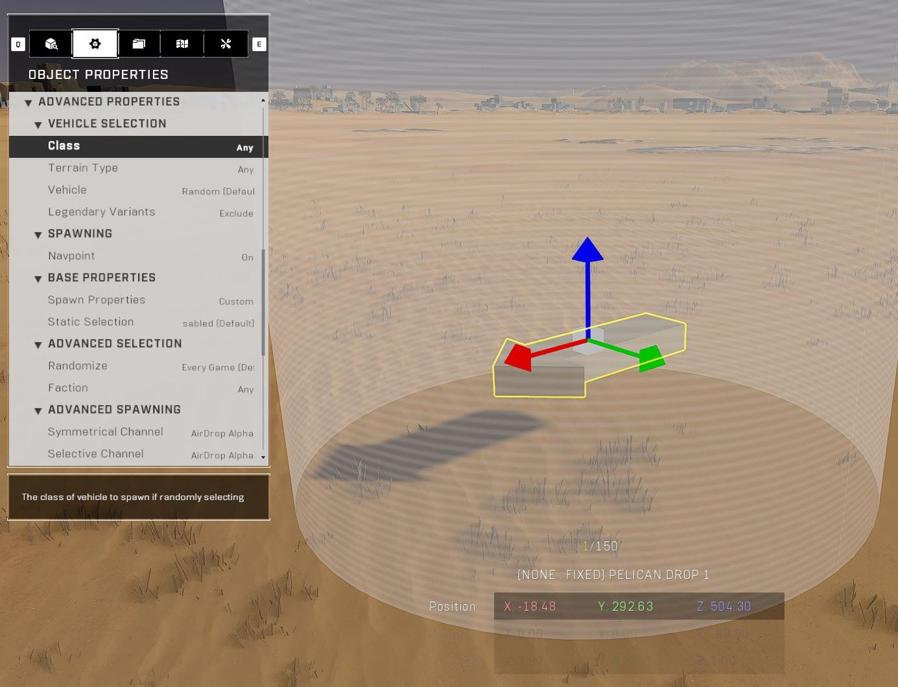<figcaption>
Properties for the Pelican Drop object
</figcaption></figure>

Even though the object can be obtained in Forge, it cannot be used to recreate the BTB Pelican drop experiences. Research was put into figuring out if it was possible to recreate the Pelican drops, and it is possible to add more Pelican drops to the dev-made maps that already support the underlying scripting for them. The map has to be loaded on a BTB-based mode for any Pelican drops to function. The Pelican Drop object will have to have specific Object Properties in order to function correctly and be detected by the level script. A correctly configured Pelican Drop object is included in the prefab: [Pelican Drop](https://www.halowaypoint.com/halo-infinite/ugc/prefabs/0c3e683d-e324-4b2a-95c8-71fdf6740c18).

<figure>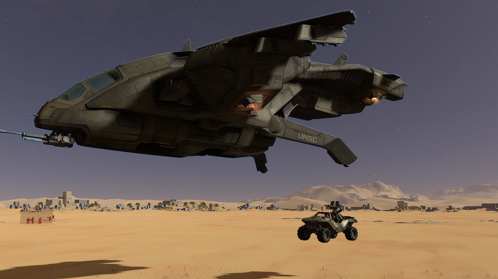<figcaption>
A Pelican drop in action
</figcaption></figure>

Although the exact BTB Pelican drops cannot be recreated on Forge maps with the object, [it was discovered](https://discord.com/channels/870017085625991189/1200297912069005413/1210602065147985930) that having a correctly set up Pelican Drop object on a map with a functioning [Firefight:King of the Hill](../../../modes/firefight/firefight-koth/) setup results in a Pelican drop event being fired at [Gameplay Start](../../../../scripting/nodes/events/on-gameplay-start.md). This meant that ordinary Forge maps loaded specifically in a Firefight:KOTH -based mode could support a singular Pelican drop at the start of the game. It is speculated that some mode scripting related to the functionality of the Firefight:KOTH mode is causing the Pelican Drop object to fire at Gameplay Start. A map where this functionality is used is [Sandtrap Firefight](https://www.halowaypoint.com/halo-infinite/ugc/maps/61201a05-5af2-432a-ab92-24f82e8e013f).

<figure>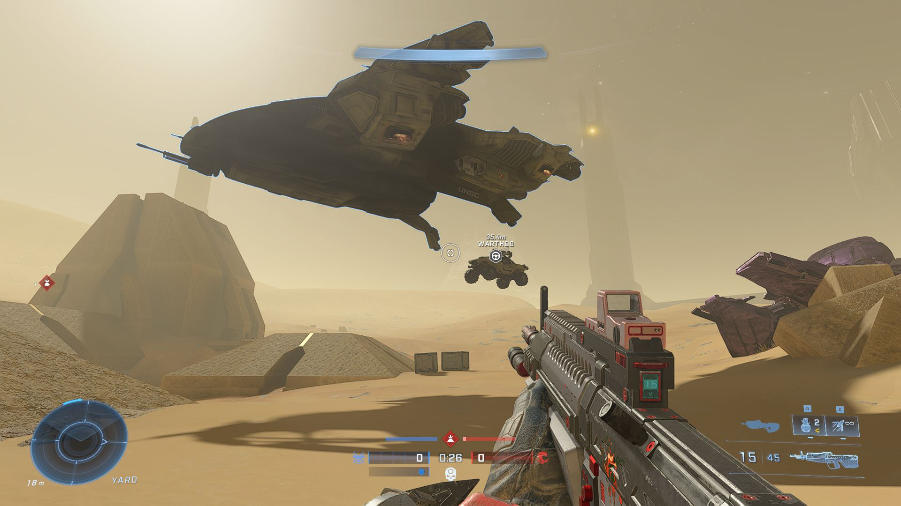<figcaption>
A Pelican drop in Firefight:KOTH on a Forge map
</figcaption></figure>

Since the Pelican Drop object uses a real Pelican vehicle, it is possible to store the Vehicle Type of the Pelican so that it can be used in scripting. A fully flyable, and real Pelican with intuitive UX support has been custom-built on Sandtrap Firefight by forger Okom1, which can be activated by having a minimum of 8 players in a Firefight:KOTH -based mode on the map and entering the crashed Pelican from the front.

<figure>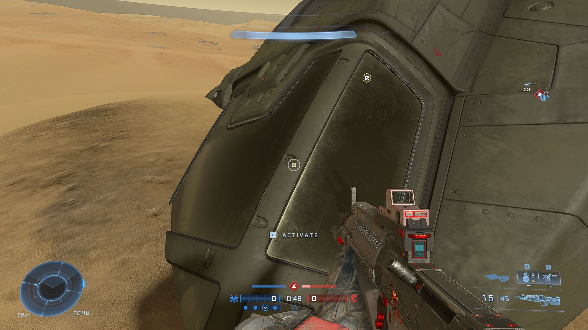<figcaption>
A prompt to enter the crashed Pelican
</figcaption></figure>

 

<figure>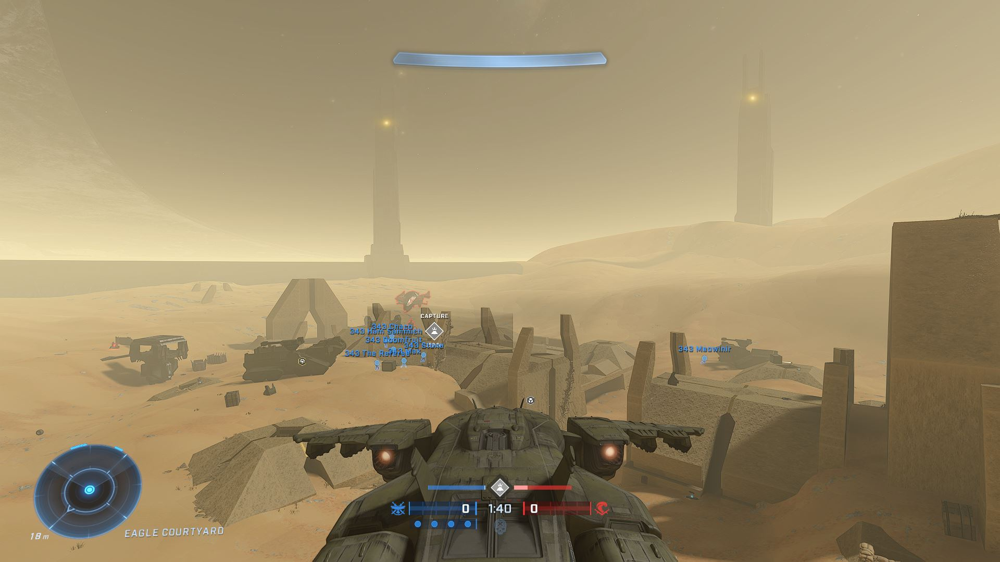<figcaption>
POV of the Pelican being piloted
</figcaption></figure>

> Map: [Sandtrap Firefight](https://www.halowaypoint.com/halo-infinite/ugc/maps/61201a05-5af2-432a-ab92-24f82e8e013f)

#### Midship and Relic Proxy

The Midship Proxy and Relic Proxy objects are low-poly representations of the map geometry of the Halo 2 Classic maps [Midship](https://www.halopedia.org/Midship) and [Relic](https://www.halopedia.org/Relic). Usually when remaking maps from other games in Halo Infinite, players would need to build the basic geometry of a map – blockout – out of hundreds of objects before they could begin to art the map with more realistic representations of objects and surfaces. With the discovery of these two proxy objects, Forgers were able to skip the blockout stage and jump straight into arting the map remakes.

<figure>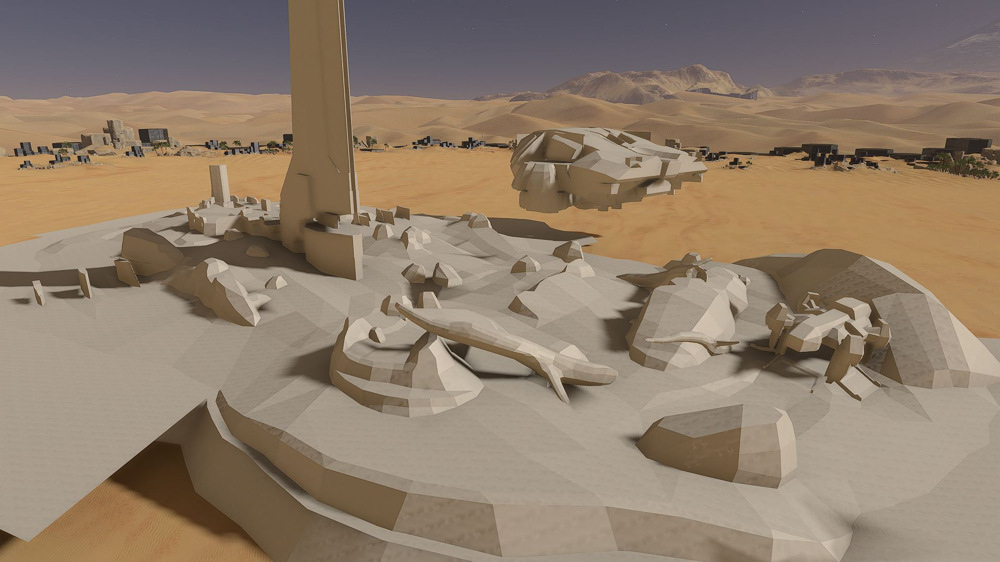<figcaption>
Relic Proxy and Midship Proxy
</figcaption></figure>

 

<figure>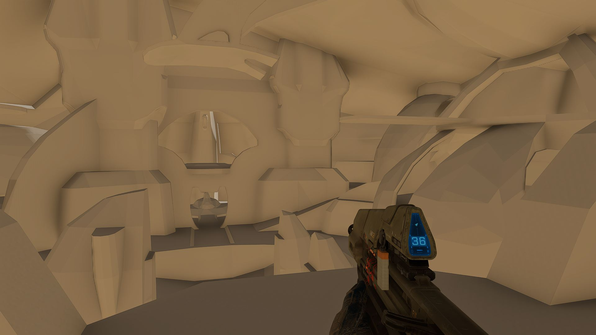<figcaption>
Inside the Midship Proxy
</figcaption></figure>

This resulted in some great remakes of Midship and Relic. The most notable Midship remake is [Inquisitor](https://www.halowaypoint.com/halo-infinite/ugc/maps/32487285-d829-4a07-947e-996c259a76a8), and a good Relic remake is [relic](https://www.halowaypoint.com/halo-infinite/ugc/maps/6ffd9b36-aa2b-4c8a-945b-8adfb6990b84). Also the map [Arctic Point](https://www.halowaypoint.com/halo-infinite/ugc/maps/c55cb0b1-24d6-441b-a64d-2826f5918a61) used the Relic Proxy as a guide for an underground structure's geometry.

<figure><figcaption>
Inquisitor map
</figcaption></figure>

 

<figure><figcaption>
Underground structure on the map Arctic Point
</figcaption></figure>

***

#### <mark style="color:green;">Contributors</mark>

Okom\
Surasia
