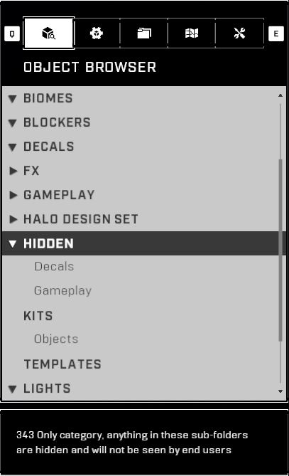

# Object Browser

<figure><figcaption></figcaption></figure>

The Object Browser tab is the first tab at the top of the Forge Menu and it displays a list of objects to spawn in Halo Infinite Forge.

## Interface

The Object Browser tab consists of object categories and subcategories, within which are spawnable objects. The categories can be opened and closed, and their state will persist until the Forge session is closed. A short description of the selected item is shown under the main interface. In addition to object categories, there are also categories for recently used objects, and Modes and Prefabs that you are a [Collaborator](../../../../ugc/metadata-and-file-management/working-with-files/file-collaborators.md) on or have bookmarked.

<figure><figcaption>
Object Browser tab with all categories collapsed
</figcaption></figure> <figure><figcaption>
Object Browser tab with two categories open
</figcaption></figure> <figure><figcaption>
Accents > Forerunner category open in the Object Browser tab
</figcaption></figure>

## Controls

Controls related to navigating the Object Browser tab. Options for both Keyboard and Mouse, and Controller are provided:



* <mark style="color:yellow;">Open the Object Browser tab</mark>:  + 
  * Alternative:  →  / 
  * Alternative: \[Hold]  → Object Browser  /  /  / 
* <mark style="color:yellow;">Close the Object Browser tab</mark>: 
  * Alternative: 
  * Alternative: 
* <mark style="color:yellow;">Navigation</mark>: , , , 
  * Alternative: , , , 
  * Alternative: , , 
* <mark style="color:yellow;">Quick Scroll Up</mark>: 
  * Alternative: 
* <mark style="color:yellow;">Quick Scroll Down</mark>: 
  * Alternative: 
* <mark style="color:yellow;">Select Item / Expand/Collapse Category</mark>: 
  * Alternative: 
  * Alternative: 
  * Alternative: 
* <mark style="color:yellow;">Expand/Collapse All Categories</mark>: 
* <mark style="color:yellow;">Go Back</mark>: 
  * Alternative: \[Hover] Subcategory Name at the top → 



* <mark style="color:yellow;">Open the Object Browser tab</mark>:  →  / 
  * Alternative: \[Hold]  → Object Browser 
* <mark style="color:yellow;">Close the Object Browser tab</mark>: 
* <mark style="color:yellow;">Navigation</mark>: 
  * Alternative: 
* <mark style="color:yellow;">Quick Scroll Up</mark>: 
* <mark style="color:yellow;">Quick Scroll Down</mark>: 
* <mark style="color:yellow;">Select Item / Expand/Collapse Category</mark>: 
* <mark style="color:yellow;">Expand/Collapse All Categories</mark>: 
* <mark style="color:yellow;">Go Back</mark>: 



## Categories ↓

The sections below detail the different categories within the Object Browser tab, and their contents in detail. The [Forge Object List](./#forge-object-list) section acts as a searchable full object list for Halo Infinite Forge.

### Recents

A list of the most recently placed objects. This list persists between Forge sessions, and only resets when the game is closed.

### Modes

A list of Forge Modes that you are a collaborator on, or have bookmarked. The modes (consisting of only Mode Brains) can be placed on the map straight from the menu.

When a Forge session is loaded, each player requests all of their owned and bookmarked modes to be loaded so the game can display these in the Modes category. This happens for both modes and prefabs. For players who have a lot of these, it can cause upwards of 1000 network requests just from loading the same modes and prefabs every time a new Forge session is loaded.

<figure><figcaption>
Prefabs and modes start loading right after the map loads
</figcaption></figure> <figure><figcaption>
Over 100 asset requests in
</figcaption></figure> <figure><figcaption>
Around 1130 asset requests by joining a Forge session
</figcaption></figure>

> Tool: [InfiniteMITM](https://github.com/Alexis-Bize/InfiniteMITM)

This results in not being able to easily select modes or prefabs from the corresponding categories when the requests are being made as the list of items is constantly changing, which resets the position of the scroll bar to the top of the category. Only after all of the requests have been fulfilled, will the scroll bar stop resetting.

### Prefabs

A list of Object Prefabs that you are a collaborator on, or have bookmarked. The prefabs can be placed on the map straight from the menu. When a Forge session is loaded, each player requests all of their owned and bookmarked prefabs to be loaded so the game can display these in the Prefabs category.

<figure><figcaption>
Forge map load started at request #1244
</figcaption></figure> <figure><figcaption>
After 1123 requests, all the assets are loaded
</figcaption></figure>

### Forge Object List

Full object list of all spawnable objects in Halo Infinite Forge:

<table data-view="cards"><thead><tr><th></th><th data-hidden data-card-cover data-type="files"></th><th data-hidden data-card-target data-type="content-ref"></th></tr></thead><tbody><tr><td>Forge Object List</td><td><a href="../../../../.gitbook/assets/cover-forge-object-list.jpg">cover-forge-object-list.jpg</a></td><td><a href="forge-object-list.md">forge-object-list.md</a></td></tr></tbody></table>

## Hidden Categories

There are hidden categories in the Object Browser which hold assets that have not been validated for Forge yet, but may have been used by 343 on their internal builds while making Forge maps. It also holds depreciated objects, that have been replaced by a new variant. Most of these are objects that have had their origin point changed.

A showcase of the hidden objects of Season 5 can be seen in this YouTube video:



> Map: [Hidden Forge Objects Season 5](https://www.halowaypoint.com/halo-infinite/ugc/maps/47dce9d6-f7bd-4570-9e75-e4a9c0fcab5d)

> Map: [Hidden Forge Objects](https://www.halowaypoint.com/halo-infinite/ugc/maps/f358f1e5-c944-43d1-81e4-139e4caf1e88) (alternative)

The hidden categories are named "Hidden", "Kits" and "Templates":

<figure><figcaption>
Hidden categories in the Object Browser
</figcaption></figure>

**Learn more about:**

<table data-view="cards"><thead><tr><th></th><th data-hidden data-card-cover data-type="files"></th><th data-hidden data-card-target data-type="content-ref"></th></tr></thead><tbody><tr><td>Hidden Forge Objects</td><td><a href="../../../../.gitbook/assets/cover-hidden-forge-objects.jpg">cover-hidden-forge-objects.jpg</a></td><td><a href="../../../../guides-and-knowledge/forge-know-how/forge-misc/hidden-forge-objects.md">hidden-forge-objects.md</a></td></tr></tbody></table>

***

#### <mark style="color:green;">Contributors</mark>

Okom\
Surasia
