# Object Properties

<figure>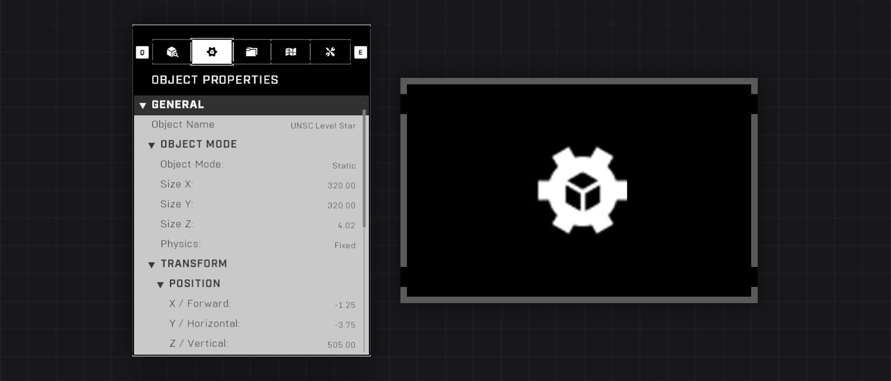<figcaption></figcaption></figure>

The Object Properties tab is the second tab at the top of the Forge Menu and it displays properties for the selected object(s).

## Interface

The Object Properties tab consists of categories and subcategories, within which are object options and settings. The categories can be opened and closed, and their state will persist until the Forge session is closed. A short description of the selected item is shown under the main interface. The common adjustable object properties include Object Mode, Transform, Visuals, and Gameplay.

<figure>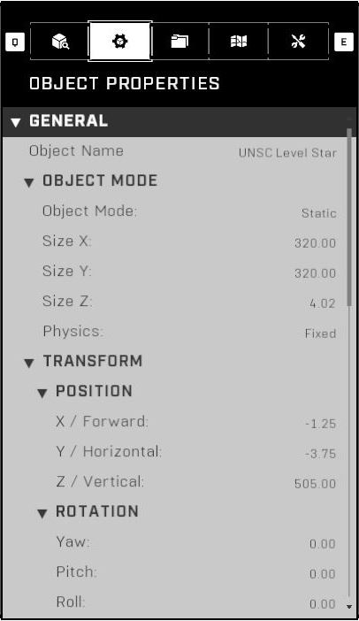<figcaption>
Object Properties tab with a selected object
</figcaption></figure> <figure>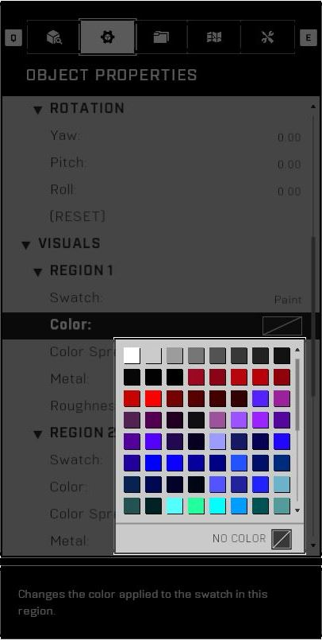<figcaption>
Color selection of a region on an object
</figcaption></figure> <figure>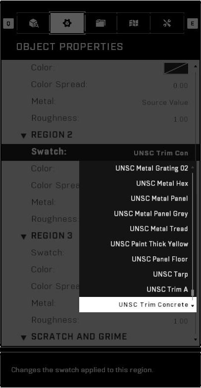<figcaption>
Swatch selection of a region on an object
</figcaption></figure>

<figure>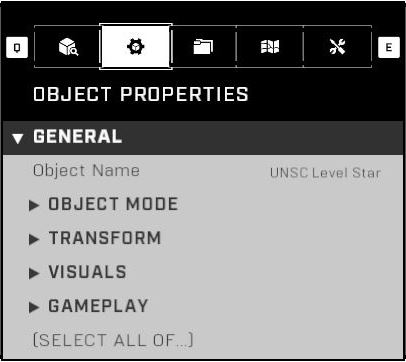<figcaption>
Object Properties tab with all categories collapsed
</figcaption></figure> <figure>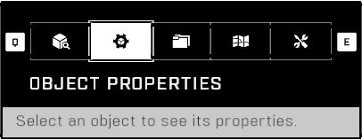<figcaption>
Object Properties tab with no selected object
</figcaption></figure>

## Controls

Controls related to navigating the Object Properties tab. Options for both Keyboard and Mouse, and Controller are provided:



* <mark style="color:yellow;">Open the Object Properties tab</mark>:  + 
  * Alternative:  →  / 
  * Alternative: \[Hold]  → Object Properties  /  /  / 
* <mark style="color:yellow;">Close the Object Properties tab</mark>: 
  * Alternative: 
  * Alternative: 
* <mark style="color:yellow;">Navigation</mark>: , , , 
  * Alternative: , , , 
  * Alternative: , , 
* <mark style="color:yellow;">Quick Scroll Up</mark>: 
  * Alternative: 
* <mark style="color:yellow;">Quick Scroll Down</mark>: 
  * Alternative: 
* <mark style="color:yellow;">Select Item / Expand/Collapse Category</mark>: 
  * Alternative: 
  * Alternative: 
  * Alternative: 
* <mark style="color:yellow;">Expand/Collapse All Categories</mark>: 



* <mark style="color:yellow;">Open the Object Properties tab</mark>:  →  / 
  * Alternative: \[Hold]  → Object Properties 
* <mark style="color:yellow;">Close the Object Properties tab</mark>: 
* <mark style="color:yellow;">Navigation</mark>: 
  * Alternative: 
* <mark style="color:yellow;">Quick Scroll Up</mark>: 
* <mark style="color:yellow;">Quick Scroll Down</mark>: 
* <mark style="color:yellow;">Select Item / Expand/Collapse Category</mark>: 
* <mark style="color:yellow;">Expand/Collapse All Categories</mark>: 



## Main Categories ↓

The sections below detail the different categories within the Object Properties tab. Includes the most common categories and properties; some listed properties may be missing from your selected object(s). Object-specific properties are not explained in this general article.

## General

#### Object Name

Sets the name of the selected object. The name is displayed in [Folders](folders/), Object Properties, [Object Reference](../../../scripting/nodes/variables-basic/object-reference.md) nodes and the [Object Information](./#object-information) panel. An object name up to 40 characters can be entered.

<figure>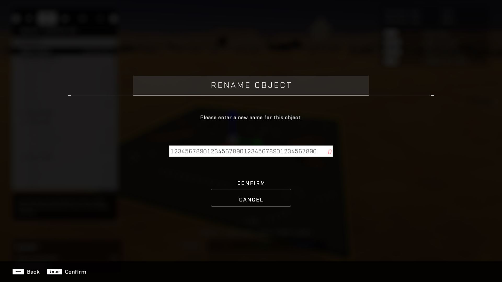<figcaption>
40-character limit on the Object Name
</figcaption></figure>

The number at the end of objects is a part of the object name. If an object with a duplicate name is created, an incrementing number will be appended to the end of the object name. If an object's name is already 40 characters long, a number won't be appended.

Some strings of characters or words are flagged as invalid, and won't be allowed in the Object Name. A list of the discovered ones has been compiled in: [Invalid Flagged Strings](../../../guides-and-knowledge/ugc-know-how/ugc-misc/invalid-flagged-strings.md).

<figure>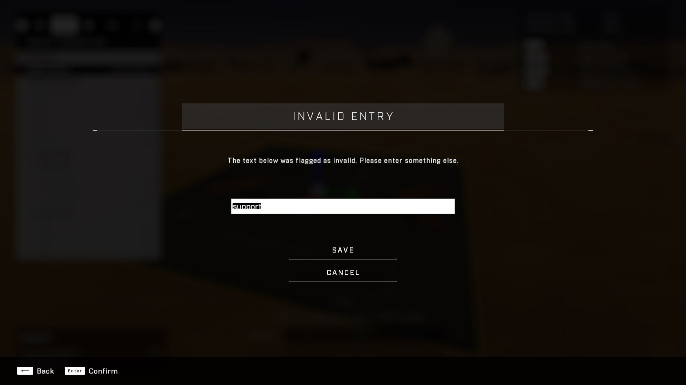<figcaption>
The word "support" being classified as invalid, and can't be in the Object Name
</figcaption></figure>

## Object Mode

#### Object Mode

Toggles between Static and Dynamic object mode. Static object can be scaled, but are not movable in-game or scriptable. Dynamic objects are scriptable and movable in-game. Static objects consume [Static Geo](#user-content-fn-1)[^1] budget. Dynamic object take up more [Game Simulation](#user-content-fn-1)[^1] budget than static objects, but consume no Static Geo budget.

Input options:

Dynamic

Static

#### Variant

Changes the size or visual variant of a dynamic object. All objects under the [Primitives](object-browser/forge-object-list.md#primitives) category have this option, when the Object Mode is set to Dynamic.

#### Size

Scale the selected object along the X (forward), Y (horizontal) or Z (vertical) axes. Note, that multiple objects can't be scaled at the same time.

Internally objects have a "Scale Limit Type", which determines what scaling constraints the object follows. The two known types are **Unset** and **Scale Multiplier**. Unset is used on most objects and it's scaling limits are as follows:

Input range (Unset): `0.50` - `4000.00`

Scale Multiplier means that the object's minimum and maximum scale limits are determined by preset values on each axis that the object's default scale is multiplied by. Objects that have this Scale Limit Type can bypass the 0.50 and 4000.00 limits, depending on the multiplier calculation.

Input range (Scale Multiplier): `Default scale * {min multiplier}` - `Default scale * {max multiplier}`

<figure>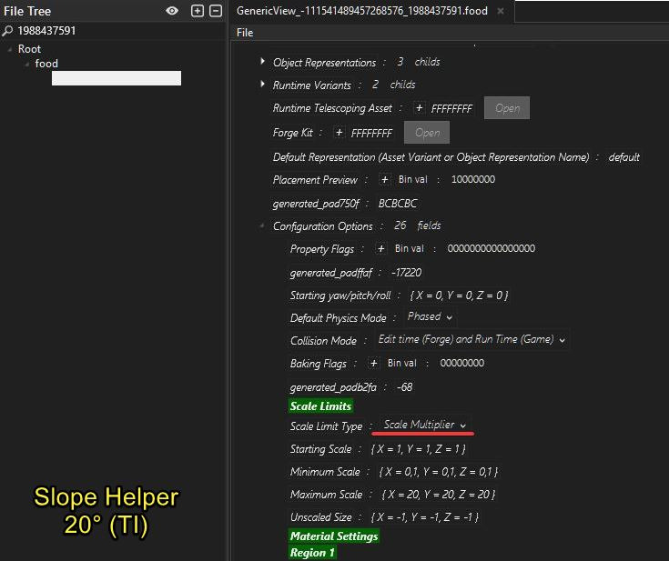<figcaption>
Slope Helper 20° (TI) scaling multipliers
</figcaption></figure> <figure>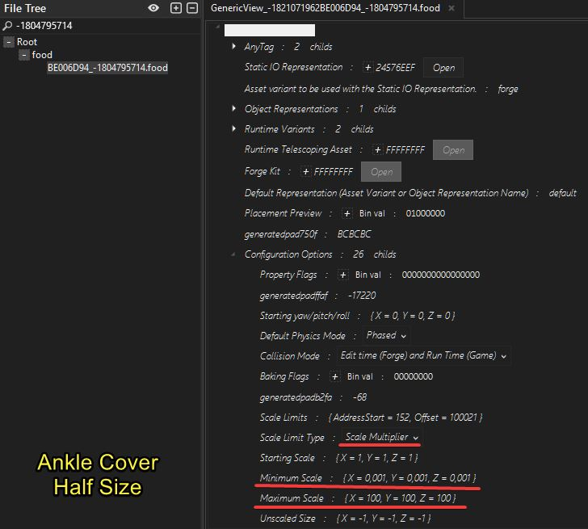<figcaption>
Ankle Cover Half Size scaling multipliers
</figcaption></figure> <figure>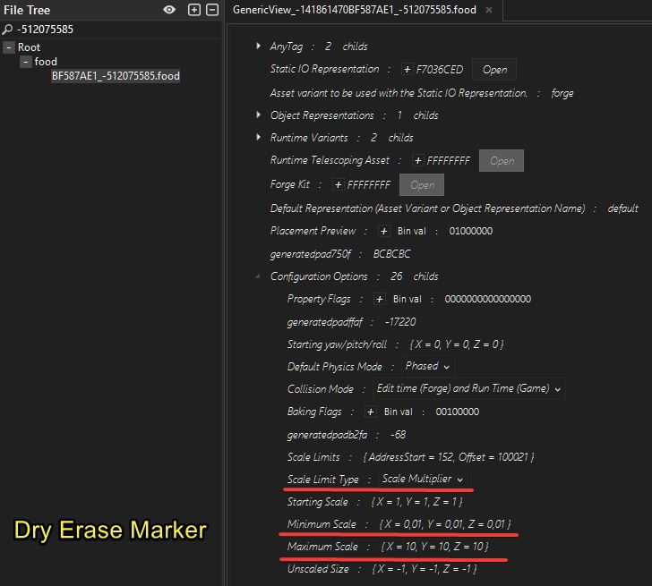<figcaption>
Dry Erase Marker scaling multipliers
</figcaption></figure>

<figure>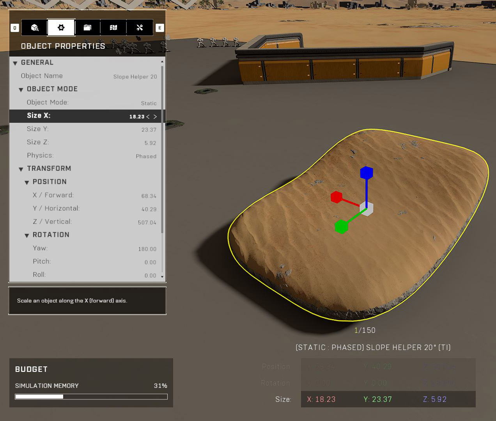<figcaption>
Minimum scale of the Slope Helper 20° (TI). (0.1 x default)
</figcaption></figure> <figure>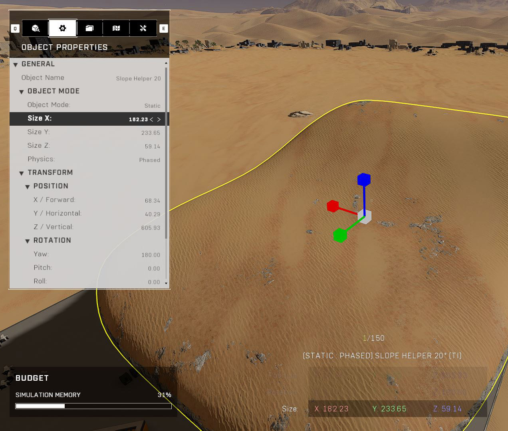<figcaption>
Default scale of the Slope Helper 20° (TI)
</figcaption></figure> <figure>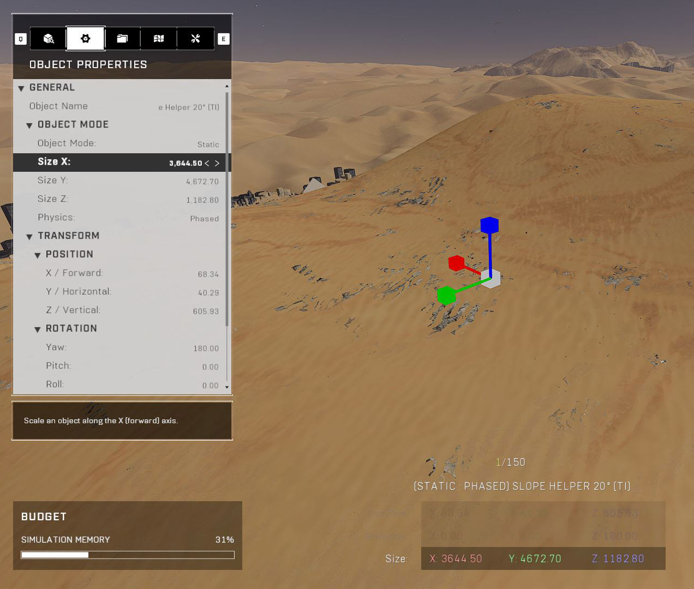<figcaption>
Maximum scale of the Slope Helper 20° (TI). (20 x default)
</figcaption></figure>

> Tool: [HIRT](https://github.com/urium1186/HIRT)


The object size values may not match the calculations correctly. This is because currently the visual object size and the object size values are affected by a major bug. Read more about the [Incorrect Object Visual Model Scaling Bug](../../../guides-and-knowledge/forge-know-how/forge-bugs/incorrect-object-visual-model-scaling-bug.md).


The most used object that has a Scale Limit Type of Scale Multiplier is the Halo Design Set > Cover > Ankle Cover Half Size, having scaling multipliers of minimum `0.001` and maximum `100`. Forgers use this object to make flat, rectangular pieces that can scale lower than 0.50. As the default scale of the object is `X: 1.00`, `Y: 8.00`, `Z: 1.50`, the X axis can scale down to 0.001 units.

<figure>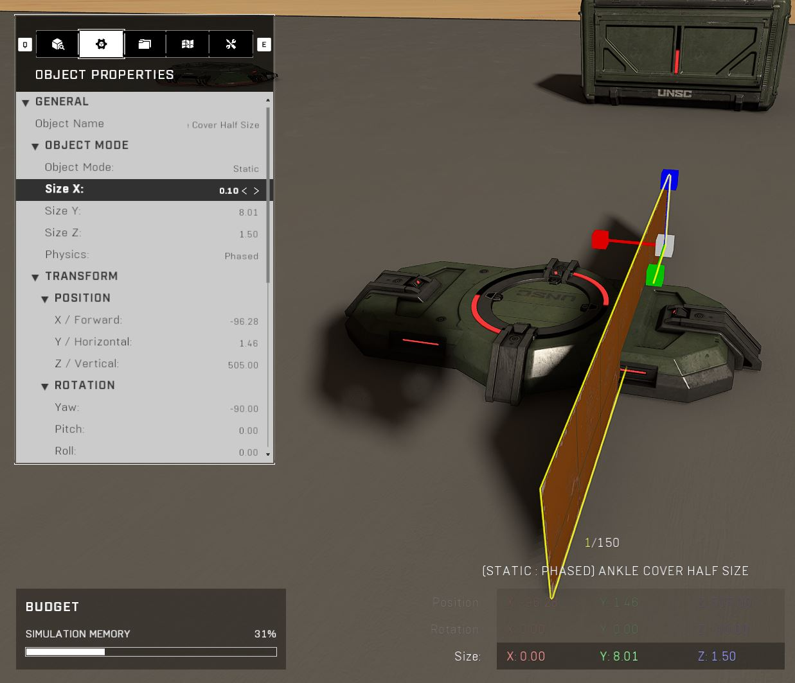<figcaption>
Ankle Cover Half Size scaled to X: 0.001. Note: that the UI can't show this.
</figcaption></figure>

Note, that even if the object can be scaled below 0.10, the Object Browser size value input interface doesn't take values lower than 0.10, nor will it show values lower than that. To get an object lower than 0.10, the Scaling Snap of `<none>` has to be selected and the object has to be manually scaled using the [Scale Gizmo](#user-content-fn-2)[^2].


Object scaling limits can also be bypassed with an exploit. Read more about: [Bypassing Object Scaling Limits](../../../guides-and-knowledge/forge-know-how/forge-exploits/bypassing-object-scaling-limits.md).


Some objects can only be scaled on select axes. In these cases, the Scale Gizmo will be gray on the axes that cannot be scaled and the Size properties in the Object Properties tab may be hidden for those axes. Objects such as [_Biomes > Water_](object-browser/forge-object-list.md#water) _> Water Plane_, and [_Structures > Slopes_](object-browser/forge-object-list.md#slopes) _> Banished Stairs M_ fall into this category.

Some objects will scale on two or more axes when only one is scaled. Objects such as [_Structures > Slopes_](object-browser/forge-object-list.md#slopes) _> Banished Ramp_ & _Banished Wedge_ fall into this category.

#### Physics

Sets the physics type of the object. Fixed objects collide with other objects, Phased objects can pass through other objects, No Collision objects only collide with projectiles, and Normal objects collide with other objects and respond to physics.

Input options:

Fixed

No Collision

Normal

Phased

Read more about the quirks of [Fixed vs Phased Physics](../../../guides-and-knowledge/forge-know-how/forge-tips-and-tricks/fixed-vs-phased-physics.md).

Some objects restrict their Physics selection such as everything under [_Gameplay > Vehicles_](object-browser/forge-object-list.md#vehicles-1), but this can be bypassed with an exploit: [Applying Inaccessible Object Properties](../../../guides-and-knowledge/forge-know-how/forge-exploits/applying-inaccessible-object-properties.md) as long as the object has an Object Mode of Dynamic.

## Transform

### Position

#### Positional Values

Change the object's X (forward), Y (horizontal) and Z: (vertical) position.

### Rotation

#### Rotational Values

Change the object's Roll (X), Pitch (Y) and Yaw (Z) rotation.

### Quickly Duplicating Positional Values Between Objects

By first selecting the object you want to copy the positional data from, and then selecting all other objects to apply them to, opening the Object Properties will show the positional data of the first object, but entering the same data again will now apply those values to all objects in the selection.

Read more about [Applying Identical Positional Data Between Objects](../../../guides-and-knowledge/forge-know-how/forge-tips-and-tricks/applying-identical-positional-data-between-objects.md).

## Visuals

### Region

Regions are sections of an object that can have different swatches, colors and other visual properties assigned to them. The amount of editable regions ranges from one to three per object.

#### Swatch

Changes the swatch applied to the selected region. A swatch is like a texture or material.

#### Color

Changes the color applied to the swatch in the selected region.

#### Color Intensity

Changes the saturation of the region's color. This option only shows up if the region's color is not "No Color".

Input range: `0.00` - `1.00`

#### Color Spread

Adjusts color spread of the region color's base hue. Adjusting this can be almost like a secondary hidden color within the main color, as it brings out some hard-to-see details from the swatch.

Input range: `0.00` - `180.00`

#### Metal

Changes the specular highlights of the swatch in the selected region to be more metallic or not metallic at all.

Input options:

Force Off

Force On

Source Value

#### Roughness

Determines how rough the swatch in this region will appear. From looking beat-up to glossy and wet.

Input range: `0.00` - `1.00`

### Scratch And Grime&#x20;

#### Scratch Amount

Determines how scratched the object will appear. The scratches are white on all objects and are most prominent on the outside edges of the object.

Input range: `0.00` - `1.00`

#### Grime

Changes the grime type of the selected objects. Grime is often used to add some extra grit to an object's texture to make it look worn and more realistic.

#### Grime Amount

Determines how much grime will be applied to the object.

Input range: `0.00` - `1.00`

## Gameplay

#### Team

Changes the object's Team affiliation. Most useful on [Team Blockers](#user-content-fn-3)[^3] that allow players from only the assigned team to pass through the blocker. Otherwise used on gameplay-related objects such as CTF Flag Stands.

### Labels

Used to include or exclude an object in a mode, to assign a gamemode-specific object identifier label or used to filter objects that can be easily referenced in scripting when calling specifically labeled objects.

"Include" means that the object will _only_ be included in that gamemode. "Exclude" means that the object will be excluded from specifically that gamemode. The labels can be combined such as "BTB Include" & "Slayer Exclude" to make the object appear only in BTB modes, excluding BTB:Slayer.


Include is synonymous for "only" in the case of labels


### Boundary

Modify properties to adjust the size/shape of the object's boundary which can be e.g. the size of a hill or can be used to detect events via scripting.

### Spawning

Spawn order, despawn and respawn settings. Mostly used on mounted turrets to determine their spawning properties, as they cannot be spawned from [Weapon Spawners](../../gameplay/sandbox/weapons/weapon-spawning/).

## Advanced Properties

Object-specific properties related mostly to the core functionality of the object.

## AI Zone

#### AI Move Zone

The AI Move Zone object that the AI Spawner's AI units will be assigned to. Linking a zone will allow the spawner's AI units to move and fight outside the vicinity of the spawner.

To clear an assigned AI Move Zone link, select the selected AI Spawner from the list of options when assigning a new move zone.

## Object-Specific Categories ↓

The sections below detail different object-specific categories that are not found on most objects. These sections are explained on a general level.

## Launcher

Options for [Launcher objects](object-browser/forge-object-list.md#launchers-lifts) to change the trajectory taken by an object that enters the launcher.

## Light

Options to modify a light object's properties.

## Light Probe Marker Settings

Options to change the size and probe spacing of the Light Probe Marker object.

## Location

#### Name

Change the name of the location displayed to players within the Named Location Volume's boundary.

## Reflection Volume Settings

Options to change the behavior of the Reflection Volume object.

## Spawn Point

Modifiers to change how spawning on the selected spawn point should be affected.

## Spawn Volume

Options to change the behavior of the Spawn Volume object.

## Vehicle

Properties for placed vehicles.

#### Camera Distance

Changes how closely the camera will follow the vehicle. Mounted turrets are also classified as vehicles.

Input range: `0.10` - `5.00`

The value "nan" can be applied to this option to make the camera distance go to 0.00, but a side-effect is that the weapon projectiles on the vehicle stop working. Read more about: [Using "nan" as the Value Instead of a Number](../../../guides-and-knowledge/forge-know-how/forge-exploits/using-nan-as-the-value-instead-of-a-number.md).

## Weapon

Properties for placed weapons.

#### Spare Clips

The amount of additional/Spare Clips the weapon has. This option can be used to add more clips to a weapon than it can normally hold as the maximum amount of ammo.

Input range: `1` - `16`

#### Spare Energy

The amount of energy the weapon has. This is commonly used to limit the amout of shots that the Scorpion Tail has; with a value of 0.02, it has 4 total shots.

Input range: `0.00` - `1.00`

***

#### <mark style="color:green;">Contributors</mark>

Okom

[^1]: Add link when ready

[^2]: Add link when done

[^3]: Link when done
