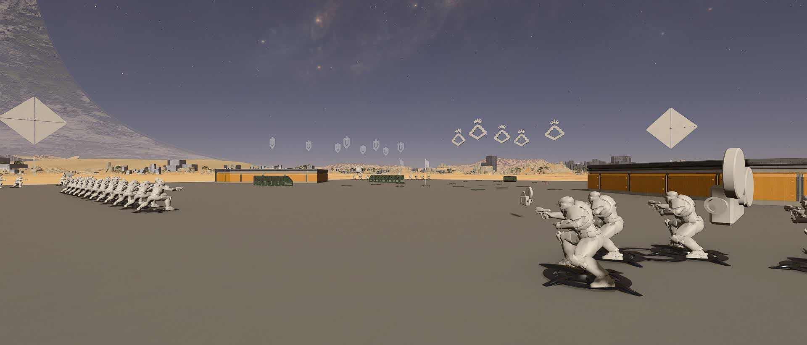
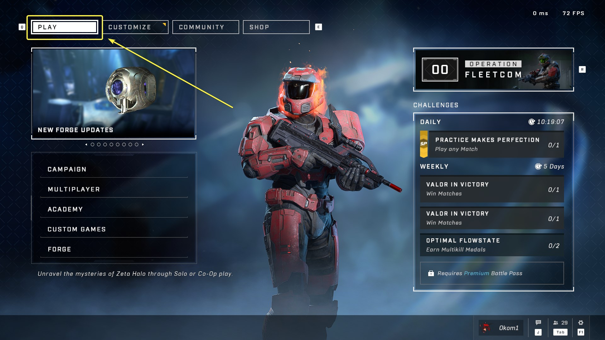
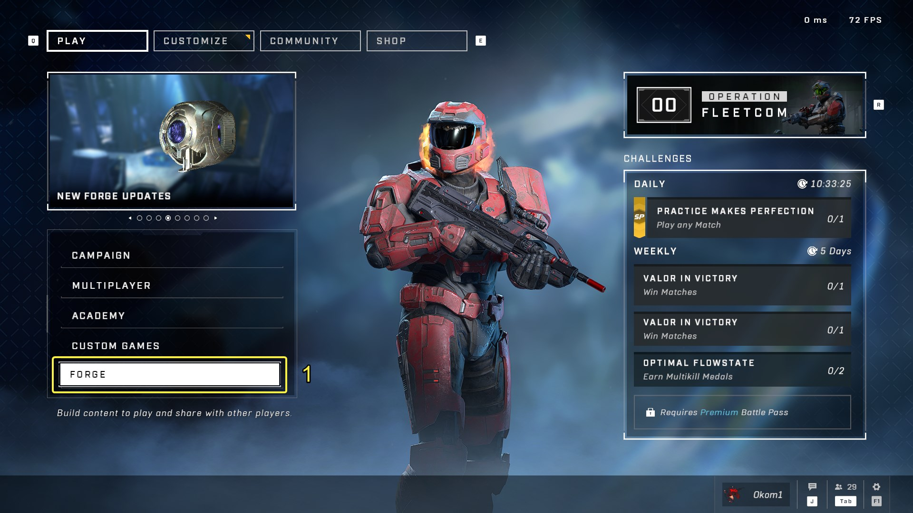
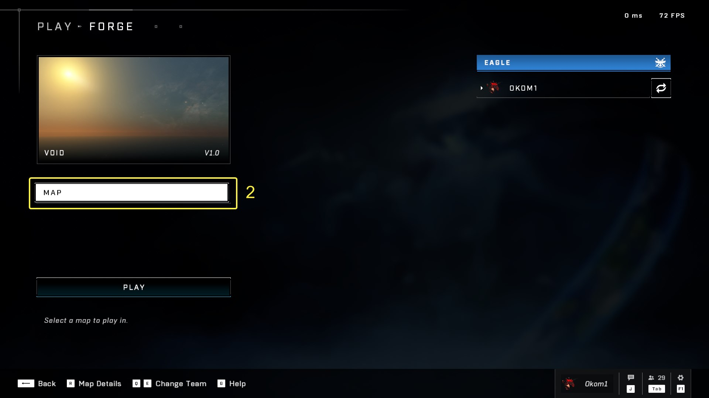
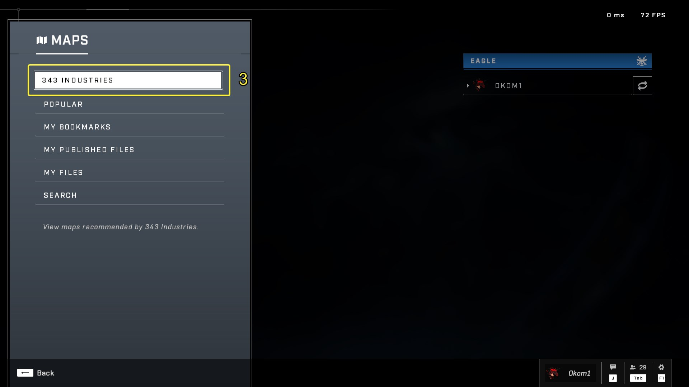
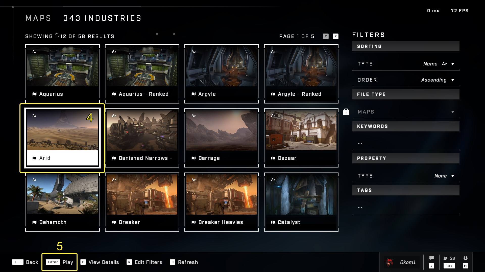
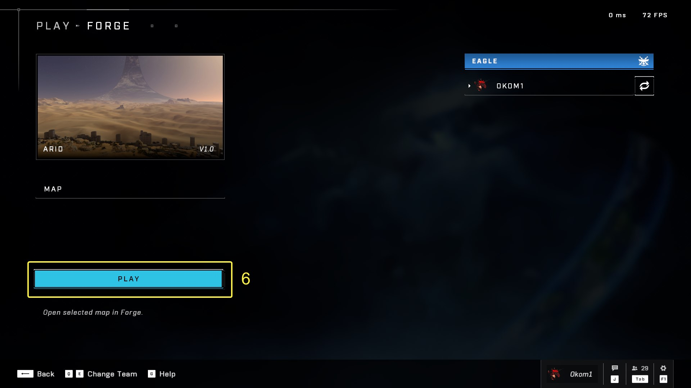
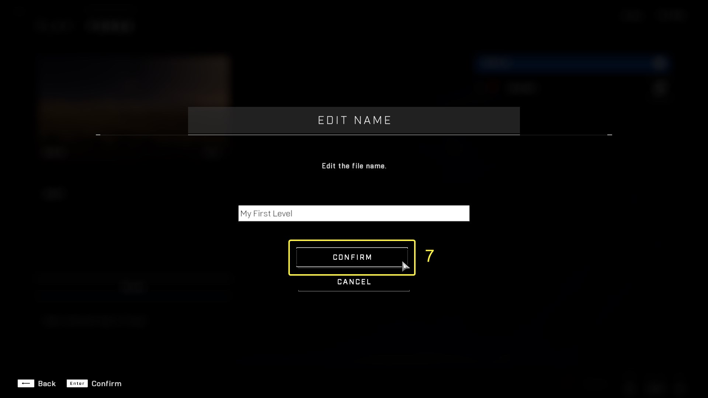
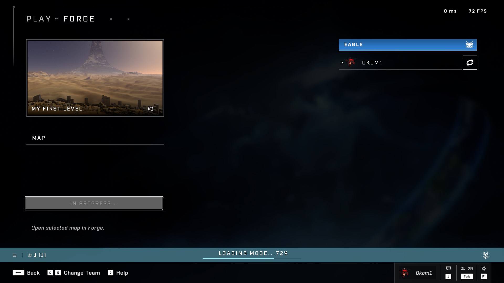
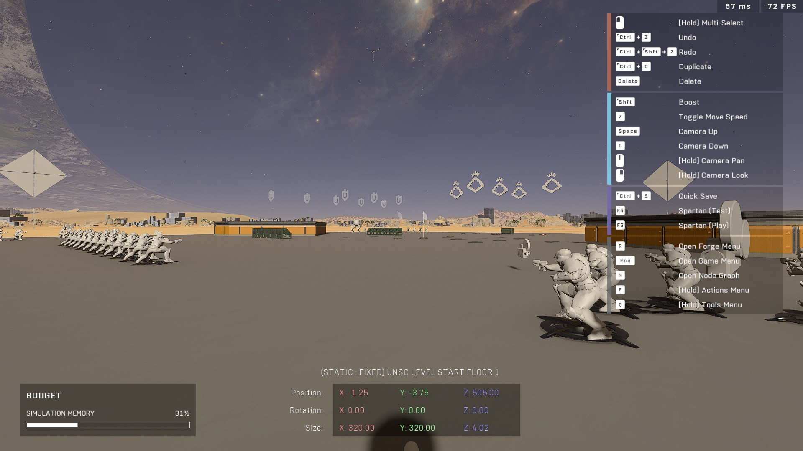

# Loading Into Forge

The first step of using Forge is actually loading into the editor on your selected map. This guide will show how that is done in Halo Infinite.

<figure><figcaption></figcaption></figure>

## Step-By-Step Process

Loading into Forge in Halo Infinite is simple. Once you're loaded into Forge, you can do all the Forge-related tasks within that session without having to load into separate modes for setting up different gamemodes for instance like in Halo Reach. Follow these steps to load into Forge on a map.

### Navigating to the Main Menu

Navigate to the lowest level of the Main Menu in Halo Infinite, and make sure the "Play" tab is selected on the top left.

<figure><figcaption></figcaption></figure>

### Selecting Forge

Select the "Forge" section in the menu on the left.

<figure><figcaption></figcaption></figure>

### Selecting the Map

Select the map that you want to load into in Forge from the "Map" tab. The default selected map is "Void", which is a blank canvas.

<figure><figcaption></figcaption></figure>

#### Map Categories

Select the map category to find your map in, in this case "343 Industries", as we will use one of the default [Forge Canvases](forge-canvases.md) to start our first level. Read more about the different map categories at [Maps Interface](../../../ugc/metadata-and-file-management/content-interface-and-controls/maps-interface.md).

<figure><figcaption></figcaption></figure>

#### Maps Interface

Select the desired map. On Keyboard & Mouse you can either `Left Click` on it, or navigate to it with arrow keys or WASD and select it with `Enter`.

<figure><figcaption></figcaption></figure>

### Loading the Map

Press "Play" to begin the process of loading the map in Forge.

<figure><figcaption></figcaption></figure>



**Naming the New Map**

A screen will show prompting you to edit the name of the map. This is because you are creating a copy of the original map for your account instead of opening and editing the original file as you are not a [Collaborator](../../../ugc/metadata-and-file-management/working-with-files/file-collaborators.md) on it. This is done because Infinite's Forge is online-based and all files are stored on the cloud instead of locally.

Afterwards, loading a map from the "My Files" map category will not prompt you to make a copy of the map as you are already one of the collaborators on the original map.

Name the map and select "Confirm".

<figure><figcaption></figcaption></figure>



Continue to the next step.



After a three-second countdown, the mode (Forge) and the map will be loaded. The time it takes to load the map depends on the size of the map file and it's [Baked-In Map Data](baked-in-map-data.md), so a faster internet speed means loading the map and mode faster.

<figure><figcaption></figcaption></figure>

Once complete, you will be loaded into the Forge mode on your map.

<figure><figcaption></figcaption></figure>


You may notice a message in the bottom left killfeed stating "Navigation data download x% complete". It relates to downloading the [Built Nav Mesh Data](../../nav-mesh/nav-mesh-generation/building-nav-mesh/), but the reason for why it's shown is not clear as it didn't use to happen. The message should not be worried about.


## Next Steps


[forge-interface](../forge-interface/)



[coordinate-system-and-spaces.md](../coordinate-system-and-spaces.md)



[working-with-objects.md](../working-with-objects.md)



[editor-modes.md](../editor-modes.md)



[saving-assets.md](../saving-assets.md)


***

#### <mark style="color:green;">Contributors</mark>

Okom
