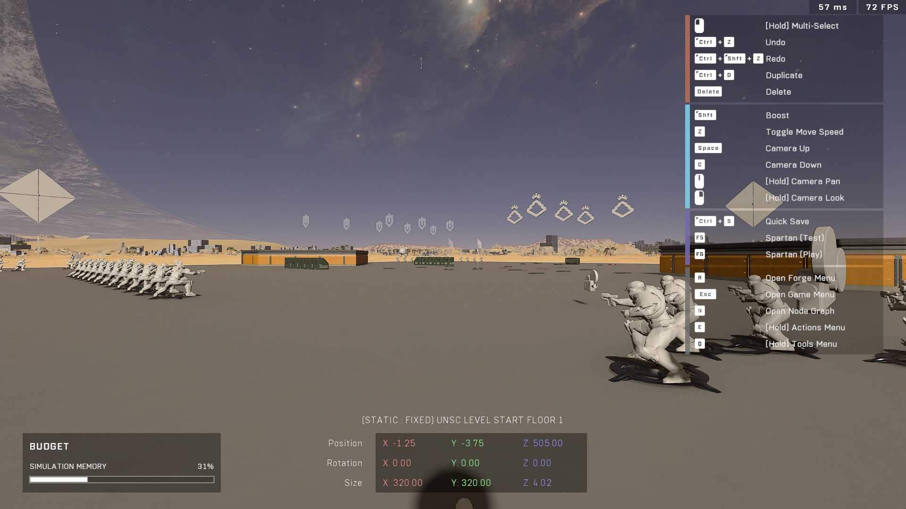

description: Information regarding map data files, such as Nav Mesh and lighting, that are downloaded when loading Halo Infinite maps.

# Baked-In Map Data


This article is a stub. You can help TSG Forge Wiki by expanding it.



[submitting-content-to-the-wiki.md](../../../community/contributing-to-tsg-forge-wiki/submitting-content-to-the-wiki.md)


<figure><figcaption></figcaption></figure>

Each map in Halo Infinite downloads several data files when it is loaded, which are provided alongside the main `.mvar` file.

### Downloaded Map Data
When inspecting network traffic during a map load, you can observe calls for these shared global assets:

* Nav Mesh: [https://blobs-infiniteugc.svc.halowaypoint.com/ugcstorage/map/ee5e295f-c298-4f2f-a64f-dbf0a1087ad8/d8dab2e7-3f98-4914-8382-faa5b9587b45/navmesh.blob](https://blobs-infiniteugc.svc.halowaypoint.com/ugcstorage/map/ee5e295f-c298-4f2f-a64f-dbf0a1087ad8/d8dab2e7-3f98-4914-8382-faa5b9587b45/navmesh.blob)
* Audio (Occlusion): [https://blobs-infiniteugc.svc.halowaypoint.com/ugcstorage/map/ee5e295f-c298-4f2f-a64f-dbf0a1087ad8/d8dab2e7-3f98-4914-8382-faa5b9587b45/audioocclusion.blob](https://blobs-infiniteugc.svc.halowaypoint.com/ugcstorage/map/ee5e295f-c298-4f2f-a64f-dbf0a1087ad8/d8dab2e7-3f98-4914-8382-faa5b9587b45/audioocclusion.blob)
* Lighting (Light Probes): [https://blobs-infiniteugc.svc.halowaypoint.com/ugcstorage/map/ee5e295f-c298-4f2f-a64f-dbf0a1087ad8/d8dab2e7-3f98-4914-8382-faa5b9587b45/lightprobes.blob](https://blobs-infiniteugc.svc.halowaypoint.com/ugcstorage/map/ee5e295f-c298-4f2f-a64f-dbf0a1087ad8/d8dab2e7-3f98-4914-8382-faa5b9587b45/lightprobes.blob)

## Reflection Data
While maps contain reflection information, this is not "baked-in" data shared globally between players. Instead, reflection data is generated locally for each player when they load into a map.

<figure><figcaption></figcaption></figure>

***

## Source Data

* Discord thread: [Baked-In Map Data](https://discord.com/channels/220766496635224065/1534001681073967227/1534001681073967227)

#### <mark style="color:green;">Contributors</mark>

Okom