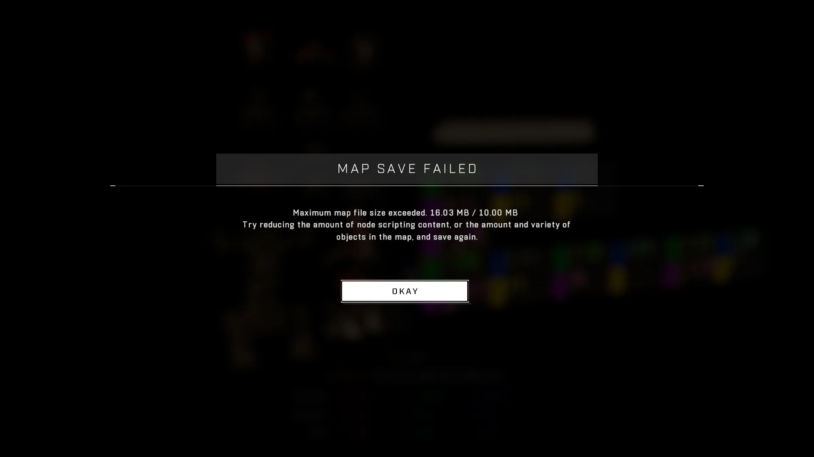

# Saving

<figure><figcaption></figcaption></figure>

Retaining progress through the creation of assets is essential for any creator working within the Forge editor.

## Saving Maps

To save a map, users have two primary options: performing a quicksave or creating a save with a custom note. A quicksave can be performed using **Ctrl+S** or by holding **Y (Hold) → Quicksave**, which adds an entry to the version history labeled "Quicksave." To create a save with a custom description, users must open the start menu, select "Save Map," input a version note (up to 265 characters), and press Confirm.

The Start Menu can be accessed at any time using the **Menu** button on a controller. When working in all editor modes via keyboard, players should use **F1** to open the Start Menu; pressing Esc while in the node graph will close the node graph instead of opening the menu.

### File Size Constraints

Maps have a maximum file size limit of 10.00 MB. If an attempt is made to save a map that exceeds this limit, a "Maximum file size exceeded" error message will appear. This notification displays the current file size and instructs the player to reduce either the object or scripting content on the map.

<figure><figcaption></figcaption></figure>

## Prefabs and Modes

### Saving Prefabs

To save a prefab, the user must select an existing prefab while in Monitor Mode and use **E (Hold)** or **X (Hold) → Save Prefab**. Like maps, prefabs are limited to a maximum file size of 10.00 MB. If the limit is exceeded, the saving process will not complete, though no error message is communicated to the player.

### Saving Modes

The process for saving modes is similar to that of prefabs with one specific requirement: all objects making up the mode must be dynamic and contain a Mode Brain. When these conditions are met, the "Save Prefab" option changes to "**Save Mode Prefab**." 


Modes created in Forge are frequently referred to as "Forge Modes" or even "Mode Prefabs."


Modes also have a maximum file size limit of 10.00 MB; if this is exceeded, the save will fail without an error notification. When saving particularly large modes, the process may take tens of seconds and can trigger server-side lag that results in multiple identical versions being saved (sometimes upwards of 15). In these instances, the latest version after the surge should be utilized.

***

## Source Data

* Discord thread: [Saving Assets](https://discord.com/channels/220766496635224065/1534024671568334978/1534024671568334978)

#### <mark style="color:green;">Contributors</mark>

Okom