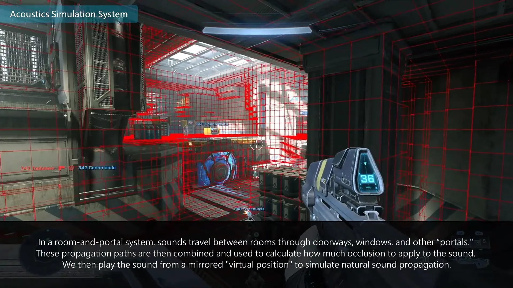

# Building Audio

<figure><figcaption></figcaption></figure>

Building the audio of a Forge map involves creating an approximation of environmental geometry to determine how sound interacts with the surroundings.

## Geometry Approximation and Occlusion

The building process creates an accurate approximation of the Forge map's geometry using voxelization technology. While there appears to be real-time occlusion occurring through approximated audio portals—allowing for roughly accurate muffling even if data is not up to date—it is recommended that a rebuild be performed whenever changes are made to the map's geometry to ensure accuracy.

<figure><figcaption>
A view of a Forge map environment used for generating audio occlusion data.
</figcaption></figure>

### Voxelization Mechanics

The generation of the audio occlusion map takes into account all visible objects on the map at the time of the build. However, if an object's visibility is hidden via the folder structure, it will be ignored by the process.

## Optimization Strategies

To ensure efficient data management, players can optimize the generation process to reduce both total build time and resulting download size. 

* Hide objects that are not involved in gameplay occlusion scenarios, such as distant skybox geometry or inaccessible areas.
* Place these non-essential items into a folder and hide them during the audio building process. This avoids generating unnecessary audio voxelization data in those specific areas.


Building Audio is strictly limited to the generation of audio occlusion voxelization data; it does not enable the usage of Audio Emitters or scripted audio.
{% endhint}



Building Audio is strictly limited to the generation of audio occlusion voxelization data; it does not enable the usage of Audio Emitters or scripted audio.
{% endhint}

***

## Source Data

* Discord thread: [Building Audio](https://discord.com/channels/220766496635224065/1538501688925626470/1538501688925626470)

#### <mark style="color:green;">Contributors</mark>

Okom