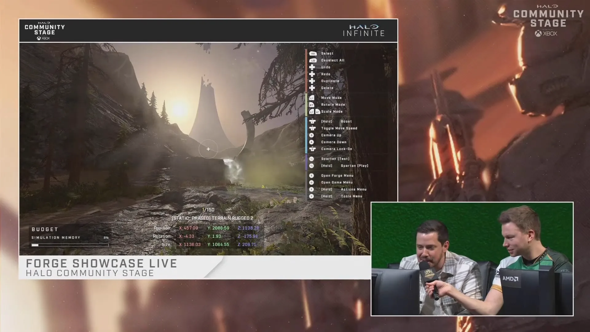

# Level Art

<figure><figcaption></figcaption></figure>

The art phase transforms functional layouts into immersive environments through detailed object placement and stylistic cohesion.

## Timing and Development Workflow

Standard practice for level design involves beginning the arting process only after the layout has been tested and no major structural changes are required. This sequence allows artists to conceptualize a cohesive theme that fits the entirety of the map's geometry. 

While minor adjustments—such as modifying routes or creating holes in walls—may occur during the art phase, these should be done with careful consideration for the visual impact they create.


Layout changes made after the arting process has begun can require significant effort to rectify surrounding visual assets and decorations.


Some creators choose to begin arting during the initial design phase to save time if their layout skills are highly confident; however, this is not the standard approach. Designing art early in a project carries the risk of becoming emotionally attached to complex visual work that may eventually need to be removed or extensively reworked due to necessary layout changes, which makes removing those parts of the map more difficult.

## Arting in Forge

Creating level art within Forge primarily involves "kitbashing," which is the practice of constructing large, complex assets by combining multiple pre-made objects (or kits) rather than building every element from scratch. While artists are limited to the available library of thousands of themed objects, Halo Infinite's Forge is the best in the franchise for kitbashing. Specifically, the ability to scale objects and modify materials has allowed Forge maps to achieve a level of detail that rivals professional development environments.

### Kitbashing and Asset Composition

By utilizing the object palette creatively, artists can manipulate and combine individual parts to build unique environmental features. This technique allows for a high degree of customization even when working within the constraints of pre-existing assets.

#### Palettes and Beauty Corners

To maintain visual consistency, artists often develop "art palettes." These are collections of objects that define the specific style of the map and provide an easy way to duplicate essential elements throughout the level.

In addition to palettes, artists often create small sections of the map known as "beauty corners." These serve several purposes:
* Validating the intended art direction early in development.
* Establishing quality benchmarks for the rest of the level.
* Communicating the final visual vision to other team members working on the map.

<figure><figcaption>
An example of a beauty corner.
</figcaption></figure>

***

## Source Data

* Discord thread: [Level Art](https://discord.com/channels/220766496635224065/1534359617570734080/1534359617570734080)

#### <mark style="color:green;">Contributors</mark>

Okom
