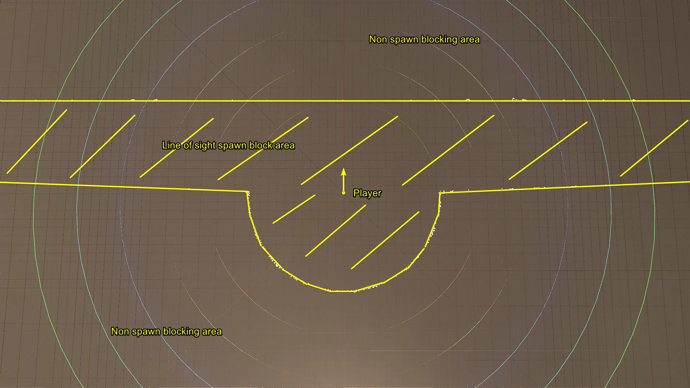
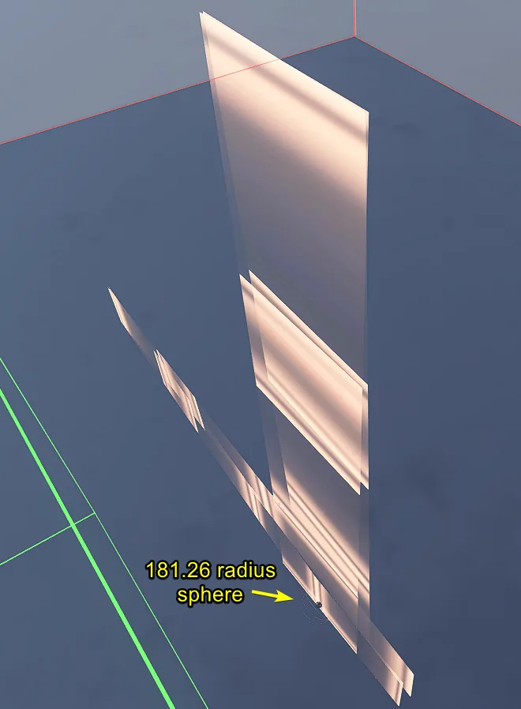
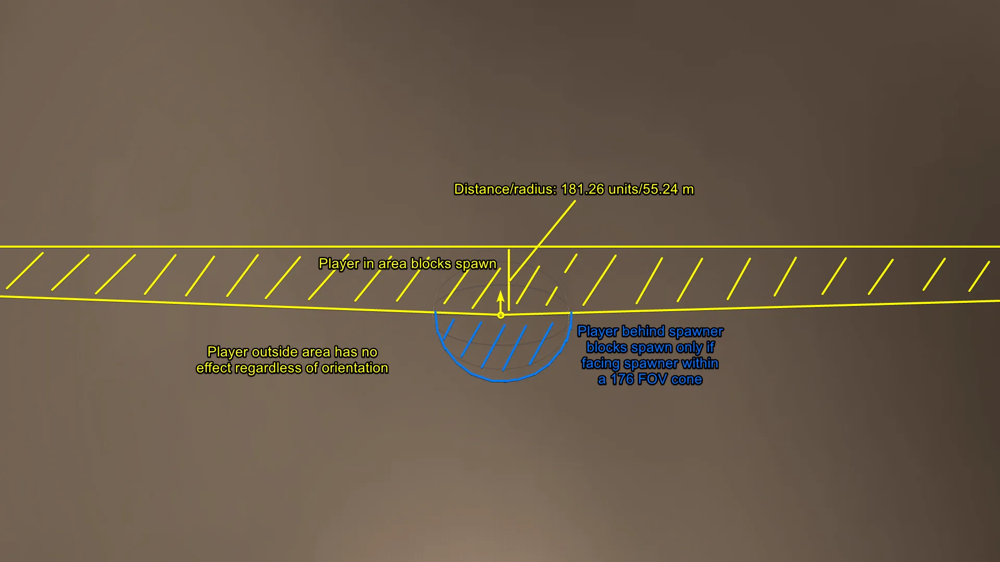
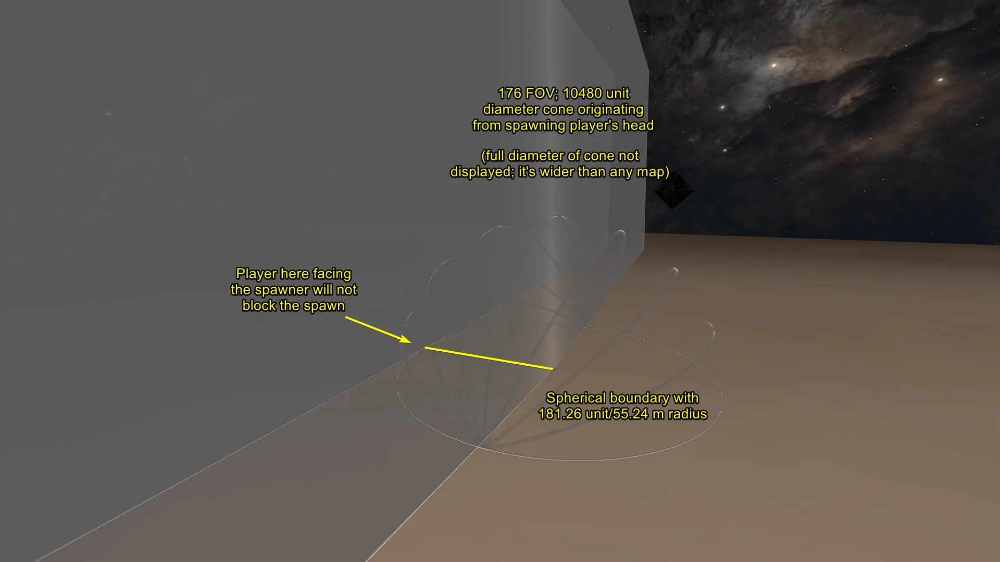

# Test FX

<figure><figcaption></figcaption></figure>

This article examines how the line of sight (LoS) cone functions as a boundary for preventing enemy spawns in Halo Infinite.

## Line of Sight Cone Mechanics

### Dimensions and Field of View

The line of sight spawn blocking logic is primarily driven by an extremely large cone originating from a player's head. This cone has an approximate field of view (FOV) of 176° and a diameter of 10480 units. The length of the cone, extending from the origin point, is approximately 181.26 units (~55 meters).

<figure><figcaption>
A visualization of how spawn blocking boundaries extend across maps.
</figcaption></figure>

#### Obstruction and Perspective Checks

For a player to block an enemy's spawn, they must be within the opponent's line of sight area and properly oriented. A key part of this check is that there must not be any static or dynamic obstruction between the player's head and the spawning player's upper torso. 

Using third-person perspective can potentially manipulate these checks because the visibility test specifically occurs between the target's head and the obstructing player's upper torso.


This video demonstrates a player successfully blocking an enemy spawn from a significant distance by remaining within their line-of-sight cone.


<figure><figcaption>
An image showing the effectiveness of being inside an opponent's line-of-sight cone to prevent spawns.
</figcaption></figure>

## Spawning Interaction Mechanics

The behavior of spawn blocking depends heavily on player orientation. To effectively block a spawn, it is most effective to face the spawning player directly; this results in the shortest distance within the boundary and maximizes visibility for the obstruction check. Conversely, if an enemy's LoS cone overlaps with a target area but the observer is facing away from the spawner, the spawn may not be blocked.


Players can influence spawning by tilting their view vertically. 


By aiming significantly upward or downward, a player positions their large diameter LoS cone above or below them. This covers the altitude at that specific level across much of the map area within a distance of 181.26 units from the player's position. Any spawns with an unobstructed line of sight to the player within this vertical cone will be blocked.

<figure><figcaption>
A visualization highlighting measurement values used for testing lines of sight around a spawn point.
</figcaption></figure>

<figure><figcaption>
Measurements illustrating the radius and diameter used in checking player lines of sight.
</figcaption></figure>


This video shows how vertical aiming can be used to increase coverage across map altitude within the LoS cone's range.


***

## Source Data

* Discord thread: [Player Line of Sight Cone Research](https://discord.com/channels/220766496635224065/1529131373602799626/1529131373602799626)

#### <mark style="color:green;">Contributors</mark>

Okom