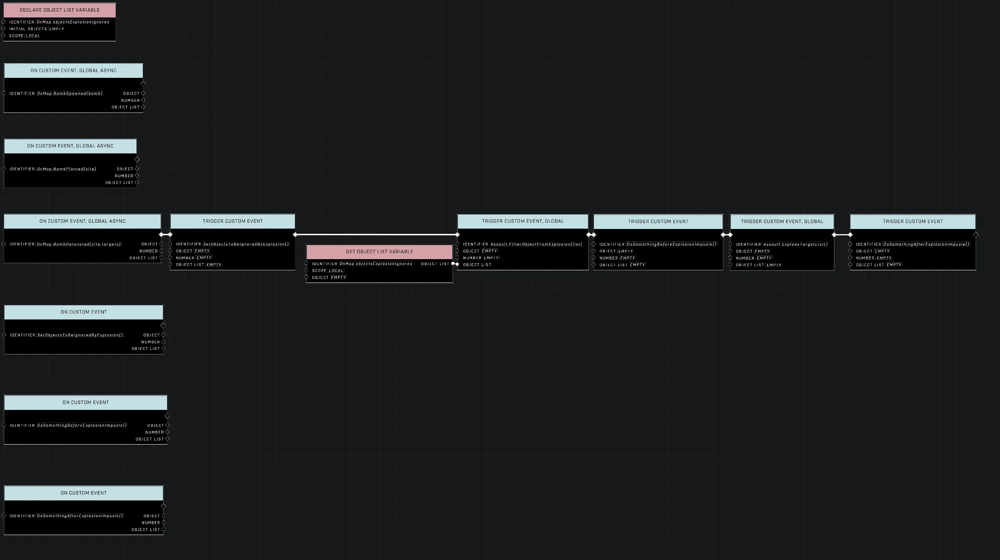
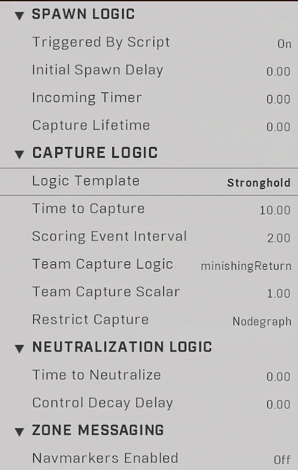
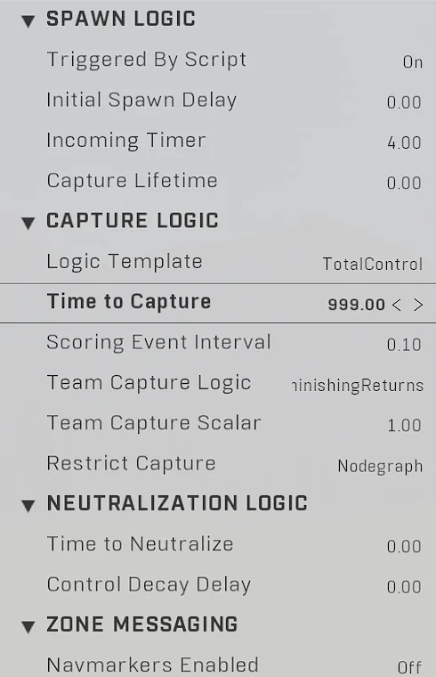
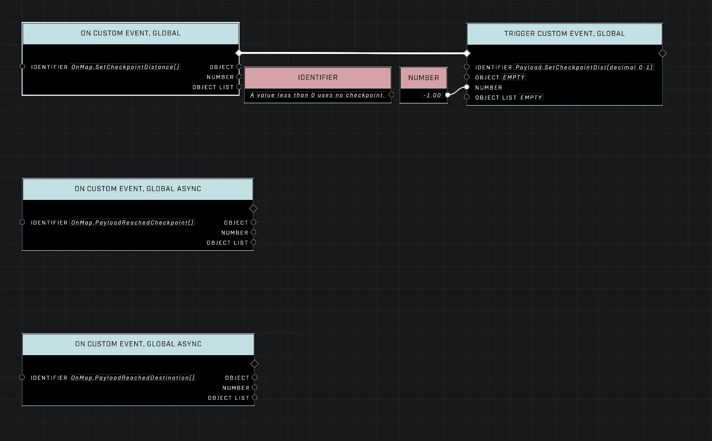
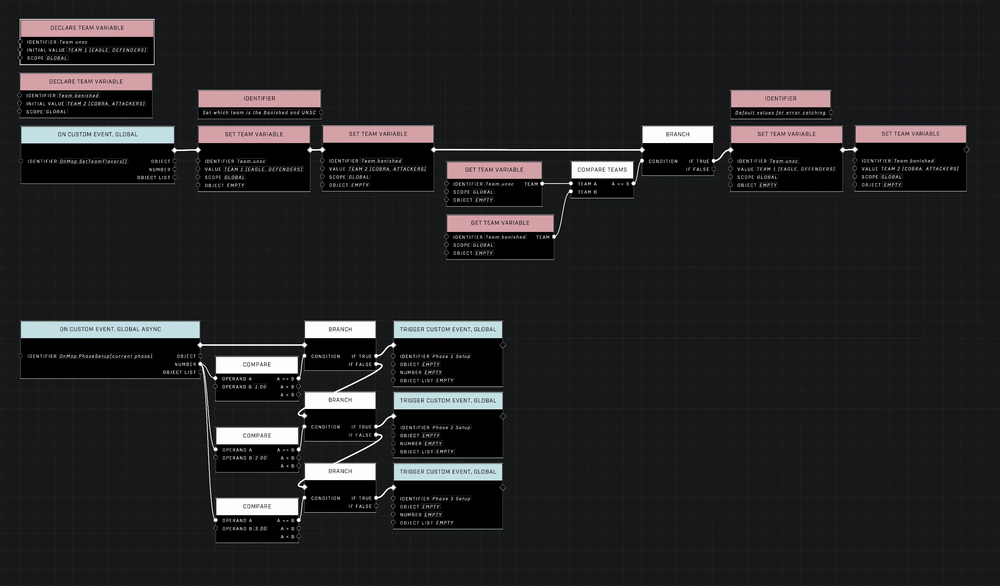
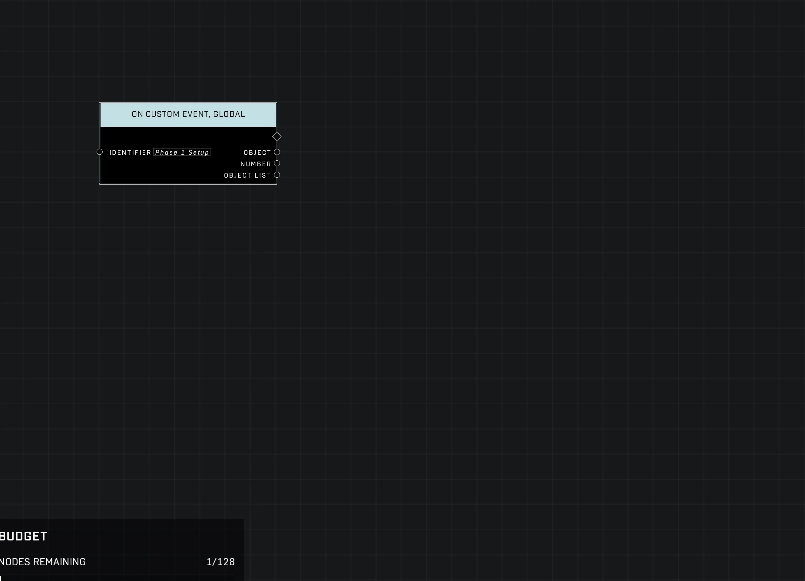
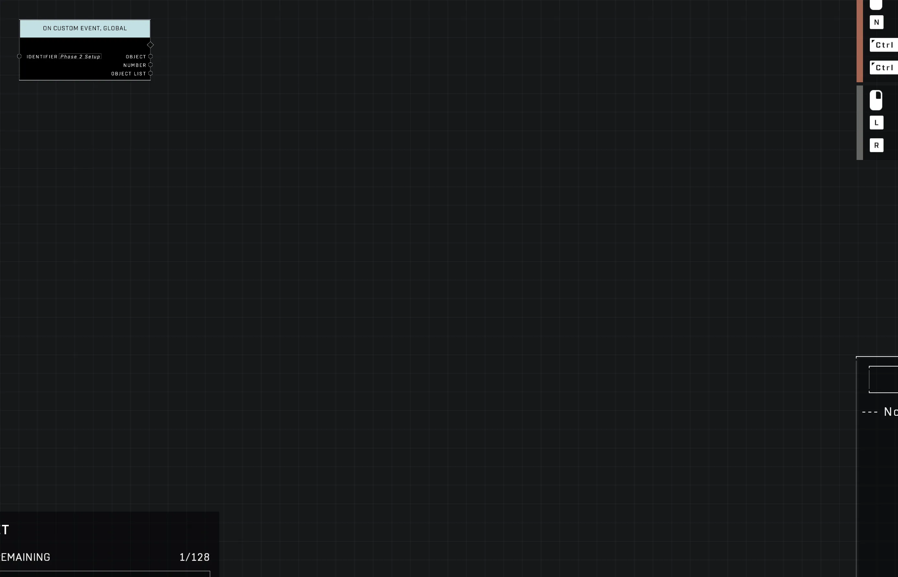
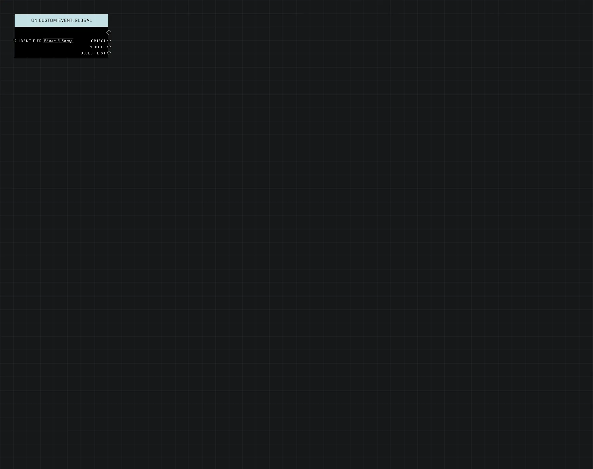

# Invasion

<figure><figcaption></figcaption></figure>

Invasion is an asymmetrical, 8v8 objective mode featuring two rounds, each divided into three distinct phases. Drawing inspiration from *Halo: Reach*, the mode includes various objectives such as Capture the Zone, Assault, Core Delivery, and Deliver the Payload.

## Match Structure and Spawning

Invasion matches progress through three distinct phases, with each completed phase earning the team a point. A team can earn up to three points per round.

### Phase Details

The requirements and available resources change as the match progresses through its phases:

| Feature | Phase 1 | Phase 2 | Phase 3 |
| --- | --- | --- | --- |
| Spawn Orders | 11, 12, 13 | 21, 22, 23 | 31, 32, 33 |
| Objective Order | 1 | 2 | 3 |
| Loadouts Per [Team](../../scripting/nodes/variables-basic/team.md) | 2 | 3 | 5 |
| Vehicle Tiers | Tier 1 | Tier 1, Tier 2 | Tier 1, Tier 2, Tier 3, Tier 4 |
| Power Weapons | None | Yes | Yes |

### Loadouts

The mode pits UNSC against Banished-affected Spartans. Players select from various loadouts that change depending on the current phase.

#### UNSC Loadouts

* **Phase 1**
 * Scout: MA5K Avenger, Frag Grenades, Threat Seeker
 * Sentry: MK50 Sidekick, Frag Grenades, Drop Wall
* **Phase 2**
 * Warrior: MA40 Assault Rifle, MK50 Sidekick, Frag Grenades, Drop Wall
 * Operator: CQS48 Bulldog, Frag Grenades, Quantum Translocator
 * Skirmisher: VK78 Commando, MA5K Avenger, Frag Grenades, Thruster
* **Phase 3**
 * Headhunter: BR75, VK78 Commando, Frag Grenades, Shroud Screen
 * Healer: CQS48 Bulldog, MK50 Sidekick, Frag Grenades, Repair Field
 * Marksman: Bandit Evo, MA40 Assault Rifle, Frag Grenades, Grappleshot
 * Sentinel: VK78 Commando, MA5K Avenger, Frag Grenades, Thruster
 * Heavy: MLRS-2 Hydra, MA40 Assault Rifle, Frag Grenades, Overshield

#### Banished Loadouts

* **Phase 1**
 * Sentry: Mangler, Spike Grenades, Thruster
 * Scout: Needler, Plasma Grenades, Active Camo
* **Phase 2**
 * Marksman: Vestige Carbine, Plasma Pistol, Spike Grenades, Repulsor
 * Hunter: Heatwave, Spike Grenades, Drop Wall
 * Sapper: Ravager, Needler, Plasma Grenades, Thruster
* **Phase 3**
 * Headhunter: Bandit Evo, Pulse Carbine, Spike Grenade, Grappleshot
 * Warrior: CQS48 Bulldog, Mangler, Spike Grenade, Threat Sensor
 * Sentinel: Sentinel Beam, Vestige Carbine, Spike Grenade, Repulsor
 * Medic: Pulse Carbine, MA40 Assault Rifle, Spike Grenade, Repair Field
 * Dark Assassin: Duelist Energy Sword, Disruptor, Plasma Grenades, Active Camo

### Buddy Spawning

A unique mechanic in Invasion is Buddy Spawning, which allows players to spawn directly on a randomly assigned teammate. This assignment is reciprocal and remains the same for the full match. If a buddy leaves the match, the ability to Buddy Spawn is lost.


Buddy Spawning is subject to several conditions: the buddy must be alive (for at least five seconds), possess full health and shields, be clear of active engagements, and have an empty seat if they are in a vehicle.


When spawning on a buddy, the player will face the same direction as that teammate. Alternatively, players can choose to spawn at the Left, Middle, or Right spawn zones.

## Configuration and Setup

Map creators must configure specific gameplay objects and labels to ensure the Invasion modules function correctly.

### Gameplay Module Labels

Each module requires specific labels to identify its items and objectives.

#### Assault Module
* **All Assault Items:** Bravo
* **Generic Bomb:** Assault Bomb
* **Generic Zone Sites:** Assault Site
* **Site Plate:** Assault Plate
* **Bomb Spawn:** Assault Bomb Spawn

<figure><figcaption>
The On Map Events Brain for the Assault module manages custom event triggers.
</figcaption></figure>

<figure><figcaption>
This second brain node setup provides additional logic for the Assault module.
</figcaption></figure>

#### Zone Capture Module
* **All Zone Capture Items:** Alpha
* **Generic Hills:** King of the Hill Zone

<figure><figcaption>
This setup shows the object properties for the Zone Capture module.
</figcaption></figure>

#### Payload Module
* **All Payload Mode Items:** Delta
* **Payload Zone:** Strongholds Zone
* **Payload Crate:** Yankee
* **Payload Cart:** Xray
* **Payload Totem:** Tango

<figure><figcaption>
This node setup manages the parameters for the Payload module.
</figcaption></figure>

#### Core Delivery Module
* **All Core Delivery Items:** Charlie
* **Generic Flag:** Flag Stand Spawner
* **Capture Plate:** Flag Delivery Plate

### Vehicle Configuration

Vehicles should be placed using a vehicle object rather than a classic or vehicle spawner. They do not require Invasion-specific labels and do not use waypoints. To set up vehicles, assign the appropriate Spawn Order (1, 2, or 3) for the intended phase and set the Respawn property to "Off."

Vehicle tiers and their respective respawn timers are as follows:

* **Tier 1 (5s respawn):** Mongoose, Razorback
* **Tier 2 (10s respawn):** Brute Chopper, Ghost, Gungoose, Rockethog, Warthog
* **Tier 3 (30s respawn):** Banshee, Boss Chopper, Wasp, Falcon
* **Tier 4 (90s respawn):** Scorpion, Wraith

### Scavenging and Equipment

Weapons are available throughout all phases and can be found on pads, lockers, drop pods, and chests. Weapon spawns are "Red Racked," meaning a single weapon will not respawn until the previously spawned weapon has been despawned. The respawn time for these weapons is 10 seconds. Normal weapon spawns in lockers and trunks do not use waypoints.

Grenades and equipment are tied to player loadouts rather than map spawns. However, these items can be collected from players who have dropped them upon death.

### On Map Events

The Invasion mode automatically fires "On Map Events," which map creators can use to trigger custom functions or map-specific logic.

<figure><figcaption>
The first brain node setup is used to manage custom map events.
</figcaption></figure>

<figure><figcaption>
The second brain node setup provides additional event handling.
</figcaption></figure>

<figure><figcaption>
The third brain node setup manages map-specific triggers.
</figcaption></figure>

<figure><figcaption>
The fourth brain node setup enables unique map functions.
</figcaption></figure>

### Custom Player-Defined Phases

Players can create custom phases using specific events built into the Invasion logic. There are three custom modules available: Echo (Custom Module 1), Foxtrot (Custom Module 2), and Golf (Custom Module 3).

The mode determines the next phase by searching for objects with labels assigned to that phase's spawn order. If an object list contains more than zero objects, that list is collected to set the module ID, and the module's start event is called. Each module in Invasion is structured similarly; a custom module begins with a top function in a script brain and ends when the creator calls a specific function in their custom script's win condition.

To activate a module once it is triggered, creators use an `on map event`. To signal that the custom phase is over, the creator must call the `Custom.AdvanceToNextPhase()` event. Upon this call, Invasion increases the attacker score and begins the process for the next phase.

***

## Source Data

* Discord thread: [Invasion Setup](https://discord.com/channels/220766496635224065/1501455397322756197/1501455397322756197)

#### <mark style="color:green;">Contributors</mark>

Max Extra\
Okom