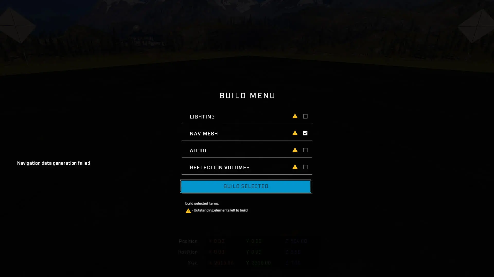
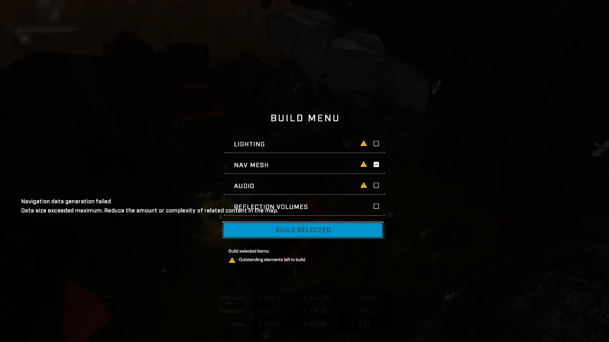
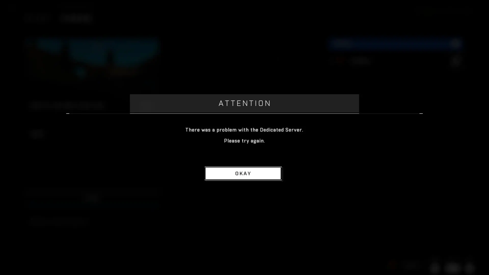
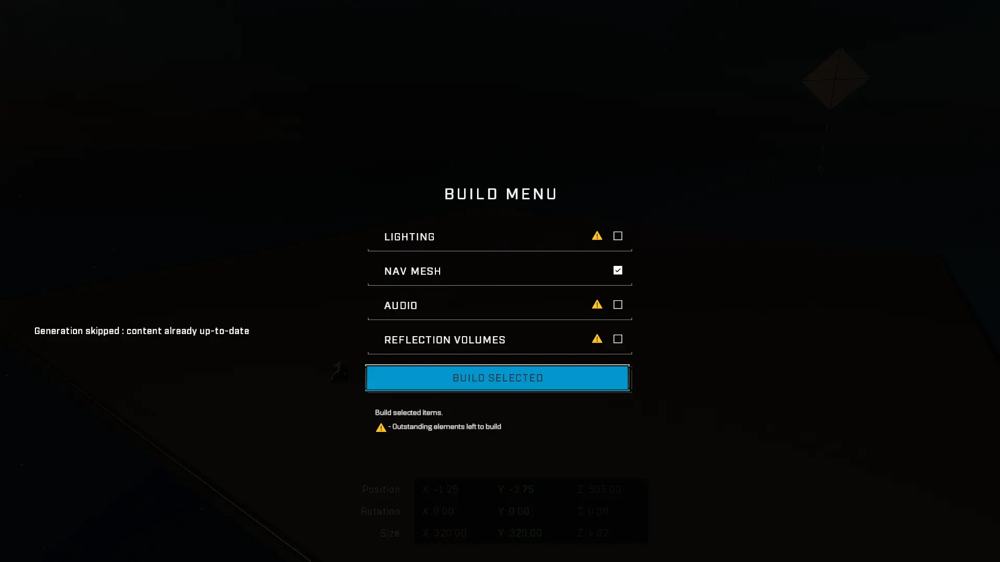

# Fixing Nav Mesh Build Issues

| Error                                                                                                                                  | Error meaning                                                                                                  |
| -------------------------------------------------------------------------------------------------------------------------------------- | -------------------------------------------------------------------------------------------------------------- |
| Navigation data generation failed                                                                                                      | There is no place on the level where Nav Mesh can generate                                                     |
| 
Navigation data generation failed Data size exceeded maximum. Reduce the amount or complexity of related content in the map.
 | The size of the Nav Mesh data file exceeds the maximum file size                                               |
| 
There was a problem with the Dedicated Server. Please try again.
                                                             | Your active Forge session got an automatic server time-out after 10-20 minutes of attempting to build Nav Mesh |
| Generation skipped : content already up-to-date                                                                                        | The engine deems the Nav Mesh data to be unchanged and won't run a new generation                              |
| Game crash                                                                                                                             | Most likely same issue as the Dedicated Server error                                                           |

## Error solutions

### "Navigation data generation failed"

* Make sure at least one [Nav Mesh generation root point](../nav-mesh-generation-root-points.md) is not blocked by e.g. geometry or a Nav Cutter, and is able to generate nav mesh. Nav Mesh generation root points include Nav Seed Points and all Spawn Point objects, except AI Spawners.
  * This error often occurs when you have no Spawn Points or Nav Seed Points placed on your map and you are blocking all of the [invisible Blackup Spawn Points](../../../spawning/initial-spawning/backup-spawn-points.md#invisible-backup-spawn-points) on the canvas floor with a Nav Cutter.

<figure><figcaption>
The error message for "Navigation data generation failed"
</figcaption></figure>

***

### "Navigation data generation failed Data size exceeded maximum. Reduce the amount or complexity of related content in the map."

* Reduce the complexity of the generated Nav Mesh data.\
  To reduce complexity, either hide objects that are contributing to the Nav Mesh data via the eye icon in the [folder structure](../../../forge-basics-and-ui/forge-interface-and-controls/folders/) or cover said objects within the boundary of a Nav Cutter.
  * Hiding objects or covering them with Nav Cutters will exclude them from the data that the Nav Mesh generation has to parse through.
* After disabling excess object geo, make sure that the Nav Mesh data is not generating on the canvas floor and possibly escaping the playable canvas area. These factors can add a lot of complexity to your Nav Mesh data especially on complex canvases like Mires.
  * The most common reason why Nav Mesh might generate on the canvas floor is due to invisible Blackup Spawn Points acting as Nav Mesh generation root points. To mitigate this, block said root points so they do not cause Nav Mesh to generate from them.
* This error means that you are hitting a hard-coded limit of Nav Mesh data size, instead of a server timeout limit. Reducing the complexity of the generated Nav Mesh data should work here.
  * This can be confirmed by trying to build Nav Mesh on the same map version in [Forge via Custom Game](../../../../guides-and-knowledge/forge-know-how/forge-exploits/forge-via-custom-game-ucn.md), which will result in the same error, instead of no error, as this is not a session timeout issue.

<figure><figcaption>
The error message for "Navigation data generation failed, Data size exceeded maximum. Reduce the amount or complexity of related content in the map."
</figcaption></figure>

***

### "There was a problem with the Dedicated Server. Please try again."

* Reduce the complexity of the generated Nav Mesh data.\
  To reduce complexity, either hide objects that are contributing to the Nav Mesh data via the folder structure or cover said objects within the boundary of a Nav Cutter.
  * Hiding objects or covering them with Nav Cutters will exclude them from the data that the Nav Mesh generation has to parse through.
* After disabling excess object geo, make sure that the Nav Mesh data is not generating on the canvas floor and possibly escaping the playable canvas area. These factors can add a lot of complexity to your Nav Mesh data especially on complex canvases like Mires.
  * The most common reason why Nav Mesh might generate on the canvas floor is due to invisible Blackup Spawn Points acting as Nav Mesh generation root points. To mitigate this, block said root points so they do not cause Nav Mesh to generate from them.
* This error means that you are hitting an arbitrary session timeout threshold, which kicks you out of the Forge session if it detects that nothing has happened for a set amount of time.
  * This can be confirmed by trying to build Nav Mesh on the same map version in Forge via Custom Game, which will show the true result of the Nav Mesh generation as there is no session timeout threshold in custom games Forge.
  * Often times you will see that the Nav Mesh will generate in custom games Forge just fine. Use this method to evaluate whether your map would be able to build Nav Mesh if there were no timeout restrictions in place.
  * The custom games Forge Nav Mesh build method will not make the built Nav Mesh show up on your live Forge file, it is merely a way to debug the issue at hand, but not necessarily a way to solve it.

<figure><figcaption>
The error message for "There was a problem with the Dedicated Server. Please try again."
</figcaption></figure>

***

### "Generation skipped : content already up-to-date"

* Duplicate an object and delete the duplicate to update the Nav Mesh calculation state and try to build Nav Mesh again.
  * Sometimes when you've made adjustments to your map such as only moving some objects, the Nav Mesh calculation state might not get be updated, which requires a forced temporary change to make the game realize that there really has been a change.

<figure><figcaption>
The error message for "Generation skipped : content already up-to-date"
</figcaption></figure>

***

### Game crash

* Refer to the solution for the error: "There was a problem with the Dedicated Server.\
  Please try again.".

#### <mark style="color:green;">Contributors</mark>

Okom
