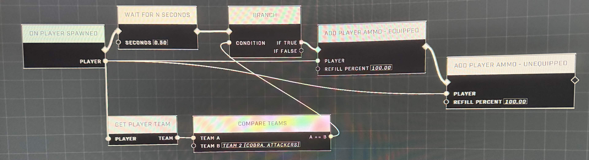
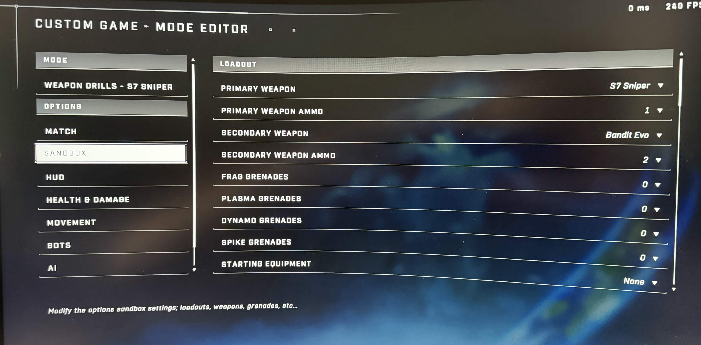
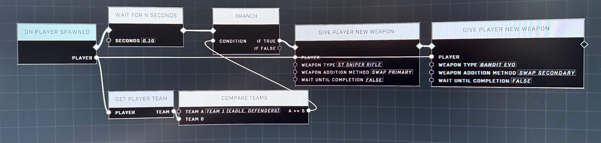

# Nav Seed Points

<figure><figcaption></figcaption></figure>

Controlling exact magazine counts for specific teams can be difficult because standard ammo nodes often only affect reserve ammo. This article details a workaround using weapon swapping to achieve precise ammo control.

## Limitations of Ammo Scripting

The `Add Player Ammo` node is often insufficient for controlling the exact number of rounds in a magazine. While it can refill a player's reserve, it may not adjust the current magazine to a specific number of shots. Additionally, relying solely on Sandbox settings for starting ammo can be inconsistent across different weapon types or scripting environments.

<figure><figcaption>
The initial script attempt failed to adjust magazine sizes, only affecting reserve ammo.
</figcaption></figure>


Because standard ammo nodes and Sandbox settings can be unreliable for controlling magazine counts, a weapon-swapping method is often required for precision.


## The Weapon Swapping Workaround

To achieve precise magazine control for different teams (for example, providing players with full ammo while giving bots limited ammo), a workaround involving weapon swapping is recommended.

### Implementation Steps

* **Configure Sandbox Settings:** Set the default starting ammo in the Sandbox/Lobby settings to the *limited* amount you want the majority of players or bots to have (e.g., 1 shot for a Sniper).
<figure><figcaption>
Custom game settings in the Sandbox can be used to define default starting ammo counts.
</figcaption></figure>
* **Grant Full Ammo to Specific Teams:** For the team that requires full magazines, use a script to [Give Player New Weapon](../../../scripting/nodes/inventory/give-player-new-weapon.md) at gameplay start. This bypasses the limited Sandbox settings by providing a fresh weapon with a full magazine.
* **Reset Limited Ammo for Other Teams:** For the team that should have limited ammo, use a [Wait For N Seconds](../../../scripting/nodes/logic/wait-for-n-seconds.md) node followed by a `Give Player New Weapon` node. By swapping their weapon after a short delay, the script forces them to use the weapon defined by the Sandbox settings, effectively simulating the limited magazine count.

<figure><figcaption>
The script successfully gave the player full ammo but failed to apply the limited magazine counts to the bot team.
</figcaption></figure>


[submitting-content-to-the-wiki.md](../../../community/contributing-to-tsg-forge-wiki/submitting-content-to-the-wiki.md)


***

## Source Data

* Discord thread: [Scripting limited ammo?](https://discord.com/channels/220766496635224065/1485449878598320339/1485449878598320339)

#### <mark style="color:green;">Contributors</mark>

Local Stranger\
Okom