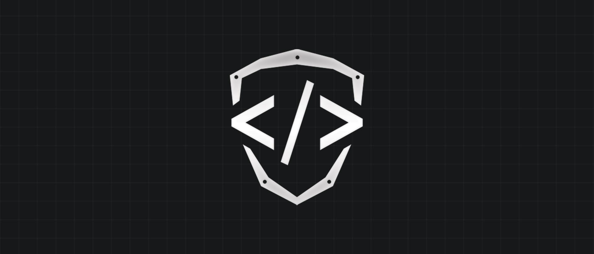
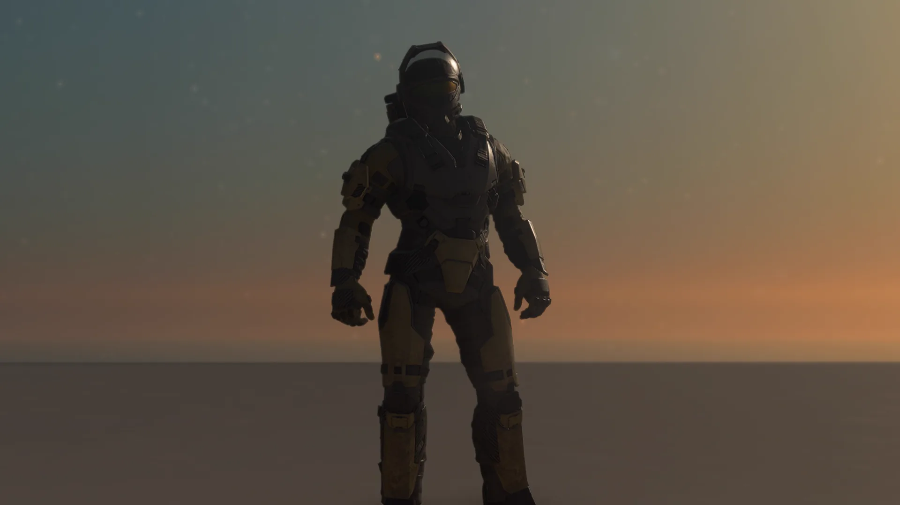
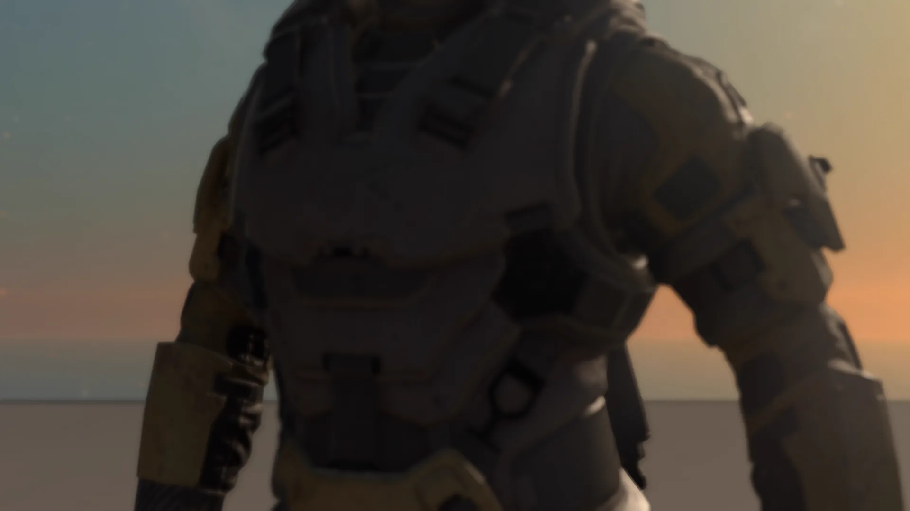

# Initial Spawn Points

<figure><figcaption></figcaption></figure>

Initial Spawn Points are used to place players at the start of a match, most commonly in Free-For-All game modes. In 4v4 team matches where valid Team Intro Spawns have not been configured, players will default to these Initial Spawn Points first, falling back to Respawn Points only if no other spawn options remain.

## Placement and Spacing

Initial Spawn Points should be situated along the outer edges of a map and placed at equal distances from one another. If a spawn point is positioned so that it appears to be floating, players will not hover in mid-air; instead, they will land on the nearest available surface.

### Camera Distance Requirements

To ensure proper presentation during the third-person intro animation sequence, there should be a minimum of 24 units of clear space in front of the Initial Spawn Point. This prevents the camera from being positioned too close to the player and ensures the entire character model is visible. Placing a spawn point directly against a wall can result in an obstructed view where the player cannot see their full model, and it may cause the player to immediately collide with geometry upon spawning.

<figure><figcaption>
The player spawns into a clear area without any walls or obstacles immediately ahead.
</figcaption></figure>

<figure><figcaption>
A wall placed only eight units from the spawn point causes the third-person camera to appear too close to the character model.
</figcaption></figure>

## Configuration and Orientation

### Rotation and Axis Settings

The Initial Spawn Point should be rotated exclusively on the Yaw axis, which dictates the direction the player faces upon spawning.


Players may experience disorientation if rotation is applied to the Pitch or Roll axes, as this causes the camera to appear tilted immediately after spawning.


### Node Properties

For a standard setup, an Initial Spawn Point should utilize the following properties:

* **Team:** Neutral
* **Order:** 2
* **Ignore Danger:** Off
* **Ignore LoS:** Off

Setting the Order value to 2 ensures that these points are not prioritized over Team Intro Spawns, as they possess a higher spawn order.

## Amount

There should be at least 8 Initial Spawn Points for a standard Free-For-All setup, and 12 for a standard Infection and Last Spartan Standing setup.

***

## Source Data

* Discord thread: [Initial Spawn Points](https://discord.com/channels/220766496635224065/1535806666199535757/1535806666199535757)

#### <mark style="color:green;">Contributors</mark>

Okom
