# Team Intro Spawns

A Team Intro Spawn is a [Forge Kit](../../../guides-and-knowledge/forge-know-how/forge-misc/forge-kit-objects.md) object consisting of four Initial Spawn Points and a Camera. This object is used to spawn in four players at the start of a match or round, and it has a built-in camera movement cycle that showcases each player before the initial [Gameplay Start](../../../scripting/nodes/events/on-gameplay-start.md).

Team Intro Spawns can be assigned to different Teams, and the Squad setting should be adjusted if more than four players per team should spawn on separate Team Intro Spawns.

The object names for the Team Intro Spawn are `Team Intro Arrow Front`, `Team Intro Arrow Left` & `Team Intro Arrow Right`.

<figure>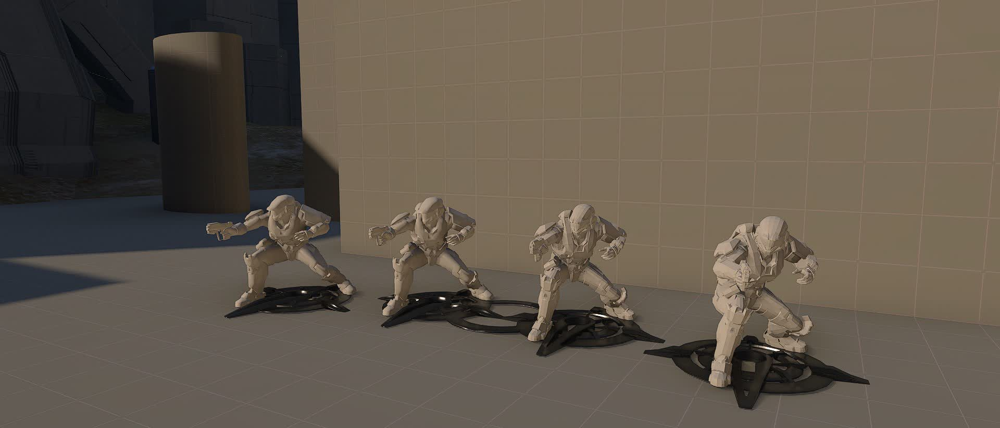<figcaption></figcaption></figure>

## Placing the object

### Object path

* `Gameplay`
  * `Match Flow`
    * Team Intro Arrow Front
    * Team Intro Arrow Left
    * Team Intro Arrow Right

### Placement

The Team Intro Spawn should be placed where a group of four players on a Team should initially spawn on. In most cases these are in or around the main bases. If some of the spawn points on the Team Intro Spawn are floating, the players will be put on the nearest surface, and won't float in the air.

<figure>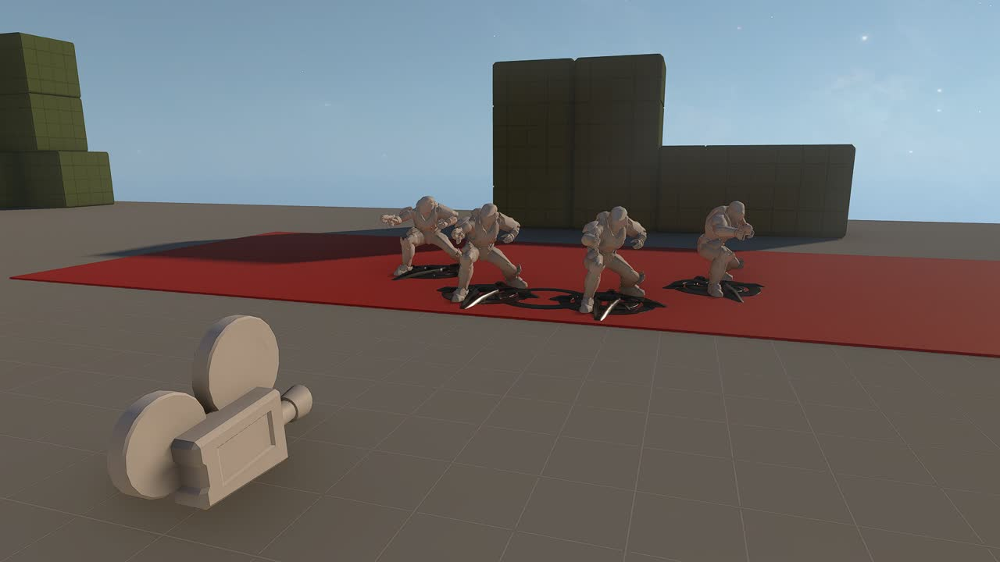<figcaption>
A good placement of a Team Intro Spawn
</figcaption></figure>

### Camera

After the [Map Intro Camera](../../gameplay/cameras/map-intro-cameras/) sequence has ended and all players have successfully spawned in the game, the Camera in the Team Intro Spawn object will go through a static cycle showcasing all four players on it. After the four players have been shown, the Camera will move to the static position shown on the Forge Kit object.

<figure>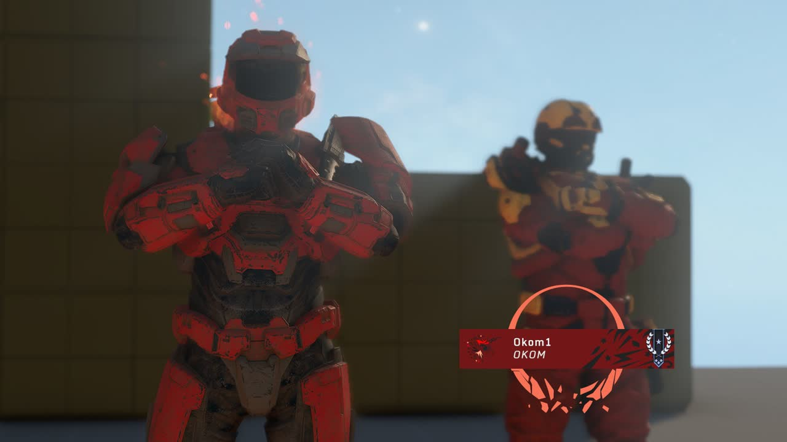<figcaption>
Camera sequence 1
</figcaption></figure>

 

<figure>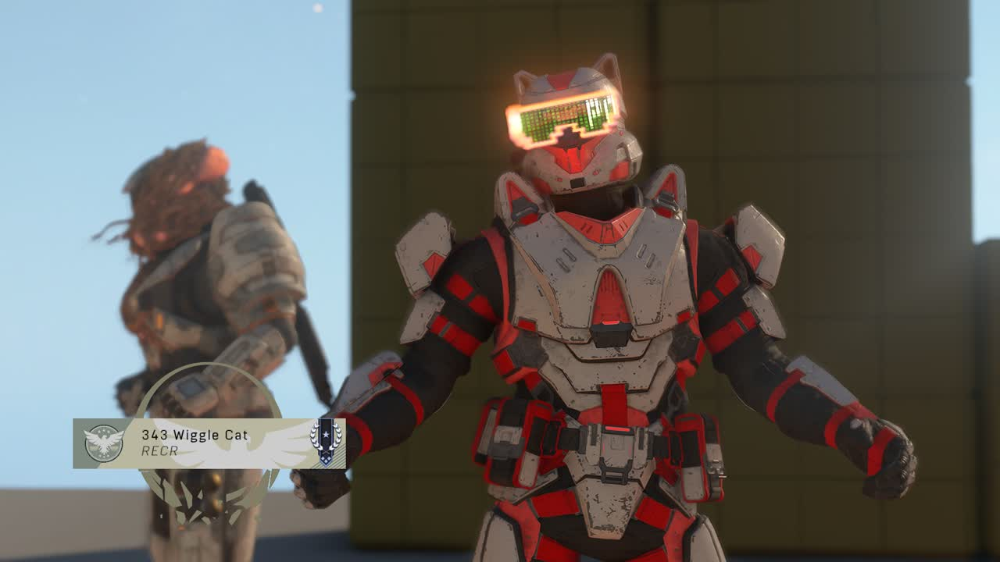<figcaption>
Camera sequence 2
</figcaption></figure>

 

<figure>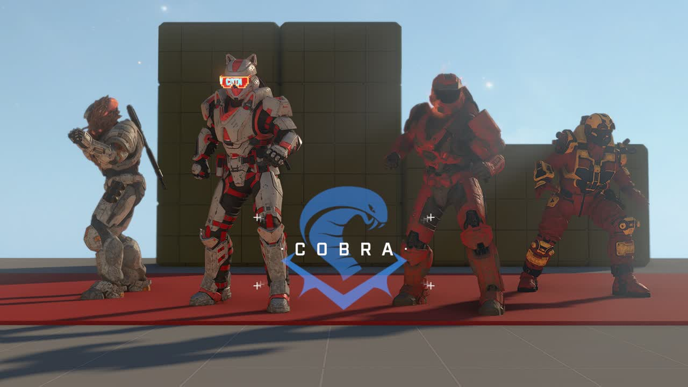<figcaption>
Camera sequence 3
</figcaption></figure>

#### Line-of-sight blockers

Make sure that no objects are blocking the view of the Camera. Otherwise, the Camera movement will look weird as it's passing through solid geometry or blocking the view towards the players at the end.

<figure>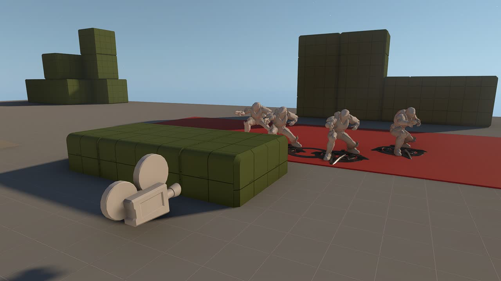<figcaption>
Geometry partly blocking visibility of the Camera from a Team Intro Arrow Front
</figcaption></figure>

 

<figure>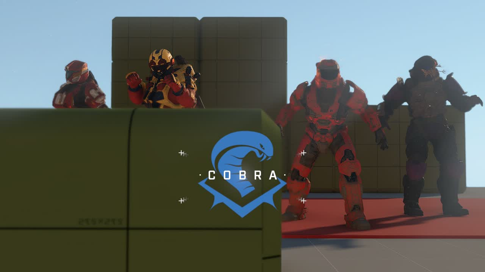<figcaption>
The Camera view at the end of the Team Intro sequence
</figcaption></figure>

#### Height

The spawn points can intersect the ground by 1.5 units and still let a player spawn on them. Any floating spawns will set the player on the nearest surface underneath them.

<figure>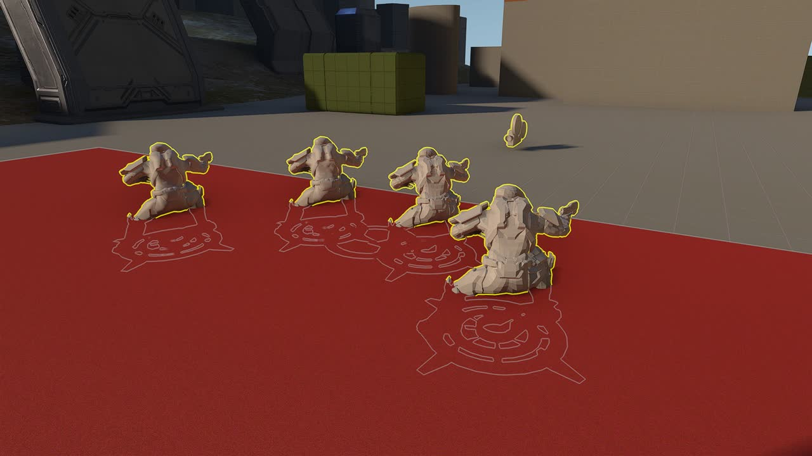<figcaption>
A spawn point can be 1.5 units under the ground and still spawn a player
</figcaption></figure>

In situations where the ground is uneven and some spawns may be floating, the view of the final Camera should be prioritized over the height positioning of the spawn points.&#x20;

<figure>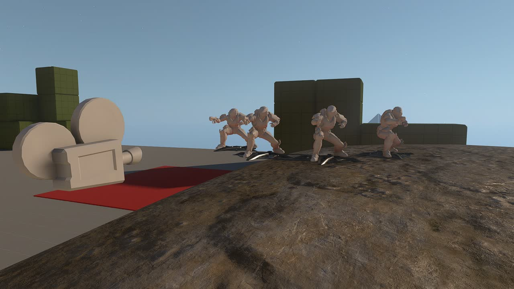<figcaption>
High camera positioning in Forge
</figcaption></figure>

 

<figure>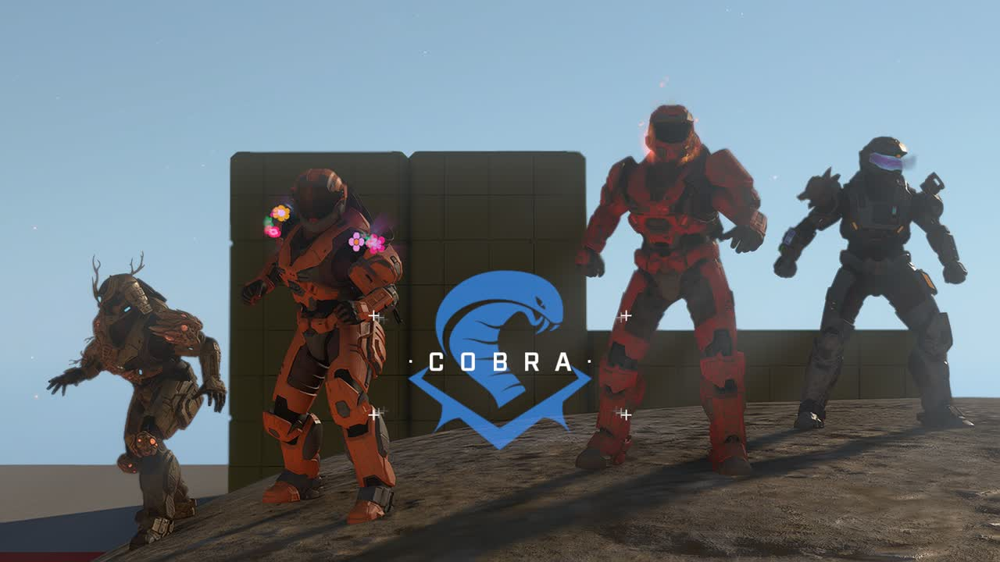<figcaption>
High camera positioning in gameplay
</figcaption></figure>

<figure>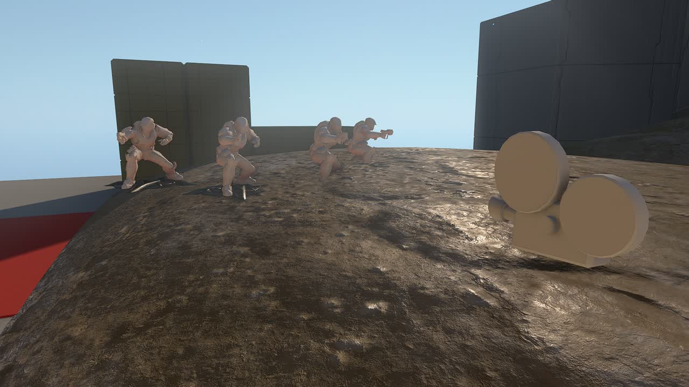<figcaption>
Low camera positioning in Forge
</figcaption></figure>

 

<figure><figcaption>
Low camera positioning in gameplay
</figcaption></figure>


Prioritize the final Camera placement over spawn point height as long as all players are able to spawn on their spawn point. This ensures that all players are fully visible in the final Camera view.


#### Blocked spawns

Placing the spawns lower than 1.5 units into the ground will cause them to be blocked. If a player can't spawn on their designated spawn point of the Team Intro Spawn, they will be relocated to a [Respawn Point](../respawning/respawn-points/) on the map. If no Respawn Points are available, [Backup Spawn Points](backup-spawn-points.md) will be used.

<figure>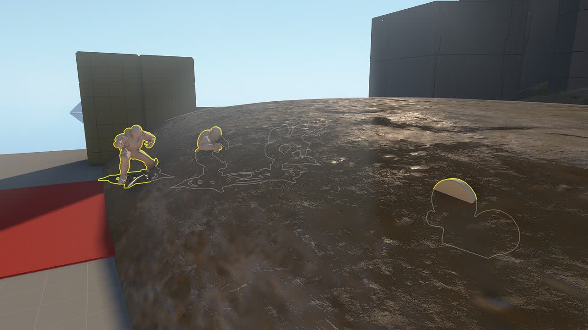<figcaption>
Spawn positioning too low causing some players to be blocked from spawning
</figcaption></figure>

 

<figure>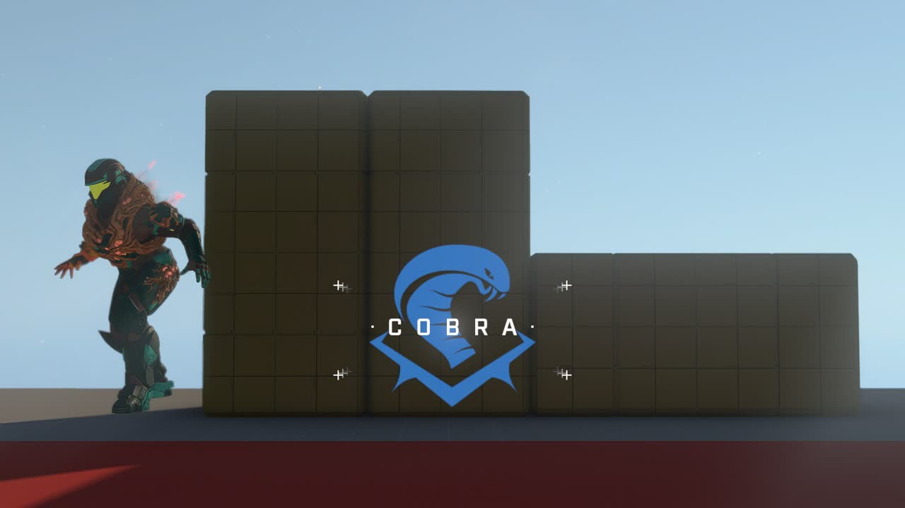<figcaption>
3/4 players are unable to spawn on blocked spawn points
</figcaption></figure>

#### Rotation

The Team Intro Spawn can be rotated without issues, as long as no spawn points get blocked in the process. The final Camera view will take on the rotation of the Camera in the Forge Kit object.

<figure><figcaption>
Team Intro Spawn tilted to the left
</figcaption></figure>

 

<figure>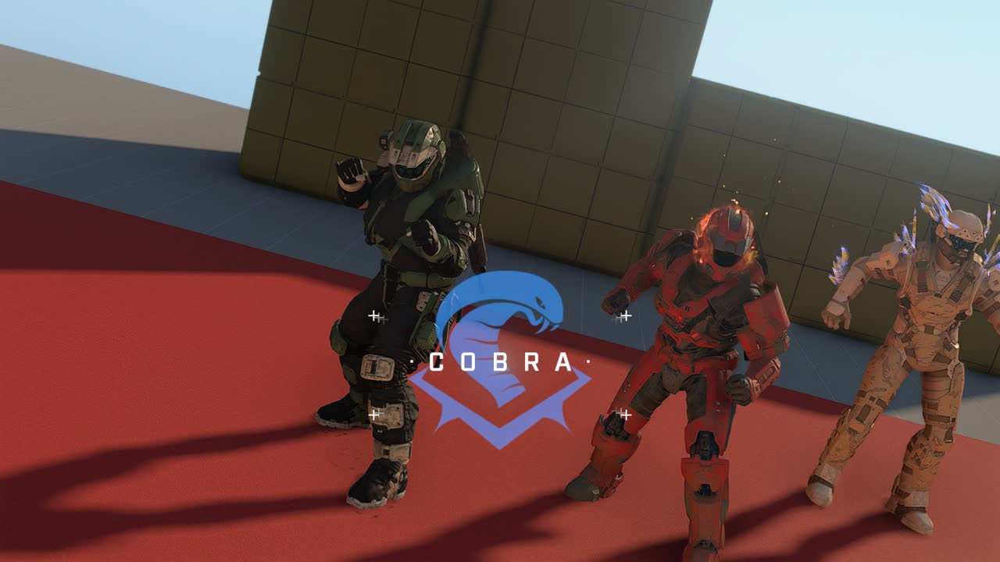<figcaption>
One spawn was blocked due to the tilt
</figcaption></figure>

<figure>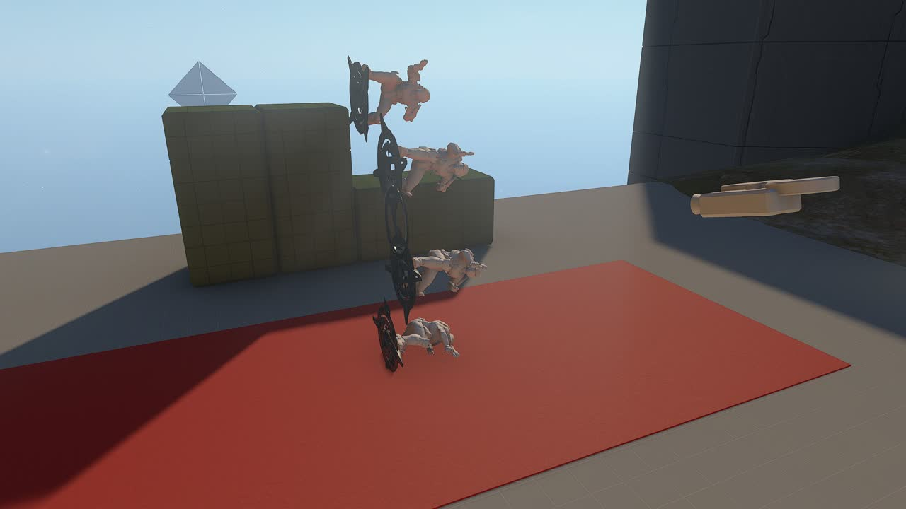<figcaption>
Team Intro Spawn 90° sideways
</figcaption></figure>

 

<figure>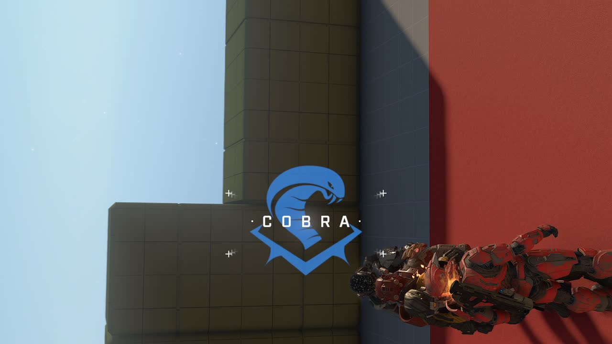<figcaption>
All of the spawns still work even with the object sideways
</figcaption></figure>

If the Team Intro Spawn is placed upside-down, the player showcase order is reversed, and the final Camera rotation will be upside-down.

<figure>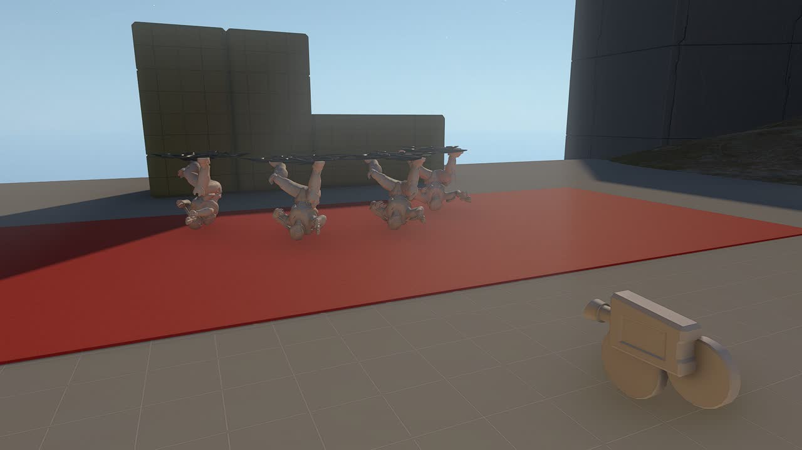<figcaption>
Team Intro Spawn upside-down
</figcaption></figure>

 

<figure>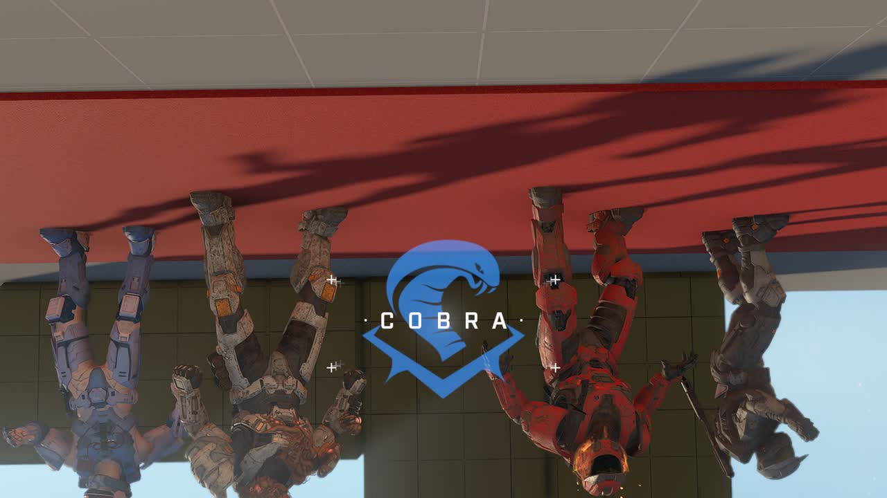<figcaption>
All of the spawns work when the object is upside-down
</figcaption></figure>


While it is possible to rotate the Team Intro Spawn to manipulate the final Camera view, it's not standard practice and will often look weird.


## Properties

### Physics

Setting the Physics value to "Phased" or "No Collision" will make moving the object easier as it won't collide with other objects.

### Assigning a Team

The <mark style="color:orange;">Team Designator</mark> property determines which Team spawns on the Team Intro Spawn.

| ADVANCED PROPERTIES |        |
| ------------------- | -----: |
| Team Designator:    | `TEAM` |

### Assigning a Squad

The <mark style="color:orange;">Squad</mark> property determines which Squad spawns on the Team Intro Spawn. Squads are used to order which Team Intro Spawns are filled first.

| ADVANCED PROPERTIES |         |
| ------------------- | ------: |
| Squad:              | `SQUAD` |

<code>SQUAD</code> options

1. Alpha
2. Bravo
3. Charlie
4. Delta
5. Echo
6. Foxtrot
7. Gamma
8. Hotel


When more than four players are present on a Team, the Squad order will be used to determine which Team Intro Spawn the players will initially spawn on.


## Practical setup

Here are examples on how to set up Team Intro Spawns in practice.

<figure>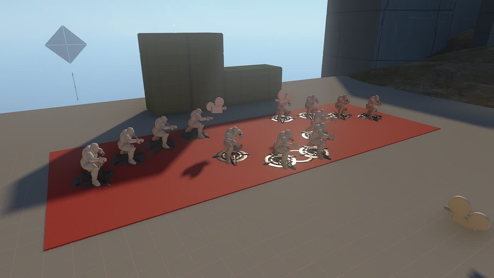<figcaption>
Three Team Intro Spawns on Cobra Team
</figcaption></figure>

 

<figure>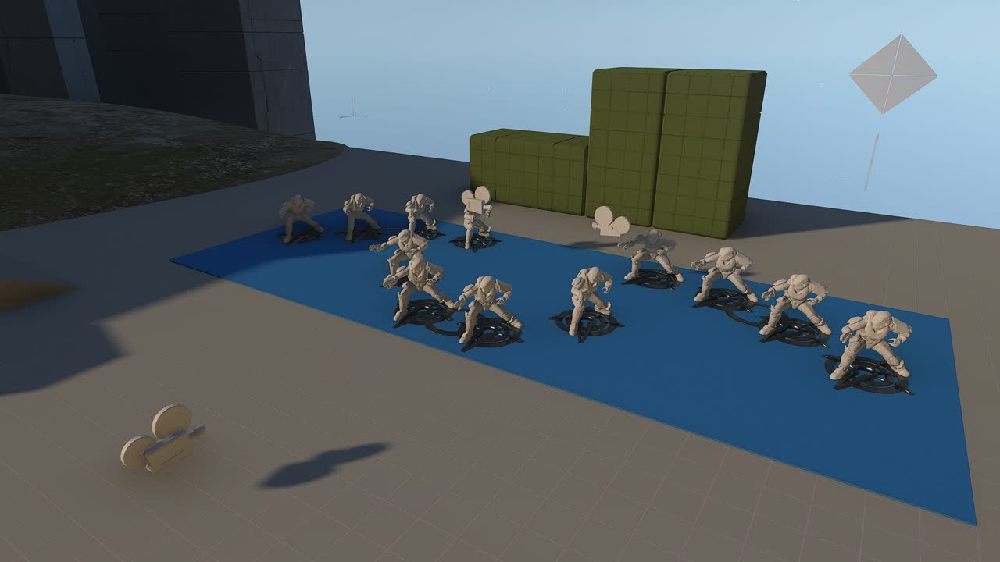<figcaption>
Three Team Intro Spawns on Eagle Team
</figcaption></figure>

### 4v4

#### <mark style="background-color:blue;">Eagle Team</mark>

Team Intro Spawn 1

| ADVANCED PROPERTIES |                  |
| ------------------- | ---------------: |
| Team Designator:    | `Team 1 (Eagle)` |
| Squad:              |          `Alpha` |

#### <mark style="background-color:red;">Cobra Team</mark>

Team Intro Spawn 1

| ADVANCED PROPERTIES |                  |
| ------------------- | ---------------: |
| Team Designator:    | `Team 2 (Cobra)` |
| Squad:              |          `Alpha` |

### 12v12

#### <mark style="background-color:blue;">Eagle Team</mark>

Team Intro Spawn 1

| ADVANCED PROPERTIES |                  |
| ------------------- | ---------------: |
| Team Designator:    | `Team 1 (Eagle)` |
| Squad:              |          `Alpha` |

Team Intro Spawn 2

| ADVANCED PROPERTIES |                  |
| ------------------- | ---------------: |
| Team Designator:    | `Team 1 (Eagle)` |
| Squad:              |          `Bravo` |

Team Intro Spawn 3

| ADVANCED PROPERTIES |                  |
| ------------------- | ---------------: |
| Team Designator:    | `Team 1 (Eagle)` |
| Squad:              |        `Charlie` |

#### <mark style="background-color:red;">Cobra Team</mark>

Team Intro Spawn 1

| ADVANCED PROPERTIES |                  |
| ------------------- | ---------------: |
| Team Designator:    | `Team 2 (Cobra)` |
| Squad:              |          `Alpha` |

Team Intro Spawn 2

| ADVANCED PROPERTIES |                  |
| ------------------- | ---------------: |
| Team Designator:    | `Team 2 (Cobra)` |
| Squad:              |          `Bravo` |

Team Intro Spawn 3

| ADVANCED PROPERTIES |                  |
| ------------------- | ---------------: |
| Team Designator:    | `Team 2 (Cobra)` |
| Squad:              |        `Charlie` |


It's possible to add more than the required minimum amount of Team Intro Spawns if you want to support a larger lobby in Custom Games. Just remember to increment the Squad value for each new Team Intro Spawn per Team.


### Infection & Firefight:King of The Hill

Infection and Firefight:King of The Hill are modes where Team Intro Spawns are required only on the Eagle side.

<figure><figcaption>
Eagle side Team Intro Spawn on an Infection map
</figcaption></figure>


The same Team Intro Spawns used for a 4v4 or 12v12 setup can be used as the spawns for Infection and FFKOTH, as long as the object [labeling](team-intro-spawns.md#labeling) doesn't prevent it.


#### <mark style="background-color:blue;">Eagle Team</mark>

Team Intro Spawn 1

| ADVANCED PROPERTIES |                  |
| ------------------- | ---------------: |
| Team Designator:    | `Team 1 (Eagle)` |
| Squad:              |          `Alpha` |

Team Intro Spawn 2 (Infection)

| ADVANCED PROPERTIES |                  |
| ------------------- | ---------------: |
| Team Designator:    | `Team 1 (Eagle)` |
| Squad:              |          `Bravo` |

Team Intro Spawn 3 (Infection)

| ADVANCED PROPERTIES |                  |
| ------------------- | ---------------: |
| Team Designator:    | `Team 1 (Eagle)` |
| Squad:              |        `Charlie` |


The standard player count of Infection is 12 with 10 of the players being Survivors, requiring three Team Intro Spawns.

Firefight:King of The Hill is intended for only four players so one Team Intro Spawn is enough.


Read more about Infection and Firefight:King of The Hill:


[infection.md](../../modes/infection.md)



[firefight-koth](../../modes/firefight/firefight-koth/)


## Labeling

In some cases, it can be useful to have players spawn in a different location in asymmetrical modes that may be played on the same map where a symmetrical Team Intro Spawn setup is present. For these situations, Labels can be used to include and exclude certain spawns.

<figure>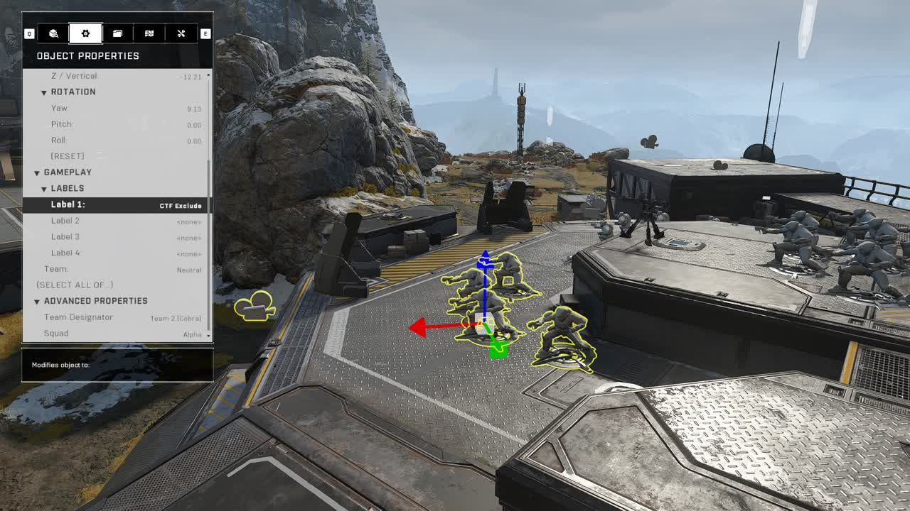<figcaption>
CTF Exclude label on a Cobra spawn
</figcaption></figure>

 

<figure>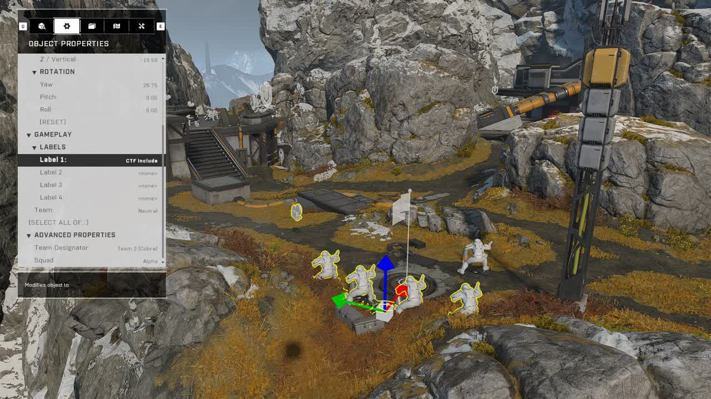<figcaption>
CTF Include label on another Cobra spawn
</figcaption></figure>

### Assigning Labels

Regular spawns

| LABELS   |                    |
| -------- | -----------------: |
| Label 1: | `ALT MODE` Exclude |

Alternative spawns

| LABELS   |                    |
| -------- | -----------------: |
| Label 1: | `ALT MODE` Include |


Make sure that the Team Designator and Squad values are setup correctly for the alternative mode spawns as well. If no other Team Intro Spawns are present for a Team in the alternative mode, the Squad value needs to start from Alpha.


Read more about Labels:


[labels.md](../../forge-basics-and-ui/forge-interface-and-controls/object-properties/labels.md)


***

#### <mark style="color:green;">Contributors</mark>

Okom
