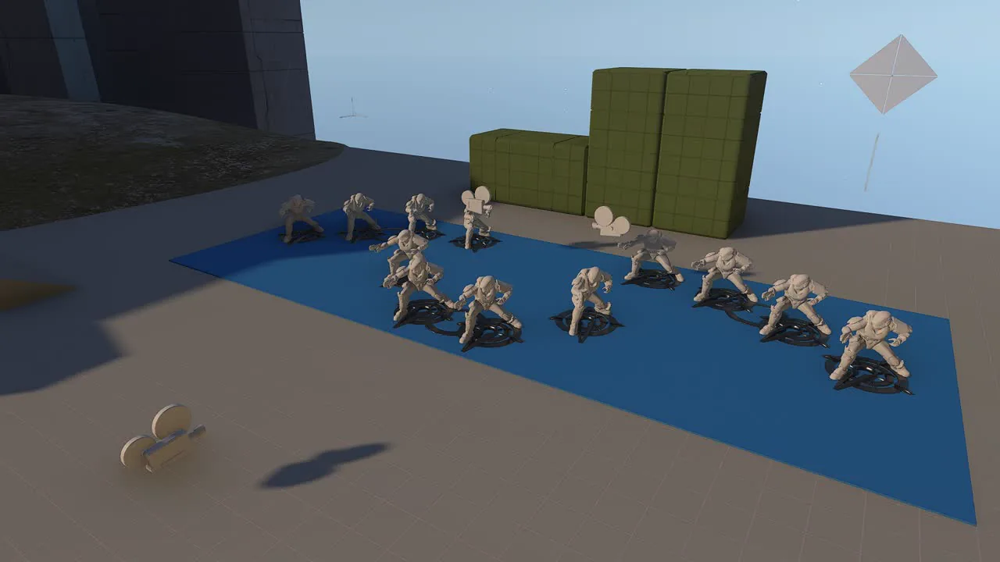
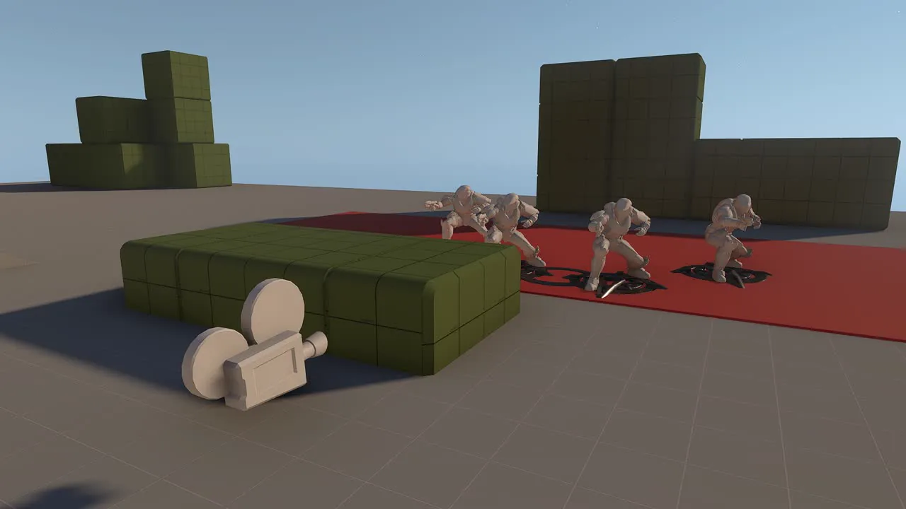
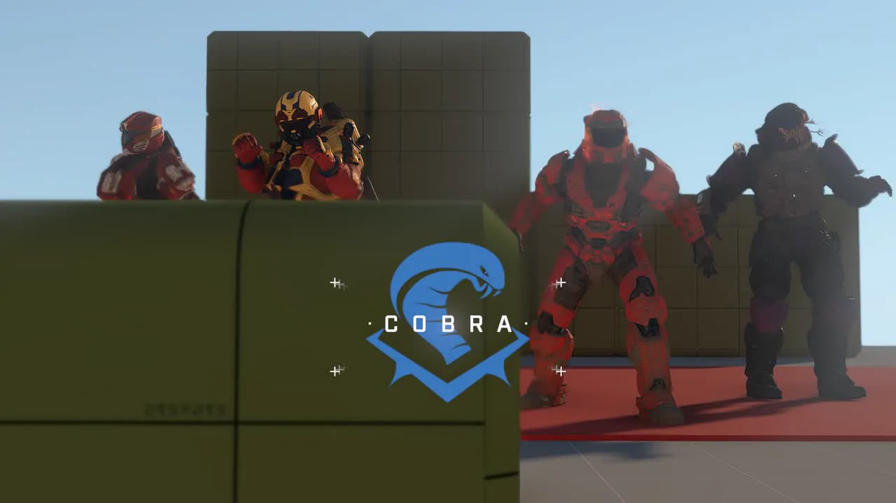
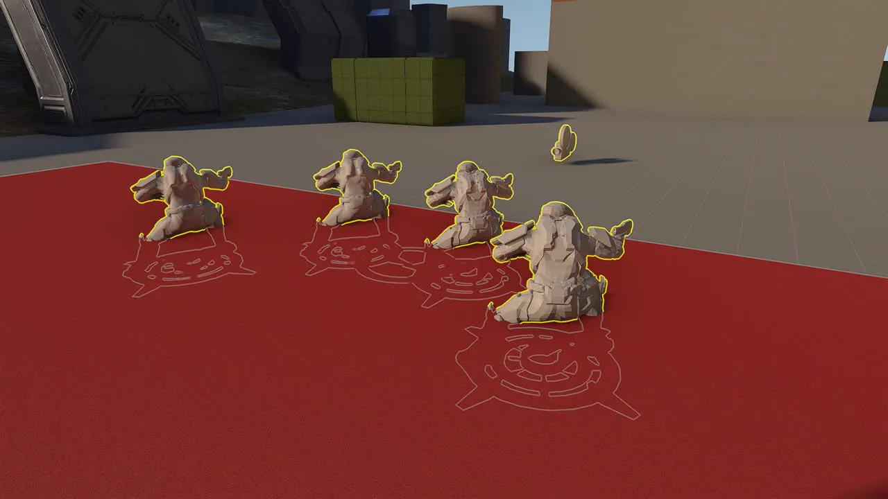
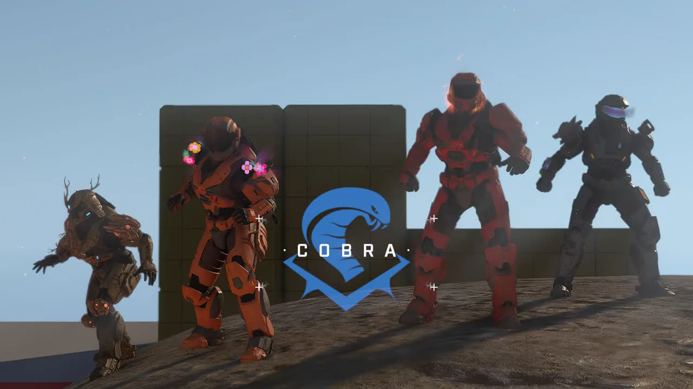

# Team Intro Spawns

<figure><figcaption></figcaption></figure>

Team Intro Spawns facilitate player entry at the beginning of a round in team-based modes. A single object can spawn one squad containing up to four players; if a team requires more than four starting players, multiple Team Intro Spawn objects must be placed for that team.

## Variants and Layouts

The Team Intro Spawn object is available in three variants:
* Team Intro Arrow Front
* Team Intro Arrow Left
* Team Intro Arrow Right

The suffix of the variant determines where the intro animation camera concludes after showcasing all players. Additionally, different variants utilize distinct spawn patterns for the four initial players; the "Front" variant uses an "A" shape, while the "Left" and "Right" variants use a horizontal line configuration.

<figure><figcaption>
The three variants determine both spawn shapes and final camera positions.
</figcaption></figure>

## Placement Guidelines

### Camera Visibility

These spawns should be placed within the starting area of a team's base and serve only as initial spawn locations, not for respawning. Because the intro sequence follows a fixed path, all space between the spawn points and the camera must remain clear of geometry to avoid visual clipping. The camera maintains a distance of 20 units in front of the "Front" variant and 15 units to the side for the "Left" and "Right" variants.

<figure><figcaption>
Geometry can partially block visibility of the camera during a Team Intro sequence.
</figcaption></figure>

<figure><figcaption>
This shows the final camera view at the end of an intro sequence.
</figcaption></figure>

### Height and Surface Interaction

Spawn points may intersect the ground by up to 1.5 units without preventing players from spawning correctly; however, placing them deeper than 1.5 units into the ground will cause them to be blocked. If a player is unable to spawn on their designated point, they are relocated to a [Respawn Point](../respawning/respawn-points.md).

If an object is floating or placed on uneven terrain, players will land on the nearest surface beneath them rather than remaining suspended in the air. 


When working with uneven ground where some spawns may be floating, prioritize the placement of the final camera view over spawn point height to ensure all players are fully visible in the intro sequence.


<figure><figcaption>
A spawn point located up to 1.5 units below ground still allows players to spawn correctly.
</figcaption></figure>

<figure><figcaption>
Players who spawn from an object on uneven terrain will land on the nearest available surface.
</figcaption></figure>

## Orientation and Properties

### Rotation Constraints

The Team Intro Spawn should only be rotated on the Yaw axis to determine which direction it faces. Rotating objects on the Pitch or Roll axes can cause the player's camera to be disoriented immediately upon spawning.

#### Property Settings

For a standard setup, use the following property configurations:
* **Team:** Neutral (irrelevant).
* **Team Designator:** User-defined; determines which Team is spawned.
* **Squad:** User-defined; determines the order of the Team Intro Object. "Alpha" is the first sequence and serves as the standard setting when only one object per team is utilized. If multiple objects are used for a single team, ensure Squad properties are unique and set in ascending order.

***

## Source Data

* Discord thread: [Team Intro Spawns](https://discord.com/channels/220766496635224065/1536530672829603851/1536530672829603851)

#### <mark style="color:green;">Contributors</mark>

Okom