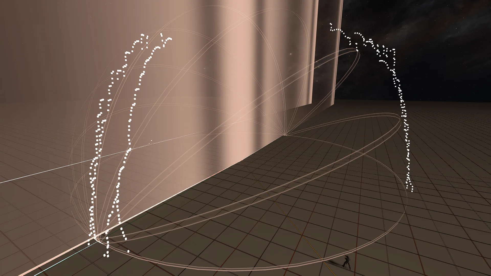
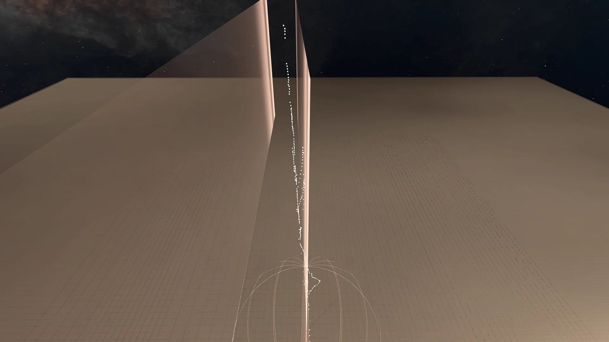

# Team Intro Spawns

<figure><figcaption></figcaption></figure>

Player movement and orientation can influence whether an enemy is able to spawn at a specific location via line of sight (LoS) checks. These boundaries consist of large vision cones that extend significantly across map space, potentially blocking spawns from great distances.

## Vision Boundary Geometry

### The Proximity Cone and Curvature
The LoS boundary manifests as an extremely large cone originating from the player's head with a diameter of approximately 10480 units and a length of 181.26 units (roughly 55 meters). This resulting field of view is approximately 176°.

<figure><figcaption></figcaption></figure>

While the shape appears to have curvature on its top and bottom edges, making it resemble a sphere in certain contexts:
<figure><figcaption></figcaption></figure>
<figure><figcaption></figcaption></figure>


A video demonstrating that a player can block a spawn while being far to one side of it.


<figure><figcaption></figcaption></figure>

## Spawn Blocking Mechanics

Spawning is blocked if a player enters specific areas of the boundary while maintaining vision of the spawner. The efficacy of this block depends on several factors:

* **Orientation:** A player in the area only blocks a spawn if they are facing the spawner within their own 176° field of view. If the player is facing away from the spawner, the spawn will not be blocked even if they are within the boundary.
* **Obstructions:** Any static or dynamic obstruction between the enemy's head and the spawning player's upper torso will invalidate a block.


A third-person perspective can potentially be used to manipulate line of sight functionality, as the obstruction check is performed from the player's head to the target's upper torso.


<figure><figcaption></figcaption></figure>
<figure><figcaption></figcaption></figure>

### The Sphere Misconception
While testers have observed what appears to be a spherical boundary, current research suggests that the "sphere" is actually just the visual result of two large LoS cones overlapping. 


The sphere acts as a useful visual aid in debug settings to represent overlap distance, but no actual separate spherical boundary exists for LoS spawn checks.


## Tactical Applications

Because every player's vision cone is active at all times, several tactical maneuvers can be used to manipulate spawning:

* **Vertical Blocking:** By aiming directly up or down, a player positions their massive 10480-unit diameter cone above or below them. This covers the entire map altitude within that range (181.26 units), potentially blocking any spawns with an unobstructed line of sight to the player's vertical plane.
* **Lateral Blocking:** For enemies attempting to spawn at locations further than approximately 55 meters away, tilting sideways toward those spawns can bring them into the vision cone and trigger a block.


A video showing how aiming up or down can position the vision cone to cover large areas above or below the player.


***

## Source Data

* Discord thread: [Player Line of Sight Cone Research](https://discord.com/channels/220766496635224065/1529131373602799626/1529131373602799626)

#### <mark style="color:green;">Contributors</mark>

Okom