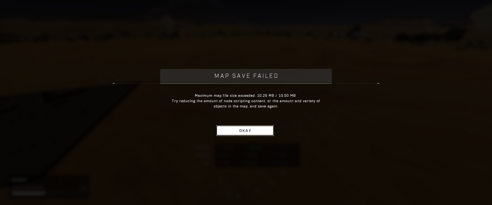
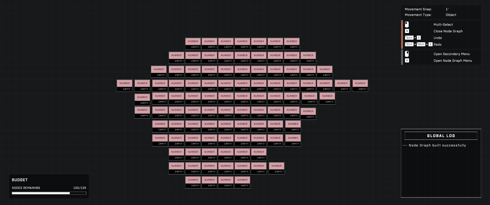

# File Size limits

<figure><figcaption></figcaption></figure>

Forge levels are stored as `.mvar` files, which act as text-based "recipes" that instruct the game engine on how to construct a level using assets from the Forge library.

## .mvar File Structure

Because `.mvar` files are text-based, their size is determined by the number of characters required to describe the level's contents. This architecture allows levels to remain relatively small by storing metadata and object lists rather than raw textures or models.

### Contributing Factors to File Size

Several elements within a level contribute to the total character count in the `.mvar` file:

* **Object Metadata:** Changing an object's coordinates (for example, moving an object from `0,0,0` to `1000,1000,1000`) increases the number of characters used to define that position.
* **User-defined Strings:** Any custom identifiers, folder names, or prefab names contribute to the text volume.
* **Prefabs:** Since prefabs are structures containing their own data and lists of included objects, they can add a significant amount of text to the file.
* **Scripting:** Scripting is the primary driver of file size. On average, a single [Number](../../scripting/nodes/variables-basic/number.md) node and one connection consume approximately 3 KB of text.

<figure><figcaption>
This screenshot shows an initial test involving script brains with 100 `Number` nodes.
</figcaption></figure>

<figure><figcaption>
This image captures the duplication process used to test the limits of script brain capacity.
</figcaption></figure>

<figure><figcaption>
The third screenshot displays the results of testing node density within the Forge environment.
</figcaption></figure>

## Capacity and Stability

As of October 18, 2023, the maximum map size limit was increased to 10 MB.


Players may encounter instability and the appearance of "phantom objects"—unselectable objects that appear in the world—well before reaching the 10 MB limit.


### Node Limits and Practical Constraints

While the hard limit is 10 MB, the functional limit for stable gameplay is lower. Testing suggests that instability and phantom objects can begin to appear at approximately 10,500 nodes. This is roughly equivalent to 83–84 script brains consisting of 128 `Number` nodes each.

The realistic node budget depends on the state of the map:

* **Blank Canvases:** Provide the highest theoretical node count.
* **Existing Maps:** On established maps, the node budget is reached much sooner because complex nodes consume more space and must share the file size budget with existing objects.

## Forge Modes

The 10 MB limit also applies to Forge Modes. There is currently no evidence of mode scripts becoming unstable when nearing this limit, as seen in large-scale modes such as Invasion or TSG Warzone.

***

## Source Data

* Discord thread: [File Size limits](https://discord.com/channels/220766496635224065/1163238371112517755/1163238371112517755)

#### <mark style="color:green;">Contributors</mark>

Captain Punch\
Toast\
Okom