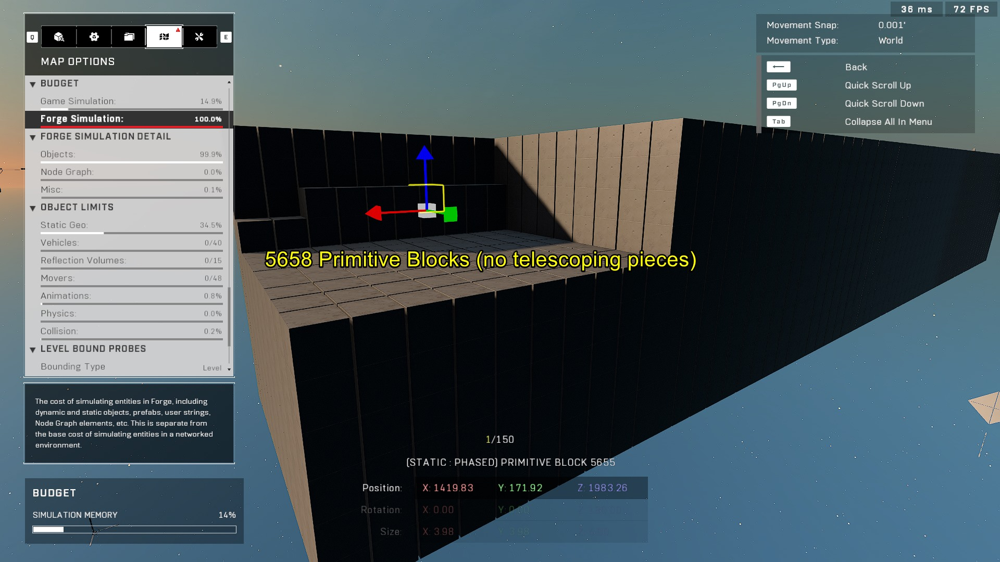
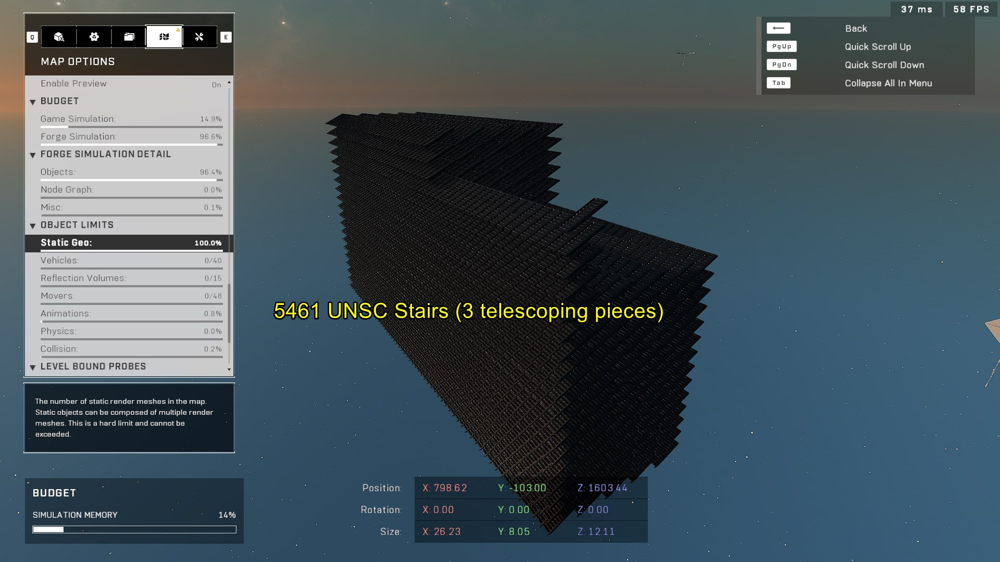
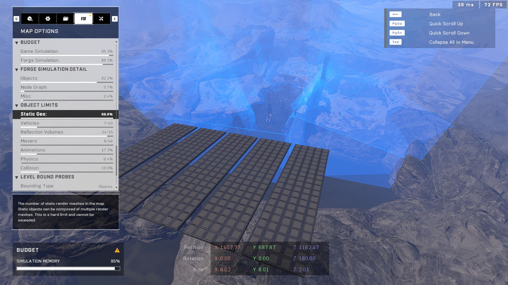

# Object Limit and Telescoping Object Research

<figure><figcaption></figcaption></figure>

Forge map creation is restricted by several different object budgets. The most common limit encountered is the Forge Simulation budget, followed by the Static Geometry budget, which is heavily influenced by the complexity of individual objects.

## Forge Simulation Budget

The Forge Simulation budget is typically the first limit a creator will encounter. As updates add more object properties and adjustments to the Forge tool, this limit can be reached more quickly.

Tests using primitive pieces, such as `Primitive Block`, `Primitive Sphere`, and `Floor Angled Standard A`, have shown the limit to be approximately 5658 objects.

<figure><figcaption>
A limit of approximately 5658 objects is reached using primitive pieces.
</figcaption></figure>


When nearing the Forge Simulation limit, item spawners such as Weapon Racks and Vehicle Spawners may reset to their default properties.


## Static Geometry Budget

The Static Geometry budget is the second most common budget to be hit. The specific limit for this budget depends on the objects being used, as objects with more static meshes consume more of the budget.

### Telescoping Objects

"Telescoping" objects, such as certain Floor and Wall pieces, are particularly expensive because they are composed of many individual static meshes. The limits for these objects vary significantly based on their complexity:

* **UNSC Stairs (3 telescoping parts):** ~5461 objects
* **Covenant Pyramids (~7 telescoping parts):** ~810 objects
* **UNSC Walls (~8 telescoping parts):** ~630 objects

Because of this, the Static Geometry budget is usually not the first limit hit unless a map is constructed primarily from these expensive telescoping objects.

<figure><figcaption>
The Static Geo budget limit can be reached at 5461 units when using UNSC Stairs.
</figcaption></figure>

## Research and Findings

Research into how these budgets interact shows that telescoping objects primarily impact the Static Geometry budget rather than the simulation budget.

In a test comparing 500 UNSC Floors (telescoping) to 500 Primitive Spheres (non-telescoping), the Forge Simulation and Objects budget usage was identical. This indicates that telescoping objects only become a primary concern if the Static Geometry budget is the first limit the map is projected to reach.

<figure><figcaption>
The Static Geo budget can be fully exhausted while the Forge Simulation budget remains near zero.
</figcaption></figure>

## Miscellaneous Data

* **Terminals:** All terminal types take up the same amount of space, including Worn Forerunner terminals.
* **Custom Events:** There is a negligible difference in budget usage between `Custom Events`, `Global Custom Events`, and `Async` event types.

***

## Source Data

* Discord thread: [Object Limit and Telescoping Object Research](https://discord.com/channels/220766496635224065/1434256456345059328/1434256456345059328)

#### <mark style="color:green;">Contributors</mark>

Okom\
Runic