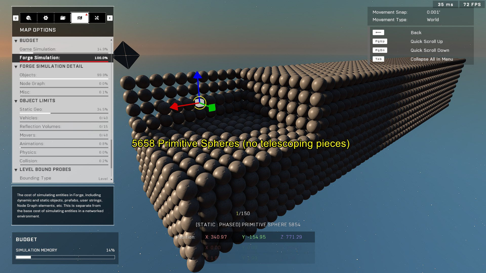
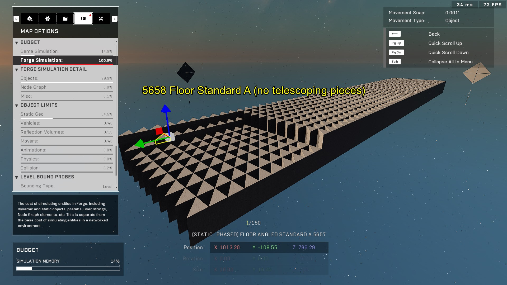
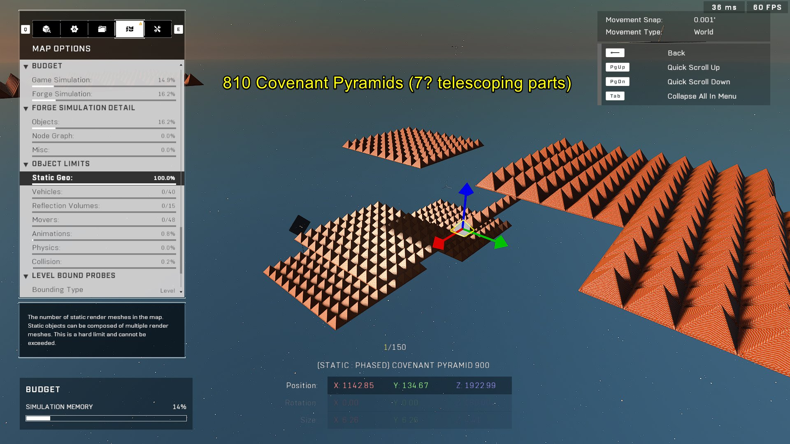
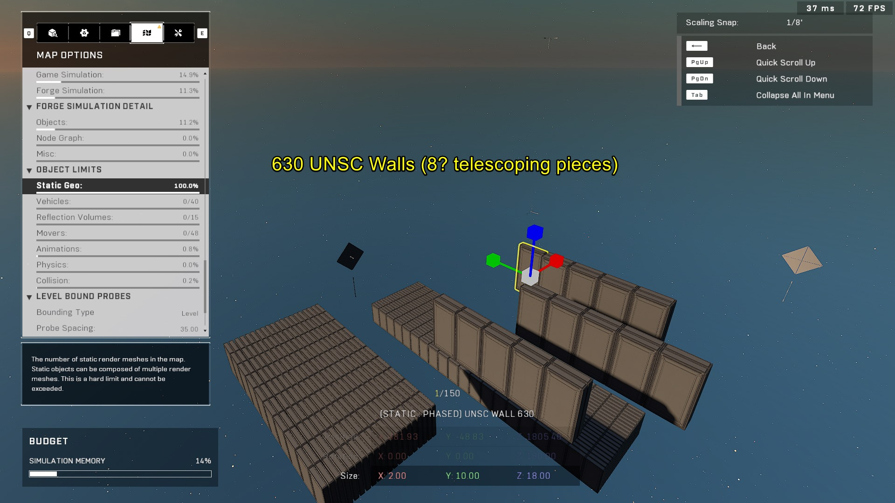
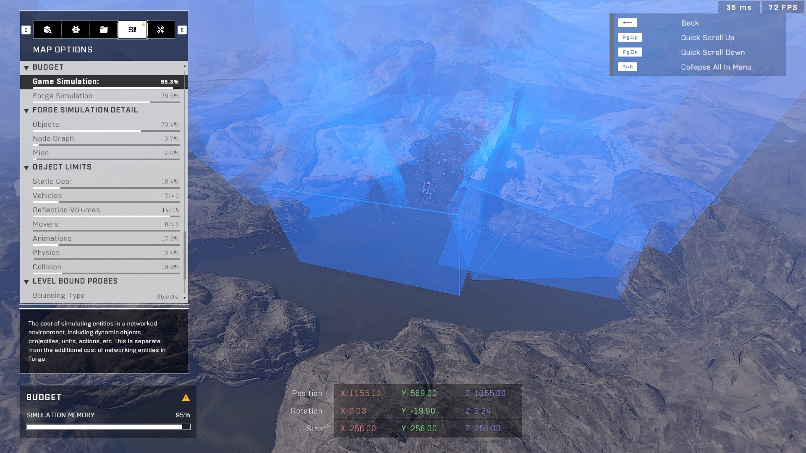

# Object Limits

<figure><figcaption></figcaption></figure>

Forge maps are constrained by several different budgets. The total number of objects allowed depends on which specific budget is exhausted first, with the Forge Simulation budget and the Static Geometry budget being the most common limiting factors.

## Forge Budgets

The object limit in a Forge map is not a single fixed number but changes based on the resource usage of the objects placed.

### Forge Simulation Budget

The Forge Simulation budget is frequently the first limit encountered. Research using highly efficient, primitive pieces—such as `Primitive Block`, `Primitive Sphere`, and `Floor Angled Standard A`—has shown limits in the range of approximately 5658 to 5664 objects.

As updates to the Forge tool introduce more object properties and adjustments, the Forge Simulation budget can be reached more quickly. A common symptom of reaching this limit is that item spawners, such as Weapon Racks or Vehicle Spawners, may reset to their default properties.

<figure><figcaption>
Primitive objects like blocks and spheres are used to test Forge Simulation limits.
</figcaption></figure>

<figure><figcaption>
Primitive spheres represent highly efficient objects for budget testing.
</figcaption></figure>

<figure><figcaption>
Standard angled floors are among the simplest objects used in budget analysis.
</figcaption></figure>

### Static Geometry Budget

The Static Geometry budget is determined by the number of static meshes contained within an object. "Telescoping" objects, such as specific floor and wall pieces, are particularly resource-intensive because they are composed of multiple individual static meshes.

The capacity for these objects varies depending on their complexity:

* **UNSC Stairs:** Approximately 5461 objects (3 telescoping parts)
* **Covenant Pyramids:** Approximately 810 objects (~7 telescoping parts)
* **UNSC Walls:** Approximately 630 objects (~8 telescoping parts)

<figure><figcaption>
UNSC Stairs consist of multiple telescoping parts that impact the Static Geometry budget.
</figcaption></figure>

<figure><figcaption>
Covenant Pyramids utilize several telescoping parts, increasing their mesh count.
</figcaption></figure>

<figure><figcaption>
UNSC Walls have a high number of telescoping pieces, making them expensive for Static Geometry.
</figcaption></figure>

## Telescoping Object Research

Research has been conducted to determine if telescoping objects impact budgets differently than standard primitive objects. In a test where 500 worst-case telescoping objects (UNSC Floors) were compared against 500 `Primitive Spheres`, the usage for the Forge Simulation and Objects budgets remained exactly the same. 

This indicates that telescoping objects primarily affect the Static Geometry budget.

<figure><figcaption>
Placing 500 UNSC Floors can cause the Static Geometry budget to reach its limit first.
</figcaption></figure>

<figure><figcaption>
Replacing telescoping objects with primitive spheres shows identical usage for Forge Simulation and Objects budgets.
</figcaption></figure>


Telescoping objects are only a major concern if your map is constructed primarily out of expensive telescoping pieces, which may cause the Static Geometry budget to be hit before other limits.


## Additional Data

* **Terminals:** All terminals, including Worn Forerunner variants, occupy the same amount of space.
* **Custom Events:** There is a negligible difference in space usage between Custom Events, Global Custom Events, and Async types.

***

## Source Data

* Discord thread: [Object Limit and Telescoping Object Research](https://discord.com/channels/220766496635224065/1434256456345059328/1434256456345059328)

#### <mark style="color:green;">Contributors</mark>

Okom\
Runic