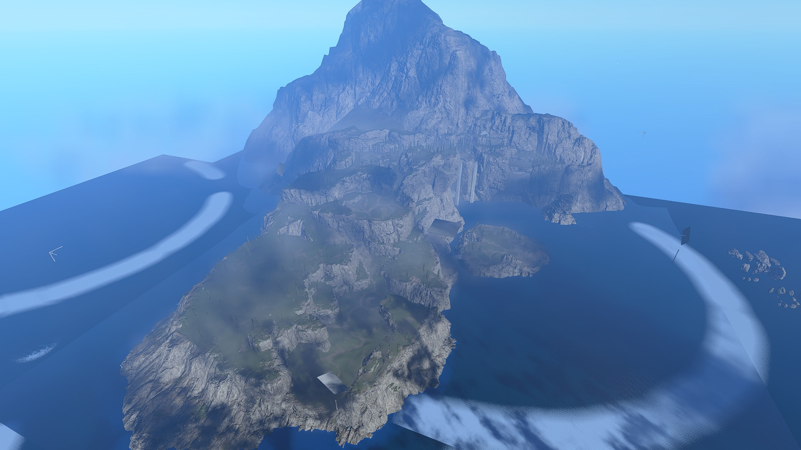
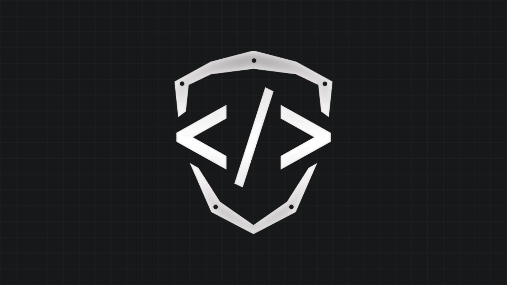

# Article Template 1

<figure><figcaption></figcaption></figure>

In this section give a brief overview of the topic that the article is about to introduce the reader into the topic. Keep it short, as the sections below should be used for further explanation.

## Main feature

In this section write about the main features. This section's header will show up on the navigation sidebar on the right.

<figure><figcaption></figcaption></figure>

### Main feature detail

In this section write about a sub-section of the feature above. This section's header will show up on the navigation sidebar on the right.

Below are some examples of image placement, which can be removed if images are not needed.

<figure><figcaption>
TSG logo in the node graph
</figcaption></figure> <figure><figcaption>
Pink cat used as a placeholder image
</figcaption></figure>

Write more about the main feature here if necessary.

#### Optional sub-section for more detail

In this section write about a sub-section of the sub-section above. This section title will _not_ show up on the navigation sidebar on the right.

## Secondary feature

In this section write about a secondary feature that still relates to the topic of the article.


Highlighted information that the reader should know can be written in alerts like this.


Write more about the secondary feature here if necessary.

***

#### <mark style="color:green;">Contributors</mark>

First article contributor\
Second contributor\
Third contributor
