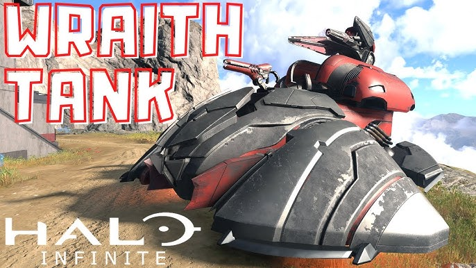

# Make Wraiths Take Longer to Destroy

<figure><figcaption></figcaption></figure>

Because vehicles do not have a built-in damage resistance attribute, developers can use scripting to simulate increased durability. This technique makes units like AI Wraiths more resilient to sustained fire, requiring players to focus damage within a specific window to destroy them.

This is a change to the article made by Okom.

<figure><figcaption>
Source image from the original research thread.
</figcaption></figure>

## Constant Health Regeneration

One method for increasing a vehicle's effective health is to constantly increase its health value over time. This creates the illusion of a "bulky" unit that absorbs more damage.

### Implementation

A simple implementation involves running a loop every 0.10 seconds that increments the vehicle's health.

* **Logic:** Every 0.10 Seconds $\rightarrow$ [Set Object Health Percent](https://wiki.thescriptersguild.com/scripting/nodes/objects/set-object-health-percent) (using [Get Object Health](https://wiki.thescriptersguild.com/scripting/nodes/objects/get-object-health) + 0.01).

#### Limitations

This method does not provide true damage resistance. A single high-damage shot—such as 2001 damage against a Wraith—can still destroy the vehicle instantly before the next regeneration tick occurs.

## Simulated Damage Resistance

A more scalable approach involves calculating the damage a vehicle has taken and immediately restoring a percentage of that damage back to the vehicle. This simulates a resistance scalar.

### Logic and Variables

To implement this, the following variables are required:

* `previous_health`: A number variable used to track the vehicle's health from the previous check.
* `damage_resistance`: A number variable (scalar between 0 and 1) representing the percentage of damage to negate.
* `damage_restore`: A number variable used to calculate the amount of health to return to the vehicle.

The logic should run on a frequent loop (e.g., every 0.10 seconds):

1. Compare the current object health to `previous_health`.
2. If the health values are different (indicating damage was taken):
 * Calculate `damage_restore` by multiplying the difference (`previous_health` - `current_health`) by the `damage_resistance`.
 * Set the object health to the sum of the current health and the `damage_restore` amount.
 * Note: Use the raw health value for this addition, not a percentage.
3. Update `previous_health` to the current health value.

For example, if a vehicle with 1000 health takes 100 damage and the `damage_resistance` is set to 0.95, the script will calculate a `damage_restore` of 95. The vehicle's health will be set back to 195, effectively meaning it only took 5 actual damage.

### Target Selection

To ensure these scripts only affect specific units, such as AI Wraiths, you can maintain an object list of valid targets.

* Use the [On Vehicle Entered](https://wiki.thescriptersguild.com/scripting/nodes/events/on-vehicle-entered) node.
* Use a Branch with [Get Is AI](https://wiki.thescriptersguild.com/scripting/nodes/ai-advanced/get-is-ai) to verify the occupant.
* If true, use the **Add To Object List** node to add the vehicle to your tracking list.

## Optimization and Performance

Running health checks on every vehicle in a map can be resource-intensive. To maintain efficiency, developers should use a controlled loop that only processes the specific objects in the tracked list.


Replacing an "Every N Seconds" node with a recursive global custom event that only runs when the object list is populated can significantly improve performance.


### Tick Rates

When setting up the loop, avoid using a "Do every 0 seconds" node. Skipping multiple ticks increases the risk that a burst of damage will destroy the vehicle before the script can react. A consistent 0.10-second interval is recommended to balance performance with responsiveness.

***

## Source Data

* Discord thread: [Make Wraiths Take Longer to Destroy](https://discord.com/channels/220766496635224065/1490097430333624450/1490097430333624450)

#### <mark style="color:green;">Contributors</mark>

seanonix\
Okom\
swagonflyyyy\
Captain Punch
