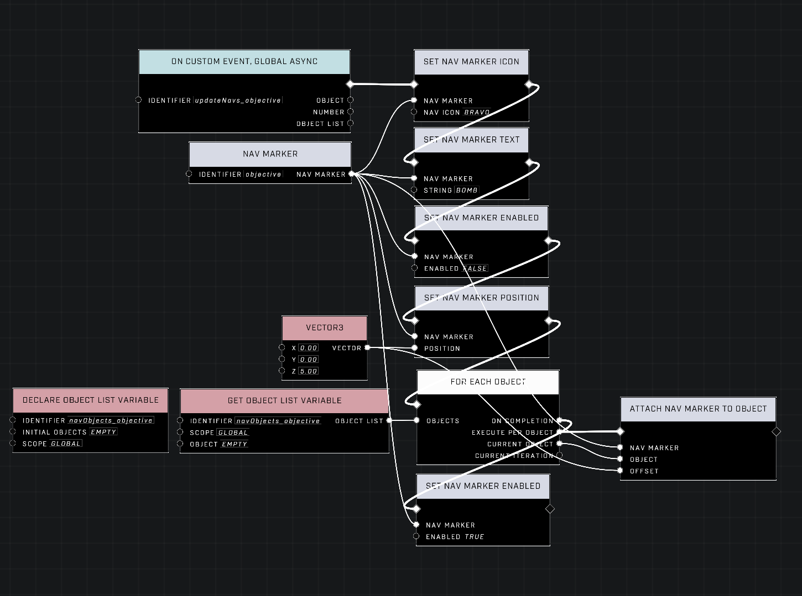

# Managing Nav Markers

To create a nav marker, you need to place a Nav Marker node on the Nodegraph and give it an identifier. This will associate a collection of configurable properties to the identifier. Once these properties have been configured to your liking using the available 'Set' nodes, you can then enable the nav marker. This will cuase it to display onscreen with your configuration.

## Multiple Nav Markers

There is a common scenario of needing multiple nav markers of the same configuration to be displayed accross multiple objects. This is possible with a few caveats. Nav markers function in a comparable way to the pub/sub model. A nav marker is enabled (or published) and it will then be displayed above the list of attached (subscribed) objects. However, removing a nav marker from an attached object is not an obvious thing to script.

The key factor is that setting a nav marker to have a position (rather than be attached to an object) will erase the list of attached objects, removing the nav marker from all objects. This happens during script execution and so the list can be recreated in the same frame. Because of this, the changes in the list of attached objects is not displayed until the following frame, making it so players in-game will are unaware of the list being erased.

<figure><figcaption></figcaption></figure>

Above is an example of an event that when triggered will update what objects a configured nav marker is displayed on. Note that after the 'objective' nav marker is configured, a position for the nav marker is set to erase the list of objects the nav marker is attached to. Immedietely afterwards, the nav marker is attached to objects in an object list variable.

To use this event, it's important to update the object list variable by adding or removing objects from it. You can then trigger the event to reflect the changes in the object list.

**Contributors**

Mr. Admirals\
Captain Punch