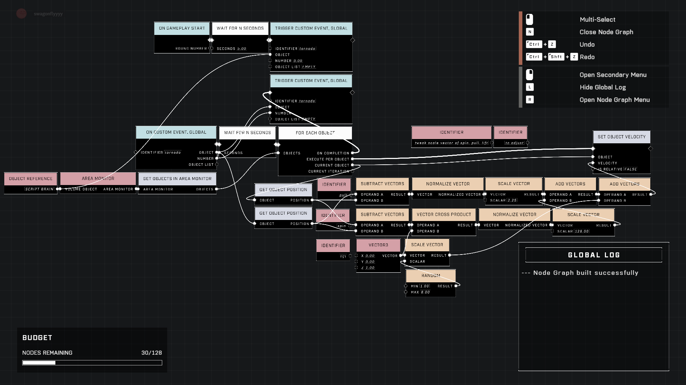

# Fog

## Atmospheric Fog

<figure><figcaption>
Atmospheric Fog Properties
</figcaption></figure>

| Property Name          | Description                                                                                                       |
| ---------------------- | ----------------------------------------------------------------------------------------------------------------- |
| Fog Offset             | Distance to offset the fog falloff from where fog starts to the horizon                                           |
| Fog Near Falloff       | Distance from player when atmospheric fog starts rendering                                                        |
| Fog Intensity          | Sets the atmospheric fog density                                                                                  |
| Fog Falloff Up         | Atmospheric fog falloff going upwards from the horizon                                                            |
| Fog Falloff Down       | Atmospheric fog falloff going down from the horizon                                                               |
| Sky Fog Intensity      | How much Fog is in the atmosphere                                                                                 |
| Inscattering           | The amount of light that scatters throughout the atmosphere (Reference Image Inscattering)                        |
| Fake Inscattering Tint | Sets a false color scatter thorough the atmosphere \| Inscattering must be under 1 (Reference Image Inscattering) |

## Volumetric Fog

<figure><figcaption>
Volumetric Fog Properties
</figcaption></figure>


Volumetric Fog simulates a 3D fog that can be used to create light rays, take in color from lights, or provide a general haze around world.


| Property Name | Description                                                 |
| ------------- | ----------------------------------------------------------- |
| Color         | Sets color                                                  |
| Density       | How thick the volumetric fog is                             |
| Enabled       | Toggles volumetric fog On/Off                               |
| Far Range     | Distance from player when volumetric fog "Stops" rendering  |
| Near Range    | Distance from player when volumetric fog "Starts" to render |

#### Contributors

Nitro\
Tyler | Lighting Artist\
