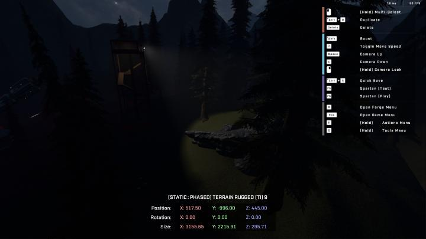
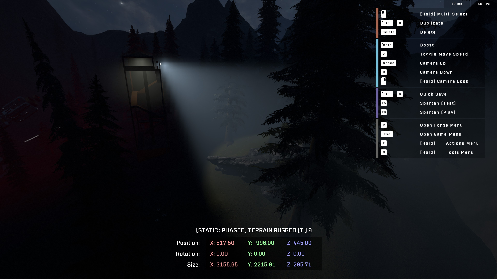

# Volumetric Fog Affects Brightness of Light Cones

## Volumetric Fog Affects Brightness of Light Cones

Volumetric fog can make lights appear brighter and harsher than intended, causing distracting and unpleasant visual effects. However, by selecting a darker color for the volumetric fog, the brightness of the light glow can be reduced, creating a softer and more natural look.

This effect can be seen not only in the volumetric fog color but also in the color of the light itself. For example, a grey light will be dimmer than a white light. This means that the brightness of light glows can be modified on a per-light basis, allowing for greater control over the look and feel of a game's lighting.

It is important to note that this effect is most noticeable when lights are placed in fog, and can make them hard to look directly at or create harsh lines in the distance. However, by adjusting the volumetric fog color and light colors, these issues can be mitigated to create a more visually pleasing experience for players.

<figure><figcaption></figcaption></figure>

<figure><figcaption></figcaption></figure>
