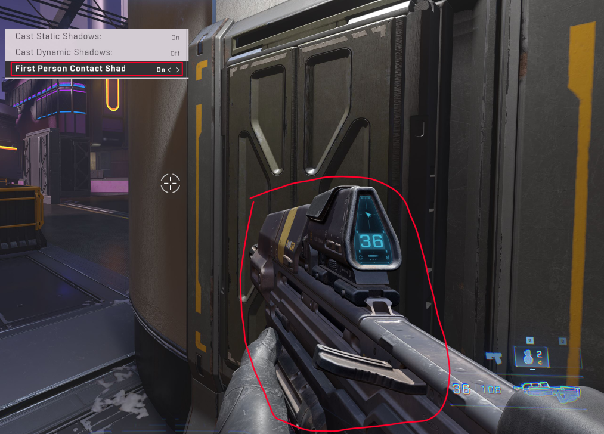

# First Person Contact Shadows

First Person Contact Shadows is a screen space effect designed to enhance smaller shadow details that might be missed under low-resolution shadowed lighting conditions. This effect specifically targets the first person model of the player within the illuminated area, providing a more detailed and realistic shadow appearance.

### Shadow Light Resolution Settings

In the Forge engine, all shadow lights render at a default resolution of 512 for Ultra, High, and Medium settings when activated and the player is in close proximity to the light source. For Low settings, the resolution is reduced to 256. However, low-resolution shadows and wide outer angle cones used in spotlights can result in light leakage and gaps, diminishing the visual quality. First Person Contact Shadows are employed to address these issues by filling in the gaps, creating the illusion of higher resolution shadows for the lights.

### Usage and Limitations

It's crucial to note that only up to four instances of First Person Contact Shadows can render simultaneously. If this limit is exceeded, the effect will not function as intended. Fortunately, this limitation is not a significant concern because the effect is limited to the first person model and ceases to render once the player exits the illuminated area.

However, it's advisable to use discretion when enabling this feature. Applying First Person Contact Shadows to lights positioned very close to the player's weapon or key lights can significantly improve shadowing effects. Additionally, it's important to be aware that these shadows do not automatically render on Low spec settings.

### Performance Considerations

While First Person Contact Shadows primarily contribute to visual fidelity, they can impact performance in resource-intensive scenarios. If players encounter performance issues in specific areas, disabling this feature could provide a performance boost.

### Customization and Integration

One of the notable advantages of First Person Contact Shadows is their independent applicability. They can be added separately from other shadows, offering a flexible approach to detailing. This flexibility proves useful in situations where allocating resources for a full shadow might be impractical or when designers aim to enhance specific details without compromising overall performance.

<figure><figcaption>
No shadows.
</figcaption></figure>

<figure><figcaption>
Shadows.
</figcaption></figure>

**Contributors**\
Tyler | Lighting Artist\
Captain Punch
