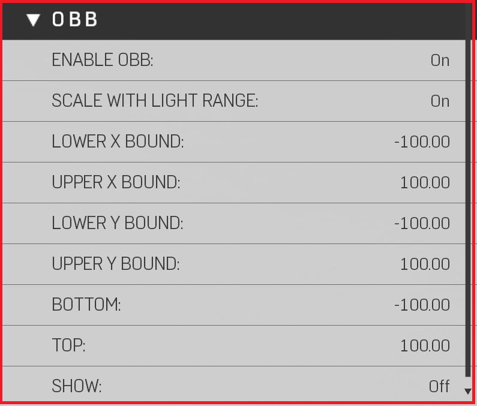
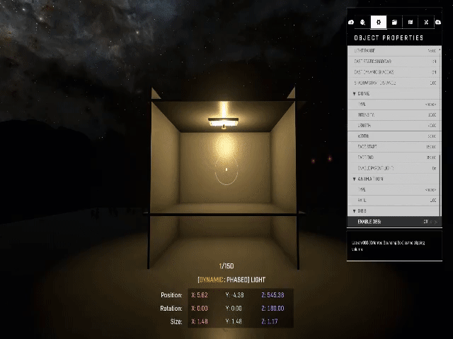

# Light Objects

## Light Properties

<figure><figcaption>
Light Properties
</figcaption></figure>

| Property Name                     | Description                                                                                    |
| --------------------------------- | ---------------------------------------------------------------------------------------------- |
| Type                              | Sets the light to be "Spot" (directional) or "Point" (omnidirectional).                        |
| Color                             | Changes the color of light source.                                                             |
| Brightness                        | How bright the light is.                                                                       |
| Outer Cone Angle (Only Spot Type) | Angle/Frustum of the outer spotlight cone. (Reference Image Light Source Outer-Inner Cone)     |
| Inner Cone Angle (Only Spot Type) | Angle/Frustum of the inner spotlight cone.                                                     |
| Source Size                       | Modifies the softness of the light source. (Reference Image Light Source Outer-Inner Cone)     |
| Light Range                       | Distance at which the light falls off.                                                         |
| Cast Static Shadows               | Enables shadows for static objects.                                                            |
| Cast Dynamic Shadows              | Enables shadows for dynamic objects, adds additional expense.                                  |
| Shadow Start Distance             | Distance from source at which the shadows start. (Reference Image Light Shadow Start Distance) |

<figure><figcaption>
Light Source Outer-Inner Cone
</figcaption></figure>

<figure><figcaption>
Light Shadow Start Distance
</figcaption></figure>

## Animation


Animations are used to create Flickering lights


<figure><figcaption>
Animation Properties
</figcaption></figure>

| Property Name | Description                                                     |
| ------------- | --------------------------------------------------------------- |
| Type          | Applies an animation to the light.                              |
| Rate          | Changes the Light animation Speed (Higher faster, lower slower) |

## Cone


Light cones are versatile, cheap to render billboard objects. Used to create fake lighting effects, such as, light rays, fog, mist, smoke. Also used to create depth and pathing.


<figure><figcaption>
Cone Properties
</figcaption></figure>

| Property Name       | Description                                                                                                                                                              |
| ------------------- | ------------------------------------------------------------------------------------------------------------------------------------------------------------------------ |
| Type                | The light cone attached to the object. (Reference Image Types of Light Cones)                                                                                            |
| Intensity           | How bright the light cone is.                                                                                                                                            |
| Length              | Changes the length of the light cone; Stacking multiple light cones over one another, or the larger the light cone takes up on screen, the more performance cost it has. |
| Width               | Changes the width of the light cone; Stacking multiple light cones over one another, or the larger the light cone takes up on screen, the more performance cost it has.  |
| Fade Start          | Distance from player when the light cone starts to fade.                                                                                                                 |
| Fade End            | Distance from player when the light come completely fades.                                                                                                               |
| Enable Parent Light | Toggles the light to be on/off; used when only a light cone is desired.                                                                                                  |

<figure><figcaption>
Types of Light Cones
</figcaption></figure>

## Gobo


Gobos are patterns projected from lights to give different lighting results. Examples being water caustics, faking shadows, or placing a Banished logo.


<figure><figcaption>
Gobo Properties
</figcaption></figure>

| Property Name    | Description                                                                                                                                                                                           |
| ---------------- | ----------------------------------------------------------------------------------------------------------------------------------------------------------------------------------------------------- |
| Gobo Information | There can only be a limit of 4 Unique gobos rendering at the same time. Duplicates work fine, but 5+ gobos in close proximity still rendering will cause the gobos to flicker or not render correctly |
| Type             | Applies a stencil (pattern) projected from the light (Only works on "Spot" lights). (Reference Image Types of Gobos                                                                                   |

<figure><figcaption>
Types of Gobos
</figcaption></figure>

## OBB


OBB's (Oriented Bounding Box) are used Primarily as a performance tool, clamping light pixels to have more performant heatmaps (Use the Light/Shadow Heatmaps to see light pixel influence)


<figure><figcaption>
OBB Properties
</figcaption></figure>

| Property Name          | Description                                                                    |
| ---------------------- | ------------------------------------------------------------------------------ |
| Enable OBB             | Toggles on/off OBB (Reference Images below )                                   |
| Scale with Light Range | Automatically scales the bounds if ""Light Range" changes                      |
| Lower X Bound          | Moves 1 side of the bounding box, setting can not be higher than Upper X Bound |
| Upper X Bound          | Moves 1 side of the bounding box, setting can not be higher than Lower X Bound |
| Lower Y Bound          | Moves 1 side of the bounding box, setting can not be higher than Upper Y Bound |
| Upper Y Bound          | Moves 1 side of the bounding box, setting can not be higher than Lower Y Bound |
| Bottom                 | Moves the Bottom of the Volume                                                 |
| Top                    | Moves the Bottom of the Volume                                                 |
| Show                   | Always render OBB Volume                                                       |

<figure><figcaption>
OBB Adjusted
</figcaption></figure>

<figure><figcaption>
OBB Default
</figcaption></figure>

#### Contributors

Nitro\
Tyler | Lighting Artist\
Captain Punch
