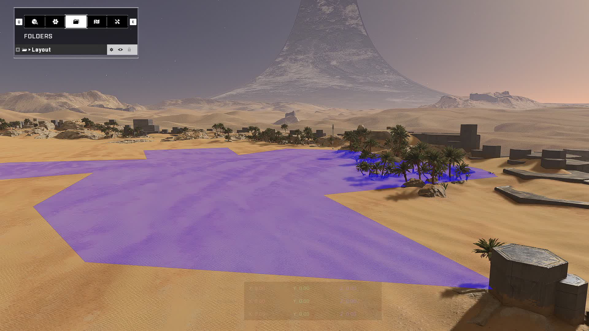
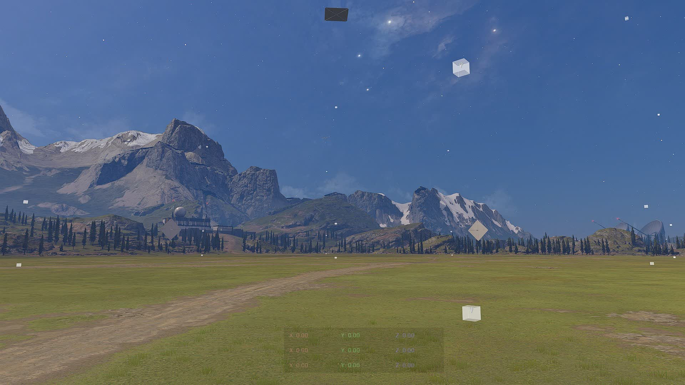

# Backup Spawn Points

### Purpose

The purpose of the `Spawn Point [Backup]` object is to spawn the player or Forge monitor on the map when there are no other Spawn Points available.

Despite the object being able to be selected from the Forge Menu, it is rumored that it was accidentally left in the retail Forge Menu for players to use on their map, when it was never supposed to have been left there. This is backed up by the fact that any extra Backup Spawn Points placed on the map serve no purpose on a regular map experience.

## Invisible Backup Spawn Points

On each map there is at least one invisible Backup Spawn Point object which can't be seen, selected nor deleted by the player. These are placed by 343 to prevent the player or Forge monitor from not being able to spawn on the map after deleting every object on the map.

<video width="" controls>
  <source src="../../../.gitbook/assets/backup-spawns-spawning.mp4" type="video/mp4">
Your browser does not support the video tag.
</video> 

### Positioning

Here are the positions of each invisible Backup Spawn Point on the listed maps that have been reverse-engineered:

Forge maps built on these canvases: Arid, Barrage, Ecliptic, Institute, Mires, Permafrost, Seafloor, Void:

* `0, 0, 505`
* `0, 0, 700`
* `0, 0, 1400`
* `0, -1450, 505`
* `0, -1450, 700`
* `0, -1450, 1400`
* `0, 1450, 505`
* `0, 1450, 700`
* `0, 1450, 1400`
* `-1450, 0, 505`
* `-1450, 0, 700`
* `-1450, 0, 1400`
* `1450, 0, 505`
* `1450, 0, 700`
* `1450, 0, 1400`
* `-1450, -1450, 505`
* `-1450, -1450, 700`
* `-1450, -1450, 1400`
* `-1450, 1450, 505`
* `-1450, 1450, 700`
* `-1450, 1450, 1400`
* `1450, -1450, 505`
* `1450, -1450, 700`
* `1450, -1450, 1400`
* `1450, 1450, 505`
* `1450, 1450, 700`
* `1450, 1450, 1400`

Aquarius

* `-135, 70, 31`

Bazaar

* `-242, 2, 32`
* `242, 2, 32`

Behemoth

* `-1052, 262, 94`

Breaker

* `-231, 352, 171`
* `-66, -68, 196`
* `-64, 47, 196`
* `-52, -440, 130`
* `-23, 459, 166`
* `2, -484, 128`
* `118, 474, 166`
* `162, -488, 128`
* `200, -124, 164`
* `200, 113, 164`

Catalyst

* `210, 0, 228`

Chasm

* `-836, -798, -1363`
* `-825, -622, -1386`
* `-725, -447, -1364`
* `-618, -807, -1364`
* `-520, -622, -1386`
* `-508, -447, -1363`

Cliffhanger

* `-66, 161, -5`
* `199, 74, -24`
* `199, 288, -32`
* `249, -175, -9`
* `386, 129, 5`

Deadlock

* `735, 535, 778`

Forbidden

Needs to be checked

Fragmentation

* `30, 436, 25`
* `873, -656, 45`

Highpower

* `-771, -49, 462`
* `-1287, -803, 447`

House of Reckoning

Needs to be checked

Launch Site

* `-50, -411, 14`
* `107, 251, -17`

Live Fire

* `47, 474, 0`

Oasis

* `8, 522, 250`
* `192, -567, 263`

Prism

Needs to be checked

Recharge

* `184, -162, 44`
* `222, 26, 22`

Scarr

Needs to be checked

Streets

* `-108, 33, 16`
* `-65, 144, 19`
* `-64, -175, 9`
* `13, -184, 5`
* `26, 39, 4`
* `53, -122, 0`
* `53, -76, -2`
* `78, 115, 10`
* `145, 82, 18`
* `150, -49, 23`

### Confusing effect on Nav mesh generation

 Players often run into an issue when generating Nav mesh where Nav mesh data is generating on the Forge canvas floor of their map for seemingly no reason. The cause for this comes from each invisible Backup Spawn Point acting as a <a href="/main/halo-infinite/forge/nav-mesh/nav-mesh-generation-root-points" target="_Blank">Nav Mesh generation Root Point</a>.

 <figure><figcaption>
Nav data generated on the Arid canvas floor with no objects on the map
</figcaption></figure>
 
 As the lowest invisible Backup Spawn Points on each Forge canvas are at Z: 505, this means that the effective radius of these low Root Point objects can just about reach the Forge canvas floor in most areas due to the canvas floor not being perfectly flat at Z: 500, causing Nav mesh to spread from them.

#### Stopping the spread of Nav mesh from invisible Backup Spawn Points

To overcome this issue, one must <a href="/main/halo-infinite/forge/nav-mesh/nav-mesh-generation-root-points#blocking-root-points" target="_Blank">block the Root Points' effective radius</a> so they can't spread the Nav mesh data. A universal way is to add a Nav Cutter over each invisible Backup Spawn point.
 * A prefab consisting of 27 Nav Cutters at each location of the invisible Backup Spawn Points on the listed Forge canvases has been made by TSG community members to help players overcome this issue. Read more here: <a href="/main/the-scripters-guild/tsg-ugc-links/tsg-navcutters" target="_Blank">tsg navCutters</a>.

 <figure><figcaption>
Nav Cutter boundaries at the locations of the 27 invisible Backup Spawn Points from the tsg navCutters prefab
</figcaption></figure>

Another more budget-efficient way is to place one `Accents > Glass > Glass Transparent 10%` object at position: 0, 0, 504, scale: 2910, 2910, 7 (minimum X & Y, can be larger), rotation: 0, 0, 0. This will block all the 9 invisible Backup Spawn Points at Z: 505 so they can't spread the Nav mesh. This will also block players from spawning on those Backup Spawn Points as there is solid geometry blocking them.
* This method is only viable on maps where the gameplay area does not utilize the Forge canvas floor in a way where having a large Glass object on it would hinter gameplay or the aesthetic of the map.

### Spawning Controversy

Early on when Forge launched for Halo Infinite, players were experiencing spawning outside their maps for seemingly no reason. At the time players had no idea what caused it, but later on research was conducted into the issue that led to the discovery that the invisible Backup Spawn Points were to blame.

Players would be queued to spawn on the invisible Backup Spawn points when all other safe spawns on the map were blocked. As this usually led to the gameplay of the map breaking, rumor has it that the functionality of the invisible Backup Spawn Points were disabled in non-Forge gamemodes.


This has still happened in Season 4 during an Arena:Infection playtest on <a href ="https://www.halowaypoint.com/halo-infinite/ugc/maps/624e31af-4e64-4f22-8be7-5ca3e8d8adb4" target="_Blank">Smallhalla Infection</a> where a survivor initially spawned on an invisible Backup Spawn Point outside the map at gameplay start. The lobby size was large and there might not have been enough initial spawns to supply all players. After the incident, three Glass objects were placed to cover all invisible Backup Spawn points.


**Contributors**\
Okom