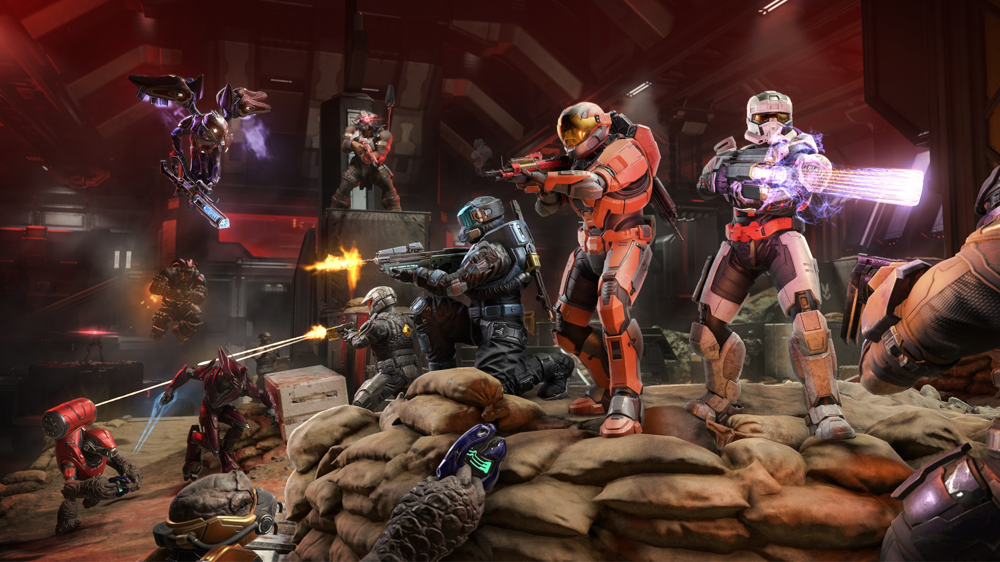
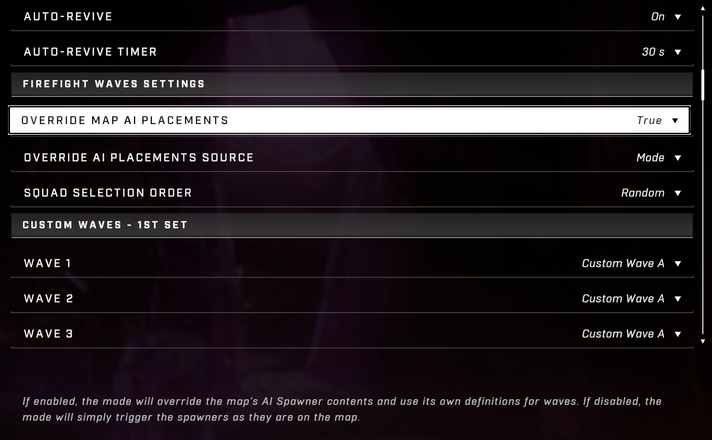
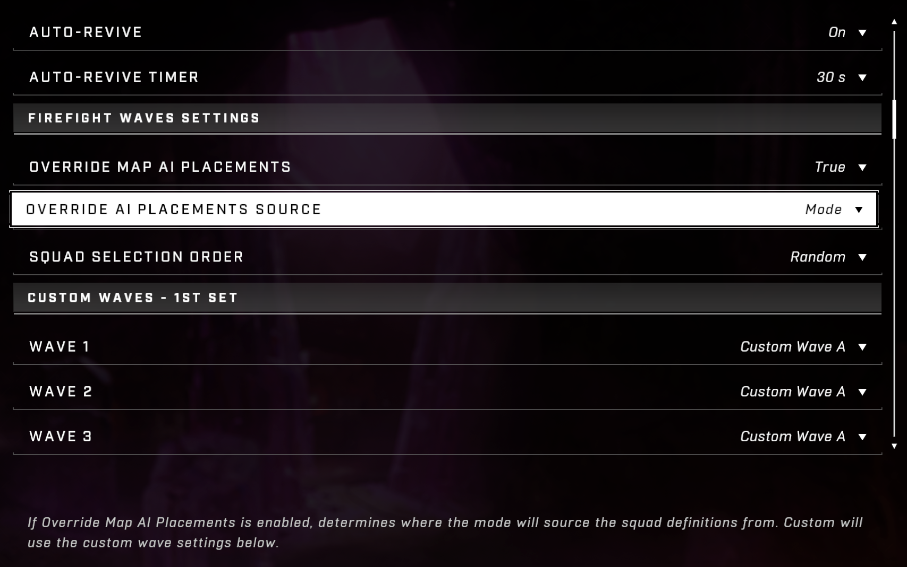
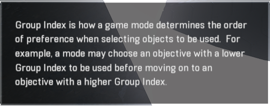
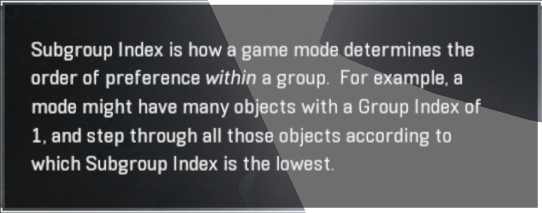
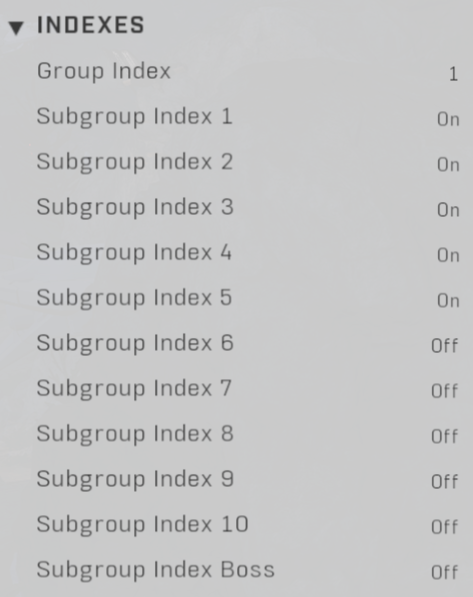

# Firefight KOTH

<figure><figcaption></figcaption></figure>

## Mode Config

By default, the mode is set up with predetermined squad definitions and the overrides to allow this built-in config are enabled.

<figure><figcaption>
Overriding the AI Spawners on the level is required for the Override AI Placements Source setting to matter.
</figcaption></figure>

 

<figure><figcaption>
This setting determines if the mode will use 343's preconfigured Firefight experience, or if it will override it.
</figcaption></figure>

These settings can be changed to make the mode pull lists from the Mode Options, or from the level itself. By default, the mode will override the settings on spawners placed on the level and use a configuration that we cannot see nor edit provided by 343 as the stock behavior of the mode.

The stock mode options provides a robust experience with a variety of enemies preselected. You can still control the flow of combat by deciding \*when\* specific spawners would be used (using the Subgroup Index setting), and it doesn't require configuring spawners with enemies.

Using the custom waves gives players easy ways to create modes like Gruntpocalypse and expect to be able to play them on any level that is properly configured for the base mode. To use the custom waves in the game mode settings, Override Map AI Placements must be set to `TRUE` and Override AI Placements Source must be set to `Custom`.\
\
To use the settings of spawners to decide which enemies to spawn, Override Map AI Placements simply needs to be set to `FALSE`.&#x20;

### Wave Config

<figure><figcaption></figcaption></figure>

Wave Options

* Custom Wave A
* Custom Wave B
* Custom Wave C
* Custom Wave D
* Custom Wave E
* Custom Wave F
* Custom Wave G
* Standard Brutes 1
* Standard Brutes 2
* Standard Brutes 3
* Standard Elites 1
* Standard Elites 2
* Standard Elites 3
* Standard Grunts 1
* Standard Grunts 2
* Standard Grunts 3
* Standard Hunters 1
* Standard Hunters 2
* Standard Jackals 1
* Standard Jackals 2
* Standard Jackals 3
* Standard Jackal Sniper
* Standard Marines 1
* Standard Marines 2
* Standard Marines 3
* Standard Skimmers 1
* Standard Skimmers 2
* Standard Skimmers 3

<figure><figcaption>
Custom Waves can be set up with up to 5 unit types apiece.  All spawnable units are available to be selected.
</figcaption></figure>

## Minimum Object Placements

* 5 KotH Capture Zones w/ Label `Firefight Objective` and `Firefight KOTH Include`
  * Each one must have a unique Group Index, set from 1 to 5
* 5 Zone Capture Plates\* w/ Label `Firefight Plate`
  * To affiliate one with a hill, just place it inside that hill's boundary
* 5 AI Spawners set to Team 2 w/ Label `Firefight Spawner`
  * If all of your spawners are only set to Subgroup Index 1 and/or Subgroup Index 2, only the spawners set to Subgroup Index 1 will trigger and they will only trigger as if they were set to Subgroup Index 1, even if they are also set to Subgroup Index 2
    * Setting any spawners to Subgroup Index 3 will solve this issue
  * It will not matter what you set the enemies to on the spawner
  * There must be at least 1 each for Group Indexes 1-5
    * Generally, you would want to have many more than 1 spawner per Group Index
  * Triggered By Script should be set to `ON`
* 1 Weapon Pad or Rack\*\*
* 1 Equipment Pad\*\*

\* _Not required for the mode to function, but required for full UX and for Matchmaking standards_\
\*\* _Required because the "Weapon Drop" code can't run without them, which breaks the mode logic._

## Configuring Hills

Aside from applying the `Firefight Objective`  and `Firefight KOTH Include` labels, and setting the desired size of the boundary, each hill only needs the Group Index set. The Group Index is what determines the order of the hills as the game progresses.&#x20;

* Group Index 1 will always be the first, as this allows you to curate the player's experience at spawn and create more consistent experiences, which can make or break someone's enjoyment when they play your content for the first time.
* Group Indexes 2-10 will cycle randomly by default, but will progress in order if Sequential Sets is set to `TRUE` in the mode settings.
  * If the hills are cycling randomly, they will only each be used once per cycle, after which they will all become eligible again for the next randomized cycle.
  * Subgroups 6-10 are not relevant unless you are designing a modified version of Firefight KOTH, they are not needed for the base experience.

## Configuring Spawners

WARNING: It appears that duplicating spawners can cause issues with their Group Index configuration. If you are having issues with your spawners you can't explain and you created them by duplicating other spawners, it may be as simple as replacing them with freshly placed spawners from the menu.

Aside from setting up enemies for bespoke experiences, which is not required for stock Firefight KoTH, the important settings for Spawners are all in the Indexes section. To be clear, this means you only need to set up the enemies on the spawners themselves if you are using a variant of the mode that doesn't have Override Map AI Placements enabled.&#x20;

### Group Index

Group Index determines which hill the spawner will be affiliated with, which allows players to curate where enemies are coming from for each hill. Each spawner can only have a single Group Index.

<figure><figcaption></figcaption></figure>

### Subgroup Indexes

Subgroup Indexes are different in that spawners can be assigned none or all of them. While Group Indexes determine which hill must be active for the spawner to be active, the Subgroup Index determines the juncture at which the spawner will be triggered during that phase.

<figure><figcaption></figcaption></figure>

<figure><figcaption>
Group Index and Subgroup Index control when a spawner is called during play.
</figcaption></figure>

#### Subgroup Index 1

* Triggered _once_, when the hill is incoming.

#### Subgroup Indexes 2-10

* Triggered in sequence as the enemies from the prior spawn event are defeated, looping back to the start after all subgroups with members have been triggered.
* This sequence ends with the hill has reached 5% capture progress and the boss wave is spawned.
* NOTE: Subgroup 2 is currently bugged. It works, but not by itself. Subgroup 3 must also be used on at least one spawner per hill for Subgroup 2 to function during that hill's phase.

#### Subgroup Index Boss

* Triggered _once_, when the hill has reached 75% capture progress for the first time by Team 1.
* The named enemy (a.k.a. the boss) will always attempt to spawn in a phantom spawner if there is one assigned to this Subgroup Index.
* Because Indexes 2-10 cycle and any of them could be active, or becoming active, when the boss wave triggers, it is important to have phantom spawners not be assigned to any of Subgroups 2-10 if they are assigned to the boss wave and to also make sure that phantom spawners assigned to the boss wave would not collide with phantoms from that hill's other spawners.

## Match Flow

Each phase of play consists of a hill spawning in and being captured, followed by progression to the next phase. In the mode settings, these phases are referred to as 'Sets'.&#x20;

Hills and Spawners are assigned to each set using the Group Index setting. For an unmodified Firefight KotH, only Group Indexes 1-5 are relevant, but 6-10 will also work if used and paired with a properly configured mode variant.

### Set Start

* Hill Incoming Nav appears
* &#x20;"Initial Guards" spawn
  * The mode selects up to 4 spawners with the current Set's Group Index that are assigned to Subgroup Index 1 and triggers them.
  * Less than 4 spawners being available will still function, but will reduce the number of AI that spawn. Smaller levels, like Live Fire, only use 3 spawners for Subgroup Index 1 for each Set.

### Reinforcements

* Once about 2/3 of the Initial Guards have been defeated _and_ 5% capture progress has been achieved by Team 1, reinforcements will begin to spawn, starting with spawners set to Subgroup Index 2.
* Similarly to how the initial guards are spawned, the mode will select up to 4 spawners to trigger.
* As each set of reinforcements is defeated, the next assigned subgroup of spawners for that set will be triggered. When there are no more spawners assigned to higher subgroups, it will loop back around to checking for spawners assigned to Subgroup Index 2.&#x20;
  * If there are no spawners assigned for a given subgroup, that subgroup will be skipped.

### Boss Wave

* Once Team 1 has reached 75% capture progress, the Boss Wave triggers and no new reinforcements will be spawned for the current Set.
  * Because this can happen right after reinforcements spawn, this can cause spawners to be used is quick succession. This can cause issues with phantom spawners and in tight spaces with regular spawners.
* The boss enemy themselves will be prioritized to spawn from a phantom spawner if one is available and will use a random (properly configured for the current set) spawner if one is not.&#x20;
* Spawners not used by the boss enemy during the boss wave will spawn support squads. Because of this, it is prudent to not spread these out too much, or the boss wave might be too easy.
* Defeating the boss and their cadre does not automatically capture the hill, but it does put the hill in  an 'accelerated capture' state, where capture progress is considerably faster.

### Capture

* Capturing the hill does not kill the boss and their cadre, leaving them for the player to deal with as they make their way to the next hill.
* Once the hill has been captured, the next chosen Set is activated and its hill and initial guards are spawned in.

## Other Considerations

\
Magic Sight should be set to `ON` for spawners that produce AI you want to ensure find the players and should be left disabled for spawners that produce AI that you want players to encounter more organically, like snipers that need to not see players unless they step into designated danger zones.

Live Fire and other small levels prepared by 343 only use Subgroup Index 1, 2, and Boss, while Deadlock (a BTB level) uses 1-5 and Boss. Use the scale of these levels and how complexly their subgroup index config is done as your metric for how much depth is needed to prepare the mode on your levels.

While 343-prepared Firefight levels seem to function just fine with only Subgroup Indexes 1, 2 and Boss set, this does not work when setting up the mode from scratch on your own levels. Subgroup Indexes 1, 2, and 3 must all be used at least once per Group Index for things to function properly.

**Contributors**\
Captain Punch\
Artifice\
Green\
JoValiant\
Connor Kennelly
