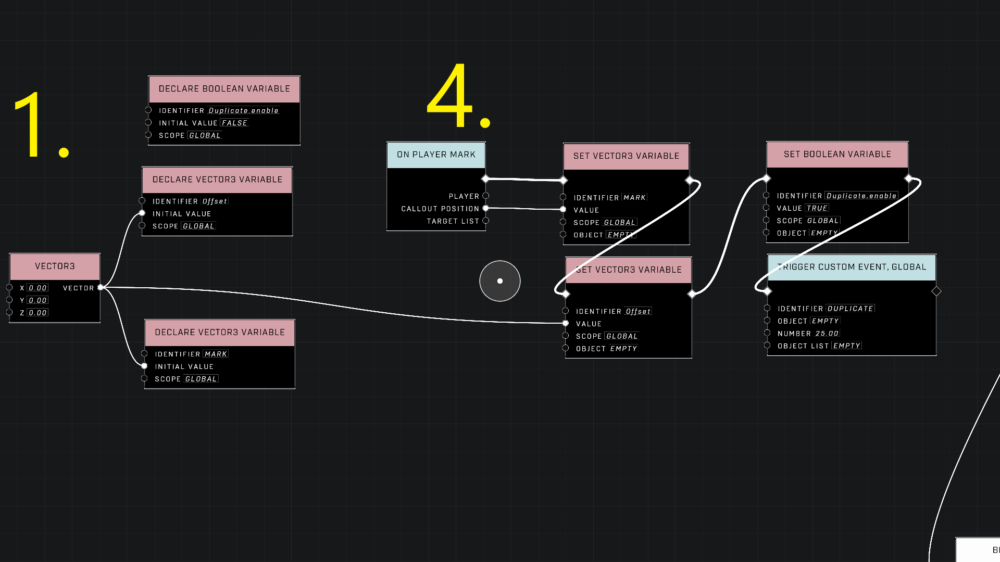
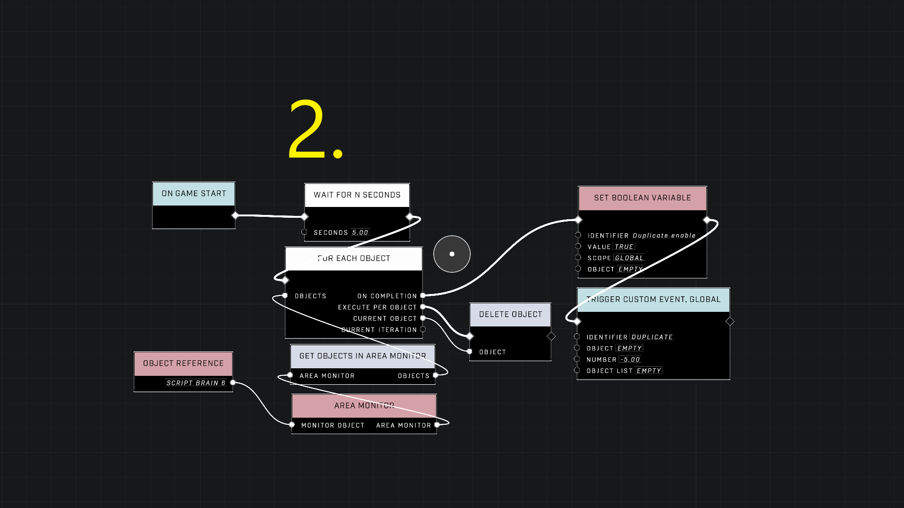
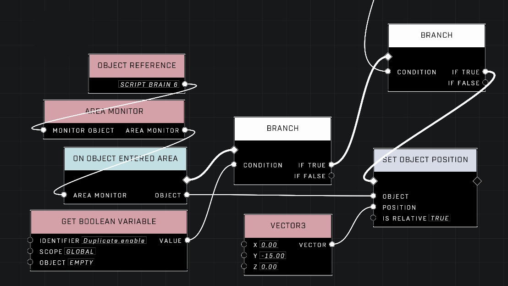
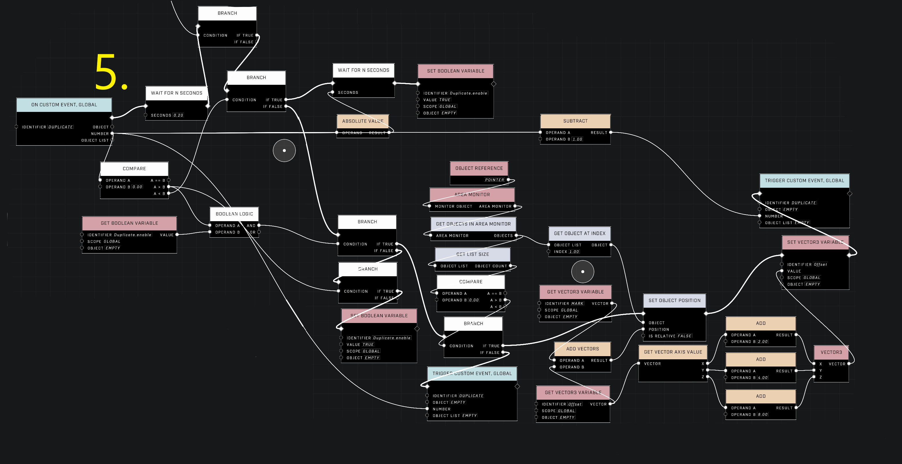

# Object Duplication Exploit

## Halo Infinite Object Duplication Exploit

This wiki entry demonstrates how to exploit a duplication method in Halo Infinite by taking advantage of the game's object respawning system.

### Example/Proof of Concept

1. Make any object dynamic, with normal physics, respawn on disturbed, and timer = 1.
2. Place the object in the map and raise it into the air by 25 units.
3. In PLAY mode, observe the object falling and respawning.

### Normal Set Up (Prequisite to Script)

1. Make an object dynamic, with any physics setting
2. Change the respawn properties to the following: respawn = ON, condition = disturbed, and timer = 1
3. Place the object in an unseen aea of your map where players cannot interact with it.

### Duplication Script

<figure><figcaption></figcaption></figure>

<figure><figcaption></figcaption></figure>

<figure><figcaption></figcaption></figure>

<figure><figcaption></figcaption></figure>

#### Simple Duplication

This script duplicates all objects within the area monitor and places them at the marked player location while maintaining their orientation.

1. Place a script brain above the object(s) you want to duplicate. a. Turn on the area monitor and adjust the size to surround ONLY the object(s).
2. Place a pointer a little bit to the side of the script brain. a. Turn on the area monitor and adjust the size to be a bit larger than the script brain's.
3. The script brain's area monitor contains the parent object which is what is duplicated. Those duplicates are placed in the pointer area monitor.
4. The pointer's area monitor is where the duplicates or child objects are pulled from.
5. Select the script brain and open the node graph menu to add the script brain as an object reference.

#### Advanced Duplication

This method duplicates many objects quickly, creating multiple duplicates in sets of 5, 10, or powers of 2.

1. Place a script brain above the object(s) you want to duplicate. a. Turn on the area monitor and adjust the size to surround ONLY the object(s).
2. Place a pointer a little bit to the side of the script brain. a. Set the distance along 1 axis and remember the figure. b. Turn on the area monitor and adjust the size to be a bit larger than the script brain's. c. Do NOT overlap the area monitors.
3. The script brain's area monitor contains the parent object which is what is duplicated. Those duplicates are placed in the pointer area monitor.
4. The pointer's area monitor is where the duplicates or child objects are pulled from.
5. Select both the pointer and script brain and open the node graph menu to add both as object references.

This method requires a more advanced script, with five main components:

1. Variable declaration
2. Initial setup
3. Automatic duplication
4. On Player Mark event to begin duplication
5. Main script that places duplicated objects

The script runs recursively, continuing to duplicate objects until the programmed amount of duplicates is placed.

### Direct Reference Node and Forge ID

When attempting to reference a duplicate using a Direct Reference node, it's essential to note that the node will grab the parent instead. This behavior is attributed to the use of the Forge ID, the ID visible during forging. Despite this limitation, previous examples have demonstrated the ability to manipulate duplicates individually without referencing the parent.

### True ID and Abstraction Layers

The True ID of an object operates at a lower abstraction layer compared to the Forge ID. While the Forge ID may recognize a parent and its duplicate as the same object, the True ID distinguishes them as unique entities. For instance, the Forge ID might label both the parent and duplicate as "Cube 1," while the True ID identifies them as "Cube 1-1" and "Cube 1-2" respectively.

### Events and True ID

Events with an object output, such as the On Enter Area and On Exit Area events, produce the True ID of an object. This enables developers to interact with duplicates without referencing the parent explicitly. Similarly, the Get Objects in Area Monitor node produces an Object List with True IDs, albeit with some quirks related to Forge and True IDs.

### Forge ID & True ID with Basic & Advanced Variables

Despite the True ID being accessible through events, distinctions between Forge ID and True ID become crucial when working with nodes that automatically convert True ID into Forge ID. Advanced Variables, for example, convert True ID into Forge ID when storing duplicates. Basic Variables, on the other hand, can safely retain the True ID of duplicates in Object Lists.

### Object Variables and Custom Events

Custom Events store the True ID of objects in their Object and Object List parameters, preserving the uniqueness of duplicates. This quirk allows developers to work with duplicates independently and utilize their own object variables. The independence of duplicate object variables opens up possibilities for recursive timers and more intricate scripting.\
\
**Contributors**\
Captain Punch\
Mathad0115\
Cookies
