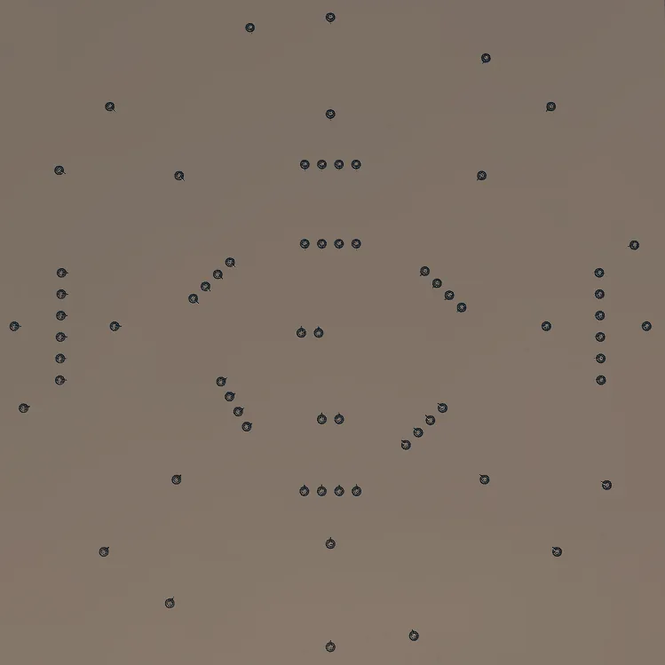
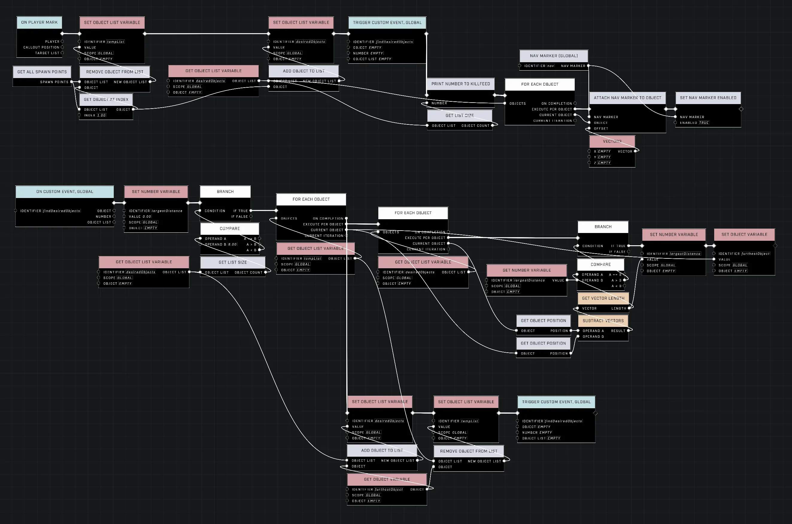
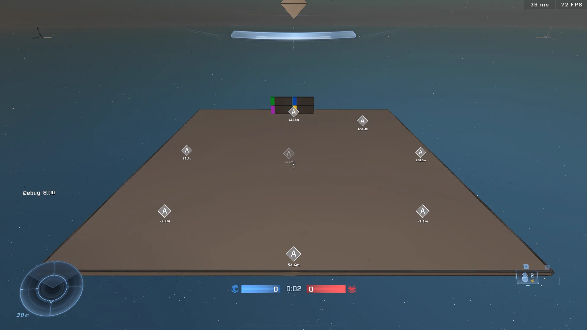

# Find Desired Amount of Furthest Away Objects From Each Other

<figure><figcaption></figcaption></figure>

Selecting a group of objects that are spread out across a map is a common spatial sampling challenge. This article explains how to use "Farthest Point Sampling" to ensure that a set of selected points—such as spawn points—maintains maximum "breathing room" between them.

<figure><figcaption>
The initial request asks for a method to find a specific number of objects that are well-spaced from one another.
</figcaption></figure>

## The Logic Trap of Maximum Distance

A common mistake when attempting to find well-spaced objects is to search for the object with the **maximum distance** to any single object in the existing set. While this seems intuitive, it fails to account for the proximity of the candidate to the rest of the group.

For example, if your selected set contains two points on opposite ends of a map, a third point sitting directly on top of the first point will have a massive distance to the second point. A "maximum distance" logic will identify this third point as a great candidate because it is very far from one member of the group, even though it is touching another.

<figure><figcaption>
This node graph demonstrates a logic error where objects are picked based on their distance to a single point rather than the entire set.
</figcaption></figure>

To achieve true spacing, the logic must shift from finding the maximum distance to finding the **maximum "minimum distance"** (often referred to as Max Min Distance). Instead of asking which point is furthest from one person, you must ask which point is furthest from its **closest neighbor** in the selected group. This effectively measures the "safety buffer" or breathing room around a candidate.

## Implementing Farthest Point Sampling

To implement this correctly, you must use a specific nested loop hierarchy. This ensures that you first identify the closest neighbor for every potential candidate before deciding which candidate has the largest buffer.

### Correct Loop Hierarchy

The logic requires three distinct levels of nesting:

1. **Main Loop:** Runs as long as the count of `Selected Points` is less than your `Target Count`.
2. **Outer Loop (Candidate Loop):** Iterates through every object in your `All Points` list to test it as a potential candidate.
3. **Inner-Inner Loop (Nearest Neighbor Loop):** Iterates through the `Selected Points` list to find the distance to the candidate's closest neighbor.

#### Variable Reset Schedule

For the logic to function, local variables must be reset at specific intervals within the hierarchy.

| Variable | Reset Value | When to Reset | Purpose |
| :--- | :--- | :--- | :--- |
| `Max Min Distance` | `0` | Start of the **Main Loop** | Tracks the largest "safety buffer" found so far in the current round. |
| `Min Distance` | `999999` | Start of the **Outer Loop** | Tracks the distance to the closest neighbor for the current candidate being tested. |


The [Branch](../../../scripting/nodes/logic/branch.md) that updates the `Best Candidate` must be placed **outside** the inner-inner loop. The inner-inner loop's only job is to finish finding the single closest neighbor for the candidate; once that is done, you compare that result to the global maximum.


By following this structure, the algorithm will successfully pick the point that is the most isolated from the entire group, resulting in a balanced distribution.

<figure><figcaption>
The corrected algorithm produces a highly even distribution of objects across the map.
</figcaption></figure>

## Performance Considerations

Because this algorithm relies on nested loops (a loop inside a loop inside a loop), it can become performance-intensive if the number of candidate objects is very high. 


If you notice frame drops when using this logic, avoid running it on a continuous tick. Instead, execute the logic once at the start of a match or during a loading phase.


***

## Source Data

* Discord thread: [Find Desired Amount of Furthest Away Objects From Each Other](https://discord.com/channels/220766496635224065/1508892619319545966/1508892619319545966)

#### <mark style="color:green;">Contributors</mark>

Okom\
Guild Archivist\
swagonflyyyy\
AddiCt3d 2CHa0s