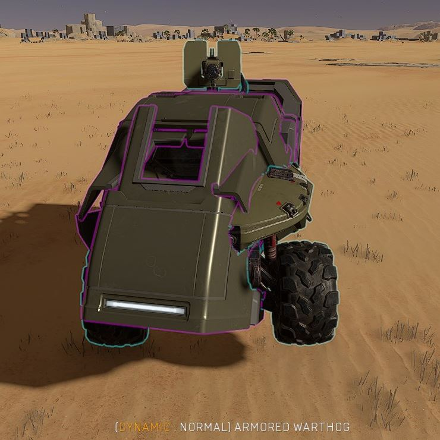
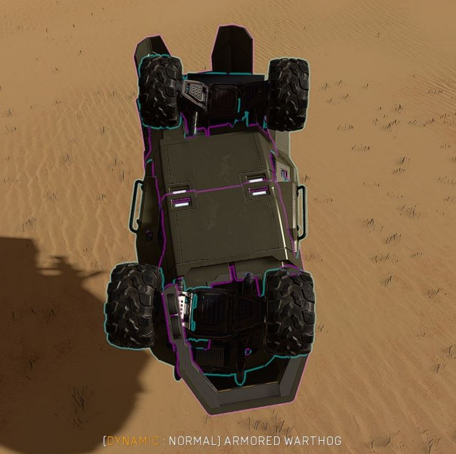
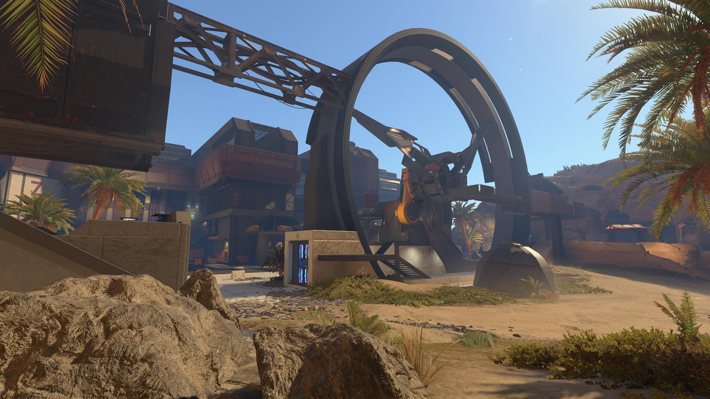

# Welded Prefab Bugs

Although welds can be used as useful gameplay elements, there are a ton of bugs surrounding them, which makes working with welded prefabs extremely annoying, sometimes to the point of having to scrap the idea that would have worked if there weren't some obscure issues happening to them.

<figure><figcaption></figcaption></figure>

## List of Known Bugs

Here are some of the bugs discovered by the Forge community:

* Welding and Unwelding a prefab repeatedly can corrupt the map
* Unwelding is likely to move and rotate every part of the prefab a small random amount
* Moving a weld into a solid object will at best cause bad performance drops and at worst crash the server
* Welded prefabs are affected by the [0.7 Degree Rotation Bug](0.7-degree-rotation-bug.md)
* Any script to move a Phased/Fixed weld will only move the parent object; only welded prefabs where all objects are set to Normal physics can be moved as a group via scripting
* Even slowly moving a weld can apply damage and physics impulse to objects that interact with it
* Welded prefabs cannot be spawned/despawned via scripting
* Welded prefabs cannot be cloned via scripting

## Examples of Weld Bugs

<figure><figcaption>
A Warthog with UNSC Cover pieces welded to it that act as armor
</figcaption></figure>

 

<figure><figcaption>
Welded child objects rotated wrong due to a bug
</figcaption></figure>

 

<figure><figcaption>
Welded child objects rotated wrong due to a bug
</figcaption></figure>

Some of these bugs are the reason why the central fan wheel on the Zanzibar remake [Kusini Bay](https://www.halowaypoint.com/halo-infinite/ugc/maps/4eb7a3ac-81f7-4faa-acd8-ce6bbba667af) can't be made to spin and not cause map-breaking issues.

<figure><figcaption>
Central fan structure of Kusini Bay
</figcaption></figure>

The creator has attempted to overcome the issue on multiple occasions, but with the current available Forge tool set, it's not possible to make work consistently and up to a matchmaking performance standard. A test map where the wheel spins has been published by the creator, which can be found here: [Zanzibar Fan Net Test 2](https://www.halowaypoint.com/halo-infinite/ugc/maps/dada0b39-0cbc-41ee-b361-17538398cfc2).

***

#### <mark style="color:green;">Contributors</mark>

Yolomcswag\
Okom
