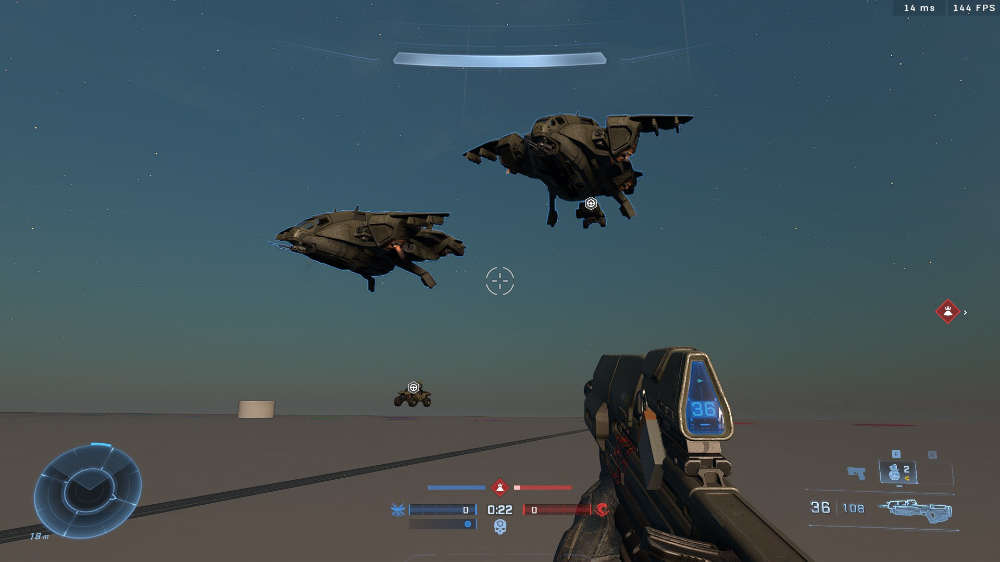
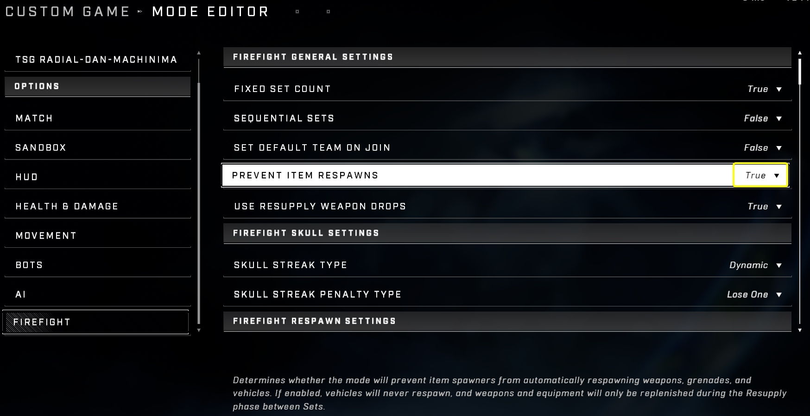
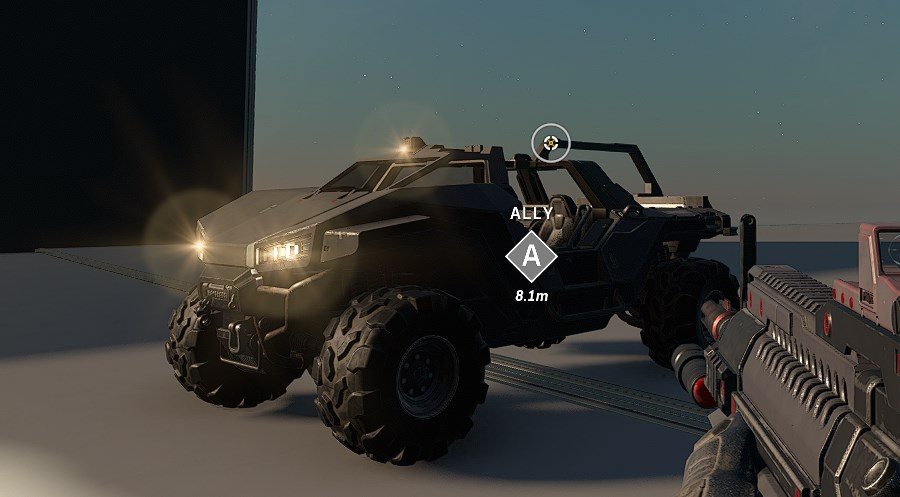

# Pelican Drops on Forge maps

<figure><figcaption></figcaption></figure>

By combining specific object configurations with Firefight mode settings, players can successfully implement Pelican Drops on Forge maps.

## Implementation

To enable Pelican Drops on a Forge map, several environmental and mode-specific conditions must be met.

<figure><figcaption>
The Pelican Drop object can be placed on a map to initiate a drop sequence.
</figcaption></figure>

### Setup Requirements

For the drop to trigger successfully, the following setup is required:

* A "Pelican Drop" object must be placed on the map (hidden object).
* The map must have a working Firefight: King of the Hill (FFKOTH) setup.
* The map must be loaded using a Firefight mode (any Firefight variant, such as Firefight: Custom, works).

### Object Properties

The Pelican Drop object requires specific properties to function. The **Cargo Drop Type** must be set to **Exact Drop**. Other relevant properties include:

* **Spawn Properties**: Default
* **Symmetrical Channel**: AirDrop Alpha
* **Selective Channel**: AirDrop Alpha
* **Drop Range**: 3.00

A prefab with a fully set up Pelican Drop object can be found here: [Pelican Drop](https://www.halowaypoint.com/halo-infinite/ugc/prefabs/0c3e683d-e324-4b2a-95c8-71fdf6740c18)

## Mode Configuration

The functionality of the Pelican Drop is tied to internal events triggered by specific mode settings. In the Mode Editor, the **Firefight → Prevent Item Respawns** option must be set to **True**. This setting is enabled by default in Firefight modes and is required for the Pelican Drop to function.

<figure><figcaption>
The Prevent Item Respawns setting must be enabled in the Mode Editor.
</figcaption></figure>

## Constraints and AI Behavior

### Pilot AI Characteristics

The Pelican is piloted by an invisible, frictionless AI entity that has no physical size but is still affected by gravity. This pilot cannot be removed from the vehicle through standard methods, such as flipping the vehicle. If the pilot AI is damaged or deleted, the Pelican vehicle will also be deleted.

<figure><figcaption>
The pilot of the Pelican is an invisible AI entity.
</figcaption></figure>

### Flight and Scripting Limitations

The Pelican Drop is designed to trigger at the start of gameplay; delaying or activating the drop via command is not currently possible. Furthermore, there are specific constraints regarding vehicle usage in different modes:

* **Firefight modes**: Attempting to pilot a Pelican using a vehicle type reference in Firefight modes will result in the pilot being automatically kicked out of the vehicle. Once this happens, the vehicle may become un-enterable via scripts.
* **BTB:Slayer**: Flying the Pelican vehicle is possible in BTB:Slayer on developer-made maps.


Attempting to pilot a Pelican in Firefight modes via a vehicle type reference will result in the pilot being automatically kicked out of the vehicle.



When using a script to enter a Pelican via a button press, add a small delay to the sequence to prevent the player from being immediately kicked out of the vehicle by the same button press used to activate the script.


#### Scripting Note: Player Respawns

When using scripts to facilitate players entering a Pelican (which typically involves respawning the player as the Pelican vehicle type), players who have been revived in FFKOTH may encounter issues where they remain on a death screen. This occurs because internal scripting may not automatically unblock respawns after a player is revived. To resolve this, add an `Unblock Respawns For Player` node immediately after teleporting the player to ensure the "enter" sequence proceeds correctly.

***

## Source Data

* Discord thread: [Pelican Drops on Forge maps](https://discord.com/channels/220766496635224065/1210616741756014632/1210616741756014632)

#### <mark style="color:green;">Contributors</mark>

Okom\
thescriptinator\
Dj_HurstyDNB\
SpawnOfTheDeep\
Josh