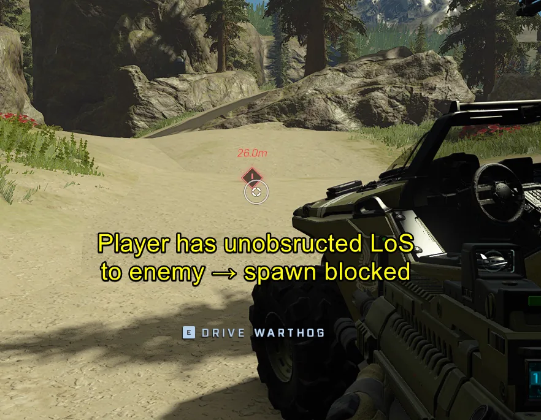
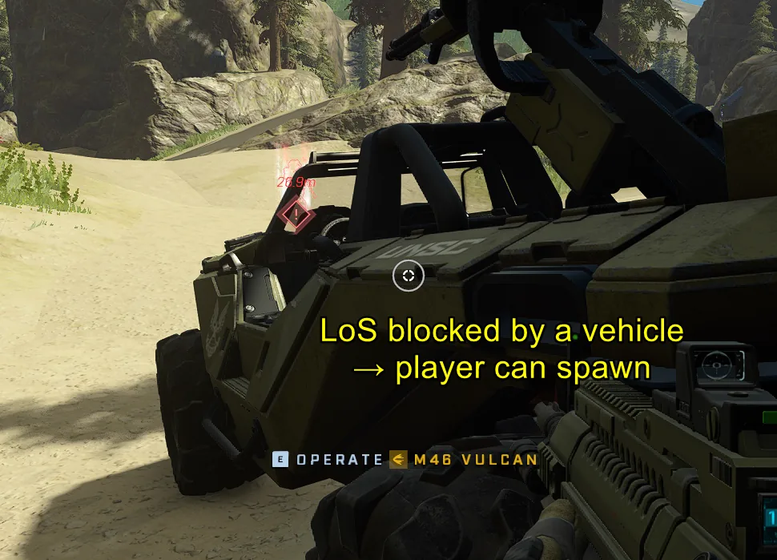
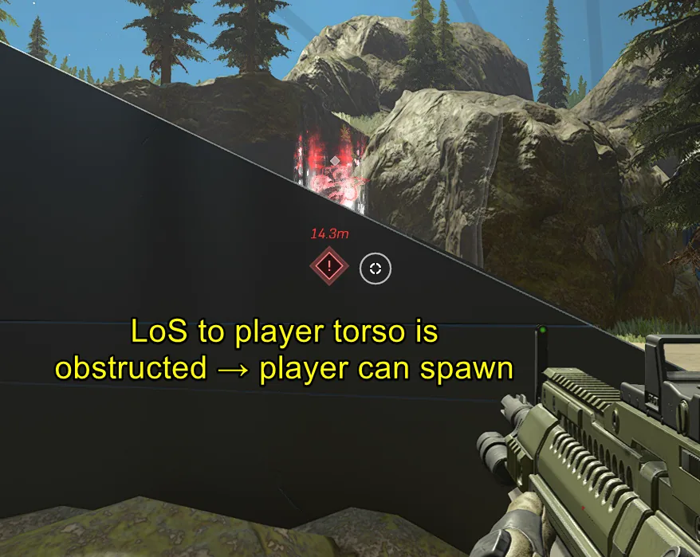
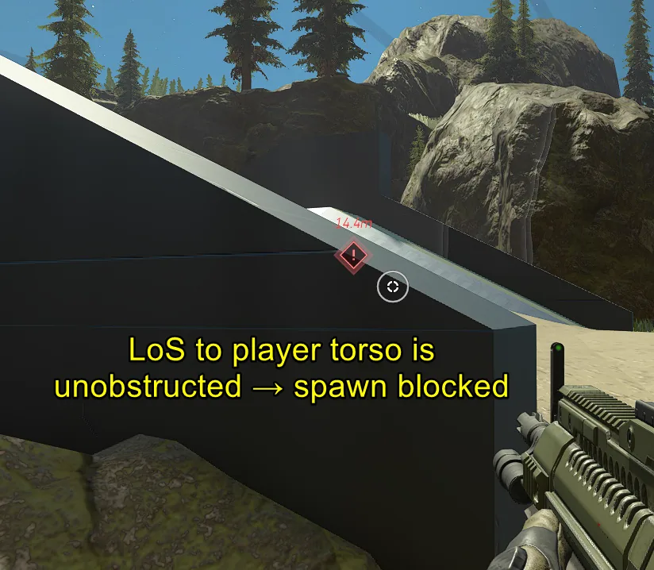
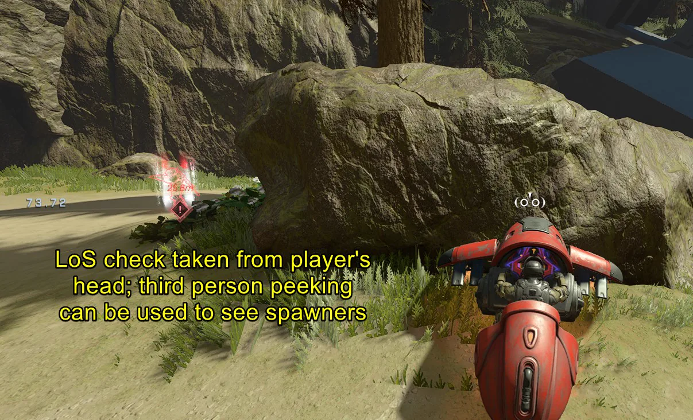

# Player Line of Sight Cone Research

<figure><figcaption></figcaption></figure>

Spawning mechanics in Forge are subject to specific line-of-sight (LoS) restrictions that prevent players from appearing in certain contested areas. These boundaries consist of a spherical proximity zone and an expansive conical field of view originating from the observer's head.

## Boundary Geometry

The spawn blocking mechanism is defined by two distinct geometric components: a sphere centered on the spawn point and a large cone extending from the player being observed.

### The Proximity Sphere
A spherical boundary with a radius of 181.26 units (approximately 55.3 meters) originates from each spawn point. This area affects both the back side of the spawner and introduces curvature on its top and bottom surfaces relative to the flat LoS boundaries.

### The Line-of-Sight Cone
In addition to the sphere, a large cone originates from an observer's head towards potential spawning players. Its dimensions are:

* **Diameter:** 10480 units
* **Length (Height):** 181.26 units
* **Field of View (FOV):** Approximately 176°


This video demonstrates how a player can block a spawn from a significant distance by occupying the LoS cone even while facing nearly 90 degrees away from the target.


<figure><figcaption>
Illustrates a setup or result relevant to Player Line of Sight Cone Research and the workflow described in this article.
</figcaption></figure>

## Line-of-Sight Validation Rules

Presence within the boundary does not automatically result in a blocked spawn; specific orientation and visibility conditions must be met for the check to trigger.

### Orientation Requirements
For players positioned inside the LoS cone, spawning is only blocked if they are facing the spawner within their own 176° FOV. If a player is located within the boundary but faces away from the spawn point, the spawn will not be obstructed by that player's presence.

### Obstruction and Height Checks
The line-of-sight check is performed specifically between the observer's head and the spawning player's upper torso. Because of this specific height requirement:

* Any static or dynamic obstruction located between these two points—such as a vehicle or piece of terrain—will invalidate the spawn blocking.
* Third-person perspective can be used to manipulate LoS functionality, as it allows an observer to see players during the spawning process by bypassing standard vertical obstructions.

<figure><figcaption>
Illustrates a setup or result relevant to Player Line of Sight Cone Research and the workflow described in this article.
</figcaption></figure>

<figure><figcaption>
Illustrates a setup or result relevant to Player Line of Sight Cone Research and the workflow described in this article.
</figcaption></figure>

<figure><figcaption>
Illustrates a setup or result relevant to Player Line of Sight Cone Research and the workflow described in this article.
</figcaption></figure>

<figure><figcaption>
Illustrates a setup or result relevant to Player Line of Sight Cone Research and the workflow described in this article.
</figcaption></figure>

<figure><figcaption>
Illustrates a setup or result relevant to Player Line of Sight Cone Research and the workflow described in this article.
</figcaption></figure>

<figure><figcaption>
Illustrates a setup or result relevant to Player Line of Sight Cone Research and the workflow described in this article.
</figcaption></figure>

<figure><figcaption>
Illustrates a setup or result relevant to Player Line of Sight Cone Research and the workflow described in this article.
</figcaption></figure>

## Strategic Use Cases

Because every player possesses their own identical line-of-sight cone and sphere at all times, players can use these mechanics to influence enemy spawning behavior.

* **Sideways Tilting:** Players can block spawns that are located more than 181.26 units away by tilting themselves sideways towards the spawn point, effectively extending their LoS coverage into those areas.
* **Vertical Exploits:** Aiming directly up or down positions a player's massive 10480-unit diameter cone above or below their current altitude. This creates an area of vertical coverage spanning approximately 181.26 units that can block any spawns with an unobstructed LoS to the player within that range.
* **Optimal Spawning:** To attempt spawning a player at a specific point, it is most effective to look directly at them; this provides the shortest path for the boundary check and ensures a clear line of sight.


To test these mechanics effectively in Forge, use specialized modes such as [tsg LoSDebug](https://www.halowaypoint.com/halo-infinite/ugc/modes/49550953-0c39-4924-a244-451a2ebb07b1) to visualize the spawn blocking boundaries and LoS cones used for bots.


***

## Source Data

* Discord thread: [Player Line of Sight Cone Research](https://discord.com/channels/220766496635224065/1529131373602799626/1529131373602799626)

#### <mark style="color:green;">Contributors</mark>

Okom