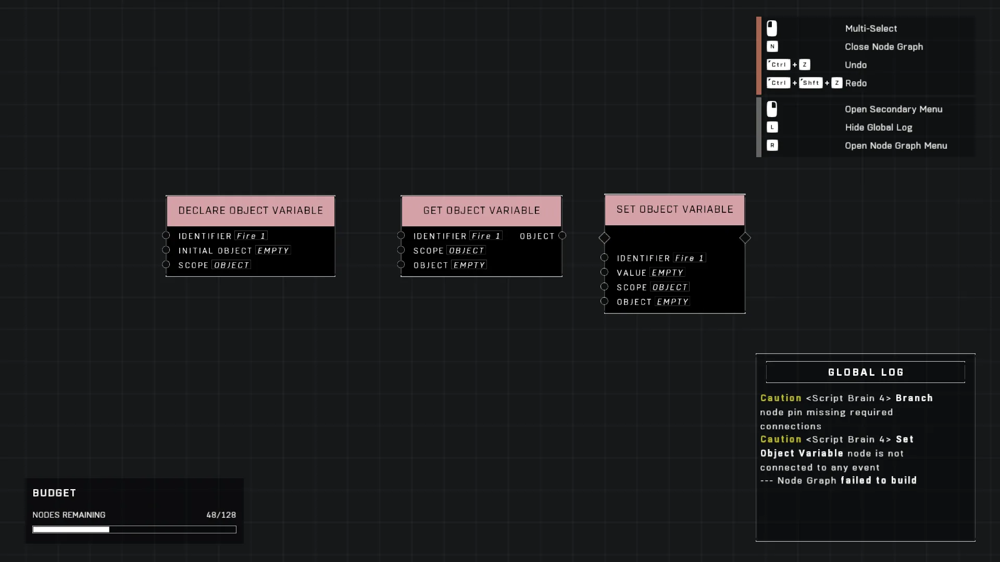

# Object variables

<figure><figcaption></figcaption></figure>

Object variables allow data to be tied to specific entities within a script, rather than being global or session-wide. Correct configuration of the node's scope and pin connections is required for this behavior to function as intended.

## Property Configuration for Scoping

To ensure that a variable functions as an object variable, you must set the **Scope** property of the relevant node to "Object". This setting ensures the data associated with the variable is tied to specific entity instances.

## Node Pin Requirements

### The 'Object' Pin

In nodes such as 'Get object variable' or 'Set object variable', a pin labeled **Object** must be connected. 

* This pin requires an input representing any object that you want the variable to be scoped to.
* A common use case for this connection is plugging in a player character.

<figure><figcaption>
The screenshot displays Declare Object Variable, Get object variable, and Set object variable nodes.
</figcaption></figure>


When configuring these nodes, ensure the pin connection matches the intended scope, such as a specific player entity.
{% endhint}



When configuring these nodes, ensure the pin connection matches the intended scope, such as a specific player entity.
{% endhint}

***

## Source Data

* Discord thread: [Object variables](https://discord.com/channels/220766496635224065/1536873477183643738/1536873477183643738)

#### <mark style="color:green;">Contributors</mark>

PTSDmachine\
Okom\
swagonflyyyy (Mr. Blackwell)