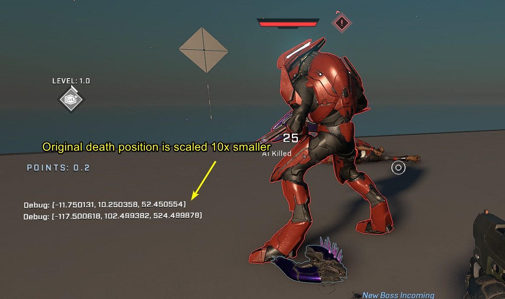
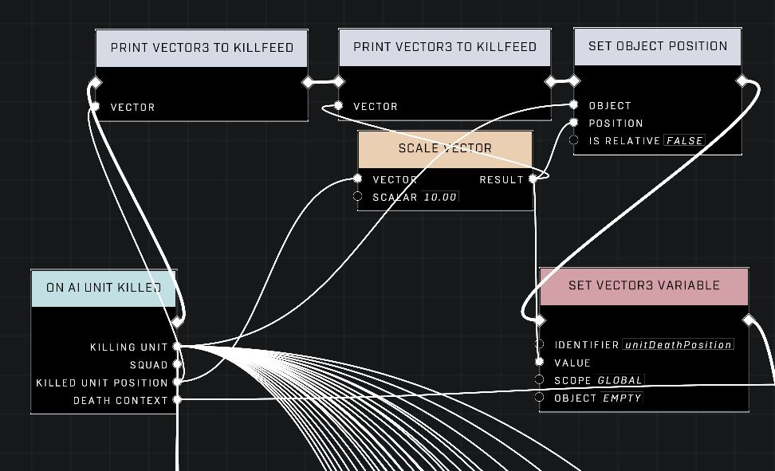

# "Killed Unit Position" Pin in On AI Unit Killed Node is Scaled 10x Smaller

<figure><figcaption></figcaption></figure>

The "Killed Unit Position" output pin on the [On AI Unit Killed](../scripting/nodes/events-ai/on-ai-unit-killed) scripting node provides coordinates that do not align directly with the Forge world grid. Specifically, the [Vector3](../scripting/nodes/variables-basic/vector3) returned by this pin is scaled to 1/10th of the actual position used by the game engine. This discrepancy requires manual adjustment in scripts to ensure correct spatial logic.

## The Scaling Discrepancy

When an AI unit is eliminated, the event pin attempts to report the location of the event. However, the value provided is not the absolute world coordinate. Instead, it is a scaled value that is 10 times smaller than the actual Forge position.

<figure><figcaption>
The debug text confirms the unscaled vector is significantly smaller than the corrected position.
</figcaption></figure>

This behavior means that any logic relying on these coordinates—such as placing objects, triggering events at specific locations, or calculating distances—will result in inaccurate results if the raw value is used directly.

### Correcting the Position

To utilize the actual position in your scripts, you must scale the output vector back up. This is achieved by routing the output from the "Killed Unit Position" pin into a [Scale Vector](/scripting/nodes/math/scale-vector) node.

<figure><figcaption>
The script graph demonstrates the necessary node connections to correct the coordinate scale.
</figcaption></figure>

You must set the scalar input on the Scale Vector node to `10.00`. This multiplication corrects the scale, yielding the accurate world coordinates required for precise scripting actions.


To get the correct output position, you need to *always* feed the Vector3 into a Scale Vector node with a 10.00 Scalar.


## Practical Applications

Once the position has been corrected, it can be used in various standard Forge scripting scenarios.

* **Setting Object Position:** The corrected vector can be fed into the Object Position input of a [Set Object Position](/scripting/nodes/objects-transform/set-object-position) node to spawn or move objects exactly where the unit died.
* **Storing in Variables:** The corrected position can be assigned to a Vector3 variable for later use, such as calculating spawn points for respawning enemies at the location of a previous defeat.
* **Event Triggers:** You can use the corrected position to define trigger volumes or activation points relative to the death of a specific AI unit.

Without the scaling correction, these applications will fail to function as intended due to the massive offset caused by the 1/10th scale factor.

***

## Source Data

* Discord thread: ["Killed Unit Position" Pin in On AI Unit Killed Node is Scaled 10x Smaller](https://discord.com/channels/220766496635224065/1450874812405645402/1450874812405645402)

#### <mark style="color:green;">Contributors</mark>

Okom
